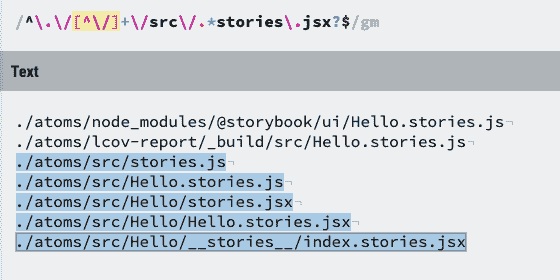

# 在 Monorepo 中使用故事书

> 原文：<https://dev.to/kamranayub/using-storybook-in-a-monorepo-38l0>

我目前在一个小型 monorepo 中工作，我们为共享组件设置了多个包，如下:

```
packages/
  atoms/
  molecules/
  organisms/ 
```

每个包在一个`src`目录下都有 React 组件，因为每个目录*是一个包*，所以它们也包含了`node_modules`(下面将详细说明为什么这很重要)。

```
packages/
  atoms/
    node_modules/
    src/
      components/
        Hello.js
        Hello.stories.js
    package.json
  molecules/
  organisms/ 
```

这不同于我见过的其他使用根目录的帖子——这不是我们想要的设置回购的方式，我们更喜欢故事就在它们描述的组件旁边。

## 设置故事书

您可以按照[入门页面](https://storybook.js.org/docs/guides/guide-react/)上的相同步骤在 monorepo 中设置 Storybook。

一旦完成，你应该在根目录下有一个新的文件夹:

```
.storybook/
  config.js 
```

如果没有，请确保创建了它。我们需要对`config.js`做一些修改，以便在 monorepo 中读取每个包中的故事。

## 为 Monorepo 配置故事书

促使我写这篇文章的关键问题是，我们需要使用 [Webpack 上下文](https://github.com/webpack/docs/wiki/context) :
来导入故事

```
require.context('../packages', true, /stories.jsx?$/); 
```

这将提示 Webpack 扫描一个`src`目录，查找字符串中包含`stories.js`或`stories.jsx`的路径。

由于 Webpack *静态分析*这段代码，这意味着我们**不能**动态读取文件系统并遍历每个包目录(我试过了😔).

还有一个问题。记得我提到过每个包目录都有`node_modules`，这意味着下面的路径将匹配正则表达式:

```
./atoms/node_modules/@storybook__react/src/stories/blah.stories.js
./molecules/lcov-report/_html/src/components/Hello.stories.js 
```

你可以想象更多这样的路径可以匹配。Webpack 会尝试将这些文件导入到它生成的包中，但这很可能会导致构建错误。这不是我们想要的！匹配文件时，我们需要*排除包中除了`src`目录之外的所有内容*。

事实证明，解决方案相当简单，因为我们有一个约定，每个包在一个`src`目录中有组件，我们只需要在包名后面匹配内部的`src`，所以我们可以写一个像这样的正则表达式:

```
require.context('../packages', true, /^\.\/[^\/]+\/src\/.*stories\.jsx?$/); 
```

我们来分解一下:

```
^               # match beginning of path
\.\/            # the path will begin with a "./", like ./atoms
[^\/]+          # get the first path segment (match characters up to first /)
\/src\/         # ensure we match under the `src` directory
.*              # match any character
stories\.jsx?   # match anything with "stories.js(x)" in it
$               # match end of string 
```

这里有一个使用我最喜欢的 regex 工具 [RegExr](https://regexr.com) 的例子，它判断哪些路径匹配，哪些路径不匹配:

[](https://res.cloudinary.com/practicaldev/image/fetch/s--vyN_9ngh--/c_limit%2Cf_auto%2Cfl_progressive%2Cq_auto%2Cw_880/https://thepracticaldev.s3.amazonaws.com/i/tdt8u9xa3kwlku94d6yu.png)

得心应手！

## 最终配置

这是我们最后的`config.js` :

```
import { configure } from '@storybook/react';

function loadStories() {
  const req = require.context('../packages', true, /^\.\/[^\/]+\/src\/.*stories\.jsx?$/);
  req.keys().forEach(filename => req(filename));
}

configure(loadStories, module); 
```

我希望这对其他人有所帮助，并为他们节省我花在执行正确的仪式上的几个小时。

* * *

如果你认为这有帮助，你可以关注我或者订阅我的博客。

最初发布于 [Kamranicus](https://kamranicus.com/posts/2019-09-12-using-storybook-in-a-monorepo)