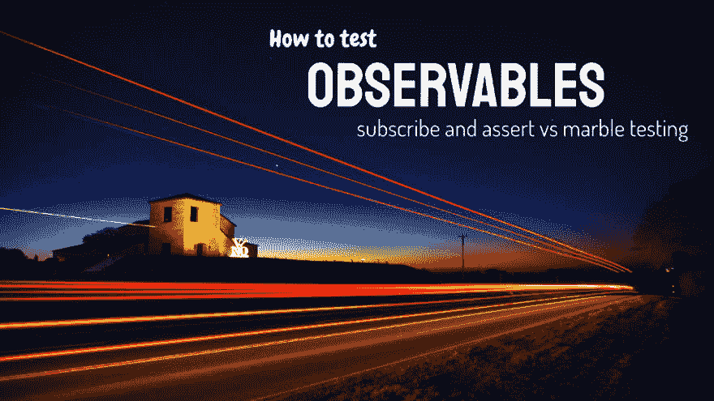

# 如何测试可观测量

> 原文:[https://dev.to/kreuzerk/how-to-test-observables-343f](https://dev.to/kreuzerk/how-to-test-observables-343f)

#### 终极指南——永远不要再为如何测试可观测性而困惑

[T2】](https://res.cloudinary.com/practicaldev/image/fetch/s--lXfs5_p0--/c_limit%2Cf_auto%2Cfl_progressive%2Cq_auto%2Cw_880/https://cdn-images-1.medium.com/max/1024/1%2AowGWewkhtBP_xlXEoGXBog.png)

反应式编程是处理异步代码的新方法。而且超级厉害！

如果你看到了这篇博文，我假设你已经用 RxJS 写了几行反应式代码，如果不是一千行的话。所以我没必要告诉你它是怎么工作的，有多酷。😎

我想我们都在同一个页面上——用 RxJS 编写高效的代码是强大的，并且很有趣。但是测试呢？

### 我们要学什么👨‍🎓

在这篇博文中，我们将会看到两种不同的策略来测试一个可观测的。

“订阅和断言模式”和“大理石测试”。

我们将在不同的场景中应用这些策略，看看它们的优点和缺点。这些策略在不同情况下的比较让我们对如何测试可观性有了一个清晰的认识。

[了解更多信息...](https://blog.angularindepth.com/how-to-test-observables-a00038c7faad)