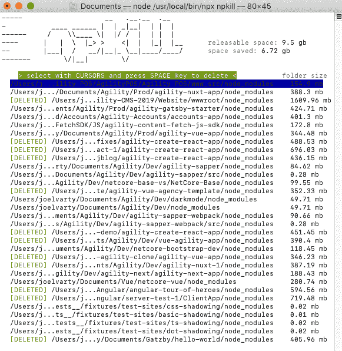

# 我刚刚使用 npkill 清理了 7 GB 的磁盘空间

> 原文:[https://dev . to/Joel arty/I-just-used-NP kill-to-clean-up-7gb 的磁盘空间-4o5g](https://dev.to/joelvarty/i-just-used-npkill-to-clean-up-7-gb-of-disk-space-4o5g)

在使用这个工具之前，您甚至不知道 node_modules 文件夹占用了多少空间！

npkill 将搜索您运行它的所有子文件夹，并允许您轻松清除 node_modules 文件夹。

当您需要再次运行文件夹中的项目时，您可以简单地运行 npm install 来恢复依赖项。

我的情况是这样的:

[T2】](https://res.cloudinary.com/practicaldev/image/fetch/s--gEbh9JHW--/c_limit%2Cf_auto%2Cfl_progressive%2Cq_auto%2Cw_880/https://thepracticaldev.s3.amazonaws.com/i/z6qze3svw7d89wb34s1h.png)

更长的介绍和描述，见[卡洛斯·卡瓦列罗的文章。](https://dev.to/carlillo/npkill-the-solution-to-deleting-nodemodules-easily-with-style-1o70)