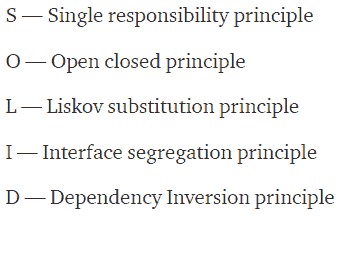
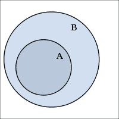
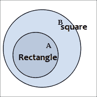

# 坚实的原则:从面向对象编程开始

> 原文:[https://dev . to/ham 8821/solid-principles-to-start-with-object-oriented-programming-1e 49](https://dev.to/ham8821/solid-principles-to-start-with-object-oriented-programming-1e49)

大家好，今天我想讨论一些实在的东西。
固体？当然不是！没那么结实。
等待...啊，也许就是那种固体！

今天去面试，被问到这个关于“**扎实的原则**”的问题。我就像“嗯...“不太确定”，意思是“我不知道你在说什么”。
在我走出房间的路上，我觉得我确实需要研究一些坚实的原则，以便正确地开始朝着面向对象编程世界的正确方向前进。

所以今天，我想用一些基本的定义和简单的例子来讲述这个话题，来帮助我们理解这个概念。

### 1)什么和为什么:**坚实的原则**

[T2】](https://res.cloudinary.com/practicaldev/image/fetch/s--irC4Zd-S--/c_limit%2Cf_auto%2Cfl_progressive%2Cq_auto%2Cw_880/https://thepracticaldev.s3.amazonaws.com/i/oa222flxjd2uc1r0vdnz.jpeg)

#### 固体代表..

南 O.L.I.D 是 Robert C. Martin 的前五个面向对象设计(OOD)**原则**的首字母缩写。

[T2】](https://res.cloudinary.com/practicaldev/image/fetch/s--oT8ZHKKH--/c_limit%2Cf_auto%2Cfl_progressive%2Cq_auto%2Cw_880/https://thepracticaldev.s3.amazonaws.com/i/51ggtko1k9rhhmvr00mi.png)

就编码、提炼和构建代码而言，它实际上是一套我们可以牢记的原则。

#### 固体燃料..

通过阅读它，我不知道它应该是什么意思。据我所知，这些原则都是为了让开发人员在软件规模变得越来越大、越来越复杂的情况下，开发出易于维护和修改的软件。所以我们可以把这个概念理解为一种接近面向对象编程的方法，通过减少不必要的部分，以精炼和重构的方式组织代码。

### 2)深入:**坚实的原理**

#### 第一原则:单一责任原则

#### 一个类应该有且只有一个改变的理由，这意味着一个类应该只有一个任务

听起来很简单，这意味着一个类应该只执行一个任务，而不是同一个类中的多个任务。
让我们来看看下面的例子。

```
class Book {
  protected $Author;

  public getAuthor($Author) {
    return $this->Author;
  }

  public function formatJson() {
    return json_encode($this->getAuthor());
  }
} 
```

<svg width="20px" height="20px" viewBox="0 0 24 24" class="highlight-action crayons-icon highlight-action--fullscreen-on"><title>Enter fullscreen mode</title></svg> <svg width="20px" height="20px" viewBox="0 0 24 24" class="highlight-action crayons-icon highlight-action--fullscreen-off"><title>Exit fullscreen mode</title></svg>

你觉得呢，你觉得你找到窍门了吗？我们可以清楚地看到名为“Book”的类正在执行不止一项任务，即获取一本书的作者，并且将输出编码为 Json 格式。但是，如果我们希望得到不同格式的输出，而不仅仅是 Json 格式的输出，该怎么办呢？在这种情况下，我们可能不得不多写几行来添加更多的方法或者修改现有的代码。这会看起来像是一个小工作，因为我们这里的这个例子非常简单，但是想象一下有数百甚至数千个类，通过实现这些原则来预先防止混淆会更好。

因此，我们可以采取的方法是类似于

```
class Book {
  protected $Author;

  public getAuthor($Author){
    return $this->Author;
  }
}

class JsonBookForm {
    public function format(Book $Author) {
        return json_encode($Author->getAuthor());
    }
} 
```

<svg width="20px" height="20px" viewBox="0 0 24 24" class="highlight-action crayons-icon highlight-action--fullscreen-on"><title>Enter fullscreen mode</title></svg> <svg width="20px" height="20px" viewBox="0 0 24 24" class="highlight-action crayons-icon highlight-action--fullscreen-off"><title>Exit fullscreen mode</title></svg>

通过这样做，如果我们想要获得不同类型的输出，那么我们不需要直接在 Book 类中进行更改。

#### 第二个原则:开闭原则

#### 对象或实体应该对扩展开放，但对修改关闭

我知道这越来越无聊，但这实际上意味着类应该被扩展以改变功能，而不是被修改。当他们想要添加更多选项时，这应该是扩展其功能的一种方式，而不应该是直接改变现有代码的情况。

下面是一个常见的例子。

```
class Triangle{
  public $width;
  public $height;
}

class Board {
  public $triangles= [];
  public function calculateArea() {
    $area = 0;
    foreach ($this->triangles as $triangle) {
      $area += $triangle->width * $triangle->height* 1/2;
    }
  }
} 
```

<svg width="20px" height="20px" viewBox="0 0 24 24" class="highlight-action crayons-icon highlight-action--fullscreen-on"><title>Enter fullscreen mode</title></svg> <svg width="20px" height="20px" viewBox="0 0 24 24" class="highlight-action crayons-icon highlight-action--fullscreen-off"><title>Exit fullscreen mode</title></svg>

我们有一个 Triangle 类，包含一个三角形的宽度和高度数据，还有一个 Board 类，用作一个三角形对象的数组。这段代码目前看起来非常好，但是当你考虑形状和计算面积函数时，也许你以后会想把这个函数用于其他形状，而不仅仅是三角形，以提高效率。目前，这些代码行不允许这样做，因为它们限制了 Board 类只能处理 Triangle 类。

我们可以尝试的方法是

```
interface Shape {
   public function area();
}

class Triangle implements Shape {
  public function area() {
    return $this->width * $this->height *1/2;
  }
}
class Circle implements Shape {
  public function area() {
    return $this->radius * $this->radius * pi();
  }
} 
```

<svg width="20px" height="20px" viewBox="0 0 24 24" class="highlight-action crayons-icon highlight-action--fullscreen-on"><title>Enter fullscreen mode</title></svg> <svg width="20px" height="20px" viewBox="0 0 24 24" class="highlight-action crayons-icon highlight-action--fullscreen-off"><title>Exit fullscreen mode</title></svg>

```
class Board {
  public $shapes;

  public function calculateArea() {
    $area = 0;
    foreach ($this->shapes as $shape) {
      $area+= $shape->area();
    }
    return $area;
  }
} 
```

<svg width="20px" height="20px" viewBox="0 0 24 24" class="highlight-action crayons-icon highlight-action--fullscreen-on"><title>Enter fullscreen mode</title></svg> <svg width="20px" height="20px" viewBox="0 0 24 24" class="highlight-action crayons-icon highlight-action--fullscreen-off"><title>Exit fullscreen mode</title></svg>

这样，我们不需要在类名 Board 中指定类的名称，所以每当我们想要添加更多的属性(比如 Rectangle)时，我们可以轻松地添加一个名为 self 的类并实现 Shape 接口，这样我们就可以在 Board 类中使用 area()。

#### 第三个原则:利斯科夫替代原则

#### **“设 q(x)是关于 t 类型的 x 的对象的一个可证明的性质。那么 q(y)对于 S 类型的对象 y 应该是可证明的，其中 S 是 t 的子类型。”**

好吧，我知道这听起来确实像我高中的数学老师。我不太明白。
但是看看这里的这张图
[](https://res.cloudinary.com/practicaldev/image/fetch/s--l1ijvx1---/c_limit%2Cf_auto%2Cfl_progressive%2Cq_auto%2Cw_880/https://thepracticaldev.s3.amazonaws.com/i/x4jct82537g2x3ta0ti1.png) 
这看着眼熟吗？我们可能在学校里见过这张照片，我相信你的数学老师一定提到过它。这张图在我们的世界中的暗示与前面的例子有关。形状。

说到形状，有很多形状吧？有圆形、三角形、长方形和正方形..等等，我们都知道长方形和正方形相似但不相同，对吗？
矩形包含正方形就矩形需要更多的条件才是正方形而言。所以会是这样的。

[](https://res.cloudinary.com/practicaldev/image/fetch/s--mJFQr5Xd--/c_limit%2Cf_auto%2Cfl_progressive%2Cq_auto%2Cw_880/https://thepracticaldev.s3.amazonaws.com/i/vg9vpqa159e2j3clgvmn.png)
* * *哎呀我把名字倒过来了！！！
我们在这里可以做的普通代码是

```
class Rectangle {
  public function setW($w) { 
      $this->width = $w;
  }

  public function setH($h) {
      $this->height = $h;
  }

  public function Area() {
      return $this->height * $this->width;
  }
} 
```

<svg width="20px" height="20px" viewBox="0 0 24 24" class="highlight-action crayons-icon highlight-action--fullscreen-on"><title>Enter fullscreen mode</title></svg> <svg width="20px" height="20px" viewBox="0 0 24 24" class="highlight-action crayons-icon highlight-action--fullscreen-off"><title>Exit fullscreen mode</title></svg>

```
class Square extends Rectangle {
  public function set($w) {
    $this->width = $w;
    $this->height = $w;
  }

  public function setH=($h) {
    $this->height = $h;
    $this->width = $h;
  }
} 
```

<svg width="20px" height="20px" viewBox="0 0 24 24" class="highlight-action crayons-icon highlight-action--fullscreen-on"><title>Enter fullscreen mode</title></svg> <svg width="20px" height="20px" viewBox="0 0 24 24" class="highlight-action crayons-icon highlight-action--fullscreen-off"><title>Exit fullscreen mode</title></svg>

但是你有没有意识到有多条线看起来完全一样？考虑到在本教程中，我们尽最大努力使代码可维护且高效，应该避免这种方式，而应该尝试这种方式。

```
interface Setshape {
  public function setH($h);

  public function setW($w);

  public function Area();
}

class Rectangle implements Setshape ;

class Square implements Setshape ; 
```

<svg width="20px" height="20px" viewBox="0 0 24 24" class="highlight-action crayons-icon highlight-action--fullscreen-on"><title>Enter fullscreen mode</title></svg> <svg width="20px" height="20px" viewBox="0 0 24 24" class="highlight-action crayons-icon highlight-action--fullscreen-off"><title>Exit fullscreen mode</title></svg>

通过这样做，我们不必一遍又一遍地写同样的代码，我们可以简单地实现类的接口。

#### 第四原则:界面分离原则

#### 永远不要强迫客户端实现它不使用的接口，也不要强迫客户端依赖它们不使用的方法

我们就快到了，第四个原则意味着类不应该被强迫实现它们不使用的接口。例如，假设有一些类看起来像

```
interface Employee {

  public function generatereport()

  public function clockin()

  public function clockout()

  public function customerservice()

  public function getPaid()

} 
```

<svg width="20px" height="20px" viewBox="0 0 24 24" class="highlight-action crayons-icon highlight-action--fullscreen-on"><title>Enter fullscreen mode</title></svg> <svg width="20px" height="20px" viewBox="0 0 24 24" class="highlight-action crayons-icon highlight-action--fullscreen-off"><title>Exit fullscreen mode</title></svg>

假设有一个值班经理在做上述的大部分工作，但不是 clockin 和 clockout，因为他们可能不是按小时计酬，所以他们永远不会用到这两个功能。为了再次遵循这个原则，我们应该这样做。

```
interface Generalemployee{
 public function clockin()
 public function clockout()
}

interface Employee{
 public function customerservice()
 public function getPaid()
}

interface management{
  public function generatereport()
}

class Staff implements Generalemployee, Employee{
}

class Manager implements Employee, management{
} 
```

<svg width="20px" height="20px" viewBox="0 0 24 24" class="highlight-action crayons-icon highlight-action--fullscreen-on"><title>Enter fullscreen mode</title></svg> <svg width="20px" height="20px" viewBox="0 0 24 24" class="highlight-action crayons-icon highlight-action--fullscreen-off"><title>Exit fullscreen mode</title></svg>

#### 最后一个原则:依赖倒置原则

#### 实体必须依赖抽象，而不是具体。它声明高级模块不能依赖于低级模块，但是它们应该依赖于抽象。”

我将直接看这个例子

```
class Getuserlists {
    private $dbConn;

    public function __construct(MySQLConn, $dbConn) {
        $this->dbConn= $dbConn;
    }
} 
```

<svg width="20px" height="20px" viewBox="0 0 24 24" class="highlight-action crayons-icon highlight-action--fullscreen-on"><title>Enter fullscreen mode</title></svg> <svg width="20px" height="20px" viewBox="0 0 24 24" class="highlight-action crayons-icon highlight-action--fullscreen-off"><title>Exit fullscreen mode</title></svg>

这是一个常见的错误，因为根据层次结构，Getuserlists 类是较高的模块，而 MySQLConn 是较低的模块，但是，你可以很容易地注意到，该类完全依赖于 MySQLConn，如果我们想使用其他数据库而不仅仅是 MySQL，这将会混淆。

所以这个问题的解决方案是...

```
interface DbConnectionInterface {
    public function connect();
} 

class MySqlConn implements DbConnectionInterface {
    public function connect() {}
}

class Getuserlists {
    private $dbConn;
    public function __construct(DbConnectionInterface $dbConn) {
        $this->dbConn= $dbConn;
    }
} 
```

<svg width="20px" height="20px" viewBox="0 0 24 24" class="highlight-action crayons-icon highlight-action--fullscreen-on"><title>Enter fullscreen mode</title></svg> <svg width="20px" height="20px" viewBox="0 0 24 24" class="highlight-action crayons-icon highlight-action--fullscreen-off"><title>Exit fullscreen mode</title></svg>

根据上面的小片段，您现在可以看到高级和低级模块都依赖于抽象。

## 恭喜你！！我们向面向对象编程世界迈进了一步！！

[T2】](https://res.cloudinary.com/practicaldev/image/fetch/s--29VbqD9K--/c_limit%2Cf_auto%2Cfl_progressive%2Cq_auto%2Cw_880/https://thepracticaldev.s3.amazonaws.com/i/5bjlddzr1dxvntsp2ro5.jpg)

### 结论

起初，坚实的原则似乎是非常令人困惑的，为了让它适合我的需要，并达到我可以舒适地使用它的程度，我甚至没有意识到，但有一些我们可以遵循的指导方针总是好的，不是吗？