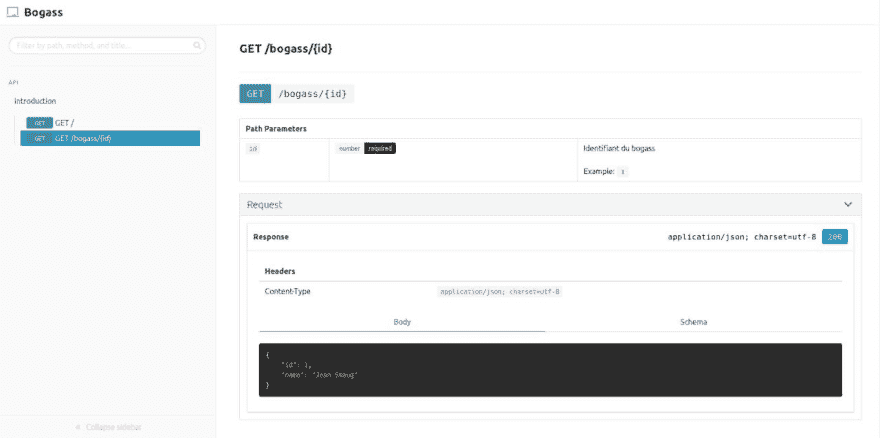

# 实验文件

> 原文:# t0]https://dev . to/jeansmaug/la-test accreditation-1gnm

我正在用框架节点“T1”创建一个 API。JS，当我想"也许是时候做些测试了"。

在试验阶段，我不确定是否要为我的项目保留同一个节点，所以我开始查看不可知论者的测试框架。我遇到了 [Dredd](https://dredd.org/en/latest/index.html) ，它允许从蓝图 Api 配置文件测试其 API。这就是一切开始的地方。

## 服务器

为了简化演示，我们的服务器将有两条从 JSON 返回的路由:

*   返回“Hello world”的根
*   具有返回用户信息的参数的路由

```
const express = require("express")

const app = express()

const users = [
  {
    id: 1,
    name: "Jean Smaug",
  },
  {
    id: 2,
    name: "Timmy",
  },
]

app.get("/", function(req, res) {
  res.json({ message: "Hello World!" })
})

app.get("/bogass/:id", function(req, res) {
  res.json(users.find(user => user.id === Number(req.params.id)))
})

app.listen(3000, () => {
  console.log("Listening on port 3000")
}) 
```

## dredd 初始化

用`yarn add -DE dredd`安装 Dredd 后，我们可以通过发射`yarn dredd init`
来初始化它

```
? Location of the API description document apiary.apib
? Command to start the API server under test yarn dev
? Host of the API under test http://127.0.0.1:3000
? Do you want to use hooks to customize Dredd's behavior? No
? Do you want to report your tests to the Apiary inspector? No
? Dredd is best served with Continuous Integration. Do you want to create CI configuration? No 
```

我们刚刚将 Dredd 配置为读取文件“`apiary.apib`”。此文件将在可通过“`http://127.0.0.1:3000`”访问的服务器上运行测试。并且该服务器将通过命令`yarn dev`启动。
既然 Dredd 已经初始化，我们就可以专注于蓝图 API 了。

## [](#api-blueprint)API 蓝图

blue print API 被定义为 les api 的“强大的描述语言”。
具体来说，我们将在`.apib`、`apiary.apib`档案中设定您的路线、必要参数和预期传回值，在此例中。
在此档案中，我们将撰写 MSON(物件评分的 Markdown 语法)，因此请务必遵守缩排。

```
FORMAT: 1A

# Bogass

API de l'application Bogass, l'application des bogass

# GET /
 - Response 200 (application/json; charset=utf-8)
 - Body {
              "message": "Hello World!"
          } # GET /bogass/{id}
 - Parameters
 - id: 1 (number) - Identifiant du bogass
 - Response 200 (application/json; charset=utf-8)
 - Body {
              "id": 1,
              "name": "Jean Smaug"
          } 
```

当 Dredd 读取此文件时，它将发出两个请求，一个在每条道路上。预计每个实体都将收到一个 HTTP 200 代码和一个值为“`(application/json; charset=utf-8)`”的内容类型。

第一个查询和第二个查询之间的主要区别在于参数传递，如下所示。

```
- nom_du_champs: valeur_de_test (type) - Description 
```

只需简单的‘t0’即可开始我们的测试。

有一个 API 描述文件是非常棒的，因为它允许任何工具来使用它。从而使我能够过渡到滑雪板

## [](#snowboard)滑雪板

滑雪板也会读取我们的配置文件`.apib`，并生成文档。

[T2】](https://res.cloudinary.com/practicaldev/image/fetch/s--Z73kYunl--/c_limit%2Cf_auto%2Cfl_progressive%2Cq_auto%2Cw_880/https://thepracticaldev.s3.amazonaws.com/i/5obdc6jef3chea9bn7if.jpg)

要获得此结果，必须发出命令`yarn snowboard html -o index.html apiary.apib`

## [](#conclusion)结论

在测试和文档之间建立联系是一个非常好的主意。我认为写文件是件枯燥无味的事情而保持它更令人厌恶。使用这种工具，如果文档不是最新的，则意味着测试也不是最新的，这是什么-我...。有问题。
总之，请阅读 Dredd、Api Blueprint 和滑雪板的文档，这些文档比这简短的介绍要完整得多。
谢谢你读给我听。

## [](#bonus)奖金

一件我没有提到的事:Dredd 也支持格式 [Open API](https://www.openapis.org/) (V2 目前)。如果你是 Open API 的爱好者，你可以参考[这篇](https://blog.itnetwork.fr/blog-post/2019/05/06/dredd-partie-1-ecriture-documentation.html)文章。