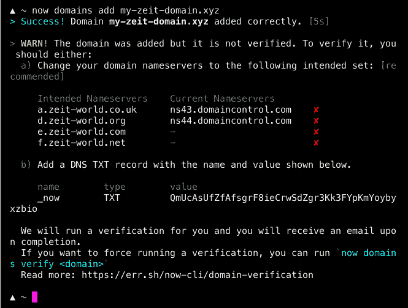
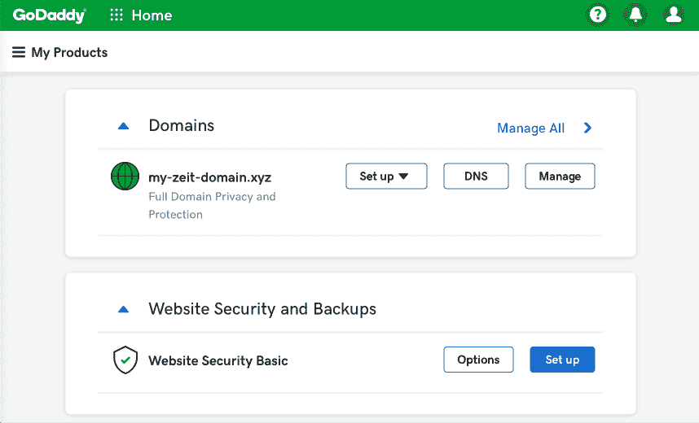
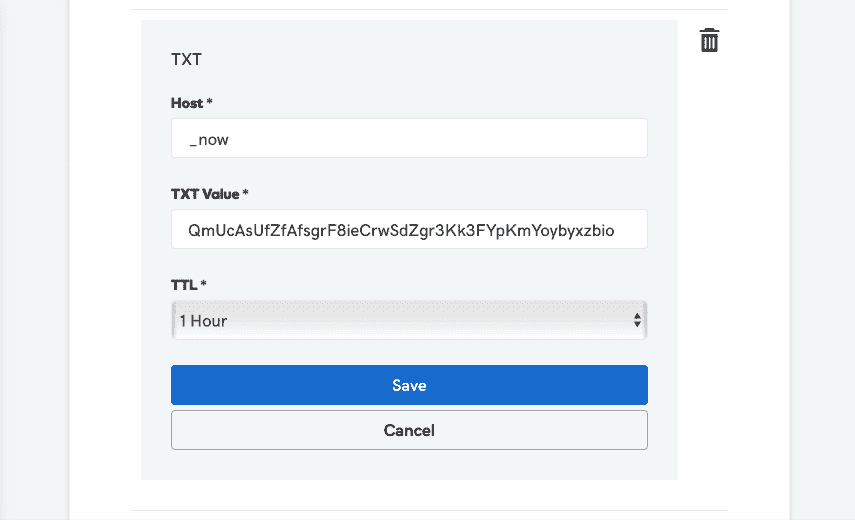
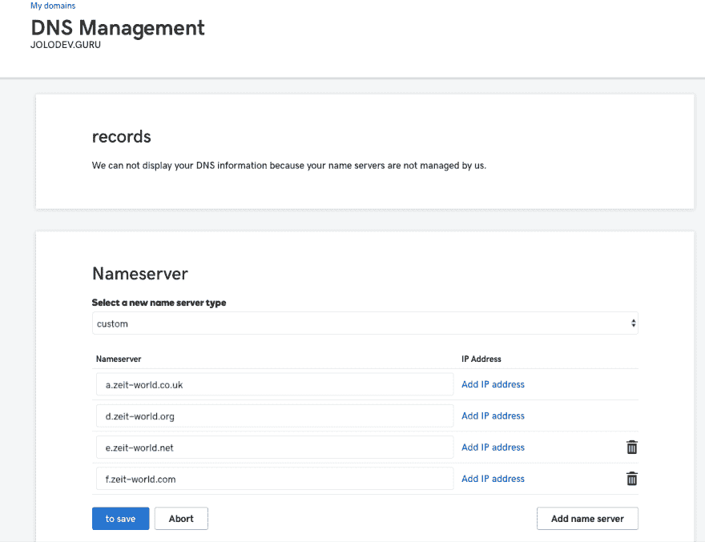
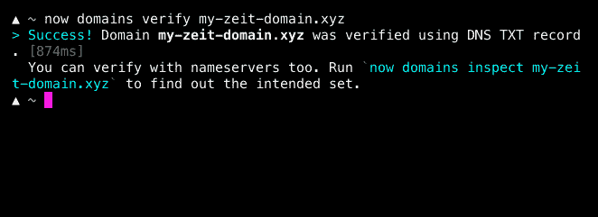

# 现在就用 Zeit 建立个人域名

> 原文:[https://dev . to/jolo/setting-up-a-personal-domain-with-zeit-now-5bkk](https://dev.to/jolo/setting-up-a-personal-domain-with-zeit-now-5bkk)

## [](#introduction)简介

我开始致力于我的网络形象，并且刚刚在 GoDaddy 上买了一个域名。当然，我也可以把我的应用程序放在那里，但既然有像 surge . sh T3 或 T5 这样的无服务器服务，我为什么要这样做呢？我选择了 Zeit，因为我已经用它做了一些原型，我喜欢 Github 集成和他们的仪表板。

## [](#why-serverless)为什么无服务器？

无服务器并不意味着“没有服务器”。当然，服务器必须为代码服务。这只是意味着减少对服务器的关心和维护开销。如果你想快速部署一些东西，而不需要设置像 **Nginx** 或 **Apache Webserver** 这样的网络服务器，或者通过 FTP 上传文件，然后维护它，这就很方便了。
有了无服务器，你就不需要这些了。
牛逼！！

## [](#zeit-now)Zeit Now

当我在寻找无服务器提供商时，Zeit 引起了我的注意。

> ZEIT Now 是一个静态网站和无服务器功能的云平台。它使开发人员能够托管即时部署、自动扩展且无需监管的网站和 web 服务，所有这些都无需配置。

这是引用自[Zeit.co](https://zeit.co/docs/)的登陆页面。
又牛逼了！！
您首先需要登录其仪表盘。我选择通过我的 Github 帐户登录，然后你需要安装 CLI。

`npm i -g now`

之后，您登录您的帐户:

`now login`

现在(呵呵)你把你的凭据。之后，您需要通过点击那里的按钮，通过电子邮件验证您的登录。最后，你可以走了...我也是这么想的。

在我的例子中，我需要设置一个`now.json`并把它放到我的项目中。

## [](#deployment-configuration-with-now)部署配置同现在

背后的原因是，我有一个 [NuxtJS](https://nuxtjs.org/) 项目，现在需要知道您想要部署什么类型的应用程序。

从[部署配置](https://zeit.co/docs/v2/advanced/configuration/)，我采取了

*   Name =部署的字符串名称。
*   版本= [现平台版本](https://zeit.co/docs/v2/advanced/platform/overview/#versioning)

最后我的`now.json`看起来像这个

```
{
    "name": "jolo-portfolio",
    "version": 2
} 
```

<svg width="20px" height="20px" viewBox="0 0 24 24" class="highlight-action crayons-icon highlight-action--fullscreen-on"><title>Enter fullscreen mode</title></svg> <svg width="20px" height="20px" viewBox="0 0 24 24" class="highlight-action crayons-icon highlight-action--fullscreen-off"><title>Exit fullscreen mode</title></svg>

现在(呵呵)可以用了...我也是这么想的，但是对于一个 Nuxt 项目，你需要调整`nuxt.config.js`并改变输出目录

```
{
  ...
  "generate": {
    "dir": "public"
  }
} 
```

<svg width="20px" height="20px" viewBox="0 0 24 24" class="highlight-action crayons-icon highlight-action--fullscreen-on"><title>Enter fullscreen mode</title></svg> <svg width="20px" height="20px" viewBox="0 0 24 24" class="highlight-action crayons-icon highlight-action--fullscreen-off"><title>Exit fullscreen mode</title></svg>

还有`package.json`

```
{
  "scripts": {
    ...
    "build": "nuxt generate"
  }
} 
```

<svg width="20px" height="20px" viewBox="0 0 24 24" class="highlight-action crayons-icon highlight-action--fullscreen-on"><title>Enter fullscreen mode</title></svg> <svg width="20px" height="20px" viewBox="0 0 24 24" class="highlight-action crayons-icon highlight-action--fullscreen-off"><title>Exit fullscreen mode</title></svg>

现在(😋)您应该能够部署您的项目，这是使用`now` -command
后的结果

```
➜ now
> Deploying /my/projects/portfolio under jolo
> Using project jolo-portfolio
> Synced 1 file (29.33KB) [924ms]
> https://jolo-portfolio-31bvou1kk.now.sh [v2] [1s]
> Ready! Deployed to https://jolo-portfolio.jolo.now.sh [in clipboard] [1m] 
```

<svg width="20px" height="20px" viewBox="0 0 24 24" class="highlight-action crayons-icon highlight-action--fullscreen-on"><title>Enter fullscreen mode</title></svg> <svg width="20px" height="20px" viewBox="0 0 24 24" class="highlight-action crayons-icon highlight-action--fullscreen-off"><title>Exit fullscreen mode</title></svg>

您将获得一个唯一的部署 URL(上面的第一个 URL)和一个带有 SSL( **)的临时 URL(上面的第二个 URL)！！！**)

相当牛逼！

## [](#point-to-a-custom-domain)指向自定义域

酷，为了一个快速的原型和你的页面在生产中的感觉，你需要一个个人的 URL。所以我谷歌了一个域名，在 GoDaddy 上找到了一个。

现在有一篇很好的关于如何用 Zeit 设置域名的博文。

`now domains add <domain>`

你会看到类似这样的东西

[T2】](https://res.cloudinary.com/practicaldev/image/fetch/s--4CzrTymM--/c_limit%2Cf_auto%2Cfl_progressive%2Cq_auto%2Cw_880/https://thepracticaldev.s3.amazonaws.com/i/52cpdhbc8c1xu37e1281.png)

上面说域名指向 GoDaddy。现在我们需要通过更改 GoDaddy 上的名称服务器来将其更改为 Zeit。

[](https://res.cloudinary.com/practicaldev/image/fetch/s--HlWidbPz--/c_limit%2Cf_auto%2Cfl_progressive%2Cq_auto%2Cw_880/https://thepracticaldev.s3.amazonaws.com/i/7r8xi322322ociqxtxsl.png) 
并点击 **DNS** 。

在**名称服务器**区域，首先通过从 CLI 复制来添加 **TXT** 。

[T2】](https://res.cloudinary.com/practicaldev/image/fetch/s--IGtac1OA--/c_limit%2Cf_auto%2Cfl_progressive%2Cq_auto%2Cw_880/https://thepracticaldev.s3.amazonaws.com/i/o1i89s539xcarhbroaob.png)

否则，将需要一个停机时间，以从 Zeit 指向您的域。

然后，您将**服务器类型**更改为**自定义**，将 CLI 输出中给出的域名服务器(见上文)添加到您的 GoDaddy 域的 DNS 中。

[T2】](https://res.cloudinary.com/practicaldev/image/fetch/s--MRQvSSRF--/c_limit%2Cf_auto%2Cfl_progressive%2Cq_auto%2Cw_880/https://thepracticaldev.s3.amazonaws.com/i/s4ta79wd9ig22rtvsioz.png)

就我而言，

*   a.zeit-world.co.uk
*   d.zeit-world.org
*   e.zeit-world.com
*   f.zeit-world.net

现在回到您的终端，您运行以下命令
`now domains verify <domain>`` 1

可能发生的情况是，您需要等待，直到它指向您的域。但是一旦设置完毕，你会看到以下信息

[T2】](https://res.cloudinary.com/practicaldev/image/fetch/s--_cn67Kcr--/c_limit%2Cf_auto%2Cfl_progressive%2Cq_auto%2Cw_880/https://thepracticaldev.s3.amazonaws.com/i/dl27ywmzeka9xtwt7lvk.png)

超级牛逼！

## [](#aliasing)走样

Zeit 现在可以专门为您的部署，还设置了一个 SSL 证书。
是时候给你的`now.json`加上别名了，它在我的箱子里是这样的

 ``{
"name": "jolo-portfolio",
"version": 2,
"alias": "jolodev.guru"
}`` 

 ``现在，我可以使用
`now --prod`将我的页面部署到生产环境中

多棒啊。

## [](#conclusion)结论

无服务器有一个设置过程，tbh 需要一段时间。然而，一旦设置完成，你就可以通过运行一个命令来部署应用程序，而且设置本身比设置自己的网络服务器要简单得多。

Zeit 是一个很棒的提供商，现在是一个很棒的工具，你可以免费使用它！！
我喜欢它的风格和博客帖子。绝对值得一试。

如果你对我推出的东西感兴趣，可以看看我的页面:
[【https://jolodev.guru/】](https://jolodev.guru/)

你有没有注意到我现在已经输入*23 次了😆*

记住:jolo——只是霸王！

## [](#references)参考文献

*   [https://zeit.co/](https://zeit.co/)
*   [https://zeit.co/guides/deploying-nuxtjs-with-zeit-now/](https://zeit.co/guides/deploying-nuxtjs-with-zeit-now/)
*   [https://zeit.co/guides/setup-godaddy-domain-now/](https://zeit.co/guides/setup-godaddy-domain-now/)
*   [https://godaddy.com/](https://godaddy.com/)
*   [https://de . godaddy . com/help/groove-you-one-txt 记录-19232？lang = en](https://de.godaddy.com/help/fugen-sie-einen-txt-datensatz-19232?lang=en)``