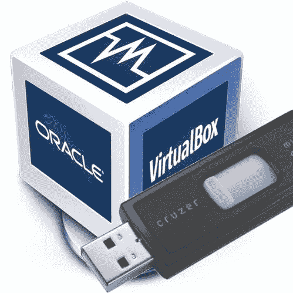

# 如何通过 USB 设备

> 原文:[https://dev . to/Oscar 37921395/virtualbox-how-to-pass-through-USB-devices-3i5k](https://dev.to/oscar37921395/virtualbox-how-to-pass-through-usb-devices-3i5k)

[T2】](https://res.cloudinary.com/practicaldev/image/fetch/s--WUL-hVsr--/c_limit%2Cf_auto%2Cfl_progressive%2Cq_auto%2Cw_880/https://cdn1.radikalno.ru/uploads/2019/9/17/2d32550ae6cdd28008b35be287444d52-full.jpg)

如果你使用虚拟机，你很有可能在某个时候知道如何在 VirtualBox 中连接 USB。[这篇文章](https://www.net-usb.com/virtual-usb/virtualbox-usb-passthrough/)展示了如何将 USB 设备连接到 VirtualBox，以及如何在 [USB 网络网关](https://www.net-usb.com/)的帮助下共享连接的设备。