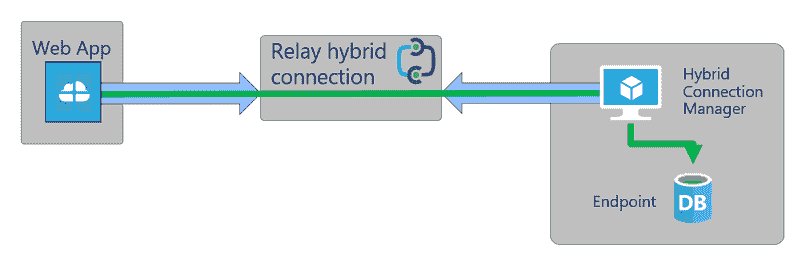

# 将 Azure PaaS 与您的企业网络连接起来

> 原文：<https://dev.to/andreasjakof/connecting-azure-paas-with-your-corporate-network-1oi6>

今年早些时候，我们公司决定，我们将在未来几年内实现云计算。由于我们已经在使用微软的许多其他云服务(SharePoint Online、Exchange Online、Azure AD、Intune、...)我们选择了蔚蓝色的云作为我们的主人。

就像每一个更大的迁移项目一样，将会有一个迁移阶段，此时部分已经在云中，而其他部分仍在公司网络中。他们需要互相交流。所以我们必须想出一个解决方案。

这些是我们想到的选择:

*   虚拟专用网络
*   蓝色快车路线
*   Azure 应用程序代理
*   Azure 混合连接器

## ~~[虚拟专用网](https://social.msdn.microsoft.com/Forums/en-US/9b14af5a-9b67-49e7-94a5-793af88b50f7/azure-site-to-site-vpn-for-azure-paas-service?forum=WAVirtualMachinesVirtualNetwork)~~

第一个也是最明显的选择是 VPN。如果不是我们想只使用平台/功能即服务(PaaS)而不使用基础架构即服务(IaaS)，这是一个可行的选择。如果我们要改变像本地/云这样基本的东西，我们会全力以赴。所以 Azure 中没有虚拟机！

事实证明，VPN 至少需要一个虚拟机，因此没有用于开发运维的 VPN。

## ~~[快递路线](https://docs.microsoft.com/en-us/azure/expressroute/how-to-move-peering)~~

对于那些从未听说过快速路线的人。它基本上就像一个 VPN，但是有更多的带宽和更高的价格。它基本上将企业网络扩展到 Azure 中。并且 *drumroll* 它与 PaaS 一起工作。但是你需要配置每一个 PaaS 应用，每一个 Azure 数据库。我们最终选择的不是解决方案，而是某个网络团队，而不是我们开发人员。
不是我们想走的路。我们需要能够适应快速变化。我们甚至不知道，网络人员在哪里。

所以德沃普家也没有快捷路线。

## ~~[Azure 应用代理](https://docs.microsoft.com/en-us/azure/active-directory/manage-apps/application-proxy)~~

Azure 应用程序代理允许你使用 Http 来访问你的公司网络。所以基本上这限制了我们对 API 的 REST 调用。
您需要两个端点:

1.  在本地安装一个服务，该服务在 Azure 中打开到中继服务的连接。
2.  在 Azure 中，您配置一个端点，该端点将调用中继到同一个中继服务，然后该服务将调用转发到已经从 OnPrem-Endpoint 打开的连接。

它只对 Http(s)有效，但是我们可以为我们的数据库查询创建一个中继 web 服务。用[连载。Linq](https://www.nuget.org/packages/Serialize.Linq/) 我们可以序列化 EF 表达式，并在 rest 调用中将它们发送给服务器，服务器调用 DB 并返回结果。

总的来说，它工作得很好。我们也有完全的控制权...但是:
有了 Azure Application Proxy，你基本上在公共互联网上拥有了一个你的内网页面/API 的开放端点，无需任何进一步的认证。你可以使用预认证，用 OAuth2.0 针对你的 Azure ADFS 认证对它的每个调用，但我从未成功地在代码中实现这一点。我总是在提示您输入凭据的页面上结束，而不是在我的公司端点上。
也许我是[拿错了](https://www.engadget.com/2010/06/24/apple-responds-over-iphone-4-reception-issues-youre-holding-th)，但是因为我需要访问我们的资产管理系统，这不是我想在公共互联网上公开的任何东西。

我们公司使用了应用程序代理，但没有用于 DevOps 团队。

## [Azure 混合连接](https://docs.microsoft.com/en-us/azure/app-service/app-service-hybrid-connections)

首先让我们来看看这篇文章的原因。网上关于它的信息有点稀疏。我只是偶然发现的，也许对你来说也是。

我曾无数次寻找我们的 VPN-PaaS 问题的解决方案，然后我发现了这个网站。
我看到这个
 
我在想:“这正是我们需要的！”。

它几乎像 Azure 应用程序代理一样工作，但是...而这却是重要的部分。它是协议不可知的...因此它转发基本的 TCP 连接，允许您访问本地数据库。

你还需要两个端点。

1.  内部中继服务
2.  配置一个 URI 来捕获和转发。(捕手)

将捕捉器配置到您的应用服务/功能/...只需使用相同的 URI，就像您在本地网络中一样，只需稍加改动。务必给出完整的 URI，包括港口。

因此，对于数据库连接，它将是`tcp://yourDbServer:1433`。
每当您在代码中访问资源时，catcher 会将请求转发到您的本地端点，在那里请求被解析、访问并返回结果。

您**在公共互联网中没有**开放的端点，因为您需要为您使用它的每个 web 应用程序配置它。但是你可以使用和本地相同的代码。

一个警告:看起来你至少需要一个高级应用服务计划来使用混合连接。因此，这大约是 100 欧元/月，但他们真的很值得！

我错过了什么明显或者不太明显的东西吗？