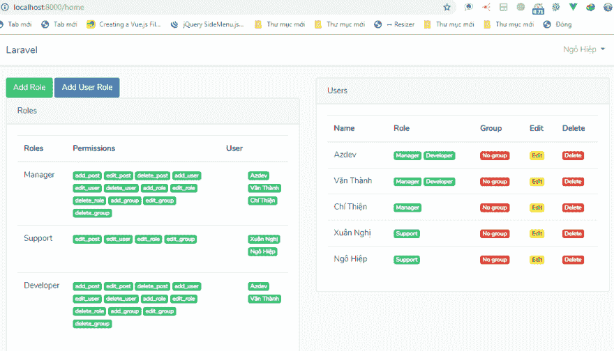

# Laravel 5.8 中的用户角色和权限

> 原文：<https://dev.to/skipperhoa/user-roles-and-permissions-in-laravel-5-8-1a4n>

每个人都可以在这里看到:[用户角色&Laravel 5.8](https://hoanguyenit.com/user-roles-and-permissions-in-laravel-58.html)中的权限

