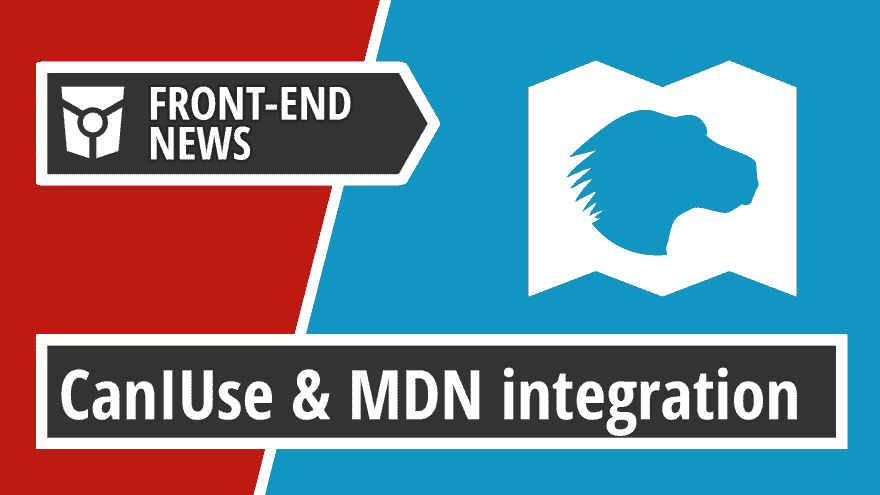
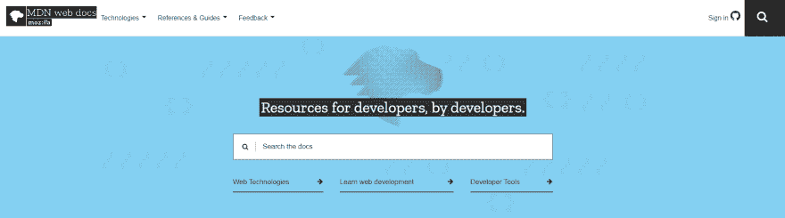
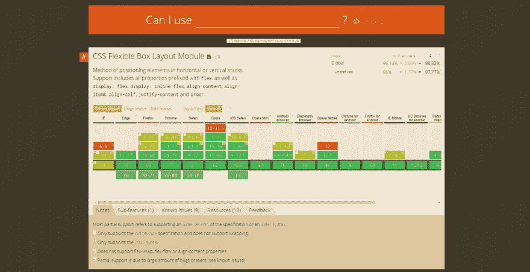
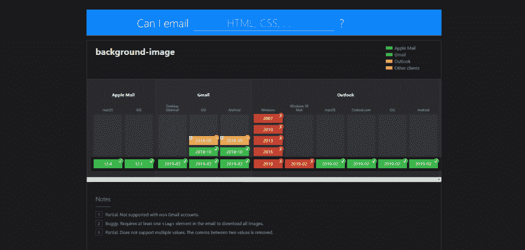
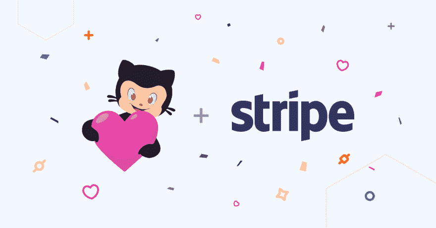
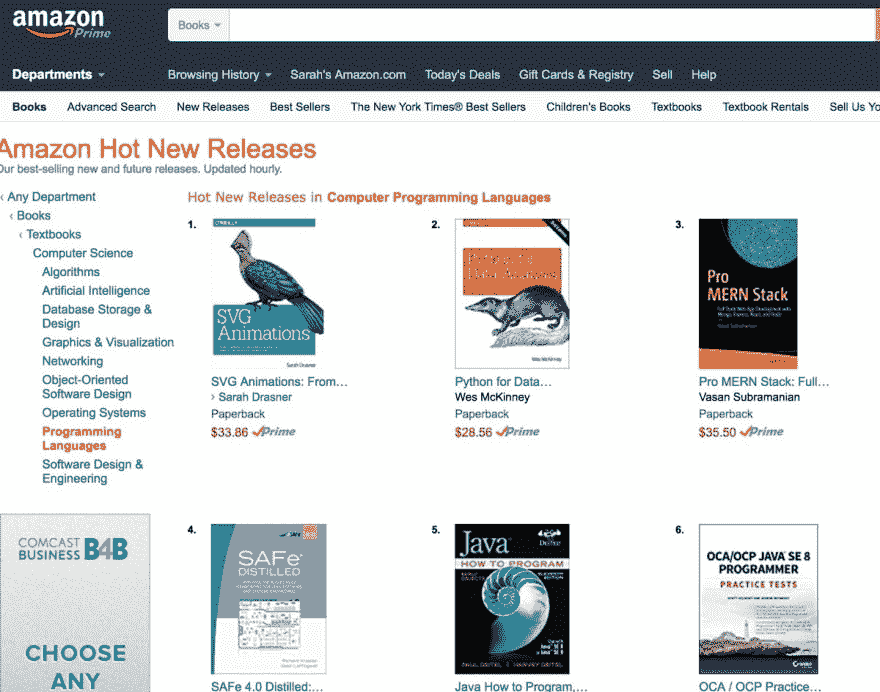
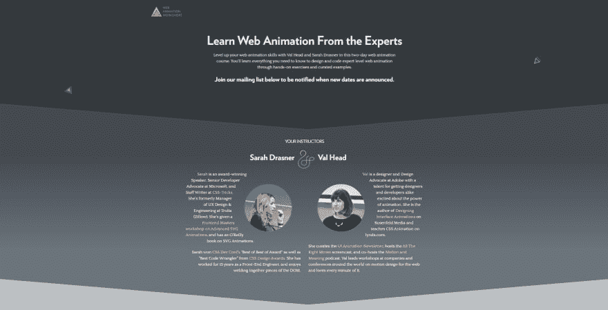

# MDN 和 Caniuse 合作| GitHub 合作伙伴与 Stripe 合作帮助赞助商|前端新闻#18

> 原文:[https://dev . to/adriansandu/MDN-and-cani use-collaborate-github-partners-with-stripe-to-help-sponsors-front-end-news-18-4 nob](https://dev.to/adriansandu/mdn-and-caniuse-collaborate-github-partners-with-stripe-to-help-sponsors-front-end-news-18-4nob)

[T2】](https://res.cloudinary.com/practicaldev/image/fetch/s--uvY3iJyU--/c_limit%2Cf_auto%2Cfl_progressive%2Cq_auto%2Cw_880/https://thepracticaldev.s3.amazonaws.com/i/eupz11xlxwpn7flxtumo.png)

大家好，欢迎收看新一轮的前端新闻。这些是今天的主题:

*   mdn，我可以使用 exchange 浏览器兼容性数据吗
*   你现在可以用我可以发邮件吗来升级你的电子邮件游戏
*   GitHub 与 Stripe 合作加速赞助商计划

接下来，是通常的软件更新和本集的本周开发者。所以请陪我到最后，找出所有的细节。

一如既往，我也为那些喜欢听而不是读的人准备了视频版本。如果你喜欢这种格式，如果你也能订阅 YouTube 频道，我将不胜感激。

[https://www.youtube.com/embed/cFjNsXv7Fdg](https://www.youtube.com/embed/cFjNsXv7Fdg)

* * *

## MDN 和 Caniuse 交换浏览器兼容性数据

Mozilla Developer Network 是目前最好的 web 开发知识库之一。它有关于开放网络平台的几乎每一个元素的全面信息。这包括一个非常方便的兼容性表，显示了现有浏览器如何支持特定的功能。

[T2】](https://res.cloudinary.com/practicaldev/image/fetch/s--qwz_9t_l--/c_limit%2Cf_auto%2Cfl_progressive%2Cq_auto%2Cw_880/https://thepracticaldev.s3.amazonaws.com/i/vpuby5z3tciq6uuemyo2.png)

2018 年初，MDN 背后的开发者决定启动浏览器兼容性数据(BCD)项目。该项目的目的是以一种可以通过编程方式访问的格式聚合所有相关数据。结果存储在 GitHub 存储库中，也可以作为单独的 npm 包获得。反过来，这也用于其他项目，如 VS 代码编辑器或 webhint.io。

然而，当你问开发人员他们用什么工具来查找浏览器兼容性信息时，大多数人会让你去 caniuse.com。在过去的十年里，这个网站一直是检查某个特性在不同浏览器间的支持方式的首选。

[T2】](https://res.cloudinary.com/practicaldev/image/fetch/s--OBI6oEC5--/c_limit%2Cf_auto%2Cfl_progressive%2Cq_auto%2Cw_880/https://thepracticaldev.s3.amazonaws.com/i/8q00k53bz11ba2boipna.png)

这两个项目自然会寻找合作和共享数据的方式。Mozilla Hacks 博客上的一篇文章最近宣布，MDN 兼容性数据从现在起将集成到 caniuse 网站中。

因此，caniuse.com 现在可以显示整个 BCD 数据集中的支持数据。这将可用数据从大约 500 个兼容性表扩展到超过 10，000 个表。这两个数据集将保持独立，因为每个网站服务于兼容但仍然不同的目的。

[T2】](https://res.cloudinary.com/practicaldev/image/fetch/s--R6kz9dgt--/c_limit%2Cf_auto%2Cfl_progressive%2Cq_auto%2Cw_880/https://thepracticaldev.s3.amazonaws.com/i/ffhbbuundhl48hfgu092.png)

就我个人而言，我很高兴看到这种合作的发生。更好和更容易地访问浏览器兼容性数据只能帮助开发人员制作更轻、更快和整体更好的网站和应用程序。

参考:

*   [https://hacks . Mozilla . org/2019/09/cani use-and-MDN-compat-data-collaboration/](https://hacks.mozilla.org/2019/09/caniuse-and-mdn-compat-data-collaboration/)

* * *

## 使用 Caniemail 升级您的电子邮件游戏

下一个主题也与能够检查代理支持和兼容性数据有关。只是这次是关于电子邮件和电子邮件客户端，而不是浏览器和网站或网络应用程序。

[T2】](https://res.cloudinary.com/practicaldev/image/fetch/s--WCgy18j9--/c_limit%2Cf_auto%2Cfl_progressive%2Cq_auto%2Cw_880/https://thepracticaldev.s3.amazonaws.com/i/hhbsddhoj85k7khfzc91.png)

Caniemail.com 可以被认为是 caniuse.com 的孪生兄弟，尽管它年轻了十岁。它使用相同的成熟设计、功能和数据结构。它还利用社区贡献来跟上最新的变化。

到目前为止，电子邮件中 CSS 支持最可靠的参考资源是 Campaign Monitor 发布的指南。然而，没有办法贡献，它不包括 HTML 或图像格式的支持信息，它可能需要很长时间的更新添加。这些都是 Caniemail.com 可以做得更好的地方，我希望它能像 caniuse.com 一样，成为新的参考网站。

*   [https://www.caniemail.com/](https://www.caniemail.com/)

* * *

## GitHub 与 Stripe Connect 合作加速赞助商计划

[T2】](https://res.cloudinary.com/practicaldev/image/fetch/s--rsE0eL0r--/c_limit%2Cf_auto%2Cfl_progressive%2Cq_auto%2Cw_880/https://thepracticaldev.s3.amazonaws.com/i/2cxhc3cmlfxyo37j2l48.png)

*图片来源:[https://github . blog/2019-09-10-accelerating-the-github-赞助商-beta/](https://github.blog/2019-09-10-accelerating-the-github-sponsors-beta/)*

GitHub 宣布了他们赞助商计划的新更新。他们与 Stripe 合作，使用 Stripe Connect Express 功能来加速入职流程。

到目前为止，在 GitHub 的不同团队和部门中，程序的新开发人员都是手工完成的。这种合作关系提供了工具，可以更快、更安全地验证身份、输入银行信息、接收资金和管理支出。所有这些都要考虑到每个受支持国家/地区的本地化规则和法规。

目前，Stripe Connect 可用于 30 个国家，并计划在未来扩展该列表。这意味着加速过程只适用于居住在这些国家之一的开发者。其他所有人都必须通过手动流程。

*   [https://github . blog/2019-09-10-accelerating-the-github-sports-beta/](https://github.blog/2019-09-10-accelerating-the-github-sponsors-beta/)

* * *

## 软件更新和发布

### 铬 77

谷歌推出了 Chrome 浏览器的 v77 更新。开发团队承诺发布一些博客文章来强调最重要的变化。在此之前，您仍然可以看到下面链接的发行说明。

*   [https://chrome releases . Google blog . com/2019/09/stable-channel-update-for-desktop . html](https://chromereleases.googleblog.com/2019/09/stable-channel-update-for-desktop.html)

### 猫鼬 v5.7

Mongoose 是用于 node.js 的 MongoDB 对象建模，最近已经升级到 v5.7。主要贡献者之一 Valeri Karpov 发表了一篇博客文章，详细介绍了现在可用的两个新特性:有条件不可变的属性和更快的文档数组。完整的细节可以在下面链接的文章中找到。

*   [http://thecodebarbarian . com/mongose-5-7-conditional-immutability-document-array-perf . html](http://thecodebarbarian.com/mongoose-5-7-conditional-immutability-document-array-perf.html)

### React Suite v4.0.0

React Suite 是一套针对企业系统产品的 React 组件库。该产品背后的社区刚刚推出了新的 4.0 版本的重大更新。这带来了很多变化，比如一组新组件、对黑暗主题的支持，或者从 Flow 到 TypeScript 的迁移。有关完整的细节，您应该查看官方发行说明。

*   [https://github.com/rsuite/rsuite/releases/tag/4.0.0](https://github.com/rsuite/rsuite/releases/tag/4.0.0)

* * *

## 一周的开发者

[T2】](https://res.cloudinary.com/practicaldev/image/fetch/s--fmZAJyC---/c_limit%2Cf_auto%2Cfl_progressive%2Cq_auto%2Cw_880/https://thepracticaldev.s3.amazonaws.com/i/uwe4hv01t99jjh1bghyh.jpg)

*图片来源:[https://aneventpapart . com/news/post/the-animated-future-a-words-with-Sarah-dras ner](https://aneventapart.com/news/post/the-animated-future-a-few-words-with-sarah-drasner)T3】*

本集“本周开发者”的冠军是莎拉·德拉斯纳。Sarah 是一名获奖的开发人员、演讲者和作家。她已经在这个行业工作了超过 15 年，现在是 Vue 核心团队成员和 Netlify 的开发者体验主管。在此之前，她是微软新兴市场的主要负责人、云倡导者以及 Trulia/Zillow Group 的 UX 和工程经理。

莎拉的 CodePen 账户里有很多好东西。她的最新项目之一，CSS 网格生成器，正在帮助开发人员尝试 CSS 网格。您只需输入网格参数，为您的 div 绘制位置，工具就会为您生成代码。小菜一碟。

Sara 热爱写作，几乎就像她热爱编码一样。她是 CSS-Tricks 的专职作家，她的文章被知名网站发表，如 Smashing Magazine、Net Magazin 和许多其他网站。她写了一本名为“SVG 动画”的书，由 O'Reilly 出版，前言由上周的专题开发者 Chris Coyier 撰写。如果这还不够支持你，我不知道什么才是。

> 莎拉·德拉斯纳[@莎拉 _ 埃多](https://dev.to/sarah_edo)神圣一扫而光！我的书是亚马逊上排名第一的编程书籍！*欢乐之舞*
> 
> [shop.oreilly.com/product/063692…](https://t.co/bV6mBteksH)2017 年 3 月 30 日下午 13:505026043

莎拉是许多活动和会议的常客。她做演示，她在舞台上现场写代码，她在世界各地经营工作室。但是你不一定要去参加活动才能向她学习。Sarah 和 Val Head 正在运行他们自己的为期两天的在线加速课程，网络动画工作室。如果这是你感兴趣的事情，请在下一次会议上注册更新。

[T2】](https://res.cloudinary.com/practicaldev/image/fetch/s--xdeZyqdJ--/c_limit%2Cf_auto%2Cfl_progressive%2Cq_auto%2Cw_880/https://thepracticaldev.s3.amazonaws.com/i/zf27o3bo9fp3g8t8f7b0.png)

您可以在以下位置找到莎拉:

*   [https://sarah.dev](https://sarah.dev)
*   [https://twitter.com/sarah_edo](https://twitter.com/sarah_edo)
*   [http://shop.oreilly.com/product/0636920045335.do](http://shop.oreilly.com/product/0636920045335.do)
*   [https://cssgrid-generator.netlify.com/](https://cssgrid-generator.netlify.com/)
*   [https://webanimationworkshops.com/](https://webanimationworkshops.com/)

* * *

## 今日问题

当你需要信息时，你使用什么参考网站？

请在评论区留下你的答案，或者发送给[https://twitter.com/frontendnexus](https://twitter.com/frontendnexus)。

* * *

这一版就这么多了。在 https://twitter.com/frontendnexus[的 Twitter 上关注 Front End Nexus](https://twitter.com/frontendnexus)，一旦有新的更新，我们将立即通知您。我还想鼓励你在 https://www.youtube.com/channel/UCgACtqiDmnSaskDIBsK54ww[的](https://www.youtube.com/channel/UCgACtqiDmnSaskDIBsK54ww)订阅 YouTube 频道。一旦该频道达到 100 名订户，我可以解锁更多的选项，因此非常感谢您的支持。

祝您度过愉快而富有成效的一周，我们下次再见！