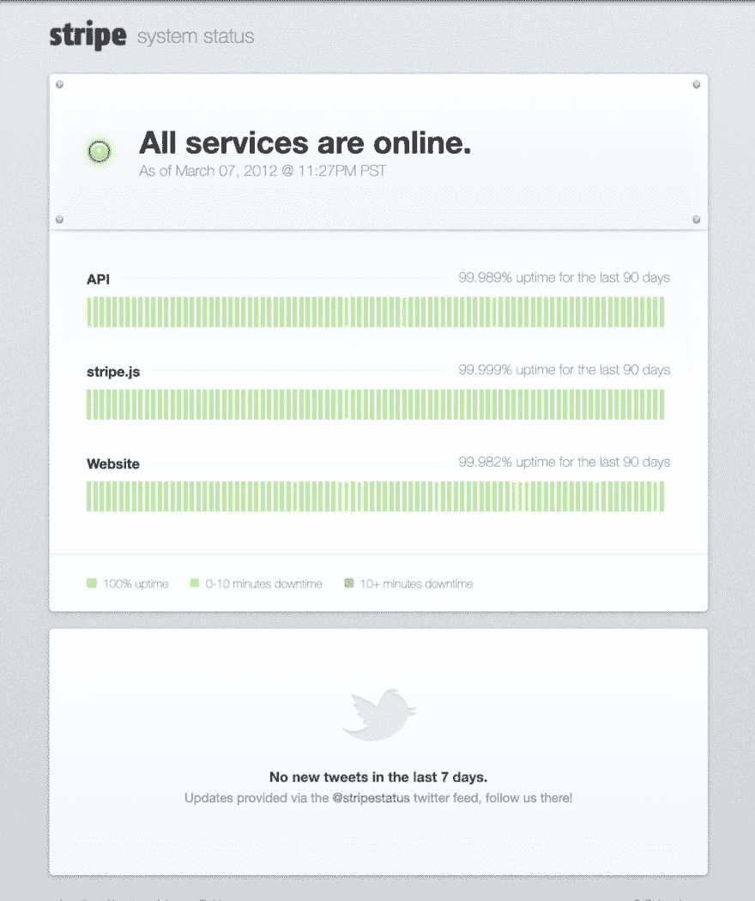
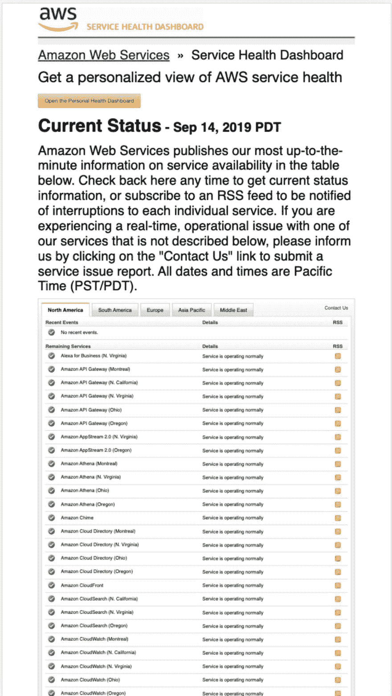
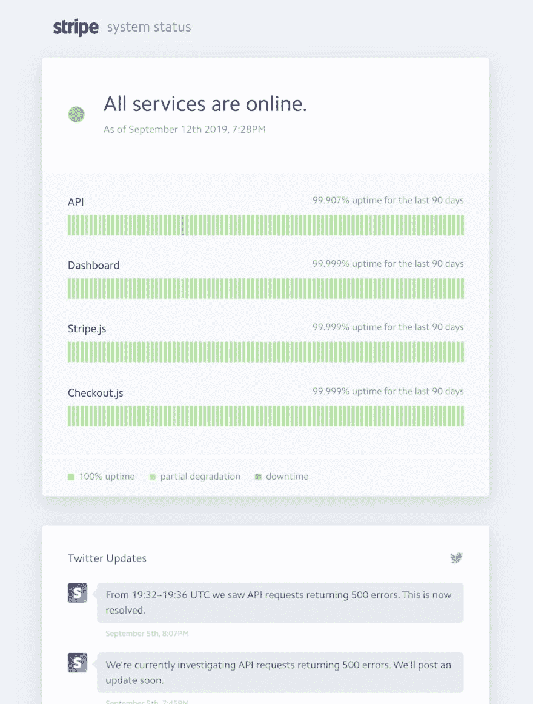

# 条带状态页面的简短历史记录

> 原文：<https://dev.to/projectpage/a-short-history-of-the-stripe-status-page-4cnl>

当 Stripe 在 2018 年成立时，stripe.com 的特色只有一句话——为开发者提供支付处理，以及单一链接。Stripe 已经从这个简单的页面发展到数十亿的估值和尖端设计的声誉——使用极其简单的设计和软件来帮助客户导航复杂的支付流程。

条形状态页面是清晰交流服务中的一个很好的设计例子，它准确地传递了读者需要的东西，仅此而已。今天，我们将看看他们选择在状态页面上包含的元素，以及为什么它如此有效。

# 条纹处的第一个状态页

status.stripe.com 的第一个 stripe 状态页面是由 Amber Feng 在 2012 年创建的，当时她在 Stripe 工作的最初几周是一名工程师，现在是这家市值 10 亿美元的公司的金融基础设施主管。

第一个页面没有响应性(当时响应性网页设计不是主流思想)，但在内容和风格上与我们今天看到的页面非常相似。它的顶部有一个全局指示器，下面是历史正常运行时间的服务列表，底部是 twitter 帐户的 feed，用于在停电时发布状态更新。来自帖子:

> “我们构建了彩色编码的图表，显示 Stripe 的三个核心服务:网站、API 和 Stripe.js 的 90 天可用性。我们还显示了相同三个月期间计算的原始正常运行时间数据。为了计算这些数字，我们使用 Pingdom 来监控每个服务，在 API 的情况下有效地执行完整的 API 请求。”

原页面:

# Pingdom 进行状态检查

这个第一页是通过 pingdom 的 checks 更新的——这是一个有趣的例子，当有一个足够好的外部 checker 服务可用时，可以避免构建一个单独的 checker 服务——这让他们可以快速构建第一个状态页，并查看是否需要在以后投入更多时间。这是一家 10 人左右的小公司，这是她的第一个任务:

> “当我第一次加入 Stripe 时，我们很小，我面试了公司的每个人！没有 Stripe 的声誉或品牌的诱惑或可信度，公司真正吸引我的是团队。”安珀·冯

# 与 AWS 对比

Amazon AWS 状态页面为 stripe 状态页面提供了一个很好的对比。它是手动更新的，没有反应(很难在手机上阅读)，而且非常复杂。没有整体状态，也没有按逻辑顺序对服务进行分组，只有一个冗长的服务和地区列表。它太长了，我甚至不能拍一张有代表性的截图，在页面的顶部是一堵没有人想看的文字墙。

# 新建状态页面

Stripe 从可能工作的最小的东西开始，一个非常简单的页面，直到今天它都很好地为他们服务。他们最新的状态页面看起来非常像原来的，最值得注意的是自最初设计以来几乎没有什么变化，这证明了其周到的简单性:

这个设计如此之好，以至于竞争对手都深受其启发。成立于 2012 年的 Statuspage.io 提供了非常相似的视图，其灵感显然来自于条纹设计，该设计按服务细分状态，并以绿色或红色条显示历史正常运行时间，汇总每天的状态。

你可以在项目页面的完整案例研究中阅读一篇更长的文章，其中有更多细节和图片，或者在 [twitter](https://twitter.com/projpage/status/1173851829899354117) 上阅读更多内容。