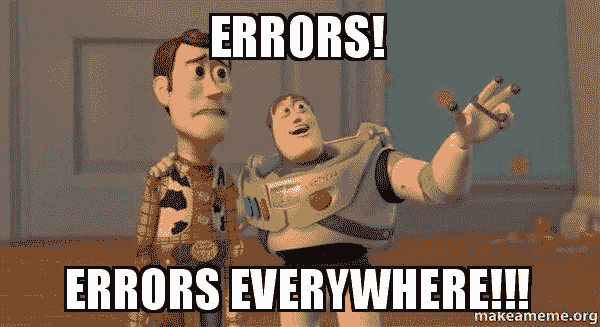

# 林挺入门指南

> 原文：<https://dev.to/jameesy/the-absolute-beginners-guide-to-linting-45a1>

我们可能都曾经经历过。我们兴奋地安装了 ESLint，希望它能整理出我们所有的代码，让我们更擅长编写好的、干净的 JavaScript。

你听说过你应该成为林挺，但这是一件你并不真正理解背后原因或方式的事情。

我们在网上找到一些说明，在你知道之前，ESLint 已经安装好了，可以开始玩了。我们加载代码，迎接我们的是一大堆红色曲线和数千个问题。如果你像我一样，你可能会惊慌失措，尽快卸载它，再也不尝试。

棉绒的本质是它们需要配置。对于初学者来说，这可能是一项艰巨的任务，而且也没有太多好的资源，所以我做了一个“完全初学者”指南来设置 linter，并让它指出你代码中的更大错误。

[](https://res.cloudinary.com/practicaldev/image/fetch/s--t-Svwx_Q--/c_limit%2Cf_auto%2Cfl_progressive%2Cq_auto%2Cw_880/https://thepracticaldev.s3.amazonaws.com/i/0fap7d5hzu60vw9hl03a.jpg)

* * *

## 皮棉？WTF？

Linters 解决了整个项目中混乱和不一致的代码问题，这通常是开发周期中至关重要的一部分。他们这样做的方式是定义一组团队中每个人都应该遵守的规则，但更重要的是，linters 帮助您遵循最佳实践，并帮助防止潜在的问题。如果有任何事情不对劲或令人担忧，他们会发出警告。

问题是，如果你刚开始，你不会经常想立刻看到所有你可以改进的地方，但是找到需要解决的更大的问题会很方便。像语法问题，意外的全局变量等等。

* * *

## NPM 安装

此时，您应该已经在系统上安装了节点和 NPM。再次检查运行:

```
node -v
npm -v 
```

<svg width="20px" height="20px" viewBox="0 0 24 24" class="highlight-action crayons-icon highlight-action--fullscreen-on"><title>Enter fullscreen mode</title></svg> <svg width="20px" height="20px" viewBox="0 0 24 24" class="highlight-action crayons-icon highlight-action--fullscreen-off"><title>Exit fullscreen mode</title></svg>

这应该会返回每个的版本号。如果没有，那么你只需要安装节点和 NPM。

要获得 ESLint，请在您的终端中运行以下命令:

```
npm install -g eslint 
```

<svg width="20px" height="20px" viewBox="0 0 24 24" class="highlight-action crayons-icon highlight-action--fullscreen-on"><title>Enter fullscreen mode</title></svg> <svg width="20px" height="20px" viewBox="0 0 24 24" class="highlight-action crayons-icon highlight-action--fullscreen-off"><title>Exit fullscreen mode</title></svg>

这将把 ESLint 安装到您的系统中。

接下来，切换到要安装 ESLint 的项目文件夹的根目录，并运行以下命令:

```
eslint --init 
```

<svg width="20px" height="20px" viewBox="0 0 24 24" class="highlight-action crayons-icon highlight-action--fullscreen-on"><title>Enter fullscreen mode</title></svg> <svg width="20px" height="20px" viewBox="0 0 24 24" class="highlight-action crayons-icon highlight-action--fullscreen-off"><title>Exit fullscreen mode</title></svg>

这应该是可行的，但是，据记载，有时这可能会有一些问题。如果对此有任何问题，请尝试以下操作:

```
./node_modules/.bin/eslint --init 
```

<svg width="20px" height="20px" viewBox="0 0 24 24" class="highlight-action crayons-icon highlight-action--fullscreen-on"><title>Enter fullscreen mode</title></svg> <svg width="20px" height="20px" viewBox="0 0 24 24" class="highlight-action crayons-icon highlight-action--fullscreen-off"><title>Exit fullscreen mode</title></svg>

如果一切顺利，您应该会在终端中看到一些文本，询问“您希望如何配置 ESLint？”。选择以下选项:

```
Use a popular style guide
Standard
JS 
```

<svg width="20px" height="20px" viewBox="0 0 24 24" class="highlight-action crayons-icon highlight-action--fullscreen-on"><title>Enter fullscreen mode</title></svg> <svg width="20px" height="20px" viewBox="0 0 24 24" class="highlight-action crayons-icon highlight-action--fullscreen-off"><title>Exit fullscreen mode</title></svg>

太好了！你已经准备好了，可以去林挺了。

* * *

## 设置超级基本配置

现在，我希望大多数以前遇到过 linters 问题的人会走到这一步，然后当他们打开他们的项目，发现到处都是错误时，就会迷失方向。

这就是配置文件发挥作用的地方！

在您最喜欢的文本编辑器中打开您的项目，您会注意到在您的根目录中有一个新版本的. eslintrc.js 文件。打开它，您应该会看到类似这样的内容:

```
module.exports = {
   "extends": "standard"
}; 
```

<svg width="20px" height="20px" viewBox="0 0 24 24" class="highlight-action crayons-icon highlight-action--fullscreen-on"><title>Enter fullscreen mode</title></svg> <svg width="20px" height="20px" viewBox="0 0 24 24" class="highlight-action crayons-icon highlight-action--fullscreen-off"><title>Exit fullscreen mode</title></svg>

第一件事先把`standard`改成`eslint:recommended`。

```
module.exports = {
   "extends": "eslint:recommended"
}; 
```

<svg width="20px" height="20px" viewBox="0 0 24 24" class="highlight-action crayons-icon highlight-action--fullscreen-on"><title>Enter fullscreen mode</title></svg> <svg width="20px" height="20px" viewBox="0 0 24 24" class="highlight-action crayons-icon highlight-action--fullscreen-off"><title>Exit fullscreen mode</title></svg>

太棒了。如果你看一下你的文件，你会发现仍然有相当多的错误。这是因为我们需要设置一个环境，以便 linter 理解一些全局变量。

```
module.exports = {
   "env": {
     "browser": true,
     "commonjs": true,
     "es6": true,
     "jquery": true
   },
   "extends": "eslint:recommended",
} 
```

<svg width="20px" height="20px" viewBox="0 0 24 24" class="highlight-action crayons-icon highlight-action--fullscreen-on"><title>Enter fullscreen mode</title></svg> <svg width="20px" height="20px" viewBox="0 0 24 24" class="highlight-action crayons-icon highlight-action--fullscreen-off"><title>Exit fullscreen mode</title></svg>

这是为了识别 ES6 和 JQuery 语法而设置的，因为我相信这可能是大多数人在他们的入门项目中使用的语法，但是，如果你使用其他框架，那么你可以像我上面所做的那样，将它们添加到“env”部分。

**棉绒掉了！**

我们做到了！一个完美的小型 ESLint 配置，不会在你每次做错事的时候对你大喊大叫。

显然，随着您的改进和需求的变化，只需在该文件中添加额外的属性即可！简单！