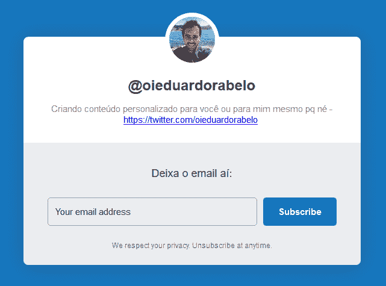

# 我的周:最佳无服务器视频

> [https://dev . to/oieduardorabelo/server less-OS-最佳视频-本周-4p8b](https://dev.to/oieduardorabelo/serverless-os-melhores-videos-dessa-semana-4p8b)

[*【学分】形象*](https://unsplash.com/photos/18mUXUS8ksI)

我每周的内容消费差异很大。书籍、音频书籍、视频、教程和一些[长期课程](https://www.edx.org/school/aws)，它们总是在我的[**【pocket】**](https://getpocket.com/)中。

有时我会帮助我的团队和公司成员审阅内容并推荐学习路径。正因为如此，我决定每周开始公开在个人和职场上引起我注意的事情。

最后，我创建了一个新的新闻稿，在该新闻稿中，我将开始向在场的任何人或仅仅向我自己发送自定义内容，因为到目前为止，我将内容作为一种消遣来编写/翻译。如果您希望在收件箱中删除更多电子邮件，请从以下地址订阅:

* * *

下面是一个非常有趣的视频列表，供您在空闲时间享受。

*   [快速、廉价&通过无服务器框架组件的全球 React 应用(视频)](https://serverless.com/blog/react-apps-with-serverless-components/?utm_source=newsletter&utm_medium=email&utm_content=oieduardorabelo&utm_campaign=oieduardorabelo-devto):UmóTimo artigo/vídeo tutorial para criar applica es React utiliando 无服务器框架组件[https://www.youtube.com/embed/ts26BVuX3j0](https://www.youtube.com/embed/ts26BVuX3j0)T3】
*   [创建 Python Lambda 函数](https://www.youtube.com/watch?v=FbMX5a6j6vY) [https://www.youtube.com/embed/FbMX5a6j6vY](https://www.youtube.com/embed/FbMX5a6j6vY)
*   [使用带有 NodeJS 的 Lambda 函数](https://www.youtube.com/watch?v=4ZyicyDpqE0) [https://www.youtube.com/embed/4ZyicyDpqE0](https://www.youtube.com/embed/4ZyicyDpqE0)
*   [AWS Lambda for Java -部署功能](https://www.youtube.com/watch?v=abZYbBr1DNc) [https://www.youtube.com/embed/abZYbBr1DNc](https://www.youtube.com/embed/abZYbBr1DNc)
*   [用 SNS 和λ](https://www.youtube.com/watch?v=S8uczd9uUnM)[https://www.youtube.com/embed/S8uczd9uUnM](https://www.youtube.com/embed/S8uczd9uUnM)构建消息系统
*   [用λ](https://www.youtube.com/watch?v=4_WI8ZGIcXY)[https://www.youtube.com/embed/4_WI8ZGIcXY](https://www.youtube.com/embed/4_WI8ZGIcXY)创建 API