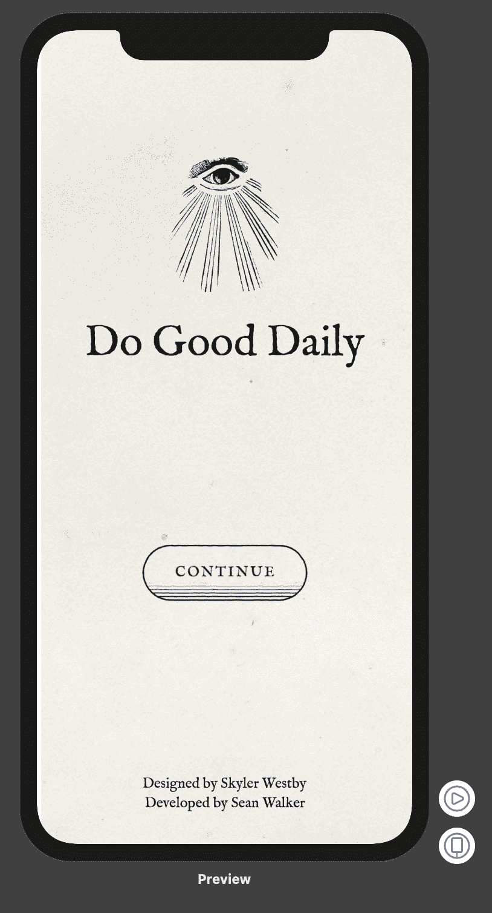
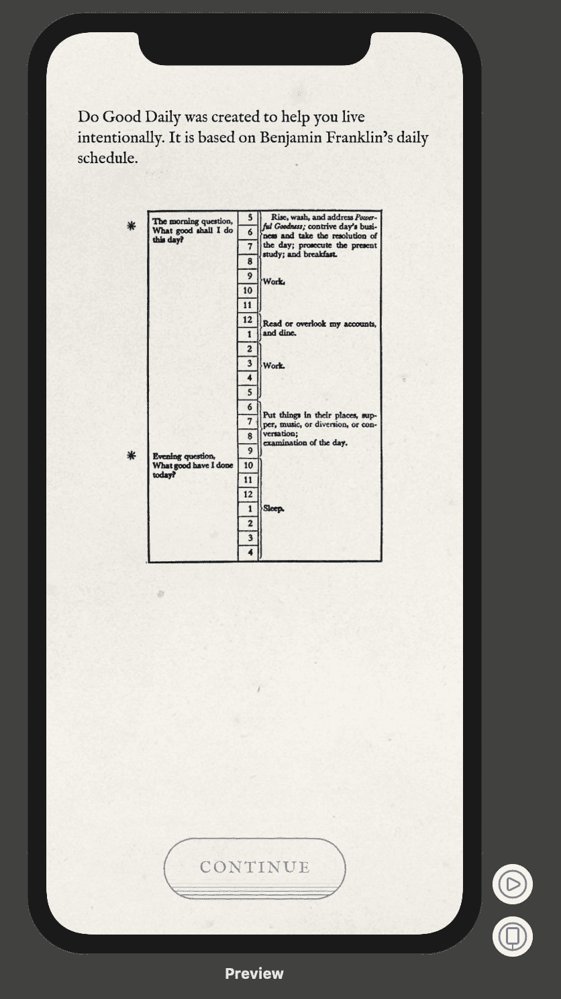

# 每天做好事第五天

> 原文：<https://dev.to/swlkr/do-good-daily-day-5-3dan>

📅2019 年 9 月 16 日
🔥连续五天
📱每日行善
💰0.99 美元的价格
🤑0 销售
⌚️花了 5 个小时
💻更改了 8 个文件，增加了 53 个(+)，删除了 9 个(-)
✅今天的目标:完成两个介绍视图

## SwiftUI 快

当然，Xcode swiftUI 预览在一个小时前是不工作的。然后我决定做一些疯狂的事情，重启我的 mac 和 POW💥他们又开始工作了。从这一点上来说，我就像到达了鲍尔默的巅峰，代码从我的指尖流出，就像岩浆从熊熊的火山中流淌下来一样🌋。

我累了，神志不清，不要评价我。但是，请随意继续并判断我编写的这些最新视图:

