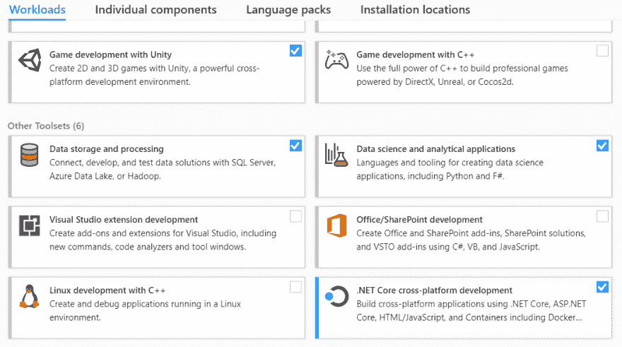
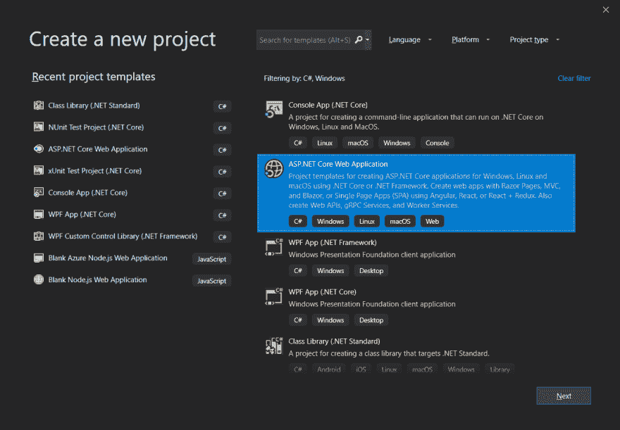
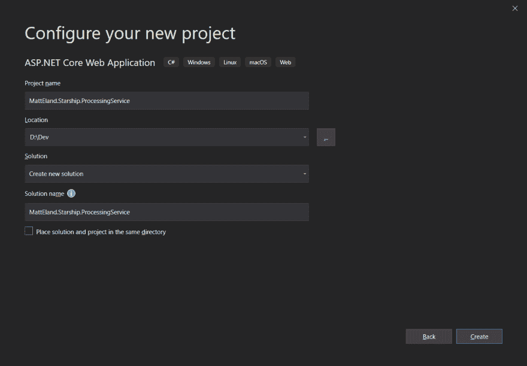
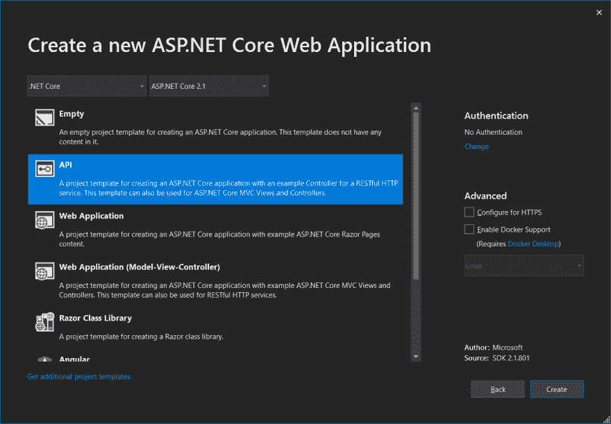
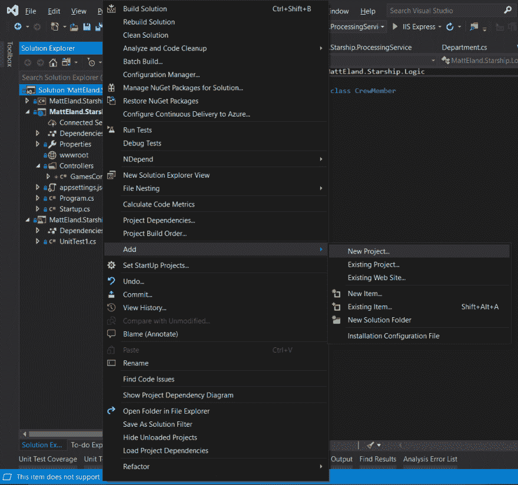
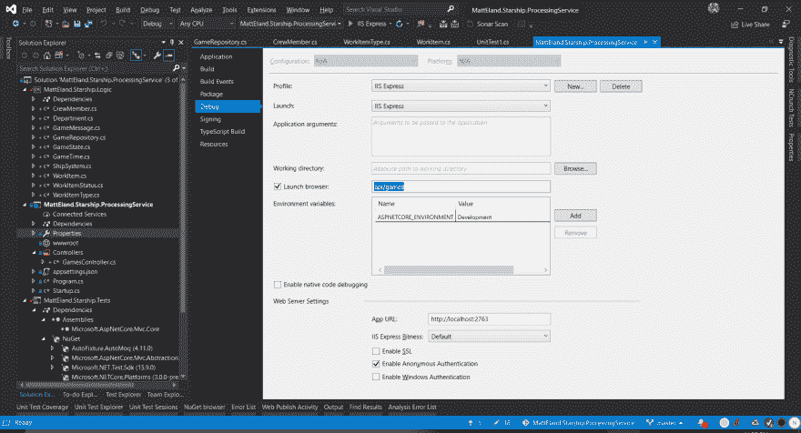
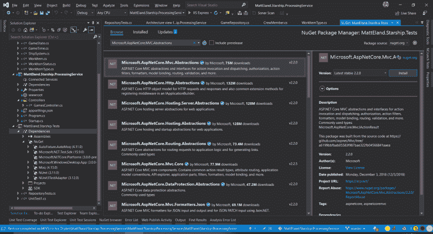
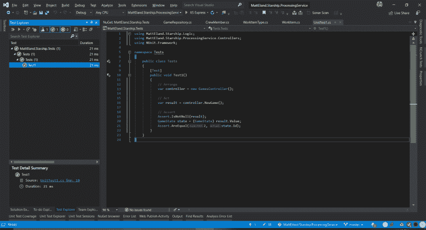

# 创建. NET 核心 API

> 原文:[https://dev.to/techelevator/creating-a-net-core-api-3n6d](https://dev.to/techelevator/creating-a-net-core-api-3n6d)

虽然这篇文章在技术上是我正在做的一个有趣的 gamedev lite side 项目的一部分，但我今晚在这个项目上的活动为分享如何创建一个新的 ASP 提供了一个很好的机会。NET 核心 Web API。

这篇文章将带你通过一些简单的步骤来创建、运行和测试一个新的 ASP。NET 核心 Web API。

# [](#prerequisites)先决条件

我将使用。NET Core 2.1，因为这是我已经安装在我的机器上，虽然今天[发布候选人 1 的。网芯 3 出来了](https://devblogs.microsoft.com/dotnet/announcing-net-core-3-0-release-candidate-1/)。

要开始使用:

*   下载安装 [Visual Studio 2019 社区版](https://visualstudio.microsoft.com/vs/community/)。您需要安装。NET 核心跨平台开发工具。
    T3T5】

*   下载并安装[。网芯 2.1 SDK](https://dotnet.microsoft.com/download/dotnet-core/2.1)

# [](#project-setup)项目设置

打开 Visual Studio 2019，新建一个项目。

出现提示时，选择 **ASP。NET Core Web 应用程序**并点击下一步。

[T2】](https://res.cloudinary.com/practicaldev/image/fetch/s--3lsgSWwT--/c_limit%2Cf_auto%2Cfl_progressive%2Cq_auto%2Cw_880/https://thepracticaldev.s3.amazonaws.com/i/9kvowmmegtyr7iwbkyya.png)

为您的项目取一个有意义的名称。解决方案名称会自动生成。

[T2】](https://res.cloudinary.com/practicaldev/image/fetch/s--62cXfWnu--/c_limit%2Cf_auto%2Cfl_progressive%2Cq_auto%2Cw_880/https://thepracticaldev.s3.amazonaws.com/i/0ndqhr1imworav5zny13.png)

接下来，Visual Studio 将询问您想要选择什么样的起始模板。这些选择并不排除你以后走上其他道路。现在，为了一个简单的演示应用程序，我们将选择 API 并取消选中右边的所有复选框。

[T2】](https://res.cloudinary.com/practicaldev/image/fetch/s--SeSJCKL4--/c_limit%2Cf_auto%2Cfl_progressive%2Cq_auto%2Cw_880/https://thepracticaldev.s3.amazonaws.com/i/m5kr6avztdg5wmeqxd5g.png)

单击 Create，您的项目将被创建并打开。

# [](#running-the-api)运行 API

为了验证一切工作正常，转到屏幕顶部的调试菜单，点击**Start without Debug**。这将启动一个 web 浏览器，并显示一个带有文本["value1 "，" value2"]的空白网页。

信不信由你，这意味着一切都在工作。您的浏览器导航到`ValuesController`类，点击它的 HTTP GET 路由，返回内容。

下面是位于`Controllers`文件夹中的`ValuesController.cs`的一个片段:

```
[Route("api/[controller]")]
[ApiController]
public class ValuesController : ControllerBase
{
    // GET api/values
    [HttpGet]
    public ActionResult<IEnumerable<string>> Get()
    {
        return new string[] { "value1", "value2" };
    }

    // Other code omitted...
} 
```

<svg width="20px" height="20px" viewBox="0 0 24 24" class="highlight-action crayons-icon highlight-action--fullscreen-on"><title>Enter fullscreen mode</title></svg> <svg width="20px" height="20px" viewBox="0 0 24 24" class="highlight-action crayons-icon highlight-action--fullscreen-off"><title>Exit fullscreen mode</title></svg>

在这里，浏览器导航到通过名称前缀与`ValuesController`匹配的`/api/values`(参见`ValuesController`类上的`Route`属性)。在这个控制器内部，我们映射到上面列出的`Get`方法，因为使用的方法是 GET(浏览器导航发出 GET 请求)，我们没有进一步研究`api/values`。

正因为如此，ASP。NET Core 运行了`Get()`方法，并返回了一个 200 OK 结果，其内容定义在上面清单中的字符串数组中。

所以，酷！我们的代码有效。现在是时候为更深入的发展做准备了。

# [](#adding-projects-to-the-solution)向解决方案添加项目

添加新项目时，我喜欢做的第一件事是创建两个新的库项目，并将它们添加到解决方案中。第一个是保存所有应用程序逻辑的库，第二个是单元测试库。

在**解决方案浏览器**中，右键单击您的解决方案(包含项目的最顶层项目)并选择**添加**，然后在其中选择**新项目**。

[T2】](https://res.cloudinary.com/practicaldev/image/fetch/s--Z77QK0fT--/c_limit%2Cf_auto%2Cfl_progressive%2Cq_auto%2Cw_880/https://thepracticaldev.s3.amazonaws.com/i/95tddirqx4wdrs1oz59j.png)

选择**类库(。NET Standard)** ，点击下一步，给它起一个有意义的名字(我命名为 mine MattEland。Starship.Logic)并点击创建。

既然库已经创建，我们将在解决方案资源管理器中右键单击主 Web API 项目，选择**添加**，然后选择**引用**。在这里，我们将检查我们添加的库的名称，然后单击“OK”。

这允许主 API 项目使用库中定义的代码，这有助于将特定于 API 的逻辑与域逻辑分开，并且如果需要的话，可以更容易地将应用程序逻辑移植到控制台、桌面或移动应用程序。

* * *

现在，单击 solution explorer 并添加另一个新项目。这次我们将选择一个新的 XUnit 测试项目或者一个 NUnit 测试项目。出于本教程的目的，我将使用 *NUnit 测试项目(。*净芯)模板。

你想给这个项目起什么名字都行(我的名字是马特兰。Starship.Tests)并点击创建。

接下来，我们将右键单击测试项目，并像上面那样添加依赖项。这次我们将向库和 web 应用程序添加一个依赖项。这样，我们的测试可以直接调用控制器上的方法进行集成测试。

# [](#adding-classes-to-the-library)向库中添加类

接下来，让我们创建几个示例域类，并将它们放入我们的逻辑库中。选中项目后，右键单击并单击添加，然后单击类...

从这里开始，将选择作为一个类，但是给它一个有意义的名字。我的将是`GameState.cs`来代表回合制游戏的状态。

在这个类中放一些简单的代码——足以测试一个简单的对象结构。

我的数据如下:

```
namespace MattEland.Starship.Logic
{
    public class GameState
    {
        public GameState(int id)
        {
            Id = id;
        }

        public int Id { get; }
        public int ClosedCount { get; set; }
    }
} 
```

<svg width="20px" height="20px" viewBox="0 0 24 24" class="highlight-action crayons-icon highlight-action--fullscreen-on"><title>Enter fullscreen mode</title></svg> <svg width="20px" height="20px" viewBox="0 0 24 24" class="highlight-action crayons-icon highlight-action--fullscreen-off"><title>Exit fullscreen mode</title></svg>

我还将创建一个`GameRepository`来存储 GameState 实例。这个类是我们的控制器将与之交互的对象。

下面列出了一个非常简单的面向演示的存储库:

```
using System.Collections.Generic;
using System.Linq;

namespace MattEland.Starship.Logic
{
    public class GameRepository
    {
        private readonly IList<GameState> _games = new List<GameState>();

        public GameRepository()
        {
            // Start with some sample data
            CreateNewGame();
        }

        public IEnumerable<GameState> Games => _games;

        public GameState GetGame(int id) => _games.FirstOrDefault(g => g.Id == id);

        public GameState CreateNewGame()
        {
            int id = _games.Count + 1;
            var game = new GameState(id);
            _games.Add(game);

            return game;
        }

        public bool DeleteGame(int id)
        {
            var game = _games.FirstOrDefault(g => g.Id == id);

            return game != null && _games.Remove(game);
        }
    }
} 
```

<svg width="20px" height="20px" viewBox="0 0 24 24" class="highlight-action crayons-icon highlight-action--fullscreen-on"><title>Enter fullscreen mode</title></svg> <svg width="20px" height="20px" viewBox="0 0 24 24" class="highlight-action crayons-icon highlight-action--fullscreen-off"><title>Exit fullscreen mode</title></svg>

现在我们已经有了一些基本的逻辑和一个存储库类来管理操作，让我们看看它是如何插入控制器的。

# [](#creating-our-first-controller)创建我们的第一个控制器

接下来，让我们删除`ValuesController.cs`文件(或者如果您想保留它作为参考，就保留它)并向 Web API 项目添加一个新的控制器。在我的例子中，这被称为`GamesController`来管理各种可用的游戏状态。

这个类将保留我们之前创建的 repository 类的一个新实例，并将操作传递给它。

我的控制器列表如下:

```
using System.Collections.Generic;
using MattEland.Starship.Logic;
using Microsoft.AspNetCore.Http;
using Microsoft.AspNetCore.Mvc;

namespace MattEland.Starship.ProcessingService.Controllers
{
    [Route("api/[controller]")]
    [ApiController]
    public class GamesController : ControllerBase
    {
        private readonly GameRepository _repository = new GameRepository();

        // GET api/games
        [HttpGet]
        public ActionResult<IEnumerable<GameState>> LoadGame()
        {
            return Ok(_repository.Games);
        }

        // GET api/games/42
        [HttpGet("{id}")]
        public ActionResult<GameState> LoadGame(int id)
        {
            var game = _repository.GetGame(id);

            if (game != null)
            {
                return Ok(game);
            }

            return new NotFoundResult();
        }

        // POST api/games
        [HttpPost]
        public CreatedResult NewGame()
        {
            var game = _repository.CreateNewGame();

            return new CreatedResult($"/api/games/{game.Id}", game);
        }

        // DELETE api/games/42
        [HttpDelete("{id}")]
        public StatusCodeResult Delete(int id)
        {
            bool deleted = _repository.DeleteGame(id);

            if (deleted)
            {
                return new StatusCodeResult(StatusCodes.Status204NoContent);
            }

            return new NotFoundResult();
        }
    }
} 
```

<svg width="20px" height="20px" viewBox="0 0 24 24" class="highlight-action crayons-icon highlight-action--fullscreen-on"><title>Enter fullscreen mode</title></svg> <svg width="20px" height="20px" viewBox="0 0 24 24" class="highlight-action crayons-icon highlight-action--fullscreen-off"><title>Exit fullscreen mode</title></svg>

注意，我定义了一个获取所有游戏的标准 GET 方法，以及一个通过 ID 获取单个游戏的特定 GET 方法。这些方法的区别在于输入到`HttpGet`属性中的参数，get specific game one 接受一个变量`{id}`，该变量被映射为`int id`参数。

还要注意，我为创建新游戏和删除现有游戏的方法定义了`HttpPost`和`HttpDelete`动词。

再次注意，这是极小的。在一个真实的应用程序中，我会将诸如请求验证和错误处理之类的东西放入 API 层(如果不是由中间件处理的话)。

# [](#testing-it-in-the-browser)在浏览器中测试它

既然逻辑已经准备好了，您可能会认为我们可以不调试就运行，并看到我们的新响应，但是请记住，Visual Studio 上次启动时导航到了`/api/values`路径。这是因为项目的调试设置被配置为查看该路径。

我们可以更改默认路径，方法是转到 Web API 项目的 properties 节点并双击它，然后选择 Debug 选项卡，然后在 Start Browser 文本框中更改 URL 以匹配新控制器的名称。

[T2】](https://res.cloudinary.com/practicaldev/image/fetch/s--dJoW8mu6--/c_limit%2Cf_auto%2Cfl_progressive%2Cq_auto%2Cw_880/https://thepracticaldev.s3.amazonaws.com/i/tv3jz9xgdyis44sc7akk.png)

一旦配置好了所有的东西，并且保存了项目(“文件”>“全部保存”)，不进行调试就运行，并验证您看到的数据与预期的一样。

在我的例子中，我看到:`[{"id":1,"closedCount":0}]`根据我简单的对象定义，它看起来是正确的。

此时，您可以对您的本地实例发出 HTTP 请求，它会以适当的响应进行响应。

# [](#testing-it-via-code)通过代码测试

我喜欢在测试我的应用程序时比必须手动测试每个 API 调用更安全一点，所以我喜欢至少有一两个集成级测试来模拟对`Controller`类的直接调用。我的大部分测试将是针对像`GameState`或`GameRepository`这样的东西的单元测试，但是测试 API 逻辑是否也在运行也是有帮助的。

在`UnitTest1.cs`(可以随意重命名)中，我将修改现有的测试，如下所示:

```
using MattEland.Starship.Logic;
using MattEland.Starship.ProcessingService.Controllers;
using NUnit.Framework;

namespace Tests
{
    public class Tests
    {
        [Test]
        public void Test1()
        {
            // Arrange
            var controller = new GamesController();

            // Act
            var result = controller.NewGame();

            // Assert
            Assert.IsNotNull(result);
            GameState state = (GameState) result.Value;
            Assert.AreEqual(2, state.Id);
        }
    }
} 
```

<svg width="20px" height="20px" viewBox="0 0 24 24" class="highlight-action crayons-icon highlight-action--fullscreen-on"><title>Enter fullscreen mode</title></svg> <svg width="20px" height="20px" viewBox="0 0 24 24" class="highlight-action crayons-icon highlight-action--fullscreen-off"><title>Exit fullscreen mode</title></svg>

这将调用我的控制器上的 NewGame 方法(在我的例子中是一个 HTTP POST 动词),并检查结果以查看是否创建并返回了一个新游戏，它的 ID 是否与我预期的一致。

注意，为了支持直接引用控制器，我必须遵循 Visual Studio 动作建议，并添加对`Microsoft.AspNetCore.Mvc.Core`的引用。

我还发现我的测试最初会失败，直到我添加了一个对`Microsoft.AspNetCore.MVC.Abstractions`的 NuGet 引用。通过在解决方案浏览器中右键单击测试项目并选择 *Manage NuGet Packages 来实现...*然后搜索该程序集，选中后点击安装。

[T2】](https://res.cloudinary.com/practicaldev/image/fetch/s--NQXfsMYH--/c_limit%2Cf_auto%2Cfl_progressive%2Cq_auto%2Cw_880/https://thepracticaldev.s3.amazonaws.com/i/wayvztqn25nj95eb6pwd.png)

从这里，您可以通过点击上层菜单中的*测试*，然后点击*窗口*，然后点击*文件浏览器*来运行您的测试。这将使 testing 窗格可用，您可以单击测试用例来运行并运行所选的测试。

[T2】](https://res.cloudinary.com/practicaldev/image/fetch/s--5fl_yD2e--/c_limit%2Cf_auto%2Cfl_progressive%2Cq_auto%2Cw_880/https://thepracticaldev.s3.amazonaws.com/i/3cmlmytmi0ip6wgspvfm.png)

注意:你的用户界面可能与我的不同。我使用 [ReSharper](https://www.jetbrains.com/resharper/) ，它在用户界面中添加了额外的测试工具

围绕着`GameRepository`的一个简单的单元测试可能看起来像这样:

```
using System.Linq;
using MattEland.Starship.Logic;
using NUnit.Framework;

namespace Tests
{
    public class RepositoryTests
    {
        [Test]
        public void RepositoryShouldStartWithGameState()
        {
            // Arrange
            var repository = new GameRepository();

            // Act
            var games = repository.Games;

            // Assert
            Assert.Greater(games.Count(), 0);
        }
    }
} 
```

<svg width="20px" height="20px" viewBox="0 0 24 24" class="highlight-action crayons-icon highlight-action--fullscreen-on"><title>Enter fullscreen mode</title></svg> <svg width="20px" height="20px" viewBox="0 0 24 24" class="highlight-action crayons-icon highlight-action--fullscreen-off"><title>Exit fullscreen mode</title></svg>

# [](#closing)关闭

在本文中，我们创建了一个新的 API 项目、一个共享逻辑库和一个测试项目，并验证了一切功能正常。

虽然这个例子中还有很多非常基础的内容，可以大大改进，但这应该可以帮助您开始。请继续关注关于优化该应用程序和处理常见场景的后续文章。ASP 里面有很多东西要学。NET 核心，但它是 API 开发的绝佳平台。