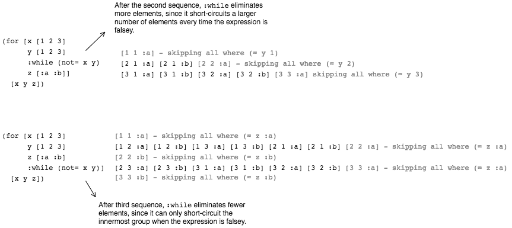

# 环

> 原文:[https://dev.to/kendru/looping-4jc4](https://dev.to/kendru/looping-4jc4)

这篇文章是安德鲁的书[第十一课](https://www.learn-clojurescript.com/section-2/lesson-11-looping/)，[T3】学 ClojureScriptT5】](https://gum.co/learn-cljs)

* * *

在上一章中，我们看了 ClojureScript 的版本，我们通常称之为分支控制结构。然而，我们了解到，与我们可能习惯的其他语言相比，ClojureScript 的工作方式略有不同——控件结构是表达式，而不是命令式控件。现在我们来看另一个基本主题——循环——我们将了解到 ClojureScript 中的情况又有所不同。

*本章内容:*

*   调查 ClojureSctipt 的各种循环结构
*   学会按顺序思考
*   副作用回路的力评估

在命令式语言中，循环用于多次重复相同的指令，通常每次都会有一些小的变化，最终会导致循环退出。经典的命令式循环是一个`while`循环，在这个循环中，计算机只是一遍又一遍地执行相同的指令，直到满足某些条件:

#### JavaScript 中的 While 循环

```
var i = 0;                        // <1>

while (i < 10) {                  // <2>
    console.log("Counting: " + i);
    i++;                          // <3>
} 
```

<svg width="20px" height="20px" viewBox="0 0 24 24" class="highlight-action crayons-icon highlight-action--fullscreen-on"><title>Enter fullscreen mode</title></svg> <svg width="20px" height="20px" viewBox="0 0 24 24" class="highlight-action crayons-icon highlight-action--fullscreen-off"><title>Exit fullscreen mode</title></svg>

1.  初始化将要变异的变量
2.  设置继续循环的条件
3.  每次通过后增加`i`的值

由于 ClojureScript 强调数据的不变性和面向表达式的编程——而循环天生就是可变的和面向语句的——人们一定想知道 ClojureScript 中是否还有循环的位置。答案既有“是”也有“不是”——有几个类似循环的结构，我们马上会看到，但仔细观察，它们是不涉及显式循环的其他概念的抽象。

## [](#manipulating-sequences-with-raw-for-endraw-)用`for`操纵序列

我们将在本章学习的第一个，也可能是最常见的表达是`for`。虽然它的名字带有某种命令式循环，但它完全是一种不同的动物。与迭代的`for`相反，ClojureScript 的`for`以理解序列的想法为中心，在其中我们通过转换和过滤现有的序列来创建一个新的序列。在 ClojureScript 中有多种方法可以完成这个任务，但是`for`无疑是一个简洁而惯用的选择。

在其最基本的形式中，`for`接受任意数量的序列和一个主体，并通过评估序列元素的每个组合的主体来产生新的序列:

#### [](#-raw-for-endraw-dissected)`for`解剖过

```
(for  [elem1  sequence1  ;; <1>  elem2  sequence2]  ;; <2>  expr)  ;; <3> 
```

<svg width="20px" height="20px" viewBox="0 0 24 24" class="highlight-action crayons-icon highlight-action--fullscreen-on"><title>Enter fullscreen mode</title></svg> <svg width="20px" height="20px" viewBox="0 0 24 24" class="highlight-action crayons-icon highlight-action--fullscreen-off"><title>Exit fullscreen mode</title></svg>

1.  从`sequence1`到`elem1`依次绑定每个元素
2.  对`sequence2`进行同样的操作
3.  对于来自`sequence1`和`sequence2`的元素的每个组合，用绑定、`elem1`和`elem2`评估`expr`

### [](#using-raw-for-endraw-with-a-single-sequence)使用`for`与单个序列

虽然`for`支持任意数量的序列，但实际上它通常只支持一个或两个序列。正如我们已经提到的，最常见的用法是序列转换。假设我们有一个数字列表，我们想找出每个数字的平方。我们想要的是以某种方式描述一个产生新列表的过程，其中每个元素都是原始列表中相应元素的平方。谢天谢地，用代码表达比用文字表达更容易:

#### [](#finding-the-square-of-09)寻找 0-9 的平方

```
(for  [n  (range  10)]  ;; <1>  (*  n  n))  ;; <2>  ;; (0 1 4 9 16 25 36 49 64 81) 
```

<svg width="20px" height="20px" viewBox="0 0 24 24" class="highlight-action crayons-icon highlight-action--fullscreen-on"><title>Enter fullscreen mode</title></svg> <svg width="20px" height="20px" viewBox="0 0 24 24" class="highlight-action crayons-icon highlight-action--fullscreen-off"><title>Exit fullscreen mode</title></svg>

1.  通过取数字 0-9 产生一个新的序列
2.  使新序列中的每个数字都是原序列的平方

到目前为止，我们应该看到，当与单个输入序列一起使用时，`for`描述了一个全序列转换。当使用 ClojureScript 时，我们应该尝试思考我们面前的问题是否可以表示为一个序列转换。如果是这样，`for`提供了一个有效的解决方案。让我们看看用`for`迭代解决的同一个问题。想象我们有许多直角三角形。我们知道与直角相邻的边，我们需要找到每个三角形的斜边。首先，JavaScript 中的迭代解决方案:

#### [](#get-hypotenuse-length-iteratively)迭代得到斜边长度

```
var sides = [[4.2, 6], [4, 4], [3, 4], [5.5, 3]]; // <1>
var lengths = [];                                 // <2>
var i;

for (i = 0; i < sides.length; i++) {              // <3>
    lengths.push(
        Math.sqrt(
                Math.pow(sides[i][0], 2) +
                Math.pow(sides[i][1], 2)
        )
    );
} 
```

<svg width="20px" height="20px" viewBox="0 0 24 24" class="highlight-action crayons-icon highlight-action--fullscreen-on"><title>Enter fullscreen mode</title></svg> <svg width="20px" height="20px" viewBox="0 0 24 24" class="highlight-action crayons-icon highlight-action--fullscreen-off"><title>Exit fullscreen mode</title></svg>

1.  将三角形边建模为二维数组
2.  声明一个数组来保存结果长度
3.  迭代边中的元素，每次将计算出的斜边长度推入到`lengths`数组中

这是非常简单的迭代代码，但是仍然比我们在 ClojureScript 中想要的要低级。像这样的循环，很容易混淆索引(例如`sides[i][0]`对`sides[0][i]`)或者引入差 1 的错误。很容易看出，这个问题只是将一个序列转换成另一个序列，所以我们可以很容易地使用`for`:

#### [](#get-hypotenuse-length-with-raw-for-endraw-)用`for`得到斜边长度

```
(let  [sides-list  (list  [4.2  6]  [4  4]  [3  4]  [5.5  3])]  //  <1>  (for  [sides  sides-list]  //  <2>  (js/Math.sqrt  (+  (js/Math.pow  (first  sides)  2)  //  <3>  (js/Math.pow  (second  sides)  2)))))  ;; (7.323933369440222 5.656854249492381 5 6.264982043070834) // <4> 
```

<svg width="20px" height="20px" viewBox="0 0 24 24" class="highlight-action crayons-icon highlight-action--fullscreen-on"><title>Enter fullscreen mode</title></svg> <svg width="20px" height="20px" viewBox="0 0 24 24" class="highlight-action crayons-icon highlight-action--fullscreen-off"><title>Exit fullscreen mode</title></svg>

1.  声明一个列表或对，每个列表或对代表一个直角三角形的两条边
2.  使用 for 表达式将转换应用于列表中的每一对
3.  应用勾股定理求斜边的长度
4.  结果是每个三角形的斜边都是一个序列

### [](#quick-review)快速回顾:

*   给定成对的点:[[x，y]，[x，y]]坐标，写一个计算点之间距离的`for`表达式。提示:这与前面的例子非常相似。

### [](#using-raw-for-endraw-with-multiple-sequences)用多个序列使用`for`

`for`的一些强大之处在于它能够组合来自多个序列的元素。当给定多个序列时，它将为来自每个输入序列的单个元素的每个唯一组合生成一个元素。这种类型的组合被称为笛卡尔积，是数学集合论中的一个重要概念。假设我们正在编写一个电子商务应用程序，对于任何给定的产品，都有几种变化:颜色、大小和样式。我们可以使用`for`获得所有可能的产品组合:

#### [](#generating-product-variations-with-raw-for-endraw-)用`for`生成产品变化

```
(let  [colors  [:magenta  :chartreuse  :taupe]  //  <1>  sizes  [:sm  :md  :lg  :xl]  styles  [:budget  :plain  :fancy]]  (for  [color  colors  //  <2>  size  sizes  style  styles]  [color  size  style]))  //  <3>  ;; ([:magenta :sm :plain] [:magenta :sm :regular] [:magenta :sm :fancy]  ;; ... [:taupe :xl :plain] [:taupe :xl :regular] [:taupe :xl :fancy]) 
```

<svg width="20px" height="20px" viewBox="0 0 24 24" class="highlight-action crayons-icon highlight-action--fullscreen-on"><title>Enter fullscreen mode</title></svg> <svg width="20px" height="20px" viewBox="0 0 24 24" class="highlight-action crayons-icon highlight-action--fullscreen-off"><title>Exit fullscreen mode</title></svg>

1.  声明 3 个序列
2.  从每个系列中选择 1 件物品的所有可能组合
3.  产生每种颜色、大小和样式组合的向量

在这个例子中，除了将产品组合打包到一个向量`[color size style]`中，我们没有做任何事情，但是我们可以执行任何我们想要的转换。考虑到使用迭代循环来完成相同的任务将需要我们编写嵌套 3 层的循环！

### [](#loop-modifiers-let-when-and-while)循环修饰符:let，when，while

到目前为止，我们只使用了`for`的基本形式，其中我们从一个或多个序列中获取每个元素。虽然这适用于许多用例，但有时我们想要过滤结果(比如，我们不想提供小尺寸的花哨产品)。我们可以使用`:when`修饰符将过滤逻辑直接构建到`for`表达式本身中，而不是在 for 生成列表后过滤列表。同样，有时我们希望在产生结果之前计算一些中间值。我们可以使用`:let`修饰符，而不是在`for`的主体中嵌套一个`let`表达式。最后，如果我们只想让元素达到某个截止点，我们可以使用`:while`修饰符。为了说明这些修饰语，我们将使用一个有些人为的例子:

#### [](#-raw-for-endraw-modifiers)`for`修饰语

```
(for  [n  (range  100)  //  <1>  :let  [square  (*  n  n)]  //  <2>  :when  (even?  n)  //  <3>  :while  (<  n  20)]  //  <4>  (str  "n is "  n  " and its square is "  square))  //  <5>  ;; ("n is 0 and its square is 0"  ;; "n is 2 and its square is 4"  ;; "n is 4 and its square is 16"  ;; ...  ;; "n is 18 and its square is 324") 
```

<svg width="20px" height="20px" viewBox="0 0 24 24" class="highlight-action crayons-icon highlight-action--fullscreen-on"><title>Enter fullscreen mode</title></svg> <svg width="20px" height="20px" viewBox="0 0 24 24" class="highlight-action crayons-icon highlight-action--fullscreen-off"><title>Exit fullscreen mode</title></svg>

1.  取 0-99 范围内的 n
2.  将每次迭代的符号`square`的绑定声明为 n 的平方
3.  仅包括 n 为偶数的值
4.  只持续到 n 达到 20

要使用这些修饰符，我们可以简单地把它添加到序列表达式列表中。这些修饰语都不难理解，所以在继续之前，我们将在下面简单地概述它们。

*   **:让**在`for`的主体内创建任意数量的绑定。它可以使用在`for`表达式中定义的任何符号以及范围内的任何其他变量。用法与常规的`let`表单相同。
*   **:当**决定为哪些输入发送一个值时。它后面跟着一个谓词表达式，当且仅当表达式为真时，它才会发出一个值。
*   **:虽然**类似于`:when`，但是当使用多个输入序列时，它将最直接的“组”短路。也就是说，当它被放置在某个序列表达式之后时，它将跳过它被放置在之后的序列中的剩余元素，并继续使用通过取前一序列中的下一项和它被放置在之后的序列中的第一项而形成的组合。为了说明这种行为，请考虑 while 子句的位置如何影响以下示例的行为:

[T2】](https://res.cloudinary.com/practicaldev/image/fetch/s--p3dRfa-0--/c_limit%2Cf_auto%2Cfl_progressive%2Cq_auto%2Cw_880/https://kendru.github.io/img/learn-cljs/chapter11/while-short-circuit.png)

*修改者`:while`的行为*

### [](#quick-review)快速回顾

*   白色的一个`for`表达式，它从`(range 50)`中取两个值`x`和`y`，当`x`和`y`的乘积小于`100`时，为`x`的所有偶数值和`y`的奇数值生成对`[x y]`。
*   回到产品变化示例，使用`:when`过滤掉所有同时为`:magenta`和`:fancy`的变化

## [](#performing-explicit-recursion-with-raw-loop-endraw-and-raw-recur-endraw-)用`loop`和`recur`进行显式递归

在下一章，我们将更详细地研究递归函数——也就是调用自身的函数。但是作为预览，下面是一个简单的递归函数，它使用[欧几里德算法](https://en.wikipedia.org/wiki/Euclidean_algorithm)来计算两个数字的最大公分母。

#### [](#an-example-recursive-function)递归函数的一个例子

```
(defn  gcd  [x  y]  //  <1>  (if  (=  y  0)  x  (gcd  y  (mod  x  y))))  //  <2>  ;; #'cljs.user/gcd  (gcd  90  60)  //  <3>  ;; 30 
```

<svg width="20px" height="20px" viewBox="0 0 24 24" class="highlight-action crayons-icon highlight-action--fullscreen-on"><title>Enter fullscreen mode</title></svg> <svg width="20px" height="20px" viewBox="0 0 24 24" class="highlight-action crayons-icon highlight-action--fullscreen-off"><title>Exit fullscreen mode</title></svg>

1.  使用欧几里德算法定义一个`gcd`函数
2.  该函数调用自己作为它做的最后一件事
3.  使用输入`90`和`60`测试功能

我们要看的下一个类似循环的结构是`loop`和`recur`的动态组合。当我们想使用递归过程，但不需要一个单独的命名函数时，我们使用`loop` / `recur`。我们与`loop`一起使用的一般形式如下:

#### [](#-raw-loop-endraw-dissected)`loop`解剖了

```
(loop  [name-1  init-value-1  //  <1>  name-2  init-value-2]  body-exprs  //  <2>  (recur  next-value-1  next-value-2))  //  <3> 
```

<svg width="20px" height="20px" viewBox="0 0 24 24" class="highlight-action crayons-icon highlight-action--fullscreen-on"><title>Enter fullscreen mode</title></svg> <svg width="20px" height="20px" viewBox="0 0 24 24" class="highlight-action crayons-icon highlight-action--fullscreen-off"><title>Exit fullscreen mode</title></svg>

1.  第一次循环时，传入任意数量的绑定及其值
2.  任何数量的身体表情
3.  可选地返回到循环的开始，在下一次迭代中为每个绑定提供值

这是 ClojureScript 与传统命令式循环最接近的命令式循环结构。 <sup id="fnref1">[1](#fn1)</sup> 将上面的`gcd`函数转换成`loop` / `recur`形式是很简单的:

#### [用`loop`实现`gcd`](#implementing-raw-gcd-endraw-with-raw-loop-endraw-)

```
(defn  gcd-loop  [a  b]  (loop  [x  a  //  <1>  y  b]  (if  (=  y  0)  x  //  <2>  (recur  y  (mod  x  y)))))  //  <3>  ;; #'cljs.user/gcd-loop  (gcd-loop  90  60)  ;; 30 
```

<svg width="20px" height="20px" viewBox="0 0 24 24" class="highlight-action crayons-icon highlight-action--fullscreen-on"><title>Enter fullscreen mode</title></svg> <svg width="20px" height="20px" viewBox="0 0 24 24" class="highlight-action crayons-icon highlight-action--fullscreen-off"><title>Exit fullscreen mode</title></svg>

1.  用函数的输入初始化循环
2.  当`y`为`0`时返回`x`
3.  在`y`不是`0`的情况下重复出现

正如我们在上面看到的，通过在条件的一个分支内调用`recur`并在另一个分支内调用另一个值，我们可以很容易地控制循环何时退出以及何时递归。这给了我们同样的粒度，我们可能习惯于命令式循环，但样板文件更少。

### [](#recur-nuances)重现细微差别

`loop`是一个非常有用的构造，它让我们简化了许多类型的递归函数。但是，它不能代替所有的递归函数，只能代替一类被称为“尾递归”的函数。这些特定的函数将自己称为函数的最后一件事(在“尾部”位置)。正如我们在上一章中提到的，每次递归函数调用自己时，都会消耗一个堆栈帧，如果递归太深，JavaScript 运行时就会因出错而停止执行。然而，用`loop`和`recur`编写的递归过程可以任意深度递归，因为 ClojureScript 编译器能够将它们优化成命令式循环。由于这个原因，`loop`通常也比函数递归更快。

因为`loop`只适用于尾部递归，我们需要注意在`recur`之后不要尝试求值。幸运的是，如果`recur`不在尾部位置，ClojureScript 编译器会警告我们，直到我们移动`recur`它才会编译代码。下面是一个正确调用`recur`和非法调用的例子。

#### [](#legal-and-illegal-raw-recur-endraw-)合法与非法`recur`

```
(loop  [i  0  numbers  []]  (if  (=  i  10)  numbers  (recur  (inc  i)  (conj  numbers  i))))  //  <1>  ;; [0 1 2 3 4 5 6 7 8 9]  (loop  [i  7  fact  1]  (if  (=  i  1)  fact  (*  i  (recur  (dec  i)  (*  i  fact)))))  //  <2>  ;; ----  Could not Analyze  <cljs form>   line:5  column:22  ----  ;;  ;;   Can't recur here at line 5 <cljs repl>  ;;  ;;   1  (loop [i 7  ;;   2         fact 1]  ;;   3    (if (= i 1)  ;;   4      fact  ;;   5      (* i (recur (dec i) (* i fact)))))  ;;               ^---  ;;  ;; ----  Analysis Error  ----  ;; nil 
```

<svg width="20px" height="20px" viewBox="0 0 24 24" class="highlight-action crayons-icon highlight-action--fullscreen-on"><title>Enter fullscreen mode</title></svg> <svg width="20px" height="20px" viewBox="0 0 24 24" class="highlight-action crayons-icon highlight-action--fullscreen-off"><title>Exit fullscreen mode</title></svg>

1.  当它是循环中最后一个要计算的东西时，它是合法的
2.  这里不能重复出现，因为我们需要在重复出现后乘以`i`

所以我们看到，并不是每个递归函数都可以被转换成一个`loop`，但是如果可以的话，肯定会有性能上的好处。这是对`loop`的一个相当简短的介绍，但是我们将在本书的过程中经常使用它，所以我们将有足够的机会更加熟悉它。

## [](#looping-for-side-effects)循环播放副作用

已经介绍了用于序列理解的`for`和用于显式递归的`loop` / `recur`。ClojureScript 中还有一类循环:副作用循环。回想一下，副作用是我们的程序在其执行的纯计算之外造成的影响，比如添加和删除 DOM 节点或者向服务器端 API 发送数据。

ClojureScript 的一个难点是它的很多序列操作(包括`for`)都是*懒*。也就是说，它们不会产生结果，直到被要求这样做。考虑这个`for`表达式:

```
(for  [i  (range  10)]  (println  i)) 
```

<svg width="20px" height="20px" viewBox="0 0 24 24" class="highlight-action crayons-icon highlight-action--fullscreen-on"><title>Enter fullscreen mode</title></svg> <svg width="20px" height="20px" viewBox="0 0 24 24" class="highlight-action crayons-icon highlight-action--fullscreen-off"><title>Exit fullscreen mode</title></svg>

如果您将这个输入到 REPL 中，它将打印出数字 0-9，正如我们所预期的那样。然而，如果我们只从由`for`生成的序列中请求几个值，我们会看到一个令人惊讶的结果:

#### [](#lazy-evaluation)懒评

```
(take  3  //  <1>  (for  [i  (range  10)]  (println  i)))  ;; 0                         // <2>  ;; 1  ;; 2  ;; (nil nil nil)             // <3>  (do  (for  [i  (range  10)]  (println  i))  (println  "Done"))  ;; Done  ;; nil                       // <4> 
```

<svg width="20px" height="20px" viewBox="0 0 24 24" class="highlight-action crayons-icon highlight-action--fullscreen-on"><title>Enter fullscreen mode</title></svg> <svg width="20px" height="20px" viewBox="0 0 24 24" class="highlight-action crayons-icon highlight-action--fullscreen-off"><title>Exit fullscreen mode</title></svg>

1.  仅从由`for`表达式给出的序列中取出 3 个元素
2.  只被叫了 3 次，而不是 10 次
3.  因为`println`返回`nil`，所以结果是一个用`nil`归档的序列
4.  不打印数字，因为我们从来不需要`for`的结果

`for`将只在需要结果来完成一些其他计算时进行评估——并且只评估序列中所需数量的值。正如我们将在后面的章节中看到的，这种懒惰对某些事情非常有用，但在处理副作用时会导致意想不到的行为，因此需要强制评估。

### [](#evaluating-an-existing-sequence-with-raw-dorun-endraw-)用`dorun`评估现有序列

第一个也是最简单的确保序列被完全评估的方法是将序列包装在`dorun`中。当给定一个序列时，它将连续执行实现每个值所需的代码，并返回 nil。例如，在上面的例子中，我们可以通过用`dorun`包装`for`表达式来强制打印数字:

#### [](#forcing-evaluation-of-a-lazy-sequence)强制评估一个懒惰序列

```
(do  (dorun  //  <1>  (for  [i  (range  10)]  (println  i)))  (println  "Done"))  ;; 0                         // <2>  ;; 1  ;; 2  ;; 3  ;; 4  ;; 5  ;; 6  ;; 7  ;; 8  ;; 9  ;; Done  ;; nil 
```

<svg width="20px" height="20px" viewBox="0 0 24 24" class="highlight-action crayons-icon highlight-action--fullscreen-on"><title>Enter fullscreen mode</title></svg> <svg width="20px" height="20px" viewBox="0 0 24 24" class="highlight-action crayons-icon highlight-action--fullscreen-off"><title>Exit fullscreen mode</title></svg>

1.  将`for`包裹在`dorun`中
2.  所有数字都按预期打印

### [](#looping-for-effects-with-raw-doseq-endraw-)用`doseq`循环播放效果

虽然`dorun`通常是我们想要的，如果我们有一个序列在每个元素被实现时执行副作用，我们更经常想要迭代一个现有的序列并为每个元素执行副作用。在这种情况下，我们可以使用`doseq`。`doseq`的语法与`for`相同(包括修饰符)，但是它立即求值并返回`nil`而不是一个序列。如果我们考虑向后端 API 发送一个用户列表，我们当然希望确保代码在我们期望的时候被评估，所以我们可以使用`doseq`，如下例所示:

```
(defn  send-to-api  [user]  //  <1>  (println  "Sending to API:"  user))  ;; #'cljs.user/send-to-api  (let  [users  [{:name  "Alice"}  {:name  "Bob"}  {:name  "Carlos"}]]  (doseq  [user  users]  //  <2>  (send-to-api  user))  (println  "Done!"))  ;; Sending to API: {:name Alice}     // <3>  ;; Sending to API: {:name Bob}  ;; Sending to API: {:name Carlos}  ;; Done!  ;; nil 
```

<svg width="20px" height="20px" viewBox="0 0 24 24" class="highlight-action crayons-icon highlight-action--fullscreen-on"><title>Enter fullscreen mode</title></svg> <svg width="20px" height="20px" viewBox="0 0 24 24" class="highlight-action crayons-icon highlight-action--fullscreen-off"><title>Exit fullscreen mode</title></svg>

1.  存根`send-to-api`函数
2.  遍历`users`集合
3.  副作用会立即出现

这里我们遍历`users`列表，并为每个用户调用`send-to-api`。因为我们不关心函数的返回值，`doseq`是这里的最佳选择。

### [](#quick-review)快速回顾

*   如果我们在前面的例子中使用了`for`而不是`doseq`，会发生什么？
*   有一个类似于`dorun`的函数叫做`doall`。在网上查一下，解释一下你什么时候会使用其中一种，而不是另一种。
*   DOM 操作是一个副作用。结合 DOM 使用`doseq`有哪些用例？

## [](#summary)总结

我们现在已经看到了 ClojureScript 的核心循环特性。虽然`for`和`while`循环在许多语言中至关重要，但我们已经知道 ClojureScript 甚至没有这些概念。它的循环结构围绕三件事之一:

*   顺序操作(`for`)
*   递归(`loop` / `recur`)
*   强制评估副作用(`doseq`)

尽管一开始我们可能会发现没有传统的命令式循环很难解决问题，但我们会很快发现“Clojuresque”解决方案通常更简单。随着我们越来越习惯于用序列和递归的方式思考，ClojureScript 方式将成为第二天性。

* * *

1.  有趣的是，`loop`编译成 JavaScript 中的`while`循环 [↩](#fnref1)