# 第一轮 100 天代码

> 原文：<https://dev.to/robledokari/round-1-of-100daysofcode-4hk8>

我完成了#100DaysOfCode 的第一轮。我是卡瑞娜，我是一名白血病幸存者。我知道如何编码，因为我在墨西哥城学过计算机科学。我的母语是西班牙语。我在医院度过了 2018 年。我是在二月份被确诊的，我在十二月份接受移植手术后离开了医院。我已经一年没有写任何代码了。

我决定开始练习#100DaysOfCode，因为我不能离开我的房子，这个挑战让我感觉更好，并帮助我治疗抑郁症。7 月份，我开始在家工作，就像在我的国家的后端开发人员一样。这太难了，但我做得很好，但这意味着我有更少的时间为娱乐而编码。

8 月，我的皮肤再次出现白血病，所以我正在接受维持化疗和全身放疗。我不知道是否有癌症患者想学习编码。但是如果你有健康问题，你并不孤单。也许这需要时间，但你可以编码。

我会列出我做过的项目。

> 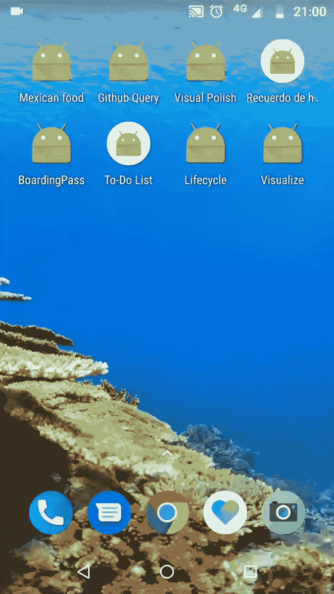<video loop="" controls=""><source src="https://video.twimg.com/ext_tw_video/1173055163684347904/pu/pl/F7lDqGdK73mM5heI.m3u8?tag=10" type="application/x-mpegURL"></video>卡琳娜[@罗夫莱多卡里](https://dev.to/robledokari)[# 100 daysofcode](https://twitter.com/hashtag/100daysofCode)第 98 天。用 Java 完成了 Android 的待办事项应用。明天是墨西哥派对。我会吃很多玉米卷。🌮
> 
> 周末快乐！
> 
> [【CodeNewbie】](https://twitter.com/hashtag/CodeNewbie)[【women hocode】](https://twitter.com/hashtag/WomenWhoCode)2019 年 9 月 02:05 日25207

> 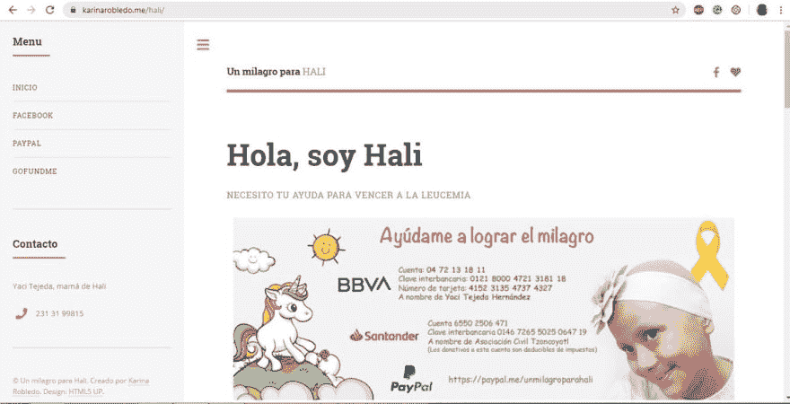卡琳娜[@ robledokari](https://dev.to/robledokari)第 95 天的 [#100daysOfCode](https://twitter.com/hashtag/100daysOfCode) 还没学会 React，但是我给一个癌症患者，哈利，做了一个网页。这对我意义重大。
> 
> [karinarobledo.me/hali/](https://t.co/rUUvzsbYEm)
> 
> [# code newbie](https://twitter.com/hashtag/CodeNewbie)[# 100 daysofcode](https://twitter.com/hashtag/100daysOfCode)[# women hocode](https://twitter.com/hashtag/WomenWhoCode)00:07AM-12 Sep 20191239

> 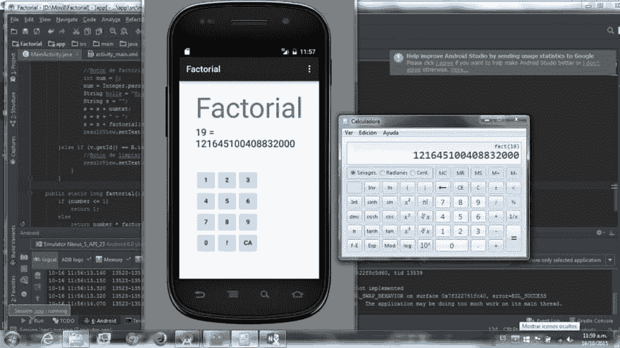卡琳娜[@ robledokari](https://dev.to/robledokari)第 91 天。一个给出阶乘数的应用。
> [# 100 daysofcode](https://twitter.com/hashtag/100DaysOfCode)[# code newbie](https://twitter.com/hashtag/CodeNewbie)[# women inetech](https://twitter.com/hashtag/WomeninTech)[# latinasinetech](https://twitter.com/hashtag/LatinasinTech)
> [# spoon iesintech](https://twitter.com/hashtag/SpooniesinTech)01:25AM-08 Sep 20191531【T42

> 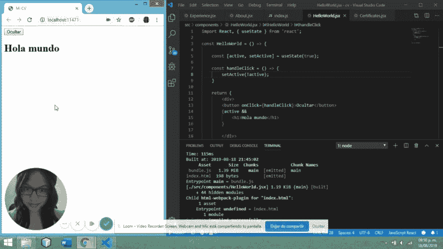<video loop="" controls=""><source src="https://video.twimg.com/ext_tw_video/1163282936659099649/pu/vid/480x270/w7lxXrcV2mokDDuR.mp4?tag=10" type="video/mp4"></video>卡琳娜[@罗布多卡里](https://dev.to/robledokari)我累了，但我能做这个作品！它是用 React 挂钩建造的。不容易，但我希望下周能学到更多。
> 
> [# 100 daysofcode](https://twitter.com/hashtag/100DaysOfCode)[# code newbie](https://twitter.com/hashtag/CodeNewbie)[# women hocode](https://twitter.com/hashtag/WomenWhoCode)2019 年 8 月 19 日上午 02:54520

> 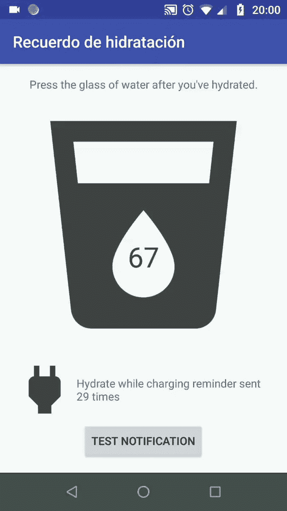<video loop="" controls=""><source src="https://video.twimg.com/ext_tw_video/1162532538834980869/pu/pl/ju5p112IqldB-9f1.m3u8?tag=10" type="application/x-mpegURL"></video>卡琳娜[@罗布多卡里](https://dev.to/robledokari)完成通知！我翻译成西班牙语。这是一款面向 Android 的 Java 原生应用。我希望有一台 Macbook 和 Iphone 来编写应用程序。
> 
> 🇲🇽骰阙巨著《阿瓜》🥛我喜欢用 Swift 应用程序，但没有苹果手机。
> 
> [# 100 daysofcode](https://twitter.com/hashtag/100DaysOfCode)
> [# CodeNewbie](https://twitter.com/hashtag/CodeNewbie)
> [# women hocode](https://twitter.com/hashtag/WomenWhoCode)01:12am-2019 年 8 月 17 日917

> 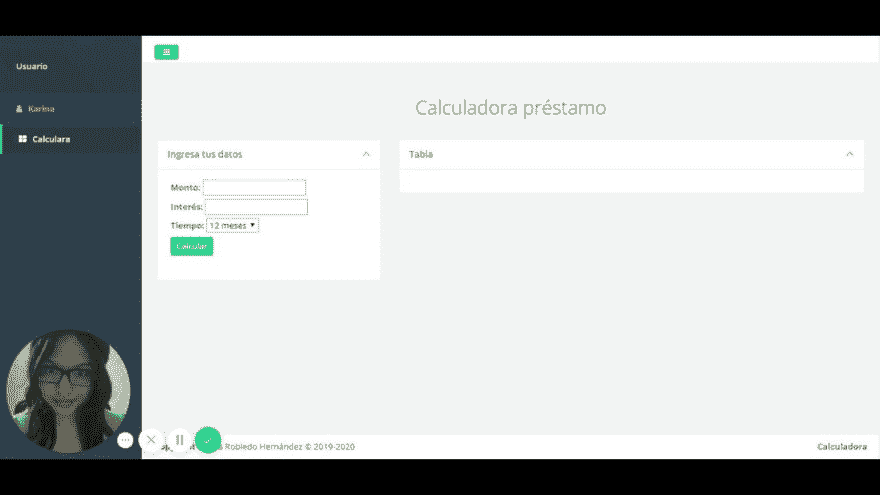<video loop="" controls=""><source src="https://video.twimg.com/ext_tw_video/1160384548074655746/pu/vid/480x270/7-tbl3BJa_Ssu_Q5.mp4?tag=10" type="video/mp4"></video>我用 Javascript 做了一个贷款计算器！/我做了一个贷款计算器。我希望能在[@ El emitro](https://twitter.com/ElPesoNuestro)
> 
> [【karinarrido。me/Infonavit/](https://t.co/il24ZExJEK) [【100 daysoffcode】](https://twitter.com/hashtag/100DaysOfCode)[的帮助下为 infonavit 做这件事](https://twitter.com/hashtag/CodeNewbie)

> 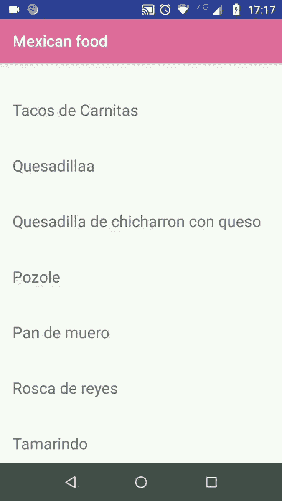<video loop="" controls=""><source src="https://video.twimg.com/ext_tw_video/1160317978723934209/pu/pl/fiY8MMAOvYR93rb6.m3u8?tag=10" type="application/x-mpegURL"></video>卡琳娜[@罗布多卡里](https://dev.to/robledokari)D63。我用我最喜欢的食物做了一个安卓应用！有了 Android Studio 和 Java，我还在学习😃
> 
> [# 100 daysofcode](https://twitter.com/hashtag/100DaysOfCode)[# code newbie](https://twitter.com/hashtag/CodeNewbie)[# women hocode](https://twitter.com/hashtag/WomenWhoCode)2019 年 8 月 10 日下午 22:329[T46】37](https://twitter.com/intent/like?tweet_id=1160318083275395078)

> 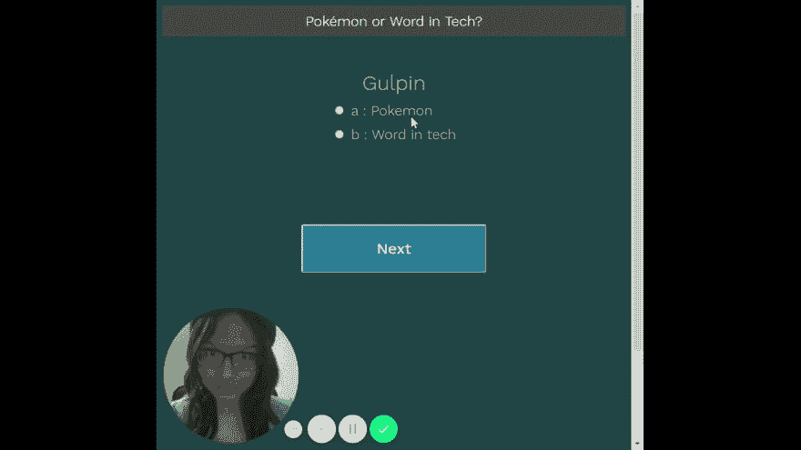<video loop="" controls=""><source src="https://video.twimg.com/ext_tw_video/1157541202104918017/pu/vid/1280x720/S3gyXERwf_-J1cju.mp4?tag=10" type="video/mp4"></video>卡琳娜[@罗布多卡里](https://dev.to/robledokari)D56。我用 Javascript、HTML 和 CSS 做了一个小测验。我不得不更多地练习 CSS，但我真的想编码这个。
> 
> 可以在这里玩:
> [karinarobledo.me/estudio/](https://t.co/2hxbyvQLlY)
> 
> [# 100 daysofcode](https://twitter.com/hashtag/100DaysOfCode)[# code newbie](https://twitter.com/hashtag/CodeNewbie)[# women hocode](https://twitter.com/hashtag/WomenWhoCode)06:38AM-03 2019 年 8 月[T49】6](https://twitter.com/intent/retweet?tweet_id=1157541229778866176)20

> 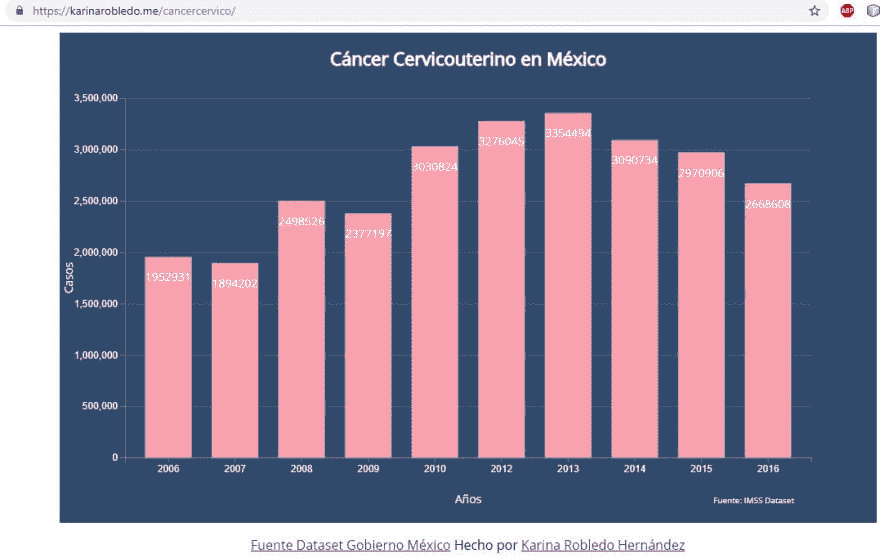【Karina】[@ robledokari](https://dev.to/robledokari)来文方是墨西哥政府，有几个数据集可供使用。
> 
> 你可以在这里看到:
> [【karinarrido。me/cancer service/](https://t.co/J7OeGKhIx3)
> 
> 点击查看与其他年份的差异。
> 2011 年不在。【2019 年 7 月 20:46-28 日】0

> 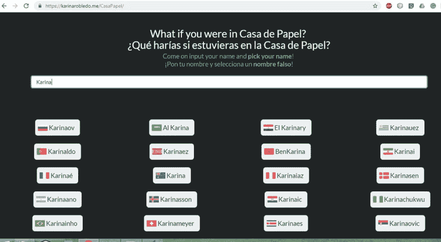【Karina】[@ robledokari](https://dev.to/robledokari)我制作了一个网站为纸屋生成了一个假名字。
> 我制作了一个页面来生成一个假的纸屋名称。
> 我最喜欢的是穆里略教授兼督察
> 
> [【karinarrido . me/caspaper/](https://t.co/6701Exd2U2)
> [【100 day soff code】](https://twitter.com/hashtag/100DaysOfCode)[【code ewe】](https://twitter.com/hashtag/CodeNewbie)

> 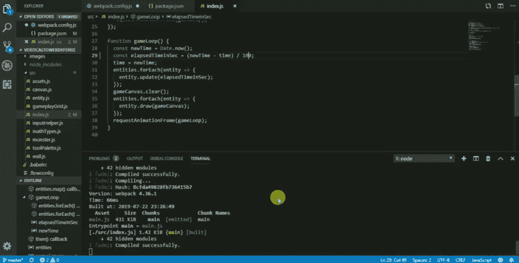<video loop="" controls=""><source src="https://video.twimg.com/ext_tw_video/1153523972178423808/pu/vid/708x360/WTGe-Q7Zwm8LNIQ6.mp4?tag=10" type="video/mp4"></video>卡琳娜[@罗布多卡里](https://dev.to/robledokari)D44。我做了一个简单的 HTML5 游戏。今天我学会了:如何使用脚本和 webpack 服务器。我希望有一天能做一个更好的游戏。超级好玩！
> 
> [【100 days ofcode】](https://twitter.com/hashtag/100daysOfcode)[【code newbie】](https://twitter.com/hashtag/CodeNewbie)
> [【women intech】](https://twitter.com/hashtag/womenintech)[【women hocode】](https://twitter.com/hashtag/WomenWhoCode)2019 年 7 月 23 日上午 04 点630

> 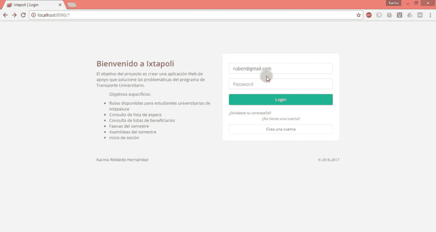<video loop="" controls=""><source src="https://video.twimg.com/ext_tw_video/1152021193635127297/pu/pl/WWSj6KIuNGNKdRa8.m3u8?tag=10" type="application/x-mpegURL"></video>卡琳娜[@罗布多卡里](https://dev.to/robledokari)我的顶点工程！👩🏽‍💻Spring Boot Java，Hibernate，MySQL，HTML5，CSS 我在说西班牙语😊
> 
> [# women hocode](https://twitter.com/hashtag/WomenWhoCode)[# women inetech](https://twitter.com/hashtag/WomeninTech)
> [【100 daysofcode](https://twitter.com/hashtag/100daysofCode)[【code newbie](https://twitter.com/hashtag/CodeNewbie)01:13AM-19 Jul 20191226

> 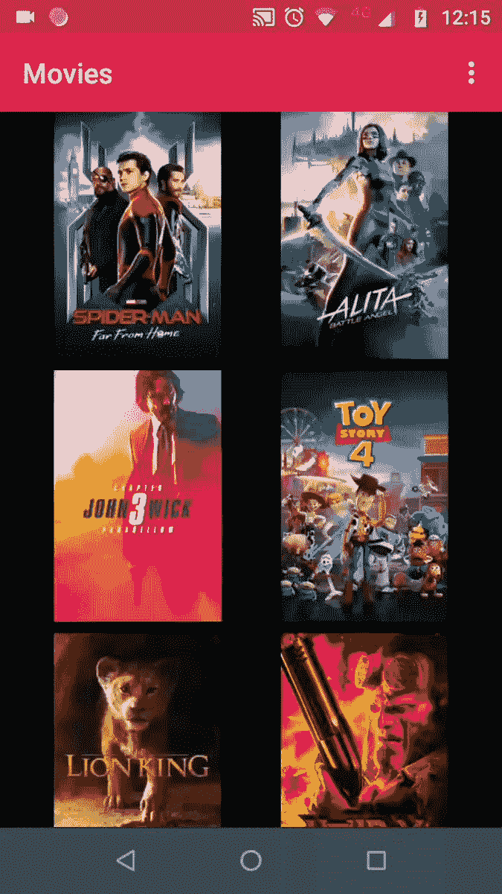<video loop="" controls=""><source src="https://video.twimg.com/ext_tw_video/1150092911658315777/pu/vid/720x1280/tVbn0NCeLJ6KVYa_.mp4?tag=10" type="video/mp4"></video>卡琳娜[@罗布多卡里](https://dev.to/robledokari)D35。我做了一个电影 app，连接了一个 API，用 Java☕
> 
> [# 100 daysofcode](https://twitter.com/hashtag/100daysOfCode)[# codenewbie](https://twitter.com/hashtag/CodeNewbie)
> [# women intech](https://twitter.com/hashtag/WomenInTech)[# women hocode](https://twitter.com/hashtag/WomenWhoCode)2019 年 7 月 13 日下午 17:2212

> 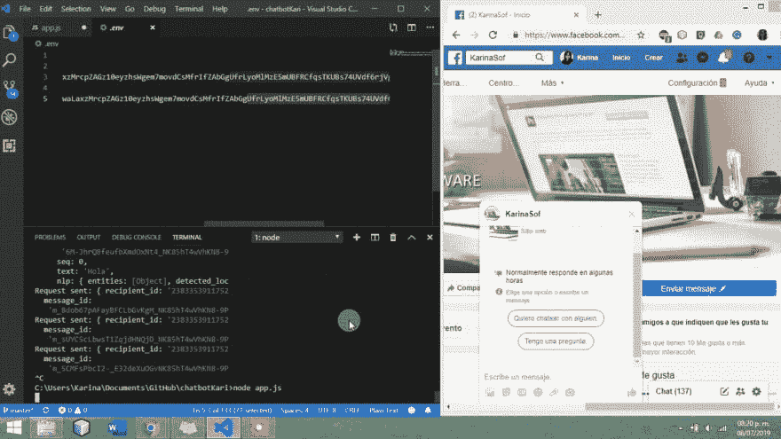<video loop="" controls=""><source src="https://video.twimg.com/tweet_video/D-_z6MZWkAAUPl7.mp4" type="video/mp4"></video>卡琳娜[@罗布多卡里](https://dev.to/robledokari)D30。我完成了聊天机器人卡莉。只是目前回复相同，但我对服务器的 1.0\. Node.jss 很满意😊
> [# women hocode](https://twitter.com/hashtag/WomenWhoCode)[# women intech](https://twitter.com/hashtag/WomenInTech)[# 100 daysofcode](https://twitter.com/hashtag/100DaysOfCode)[# code newbie](https://twitter.com/hashtag/CodeNewbie)01:34AM-09 Jul 2019612

在你读完之前。对我来说，更重要的是开心，享受生活。移植后 300 天，我战胜了癌症。嗯，这是我作为一个开发者的人生的开始。我希望创造更多的项目，帮助人们，我想成为一名成功的开发人员在我的公司。

相信你，你能行。