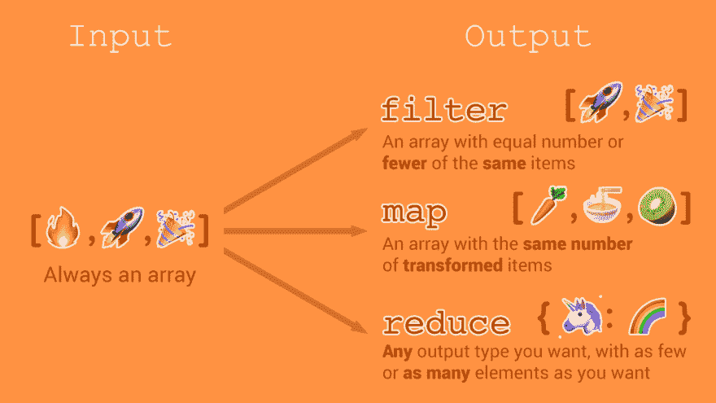
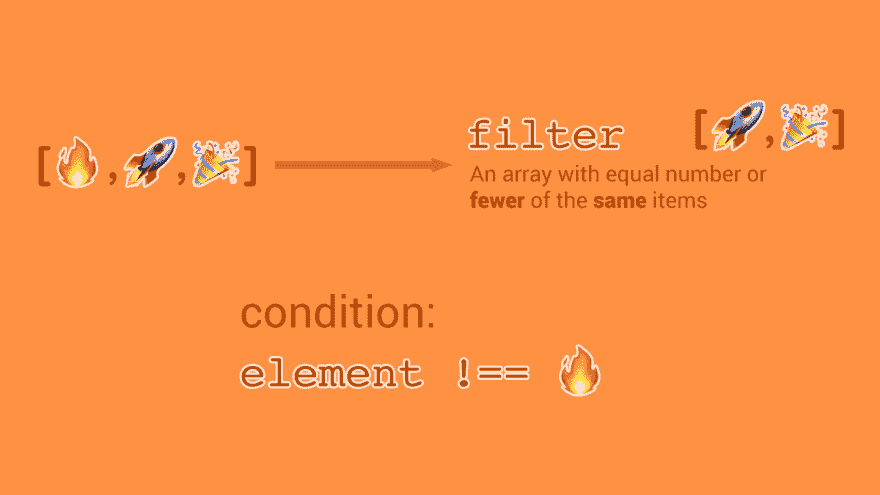
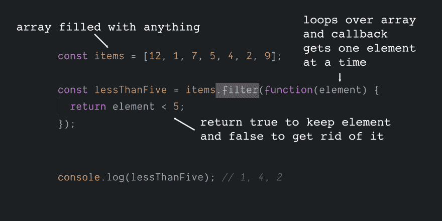
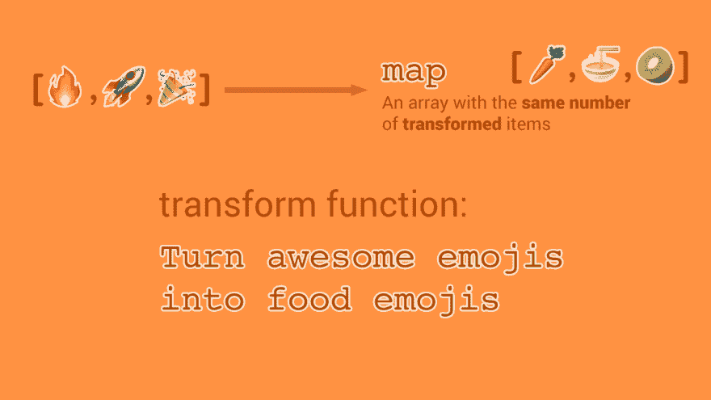
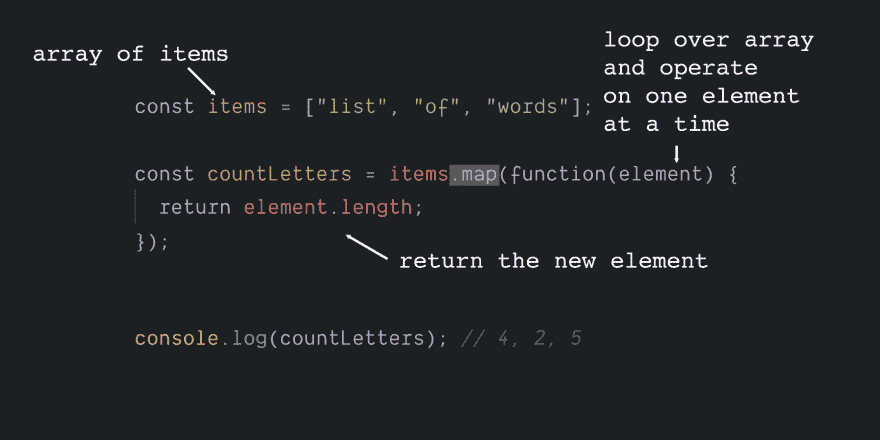
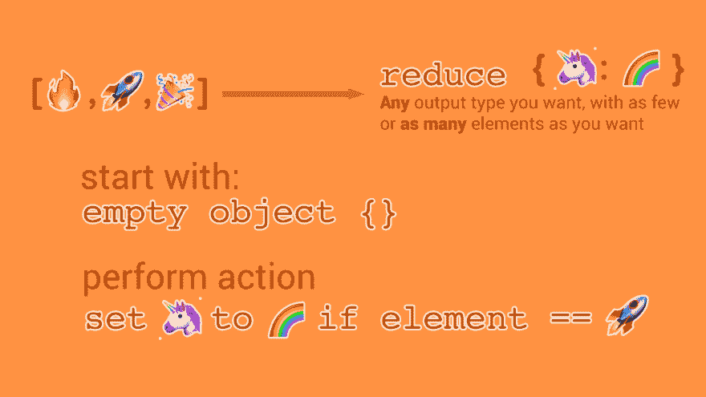
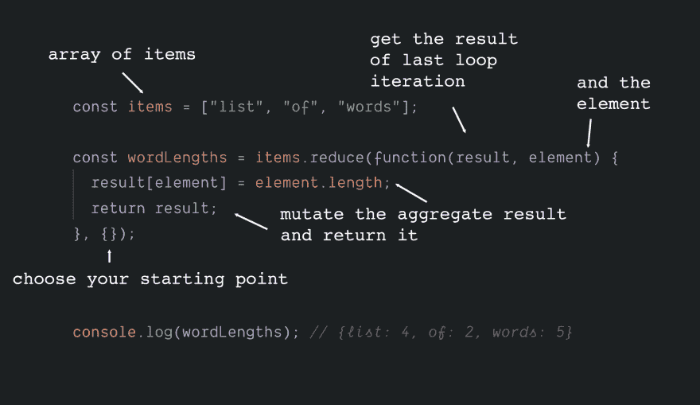
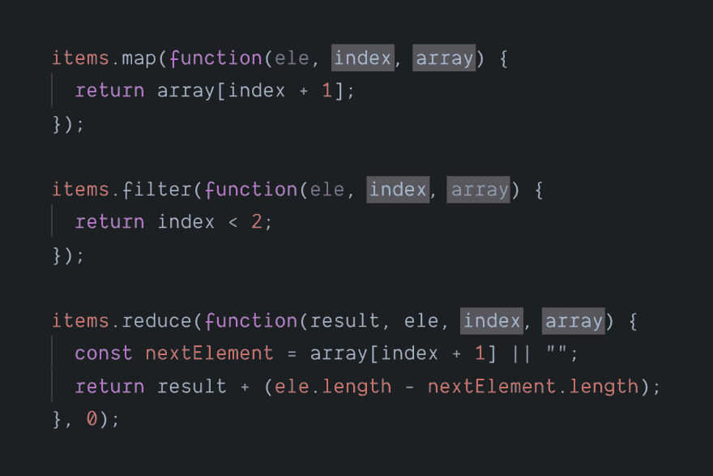
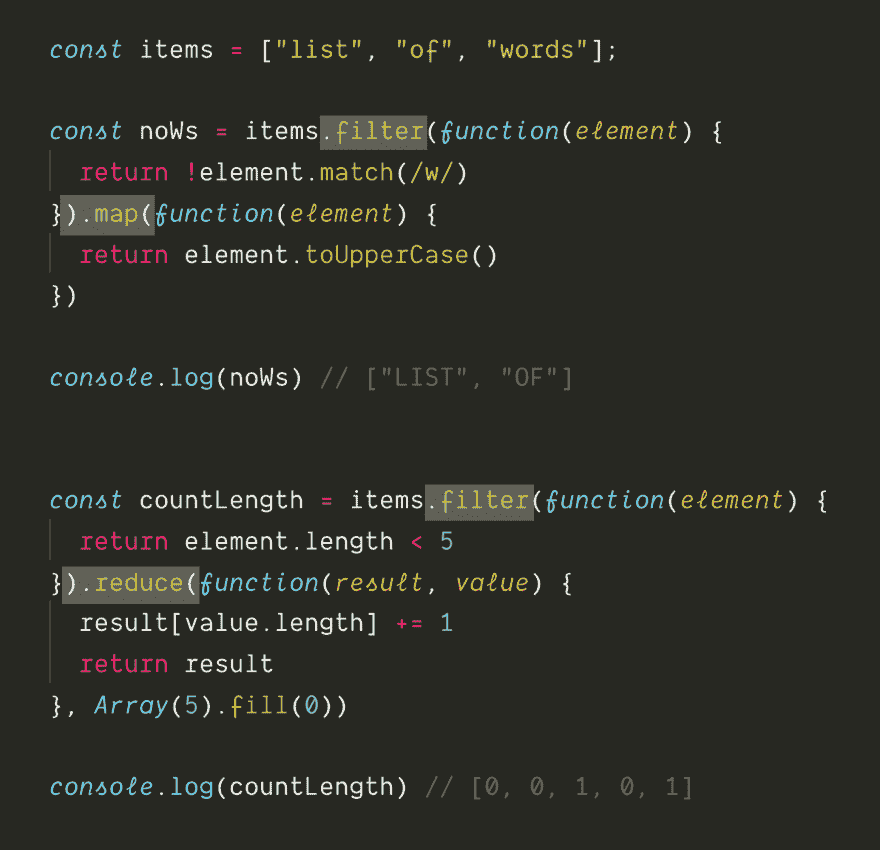
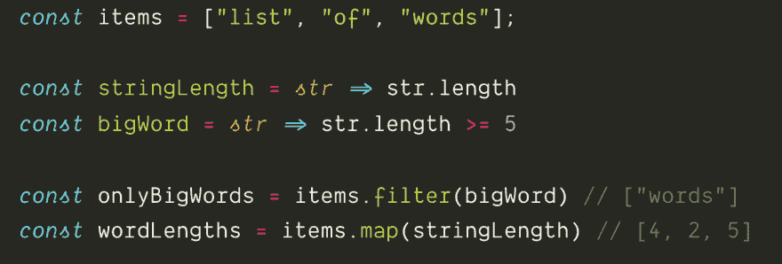

# 映射/过滤/减少速成课程

> 原文:[https://dev . to/chrisachard/map-filter-reduce-crash-course-5gan](https://dev.to/chrisachard/map-filter-reduce-crash-course-5gan)

*这最初是作为 Twitter 帖子发布的:[https://twitter.com/chrisachard/status/1173750491458789378](https://twitter.com/chrisachard/status/1173750491458789378)T3】*

你听说过映射、过滤和减少，但从未真正理解它们吗？

这里有一个🔥地图()。过滤器()。减少()🔥给你的速成班！

# 1。

`map`、`filter`、`reduce`可以独立运行，也可以连锁运行

他们对一个*数组*进行操作，然后*对其进行转换*

[T2】](https://res.cloudinary.com/practicaldev/image/fetch/s--YtWZoX0Y--/c_limit%2Cf_auto%2Cfl_progressive%2Cq_auto%2Cw_880/https://thepracticaldev.s3.amazonaws.com/i/mgcuihl4bicusutctlow.png)

# 2。

`filter`获取数组并返回一个新数组，该数组只包含符合某些条件的元素

[T2】](https://res.cloudinary.com/practicaldev/image/fetch/s--Alyg7Nlh--/c_limit%2Cf_auto%2Cfl_progressive%2Cq_auto%2Cw_880/https://thepracticaldev.s3.amazonaws.com/i/rupils42cz56821153u1.png)

# 3。

它遍历元素，将每个元素传递给一个回调函数

您可以返回`true`将该元素包含在新数组中，或者返回`false`将其排除

[T2】](https://res.cloudinary.com/practicaldev/image/fetch/s--U4QRne7r--/c_limit%2Cf_auto%2Cfl_progressive%2Cq_auto%2Cw_880/https://thepracticaldev.s3.amazonaws.com/i/vwiesj96ln90uslfpmre.png)

# 4。

把`map`想象成一个元素转换函数

它遍历一个数组，可以为数组中的每个点返回一个新元素

[T2】](https://res.cloudinary.com/practicaldev/image/fetch/s--BCSVRaF8--/c_limit%2Cf_auto%2Cfl_progressive%2Cq_auto%2Cw_880/https://thepracticaldev.s3.amazonaws.com/i/xqr9k2ttfo5bcqq3actm.png)

# 5。

这让您可以将每个元素转换成新的东西(或者保持不变)

类型不必相同:可以返回对象、字符串、数字——任何东西！

[T2】](https://res.cloudinary.com/practicaldev/image/fetch/s--YxdnH2BJ--/c_limit%2Cf_auto%2Cfl_progressive%2Cq_auto%2Cw_880/https://thepracticaldev.s3.amazonaws.com/i/dwartorz3qgxuip2g67m.png)

# 6。

在一个数组中循环，让你“收集”元素到别的东西中(通过运行一个函数)

你把“别的东西”指定为第二个参数

这样，您可以将数组“折叠”(缩减)成一个新数组、一个对象、一个数字等。

[T2】](https://res.cloudinary.com/practicaldev/image/fetch/s--v6_YX_pf--/c_limit%2Cf_auto%2Cfl_progressive%2Cq_auto%2Cw_880/https://thepracticaldev.s3.amazonaws.com/i/hrmg8wkrdxmpc0gmwghj.png)

# 7。

在`reduce`的每一次循环中，可以得到上一次循环的结果，以及数组中的下一个元素

更改结果，然后将其返回用于下一次循环迭代

完成后，您就拥有了完整的收藏

[T2】](https://res.cloudinary.com/practicaldev/image/fetch/s--kJ2OOLd5--/c_limit%2Cf_auto%2Cfl_progressive%2Cq_auto%2Cw_880/https://thepracticaldev.s3.amazonaws.com/i/v3zxmzqyk7kesj1axl8a.png)

# 8。

如果你需要的话，`map`、`filter`和`reduce`的回调函数都可以得到当前索引和整个原始数组

[T2】](https://res.cloudinary.com/practicaldev/image/fetch/s--bM1j8RI_--/c_limit%2Cf_auto%2Cfl_progressive%2Cq_auto%2Cw_880/https://thepracticaldev.s3.amazonaws.com/i/e8xh3mvn710sioyw9nbm.png)

# 9。

现在一起:

将`filter`与`map`链接起来，首先删除你不关心的元素，然后变换它们

或者，

将`filter`与`reduce`链接起来，首先过滤列表，然后将其转换成其他内容

[T2】](https://res.cloudinary.com/practicaldev/image/fetch/s--PrJVpzjX--/c_limit%2Cf_auto%2Cfl_progressive%2Cq_auto%2Cw_880/https://thepracticaldev.s3.amazonaws.com/i/fk0kxfigxpbdma4dntvp.png)

# 10。

那么为什么 map、filter 和 reduce 有用呢？

*   不必手动循环数组
*   链接在一起进行简单明了的数组转换
*   可以重用回调函数并将它们组合在一起

[T2】](https://res.cloudinary.com/practicaldev/image/fetch/s--_jf0nM7p--/c_limit%2Cf_auto%2Cfl_progressive%2Cq_auto%2Cw_880/https://thepracticaldev.s3.amazonaws.com/i/oa4a58apyneg99lygwiu.png)

# 代码链接

这里有一些交互式代码示例可以玩:[https://chrisachard.com/examples/map-filter-reduce](https://chrisachard.com/examples/map-filter-reduce)

我知道这可能会令人困惑！

如果我能帮忙，发微博给我或 DM🙌

**喜欢这个速成班？**
在 twitter 上查找更多: [@chrisachard](https://twitter.com/chrisachard)
和在我的[我的简讯中📬](https://chrisachard.com/newsletter/)

感谢阅读！