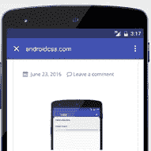
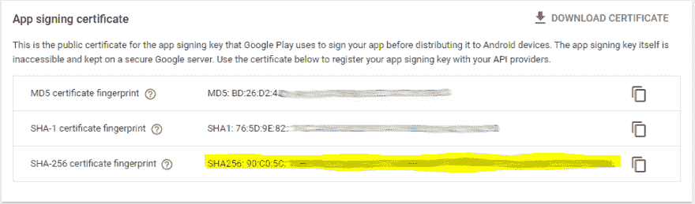
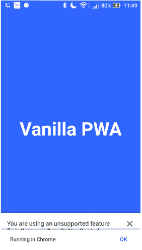

# 可信网络活动+ Android 应用捆绑包

> 原文:[https://dev . to/Kimura dev/trusted-web-activity-Android-app-bundle-240n](https://dev.to/kimuradev/trusted-web-activity-android-app-bundle-240n)

在 PlayStore 发布 TWA 时的黄金提示。

如果你没有看到之前的文章，关于 TWA [看看这里。](https://dev.to/kimuradev/trusted-web-activities-54lc)

[T2】](https://res.cloudinary.com/practicaldev/image/fetch/s--jyQ5C9yp--/c_limit%2Cf_auto%2Cfl_progressive%2Cq_auto%2Cw_880/https://thepracticaldev.s3.amazonaws.com/i/kwgxxogen53ycavvpcxy.png)

今天我要讲一个问题，你们中的一些人可能会在使用 **Android 应用捆绑包格式将应用发布到商店时遇到这个问题。**

对于那些不知道的人来说，这是在 Play Store 上发布应用程序的新[官方](https://developer.android.com/platform/technology/app-bundle)模式。通过这种新的格式，谷歌承诺**在构建和发布方面有更好的效率**，以及**增加压缩**和**减少应用程序的大小**。

如果你想了解更多，我会留下下面的链接:
[https://developer.android.com/guide/app-bundle/](https://developer.android.com/guide/app-bundle/)

# 即是说，我想去哪里？

嗯，有了这种新的发布方式，我们有了一个非常有趣的选项，可以通过谷歌商店自己选择你的[应用程序签名](https://support.google.com/googleplay/android-developer/answer/7384423)。如果你这样做了，你需要**将你通过 Android Studio 生成的**密钥替换为在 Play Store 上生成的密钥，否则你的应用和你的网站**之间的认证将失败**，并且你的应用中将出现 URL 栏，类似于下图所示:

[T2】](https://res.cloudinary.com/practicaldev/image/fetch/s--niNYDLZ_--/c_limit%2Cf_auto%2Cfl_progressive%2Cq_auto%2Cw_880/https://thepracticaldev.s3.amazonaws.com/i/1woyddo8nkm30z7gb6zj.png)

为了防止这种情况发生，你的 TWA 看起来像一个原生应用程序，只需在 PlayStore 上输入你的应用程序的**设置**，在左侧菜单中找到**发布管理**选项，并选择**应用程序签名**选项。

[T2】](https://res.cloudinary.com/practicaldev/image/fetch/s--DzU036ld--/c_limit%2Cf_auto%2Cfl_progressive%2Cq_auto%2Cw_880/https://thepracticaldev.s3.amazonaws.com/i/sv8haij2m2l4vo6pa9un.PNG)

在右边，你应该打开一个像下面这样的屏幕，通知你哪个是 **SHA-256 认证指纹**，你应该在你的 **assetlinks.json** 文件中替换它。

[T2】](https://res.cloudinary.com/practicaldev/image/fetch/s--Khvy98mt--/c_limit%2Cf_auto%2Cfl_progressive%2Cq_auto%2Cw_880/https://thepracticaldev.s3.amazonaws.com/i/14bc3xths7j8kdhzqmg0.PNG)

完成后，只需**上传**你的 json 文件到你的网站，你的 TWA 就可以正常工作了！

[T2】](https://res.cloudinary.com/practicaldev/image/fetch/s--FppWhA2r--/c_limit%2Cf_auto%2Cfl_progressive%2Cq_auto%2Cw_880/https://thepracticaldev.s3.amazonaws.com/i/pajyjhs5rp1fwun1zis2.png)

那么，今天只是一个快速提示，可以帮助任何人谁正在经历这个小问题！

如果你有任何问题，你可以在推特上找到我。

再见，伙计们！