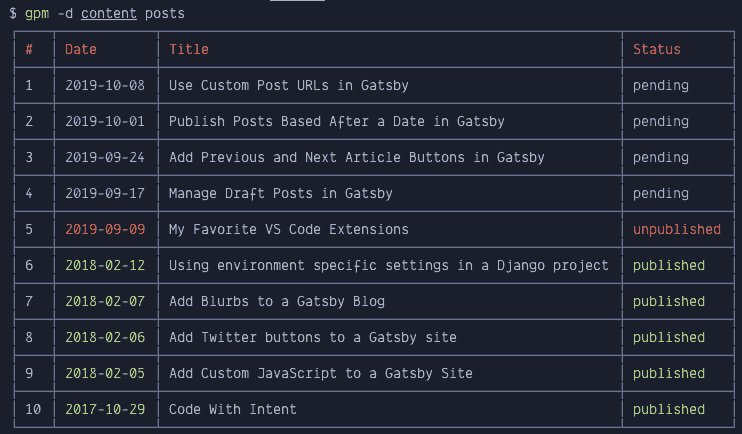
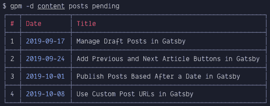
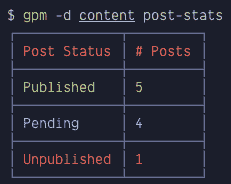

# 🎉宣布盖茨比邮政经理

> 原文:[https://dev . to/mercantte/announcing-Gatsby-post-manager-33oo](https://dev.to/mercatante/announcing-gatsby-post-manager-33oo)

我用盖茨比写博客，喜欢一次写一堆文章，这样我就可以一段时间后发布。但是，由于我使用平面文件而不是 CMS，跟踪我的文章及其状态(已发布、待定、未发布)会变得很棘手——尤其是当它们的数量增加时。所以，我开发了一个工具来帮助管理它们。

🎉**介绍[盖茨比岗位经理](https://github.com/steven-mercatante/gatsby-post-manager)T3】🎉**

Gatsby Post Manager(简称`gpm`)是一个用 Node.js 编写的命令行工具，可以很容易地跟踪你有多少帖子，以及它们的状态。它是作为一个全局包安装的，所以你可以在你的任何 Gatsby 站点上使用它。

```
$ npm install -g gatsby-post-manager 
```

目前它有两个命令:`posts`和`post-stats`。这个项目的 [`README`](https://github.com/steven-mercatante/gatsby-post-manager/blob/master/README.md) 显示了更详细的用法，但大意是...

**您可以显示所有帖子:**

[T2】](https://res.cloudinary.com/practicaldev/image/fetch/s--JqTOgtfC--/c_limit%2Cf_auto%2Cfl_progressive%2Cq_auto%2Cw_880/https://thepracticaldev.s3.amazonaws.com/i/fqmsc2jgakdwtl6aby3g.png)

**按特定状态过滤帖子:**

[T2】](https://res.cloudinary.com/practicaldev/image/fetch/s--17O6bYbe--/c_limit%2Cf_auto%2Cfl_progressive%2Cq_auto%2Cw_880/https://thepracticaldev.s3.amazonaws.com/i/zlcbj2i3ofdgh6r920u0.png)

**显示帖子统计的快速摘要:**

[T2】](https://res.cloudinary.com/practicaldev/image/fetch/s--XK-Da3ye--/c_limit%2Cf_auto%2Cfl_progressive%2Cq_auto%2Cw_880/https://thepracticaldev.s3.amazonaws.com/i/14p69zdml21c17rjzr8v.png)

`gpm`的工作原理是找到你所有的 markdown(包括 MDX)帖子，解析它们的 frontmatter 并确定它们的状态，然后将数据呈现到你的终端上。`gpm`背后的概念非常简单，应该适用于其他静态站点生成器。

如果你发现跟踪你的盖茨比帖子很棘手，我希望你能试一试[盖茨比帖子经理](https://github.com/steven-mercatante/gatsby-post-manager)。

👋喜欢这篇文章吗？

加入我的[时事通讯](https://stevemerc.com/newsletter/?r=dev)并在 Twitter[@ mercantate](https://twitter.com/mercatante)上关注我以获得更多类似的内容。