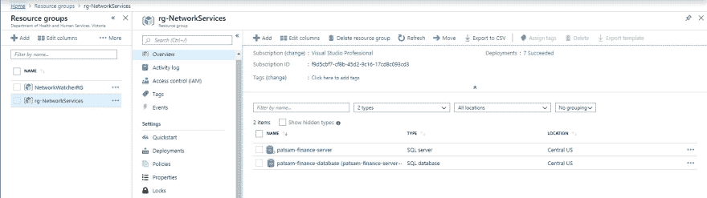

# 创建 Azure SQL Server 数据库

> 原文:[https://dev . to/patricksameerajayalath/create-an-azure-SQL-server-database-588 p](https://dev.to/patricksameerajayalath/create-an-azure-sql-server-database-588p)

在本[教程](https://github.com/patricksameerajayalath/AzureTutorials/blob/master/Create%20an%20Azure%20SQL%20Server%20Database.pdf)中，我将展示如何:

创建资源组
创建 SQL 数据库服务器
创建 SQL 数据库
将 SQL 数据库部署到 SQL 数据库服务器

[T2】](https://res.cloudinary.com/practicaldev/image/fetch/s--AWjZOJlf--/c_limit%2Cf_auto%2Cfl_progressive%2Cq_auto%2Cw_880/https://thepracticaldev.s3.amazonaws.com/i/5e0htiiiacbmgupo1cz0.JPG)

你可以在这里找到这个教程[的 PDF 版本。](https://github.com/patricksameerajayalath/AzureTutorials/blob/master/Create%20an%20Azure%20SQL%20Server%20Database.pdf)

你可以找到我所有的 Azure/。Net 教程[这里](https://dev.to/patricksameerajayalath)。

尽情享受吧！！