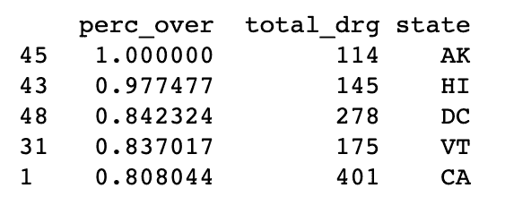
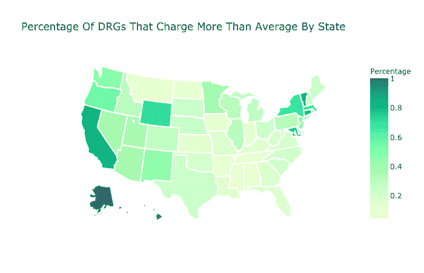

# 使用 SaturnCloud.io 和 BigQuery 分析医疗保健数据

> 原文：<https://dev.to/seattledataguy/analyzing-healthcare-data-with-saturncloud-io-and-bigquery-167k>

路易斯·梅伦德斯在 [Unsplash](https://unsplash.com/search/photos/healthcare?utm_source=unsplash&utm_medium=referral&utm_content=creditCopyText) 上的照片

今天，我们想讨论如何使用云工具来分析医疗数据集，这些工具人人都可以使用。

特别是将为医疗保险提供者使用 Kaggle 数据集。它包含了与诊断相关的群体平均费用、医院位置以及关于提供者及其服务质量的有趣事实的信息。

这些数据集使您能够回答以下问题:哪些州的服务质量最高(基于它们提供的指标)、平均成本最高，以及患者群体的人口统计数据。

由于医疗成本往往是最大的焦点之一，我们将看看哪些州的成本高于平均水平的百分比最大。为了查询数据，我们将使用 [SaturnCloud.io](https://www.saturncloud.io/?source=br-1) 作为 Jupyter 笔记本和 [BigQuery](https://cloud.google.com/bigquery/) 的平台。

# 我们会用到的工具

## SaturnCloud.io

对于那些不熟悉像 [SaturnCloud](https://www.saturncloud.io/?source=br-1) 这样的工具的人。SaturnCloud.io 允许您轻松启动已经安装了 Jupyter notebook 的虚拟机。但事实远不止如此。

使用 SaturnCloud.io 可以很容易地与其他队友共享您的工作，而不必处理确保他们安装了所有正确的库的麻烦。此外，对于那些在本地运行 Jupyter 笔记本电脑并耗尽内存的人来说，它还允许您使用所需的内存和 Ram 来启动虚拟机，并且只需为您使用的内容付费。

还有一些其他的附加功能，可以真正减轻通常从 DevOps 角度完成的工作的复杂性。这就是像这样的工具的伟大之处。在许多方面，直到你在一个连共享一个基本的 Excel 文档都变得很麻烦的公司环境中工作，几乎很难向年轻的数据科学家解释为什么这是如此之好！

## 大查询

这是由于数据存储的位置。我们还需要与大查询互动。这是一个谷歌云服务，允许你查询数据。在这种情况下，医疗保险数据对所有人开放，但存储在谷歌云上。

与大多数云服务一样，只要谷歌公开这些数据，管理起来就很方便。提取数据和运行查询真的很容易，而不必下载 csv 并将其加载到您自己的数据库中。

在我们开始之前，你也可以在这里查看一下 Jupyter 笔记本。

## 连接到大查询

第一步，我们将检索 cms_medicare 公共数据集。为了做到这一点，你需要设置 Google API 证书([参见这里的说明](https://www.dundas.com/support/learning/documentation/connect-to-data/how-to/connecting-to-google-bigquery))。您会注意到凭证不像。json 文件，其密钥如下所示。

```
from google.cloud import bigquery
from google.oauth2 import service_account

credentials = service_account.Credentials.from_service_account_file(
filename="JSON_KEYPATH"
)
    client = bigquery.Client(
    credentials=credentials,
    project=credentials.project_id,
)

medicare = client.dataset('cms_medicare', project='bigquery-public-data') 
```

设置好凭据后，您就可以创建对客户端的引用。这将是你的接入点。

为了了解您正在处理的内容，您实际上可以打印 cms_medicare 数据集中的表列表。使用下面的代码，你可以遍历这些表，这样你就知道你在做什么了。

现在，一旦您提取了数据集，您实际上就可以访问几个表了。您可以运行上面的 print 语句来获得所有表的列表。

```
medicare = client.dataset('cms_medicare', project='bigquery-public-data')
print([x.table_id for x in client.list_tables(medicare)]) 
```

在此分析中，我们将使用 2014 年住院病人费用数据集。这有关于提供者的信息，DRG 代码(代表诊断相关组)不像 ICD 代码那样 100%在诊断上，但它是数据集包含的内容。我们这样说是因为我们将跨州比较 DRG 代码。这不是一个真正公平的比较，因为在汇总中可能会丢失各种细节，从而导致更高或更低的成本。我们这样做是为了展示你如何做未来的工作。

**通过问一个问题开始你的分析**

为了开始这个分析，让我们先问一个基本的问题。如前所述，我们想知道哪些州的 drg 定义收费一直高于其他州。

**哪些州的房价一直高于平均水平**

```
SELECT
    sum(total_discharges*average_total_payments)/sum(total_discharges) AS avg_cost_drug,
    drg_definition
FROM    `bigquery-public-data.cms_medicare.inpatient_charges_2014`
GROUP BY
Drg_definition 
```

为了做到这一点，我们需要在国家的粒度上计算平均价格。这可以通过使用 pandas 和 SQL 来实现(我个人认为 SQL 通常更适合这类工作)。所以，这就是我们要用的。我们可以像下面这样编写查询。

```
#!/usr/bin/python
# -*- coding: utf-8 -*- import pandas

# How many nurrsing facilitins in different States 
query1 = """ SELECT
  (
  sum(
    CASE
      WHEN avg_cost_drug < average_total_payments THEN 1
    ELSE
      0
    END
      )*1.0/count(*)) perc_over,
    count(distinct a.drg_definition) total_drg,
    provider_state
FROM 
    (
    SELECT
        sum(total_discharges*average_total_payments)/sum(total_discharges) AS avg_cost_drug,
        drg_definition
    FROM  `bigquery-public-data.cms_medicare.inpatient_charges_2014`
    GROUP BY
    drg_definition 
    ) a
INNER JOIN  `bigquery-public-data.cms_medicare.inpatient_charges_2014` b
ON  a.drg_definition = b.drg_definition
INNER JOIN  `bigquery-public-data.cms_medicare.hospital_general_info` c
ON  b.provider_id = c.provider_id
GROUP BY
provider_state
"""

query_job = client.query(query1)
results = query_job.result()  # Waits for job to complete. 
perc_over = []
total_drg = []
provider_state = []

for i in results:
    perc_over.append(i[0])
    total_drg.append(i[1])
    provider_state.append(i[2])
state_df = pd.DataFrame({'perc_over': perc_over,
                        'total_drg': total_drg,
                        'state': provider_state}) 
```

使用这个查询作为子查询，我们可以将它连接到 hospital_general_info，然后再连接到原始表。这将提供原始成本以及状态信息。这将允许我们比较 drg_definitions 以及按州分组的成本。

然后我们可以使用 case 语句来计算 drg 定义超过平均成本的百分比。这可以在下面的 query1 变量查询中看到。

使用该查询，您现在可以找出哪些州的 drg 定义收费高于平均值的百分比最高。下面你可以看到我们拉着最高的几个，你会注意到最高的州是阿拉斯加州，加利福尼亚州和佛蒙特州。

[](https://res.cloudinary.com/practicaldev/image/fetch/s--ZlSRzjnC--/c_limit%2Cf_auto%2Cfl_progressive%2Cq_auto%2Cw_880/https://miro.medium.com/max/60/0%2AiMG36qvuoj6c7GmI%3Fq%3D20)

[](https://res.cloudinary.com/practicaldev/image/fetch/s--fQtyYTlV--/c_limit%2Cf_auto%2Cfl_progressive%2Cq_auto%2Cw_880/https://miro.medium.com/max/1184/0%2AiMG36qvuoj6c7GmI)

数据可视化——绘制医疗成本图

这是一个很好的例子，您可以使用简单的数据可视化将信息提取到简洁的图形中。看数字和州代码很难。很难真正了解发生了什么。相反，让我们使用 ploty 库来绘制它

[](https://res.cloudinary.com/practicaldev/image/fetch/s--1e9IeRkN--/c_limit%2Cf_auto%2Cfl_progressive%2Cq_auto%2Cw_880/https://miro.medium.com/max/60/0%2ADeBzQM-n-WuHDvIk%3Fq%3D20)

[](https://res.cloudinary.com/practicaldev/image/fetch/s--KX_49Rzq--/c_limit%2Cf_auto%2Cfl_progressive%2Cq_auto%2Cw_880/https://miro.medium.com/max/1400/0%2ADeBzQM-n-WuHDvIk)T3】

```
from plotly.offline import init_notebook_mode, iplot

import plotly.graph_objs as go
import matplotlib.pyplot as plt
import chart_studio.plotly as py
from plotly import tools

import warnings
warnings.filterwarnings("ignore")

import pandas as pd
init_notebook_mode(connected=True)
scl = [[0.0, 'rgb(248,255,206)'],[0.2, 'rgb(203,255,205)'],[0.4, 'rgb(155,255,164)'], [0.6, 'rgb(79,255,178)'],[0.8, 'rgb(15,183,132)'], [1, '#008059']]

data = [ dict(
        type='choropleth',
        colorscale = scl,
        autocolorscale = False,
        locations = state_df.state,
        z = state_df.perc_over,
        locationmode = 'USA-states',
        text = state_df.state,
        marker = dict(
            line = dict (
                color = 'rgb(255,255,255)',
                width = 2
            ) ),
        colorbar = dict(
            title = "Percentage ")
        )
       ]

layout = dict(
        title = 'Percentage Of DRGs That Charge More Than Average By State',
        geo = dict(
            scope='usa',
            projection=dict( type='albers usa' ),
            showlakes = True,
            lakecolor = 'rgb(255, 255, 255)'),
             )

fig = dict( data=data, layout=layout )
iplot( fig, filename='d3-cloropleth-map' ) 
```

有了这张地图，你可以更好地看到哪些州是高成本的罪魁祸首。现在你不再盯着数字看，而是清楚地知道哪些州的收费高于平均水平。

同样，这不是 ICD 码的粒度，因此会丢失很多信息，但这是一个很好的概括。

## 下一步步骤和结论以及 Youtube

你可以在我的 youtube 频道上查看第一部分和第二部分

从这里开始，我们将调查各种高成本州，并查看是否有特定的 DRG 代码在提供商级别上保持一致。但是现在我们将在这篇文章变得太长之前结束它。

如果你愿意，你可以点击查看 [Jupyter 笔记本。你甚至可能想提出你自己的问题，关于不同医疗程序类别的费用，不同提供者的服务水平，以及你可以利用这个数据集得出的其他结论。](https://www.saturncloud.io/yourpub/rogoben/20cc56b6f8df482997e1e73669aee278/notebooks/States%20With%20The%20Highest%20DRG%20Costs%20-%20Medicare%20CMS.ipynb?source=br-1)

如果你碰巧用它作为某个项目的基础，请告诉我们！我们很想知道你问了什么问题，你最终发现了什么。