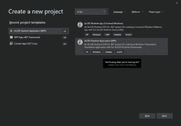

# 使用 ArcGIS Runtime SDK 为创建地图应用程序。网

> 原文:[https://dev . to/bradwell sb/getting-started-with-ArcGIS-runtime-SDK-for-net-12l 4](https://dev.to/bradwellsb/getting-started-with-arcgis-runtime-sdk-for-net-12l4)

[来源](https://wellsb.com/csharp/advanced/wpf-dotnet-arcgis-runtime-sdk/)

如果您是 C#开发人员并从事 GIS 或制图工作，ArcGIS Runtime for。NET 将帮助您快速开始构建 WPF 应用程序。在本教程中，您将构建一个显示亚特兰大公共交通路线地图的 WPF 应用程序。

## [](#create-c-gis-project)创建 C# GIS 项目

如果您还没有这样做，请从下载并安装最新的 Visual Studio 扩展开始。vsix)文件。NET ArcGIS Runtime。该扩展模块将添加模板和所需的 NuGet 包，以便在中使用 GIS 运行时。NET 应用程序。

安装扩展模块后，使用模板 **ArcGIS Runtime 应用程序(WPF)** 创建一个新项目。命名项目 **AtlantaTransit** 。

[T2】](https://wellsb.com/csharp/wp-content/uploads/sites/2/2019/09/arcgis-getting-started1-min.png)

该项目将使用 MainWindow.xaml 文件和 MapViewModel.cs 文件作为模板。一旦创建了项目，就继续构建它( **Ctrl+B** )。这将自动向项目添加所需的 NuGet 包引用。

在 MainWindow.xaml 中，您会看到`esri:MapView`控件已经绑定到一个名为`Map`的属性。

```
<esri:MapView Map="{Binding Map, Source={StaticResource MapViewModel}}" /> 
```

**Map** 是实现`INotifyPropertyChanged`的 **MapViewModel** 类中一个公共属性的名称。关于数据绑定的提示，请回顾关于使用 INotifyPropertyChanged 进行 WPF 数据绑定的教程。

在 MapViewModel.cs 中，您将创建一个新的异步方法来初始化您的地图。您将生成一个名为`InitializeMap()`的`private async void`方法。请确保在初始化 MapViewModel()时调用此方法。从第 24 行开始，您的代码将如下所示:

```
public MapViewModel()
{
    InitializeMap();
}

private async void InitializeMap()
{

} 
```

在 InitializeMap()方法中，您将创建一个新地图并加载一个表示亚特兰大地区的[公交路线的要素服务。您应该异步加载这些数据点，以便在加载大型数据集时 UI 不会挂起。最后，将此图层添加到地图中，并放大到适当的区域。](https://arcgis.atlantaregional.com/arcgis/rest/services/OpenData/FeatureServer/146) 

```
private async void InitializeMap()
{
    Map newMap = new Map(Basemap.CreateStreets());
    FeatureLayer featureLayer = new FeatureLayer(new Uri("https://arcgis.atlantaregional.com/arcgis/rest/services/OpenData/FeatureServer/146"));

    await featureLayer.LoadAsync();

    newMap.OperationalLayers.Add(featureLayer);
    newMap.InitialViewpoint = new Viewpoint(featureLayer.FullExtent);

    Map = newMap;
} 
```

在第 31 行，您使用世界街道地图底图声明了一个临时地图对象。第 32 行创建了一个新图层，其源是亚特兰大公共交通要素服务。该层在第 34 行异步加载。第 36 行将图层添加到地图中，第 37 行将地图的视点设置为公共交通要素图层中的要素范围。

回想一下，MapView 控件(来自 MainWindow.xaml)有一个与 MapViewModel 类的 Map 属性关联的绑定。因此，只有当名为 **Map** 的属性发生变化时，应用程序的用户界面才会更新。这就是 39 行的作用。

在加载亚特兰大地区公交路线地图时，请耐心等待；这是一个很大的数据集！在下一个教程中，您将学习如何过滤数据集，以便只获取所需的数据。

[T2】](https://wellsb.com/csharp/wp-content/uploads/sites/2/2019/09/arcgis-atlanta-transit-min.jpg)

以下是完整的 MapViewModel.cs 的外观:

```
using System;
using System.Collections.Generic;
using System.ComponentModel;
using System.Linq;
using System.Text;
using System.Threading.Tasks;
using System.Runtime.CompilerServices;
using Esri.ArcGISRuntime.Data;
using Esri.ArcGISRuntime.Geometry;
using Esri.ArcGISRuntime.Location;
using Esri.ArcGISRuntime.Mapping;
using Esri.ArcGISRuntime.Security;
using Esri.ArcGISRuntime.Symbology;
using Esri.ArcGISRuntime.Tasks;
using Esri.ArcGISRuntime.UI;

namespace AtlantaTransit
{
    public class MapViewModel : INotifyPropertyChanged
    {
        public MapViewModel()
        {
            InitializeMap();
        }

        private async void InitializeMap()
        {
            Map newMap = new Map(Basemap.CreateStreets());
            FeatureLayer featureLayer = new FeatureLayer(new Uri("https://arcgis.atlantaregional.com/arcgis/rest/services/OpenData/FeatureServer/146"));

            await featureLayer.LoadAsync();

            newMap.OperationalLayers.Add(featureLayer);
            newMap.InitialViewpoint = new Viewpoint(featureLayer.FullExtent);

            Map = newMap;
        }

        private Map _map = new Map(Basemap.CreateStreets());

        public Map Map
        {
            get { return _map; }
            set { _map = value; OnPropertyChanged(); }
        }

        protected void OnPropertyChanged([CallerMemberName] string propertyName = null)
        {
            PropertyChanged?.Invoke(this, new PropertyChangedEventArgs(propertyName));
        }

        public event PropertyChangedEventHandler PropertyChanged;
    }
} 
```

[来源](https://wellsb.com/csharp/advanced/wpf-dotnet-arcgis-runtime-sdk/)