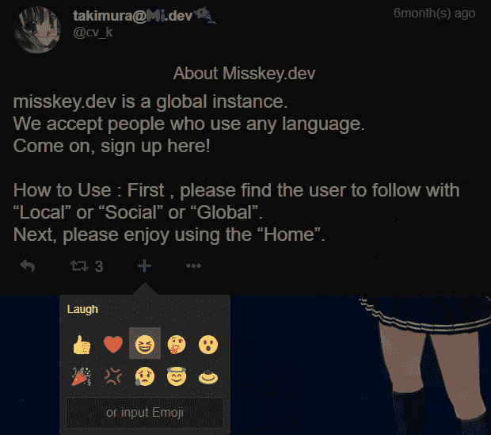

# misskey.dev 简介

> 原文:[https://dev.to/takimura/misskey-dev-introduction-55a2](https://dev.to/takimura/misskey-dev-introduction-55a2)

Misskey 是 syuilo 在 2014 年开发的一款 SNS 软件。最初它没有连接到 Fe diversity，但从 2018 年 4 月开始支持。

贡献者已经启动了一个名为 misskey.dev 的实例，并欢迎来自世界各地的注册。它是免费使用的，并接受一些捐赠。

[T2】](https://res.cloudinary.com/practicaldev/image/fetch/s--TfO34mZy--/c_limit%2Cf_auto%2Cfl_progressive%2Cq_auto%2Cw_880/https://thepracticaldev.s3.amazonaws.com/i/o3xdftse9kkih3wxkdkf.png)

各种自定义表情符号可用于反应操作。

### 链接

miss key . dev[https://misskey.dev/](https://misskey.dev/)
join miss key[https://joinmisskey.github.io/](https://joinmisskey.github.io/)

GLHF!