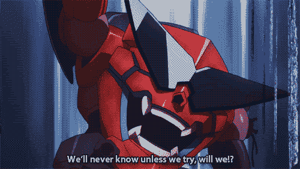
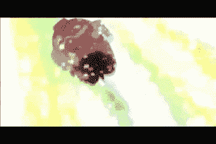

# 让我们来看看 2019 年 JS 中的 CSS 与 React-React-JSS

> 原文：<https://dev.to/phizzard/let-s-take-a-look-at-css-in-js-with-react-in-2019-react-jss-46bj>

嘿！我回到了我的系列的第 2 部分，在那里我决定讨论 js 解决方案中的 CSS，用于设计 React 应用程序的样式。

如果这是你进入这个系列，请随时检查我的第一个条目！我从基础开始，用 React 讨论普通 CSS，提供关于 CSS 的一般陷阱的参考资料，以及我用 React 遇到的个人陷阱。我还将继续介绍 React 的内联样式以及它如何解决这些问题，但不幸的是，它并没有完全采用 w。

从好的方面来看，它充满了矩阵参考，因此您至少应该检查一下！

[](/phizzard) [## 让我们来看看 2019 年 JS 中的 CSS 与 React-CSS &内联样式

### Phil tiet jen 9 月 9 日 1915 分钟阅读

#webdev #react #css #tutorial](/phizzard/let-s-take-a-look-at-css-in-js-with-react-in-2019-css-inline-styling-jcg)

## 什么是 JSS？

我会尽量让事情简单明了，这样我们就可以直接进入 React 的实现，所以让我们使用方便的丹迪·JSS 文档来告诉我们我们需要知道什么！

> JSS 是一个 CSS 创作工具，它允许你使用 JavaScript 以一种声明性的、无冲突的和可重用的方式来描述风格。它可以在浏览器、服务器端或在节点中编译。

哎呀，费城男孩，这听起来很像你上次展示的带有 React 的内联样式。实际上，因为实现是相似的，所以我决定把 JSS 作为我的第二个条目，因为我们已经熟悉了 Javascript 的写作风格！由于引擎盖下的工作方式略有不同，我们获得了相同的好处和一些额外的好处。

> JSS 是框架不可知论者。它由多个包组成:核心、插件、框架集成和其他。

**总结一下**
*核心*——让我们用 Javascript 来描述自己风格的东西。

插件(Plugins)-可以添加到核心上的东西，以增加我们描述自己风格的功能。

框架集成(Framework Integrations)——让我们可以在特定框架中轻松使用 JSS 的东西**答对了！**

## 这就是反应——JSS 的切入点

[](https://res.cloudinary.com/practicaldev/image/fetch/s--124MbxBh--/c_limit%2Cf_auto%2Cfl_progressive%2Cq_auto%2Cw_880/https://thepracticaldev.s3.amazonaws.com/i/n53shw66o63kpvhudhxl.jpg)

> 让我们假设这个小家伙是 JSS。给我的？

React-JSS 是一个框架集成，能够在我们的 React 应用程序中使用 JSS。这是一个单独的包，所以我们不需要安装 JSS 核心，我们只需要反应 JSS 包。它也可能带有 JSS 插件和配置设置。首先，让我们比较一下 React-JSS 的内联样式和上次的按钮组件。

**直列造型**

```
// Button.js
import React from 'react'

const Button = () => {
  const buttonGreen = {
    backgroundColor: "green",
    border: "2px solid white",
    borderRadius: "2rem"
  };

  return(
    <button style={buttonGreen}>
      I think I'm green
    </button>
  )
} 
```

**做出反应——JSS**

[](https://res.cloudinary.com/practicaldev/image/fetch/s--ihmGxJw3--/c_limit%2Cf_auto%2Cfl_progressive%2Cq_66%2Cw_880/https://thepracticaldev.s3.amazonaws.com/i/k4f8se50b3psm8novy8k.gif)

> React-JSS 结合 React

```
// Button.js
import React from 'react'
import {createUseStyles} from 'react-jss'

const useStyles = createUseStyles({
  buttonGreen: {
    backgroundColor: "green",
    border: "2px solid white",
    borderRadius: "2rem"
  }
})

const Button = () => {
  const {buttonGreen} = useStyles()

  return(
    <button className={buttonGreen}>
      I think I'm green
    </button>
  )
} 
```

[](https://res.cloudinary.com/practicaldev/image/fetch/s--OKuneQgN--/c_limit%2Cf_auto%2Cfl_progressive%2Cq_66%2Cw_880/https://thepracticaldev.s3.amazonaws.com/i/ce7wqm1c1qn3tllx2nzk.gif)

> 抱歉，可能更像这样。

**实现是如何变化的？**

*   我们从 React-JSS 包中导入了`createUseStyles`函数。
*   我们通过调用`createUseStyles`创建了一个`useStyles`钩子。
*   我们在`createUseStyles`的参数中的一个对象属性下描述了我们的 CSS 样式
*   我们从`useStyles`钩子的返回值中析构了`buttonGreen`。
*   我们将`buttonGreen`而不是`style`传递给了`className`属性

让我们也来比较一下上次的按钮组件和影响我们风格的道具。

**使用具有内嵌造型的道具**

```
// Button.js
import React from 'react'

const Button = ({backgroundColour, children}) => {
  const buttonStyles = {
    backgroundColor: backgroundColour,
    border: "2px solid white",
    borderRadius: "2rem"
  };

  return(
    <button style={buttonStyles}>
      {children}
    </button>
  )
} 
```

**使用道具配合 React-JSS**

```
// Button.js
import React from 'react'
import {createUseStyles} from 'react-jss'

const useStyles = createUseStyles({
    buttonStyles: {
      backgroundColor: backgroundColour => backgroundColour,
      border: "2px solid white",
      borderRadius: "2rem"
    }
})

const Button = ({backgroundColour, children}) => {
  const {buttonStyles} = useStyles(backgroundColour)

  return(
    <button className={buttonStyles}>
      {children}
    </button>
  )
} 
```

另外:这种用法对两种实现都有效！

```
// SomePage.js
import React from 'react';
import Button from 'Button';

const SomePage = () => (
  <Button backgroundColour="blue">I'm going to be blue</Button>
) 
```

**实现是如何变化的？**

*   我们将我们的`backgroundColour`道具作为参数传递给我们的`useStyles`
*   在我们的`createUseStyles`中，我们可以将`backgroundColour`作为一个函数值来访问，并相应地对其赋值。

[](https://res.cloudinary.com/practicaldev/image/fetch/s--tZeXKmys--/c_limit%2Cf_auto%2Cfl_progressive%2Cq_66%2Cw_880/https://thepracticaldev.s3.amazonaws.com/i/umdvsaimk0tpmahg7c3i.gif)

> React-React 里的 JSS 看起来很酷吧？

## 从内联到反应式的转变中我们受益了什么——JSS？

**来自刚 JSS**

*   JSS 生成 CSS，而不是内联样式。
*   JSS 生成散列类名以避免选择器中的冲突。
*   JSS 拥有高效的 CSS 更新来控制动画的使用。

*要查看完整的优势列表，这里是 JSS 文档中的[功能列表](https://cssinjs.org/features?v=v10.0.0-alpha.24)*

**来自 React-JSS**

*   它允许我们基于 React 的上下文 API 使用主题化。
*   只有来自渲染组件的 CSS 被提取。
*   基于已安装和未安装的组件创建和删除生成的样式表。

*如需完整的优势列表，请点击这里的 [React-JSS 文档](https://cssinjs.org/react-jss/?v=v10.0.0-alpha.24#accessing-the-theme-inside-the-styled-component)*

## 我个人喜欢 React-JSS 什么？

#### 简单

React-JSS 没有偏离内联样式是如何实现的太远，这使得它非常容易过渡到。无论你是第一次学习，还是将应用程序从内联式过渡到反应式——JSS。

#### 挂钩

这真的可以联系到简单的一点，然而，我是 React 的钩子 API 的盲目追随者，因为它出来了。这也是一个完美的时间来澄清和承认我已经尝试过反应-JSS 早就和不**不**喜欢它。那时你必须使用一个[高阶组件](https://reactjs.org/docs/higher-order-components.html)来将你的风格变量注入到你的组件中，与其他组件相比，这对我来说太多了。然而，带有`createUseStyles`的新 API 对我来说几乎是一个转折点；这样更容易理解正在发生的事情，也更容易打字。

#### 我们的 Html 中没有内嵌样式

耶！还记得我的内嵌样式的缺点吗？嗯，它在这里几乎不费吹灰之力就完成了。

## 关于 React-JSS 我个人不喜欢什么？

[](https://res.cloudinary.com/practicaldev/image/fetch/s--HHE3Xr2F--/c_limit%2Cf_auto%2Cfl_progressive%2Cq_66%2Cw_880/https://thepracticaldev.s3.amazonaws.com/i/fu4bhxot0ichauulwvg5.gif)

#### 对象样式

我仍然不喜欢用 Javascript 对象描述我的风格。你可以说我心胸狭窄，但是我不喜欢错过语法重点，不喜欢因为我的大脑必须将 CSS 转换成 Javascript 而不得不多考虑 3%的内容。获取任何原始 CSS 并将其转换过来仍然很繁琐。

#### 给类名分配样式

虽然这确实使从`style={styles}`过渡到`className={styles}`变得容易，但我不喜欢它在组件文件中的样子。考虑到 JSS 正在后台制作 CSS 样式表，并且组件需要引用散列类，这是有意义的。我只是希望有一种更美观的形式。

> 这对下一篇文章来说是不是太多的铺垫了？

## 我会用 React——JSS 吗？

这将是我的选择和包的武库，以检查时间。这是一个设计 react 应用程序的简单解决方案，拥有足够的性能，易于使用。如果你正在使用内联样式的应用程序，或者你只熟悉内联样式，我强烈推荐你使用 React-JSS。

希望下一部能见到你！看看我能不能在 2019 年结束前“完成”这个系列；不管结束意味着什么！

嘿！如果你想关注我或者在上面聊天，我在 Twitter 上。我有时在那里张贴东西！