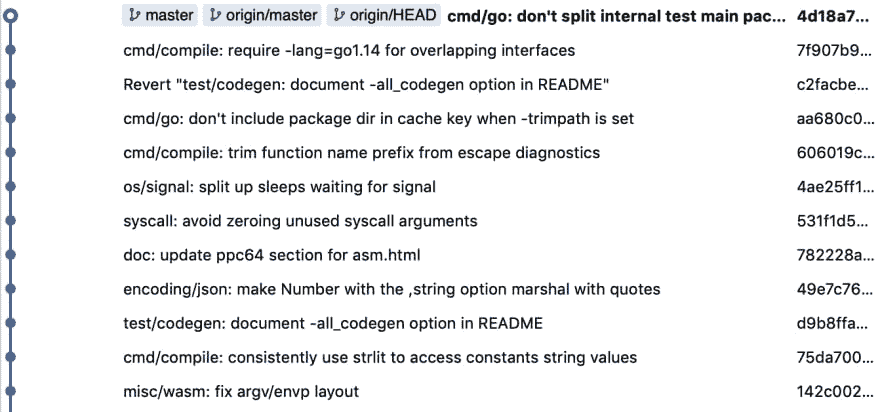
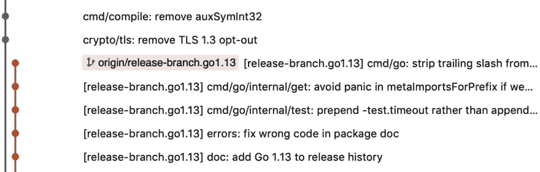
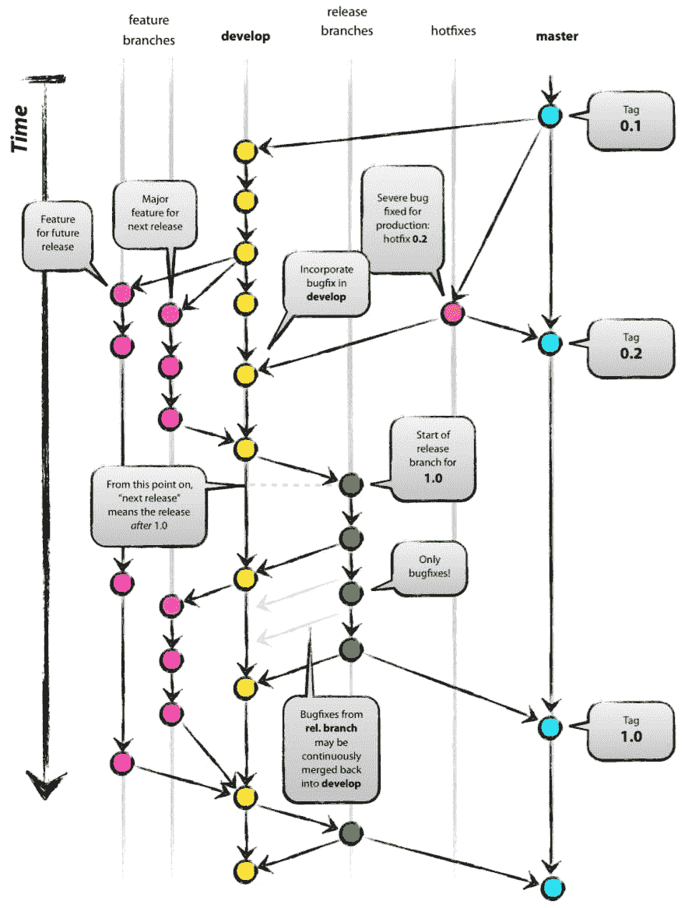

# 如何使用 git 分支

> 原文:[https://dev.to/projectpage/how-to-use-git-branches-3641](https://dev.to/projectpage/how-to-use-git-branches-3641)

git 有很多可能的工作流程，但最简单的一个在我的经验中也是最有效的，在谷歌和脸书从小团队到非常大的团队都适用。这有时被称为基于主干的开发，我将在下面解释它是如何工作的。

# 主干基础发展

*   有一个主要分支-通常称为主。
*   这在测试中总是绿色的，从来没有坏过。
*   所有新的变化都是基于母片
*   没有单独的合并提交

Master/Head 可用作所有新变更的基础，并随着开发人员发布的变更而定期更新。所有的开发者都有提交权限，社会契约是这样的，主人永远不会被打破。它可以作为一个工作版本，用于内部测试或开发，所有新的工作都是基于 master 的。可能有发布分支(例如，用于反向移植 bug 修复)，本地开发人员使用特性分支进行变更。

所有的新变化都是基于主的，并且通常是在一个特性分支中完成的，尽管如果很小的话，它们可以被直接处理。当变更已经被本地测试并准备就绪时，它被从 master 中移除(可选地，一些提交被压缩和整理)，然后它被合并到 master 中，在 master 上产生一个所有工作完成的简单线性历史，用标记来表示不同的发布。结果，master 分支看起来像这样(例子取自 Google 的 go 语言项目):

[T2】](https://res.cloudinary.com/practicaldev/image/fetch/s--bH4JORSI--/c_limit%2Cf_auto%2Cfl_progressive%2Cq_auto%2Cw_880/https://thepracticaldev.s3.amazonaws.com/i/bguf8d6gta31qu0zqem3.png)

没有合并提交，也没有长期存在的分支(除了可选的发布分支，它的存在是为了支持 bug 修复)。

因此，开发和提交代码的过程是:

*   拉最新来源/主数据
*   重设基础特征分支主控形状
*   对特征分支进行更改
*   对功能运行测试
*   准备就绪后，共享以供代码审查

当代码通过代码评审时，开发人员可能会经历这个过程的几个循环。最终合并的过程是:

*   拉最新来源/主数据
*   重设主图形的基础特征，必要时挤压
*   运行测试
*   合并到源/母版

# 发布分支

例如，发布 go 项目的分支，如下所示:

[T2】](https://res.cloudinary.com/practicaldev/image/fetch/s--9PzyJ-OF--/c_limit%2Cf_auto%2Cfl_progressive%2Cq_auto%2Cw_880/https://thepracticaldev.s3.amazonaws.com/i/9jospkcaydp212j4h08z.jpg)

最初发布时主版本的一个分支，它保存特定于该发布的任何新提交。如果需要的话，这些可以用于对旧代码的 bug 修复发布(通常在较大的项目中)。大多数较小的项目不必为此烦恼，只需标记发布即可。

# 替代品

### 特征分支

特性分支实际上也可以与基于主干的开发一起使用，并且通常是在本地进行变更，但是这种使用 git 的方式有一个重要的区别——它需要合并提交来合并特性分支。

有些人喜欢这样，因为它给出了一个分支何时被检入的明确指示，并且可以更容易地从分支中恢复所有的更改。

我更喜欢放弃分支和分支名称这样的历史人工制品，而是让提交注释在历史中自己说话。

这意味着知识库最终可能看起来像一张特别卡夫卡式的地铁图:

[T2】](https://res.cloudinary.com/practicaldev/image/fetch/s--2hAbdm6E--/c_limit%2Cf_auto%2Cfl_progressive%2Cq_auto%2Cw_880/https://thepracticaldev.s3.amazonaws.com/i/9dwnd5dm1pq9bt17dqyj.png)

### Gitflow

另一种选择有时被称为 git flow——这适合一种开发风格，在这种风格中，软件的开发版本的工作持续几周或几个月，然后在很长时间后合并到主版本中。如果你想练习连续交付和频繁发布小特性，它不是很适合。这可以用下图来概括:

[T2】](https://res.cloudinary.com/practicaldev/image/fetch/s--Bdef9if5--/c_limit%2Cf_auto%2Cfl_progressive%2Cq_auto%2Cw_880/https://thepracticaldev.s3.amazonaws.com/i/3x55vv7dviuhjnwg7ffr.jpg)

它告诉你关于 gitflow 你需要知道的一切。图片来自 nvie.com。

### Github 工作流程

Github 引入了一个有趣的使用 git 的方法，它要求用户克隆(派生)回购协议，进行所有的修改，然后提交一个 pull 请求给原始回购协议。

这确实允许无法访问原始回购的开发人员处理代码，并提交建议的更改，因此它在开源项目和 github 上很受欢迎。不利的一面是，这可能意味着在没有与最初的维护者讨论的情况下孤立地进行更改，然后作为一个大的转储一次提交。

# 结论

我认为如果你能完全控制你的开发过程，使用基于主干的开发模型会更简单和更有效率，因为它让你能经常发布并随时保持 master 更新，并产生一个清晰的 git 历史，易于阅读，并且没有开发过程中的人工制品。这个系统在谷歌的规模下运行良好，对于小团队也是如此。

你可以在这篇[文章](https://cacm.acm.org/magazines/2016/7/204032-why-google-stores-billions-of-lines-of-code-in-a-single-repository/fulltext)中找到更多关于 Google 如何使用 git 的信息，或者通过参与他们的一个开源项目，比如 [Go 语言](https://golang.org/)。