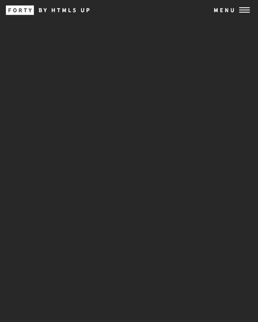
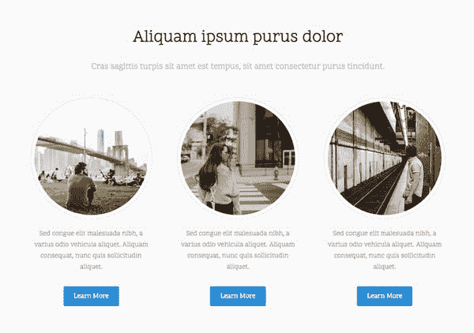
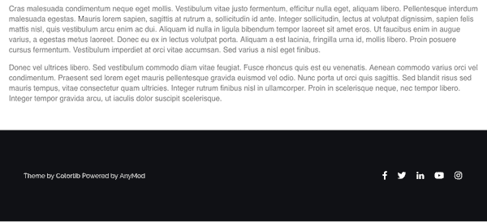

# 个人资料页面，深色导航栏，社交页脚|模块周一 55

> 原文：<https://dev.to/tyrw/profile-page-dark-navbar-social-footer-module-monday-55-220f>

## 下面的一切都是开源的

它可以在任何网站、web 应用程序或其他任何地方免费使用。在 AnyMod 上还有数百个这样的构建和共享。

单击一个 mod 来查看它及其源代码。

## 简介高亮页面

带有简单链接和淡入效果的完整页面配置文件。
[查看 mod](https://anymod.com/mod/identity-solo-portfolio-page-dknnrb?preview=true)
  

## 导航菜单覆盖

全页面覆盖的侧边/顶部导航解决方案。
[查看 mod](https://anymod.com/mod/navbar-llkmrr?preview=true&dark=true)
  

## 内容圈

带有文本和行动号召按钮的预设圆形图像。
[查看 mod](https://anymod.com/mod/circles-and-content-barkok)
  

## 黑暗社会的页脚

带有消息和社会链接的可重复使用的页脚。
[查看 mod](https://anymod.com/mod/dark-footer-with-social-links-dkdobk)
  

## 悬停图像文本

悬停时字幕覆盖的图像。
[查看 mod](https://anymod.com/mod/rdbdn?v=20&preview=true&lorem=true)
  

* * *

我每周一从社区[这里](https://dev.to/tyrw)贴出新的 mods 我希望你觉得它们有用！

快乐编码✌️