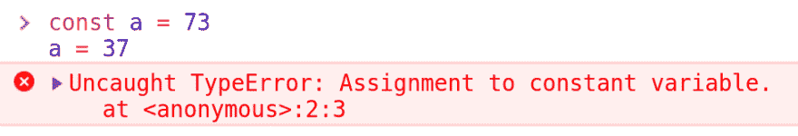

# 纯粹的功能和不变性，一点关于干净的代码和质量

> [https://dev . to/code 播客/funcoes-pure-e-immunidad-um-略高于-code-clean-e-quality-2he 3](https://dev.to/codecasts/funcoes-puras-e-imutabilidade-um-pouco-sobre-codigo-limpo-e-qualidade-2he3)

清洁代码(*清洁代码*是一个反复出现的重要话题。不幸的是，没有一个领养比你想象或预期的要大。

其动机包括缺乏深入的主题及其细微差别，以及软件开发专业人员工作的项目或公司的良好背景和现实情况。
混乱、收费和需求，很多领导人或管理者不能，或者干脆看不到这些做法的价值，好老*重要的是*。

也许有人会惊讶或惊讶地发现，仍然有很多企业和专业人员没有遵循许多基础考虑的做法和概念。

本文旨在帮助对某些主题和技术进行解密，从而使它们更易于采用。

* * *

## 清理代码 e JavaScript

清洁守则是一个广泛的问题，在某些方面甚至有争议。有些事情可以说是主观的，辩论并不罕见。

不幸的是，其中很多讨论都是[【碧兴园】](https://pt.wikipedia.org/wiki/Lei_da_trivialidade)，结果一无所获。当这种情况发生时，处于球队领先地位的人需要采取僵硬明确的立场，有时是单方面的。这不是一件简单的事情，毕竟它可能会在团队中引起冲突，但这是必要的。

我的建议是:坦率而明确地说，目的不是强加意愿，而是结束没有结果的对话。

### 工具

其中许多讨论都是关于句号和逗号……制表符或空格……[骆驼牌](https://pt.wikipedia.org/wiki/CamelCase)或[蛇牌](https://en.wikipedia.org/wiki/Snake_case)的……解决办法很简单，采用预先存在的综合风格，并保持原样。

在 JavaScript 中，我们已经有了一些相当流行的模式:[【谷歌风格指南】](https://google.github.io/styleguide/jsguide.html)、[【Airbnb 风格指南】](https://github.com/airbnb/javascript)和[【JavaScript 标准风格】](https://standardjs.com/)。每个人都有自己的‘T6’斯洛文尼亚的规则。选择其中一个并将其用于您的团队或项目，我建议不要修改规则。

有一些平台超越了斯拉夫语所做的工作，对其代码进行分析和分类。有些是免费的，用于开源项目。

*   [深度扫描](https://deepscan.io/home/)
*   [SonarJS](https://www.sonarsource.com/products/codeanalyzers/sonarjs.html)
*   [预包装](https://prepack.io/)
*   [编码因子](https://www.codefactor.io/)
*   [编码气候](https://codeclimate.com/)
*   [Codacy](https://www.codacy.com/)
*   [代码节拍](https://codebeat.co/)
*   [声纳曲](https://www.sonarqube.org/)

### 技术信息

是几个，本文将重点论述 [**【不变性】**](https://www.sitepoint.com/immutability-javascript/)[**【纯功能】**](https://medium.com/javascript-scene/master-the-javascript-interview-what-is-a-pure-function-d1c076bec976) 。但是，我们不能不举出一些如、[【固体】](https://pt.wikipedia.org/wiki/SOLID)、[【kiss】](https://pt.wikipedia.org/wiki/Keep_It_Simple)和[【对象健美操】](https://eltonminetto.net/2016/06/24/como-melhorar-seus-codigos-usando-object-calisthenics/)。

通过深入了解这些技术，您将了解到思想和流的融合，随着时间和实践的推移，这些思想和流已成为您的编码方式的自然组成部分。

* * *

## 不变性

不变性也许是本文最复杂的话题之一。不是技术上的复杂性，而是近乎哲学上的复杂性和某种‘t0’假阳性’。

> 我们首先要了解的是，不变性并不意味着常数。

```
const a = 73
a = 37 
```

[](https://res.cloudinary.com/practicaldev/image/fetch/s--As8tGoSn--/c_limit%2Cf_auto%2Cfl_progressive%2Cq_auto%2Cw_880/https://thepracticaldev.s3.amazonaws.com/i/5eme2dfcibd021zxqiwe.png)

这是我们在运行上述示例时收到的错误，很多人会假设 JavaScript 中的“[***const***](https://developer.mozilla.org/en-US/docs/Web/JavaScript/Reference/Statements/const)与常量相关，但其目标是防止“**重新分配”**

让我们进一步了解一下它是如何工作的。

## 价值观和参考

在 JavaScript 中，我们有以下基本元素:

*   [布尔型](https://developer.mozilla.org/pt-BR/docs/Glossario/Booleano)
*   [号](https://developer.mozilla.org/pt-BR/docs/Glossario/N%C3%BAmero)
*   [字符串](https://developer.mozilla.org/pt-BR/docs/Glossario/String)
*   [Null](https://developer.mozilla.org/pt-BR/docs/Glossario/Nulo)
*   [未定义](https://developer.mozilla.org/pt-BR/docs/Glossario/Undefined)
*   [符号](https://developer.mozilla.org/en-US/docs/Glossary/Symbol)

在内部使用比较运算符`==`和`===`时，总之是比较内存引用。JavaScript 是 100%面向对象的语言，其所有类型和值都是对象。

对象将有一个内存地址，在实践中`x == y`是比较`x`表示的内存地址是否与`y`表示的相同。因此`{} == {}`或`[] == []`不起作用，因为每个`{}`和`[]`都指向不同的记忆位置。

明知`2`为 Number 型，也是一个物体，`2 == 2`是如何工作的呢？答案很简单，JavaScript 中的原始类型是常量和不变的。

```
01. let n = 73
02. n == 73 // true
03. n = 37
04. n == 73 // false 
```

*   在`73`行中，我们宣告`n`并为其指定`73`。
*   在`02.`行中，我们比较`n == 73`，如`n`指向与`73`相同的记忆地址，结果是`true`。
*   在`37`行中，我们将`n`重新分配到另一个值，现在`37`。
*   在`04.`行，我们比较`n == 73`，如`n`指向另一个地址而不是`73`，结果是`false`。

JavaScript 中的每个原始元素都以这种方式工作；与此行为相关的另一个特征是它们的不变性；原始元素的方法不会更改其值……在需要时不会更改其在内存中的引用，但永远不会更改原始引用。

```
const s1 = 'Codecasts'
const s2 = s1.toUpperCase() // CODECASTS
s1 == s2 // false 
```

这种行为是原始人的固有行为，但诸如`Array`和`Object`等其他类型并不这样做，`[7, 3] == [7, 3]`将永远是`false`，因为每个类型指向不同的记忆地址。

> [解释 Javascript 中的值与引用](https://medium.com/p/explaining-value-vs-reference-in-javascript-647a975e12a0)

## 不变参考

当我们在 JavaScript 中谈论不变性时，我们谈论的是“”避免修改引用“”。

在原始人中使用`const`时，我们已经保证了很好的不变性，但最大的挑战是处理不变的物品和清单。

```
01. const arr = [7, 3]
02. arr.push(12)           // arr --> [7, 3, 12]
03. arr.unshift(1)         // arr --> [1, 7, 3, 12]
04. const last = arr.pop() // arr --> [1, 7, 3]
05. last == 12 // true 
```

> 参考文献: [`.push`](https://developer.mozilla.org/pt-BR/docs/Web/JavaScript/Reference/Global_Objects/Array/push) ， [`.unshift`](https://developer.mozilla.org/pt-BR/docs/Web/JavaScript/Reference/Global_Objects/Array/unshift) e [`.pop`](https://developer.mozilla.org/pt-BR/docs/Web/JavaScript/Reference/Global_Objects/Array/pop)

在`[7, 3]`行中，我们宣告`arr`，在其上分配了`[7, 3]`阵列。在`02.`至`04.`行中，我们操纵`arr`，然后说明了其现状。

最初这样的事情可能看起来无害，但有很难查明或追查到的极端情况的可能性。

下面的示例说明了如何使用对象作为参照。

```
const fn = x => x
const obj = {}
obj == fn(obj) // true 
```

`x`功能除了传回`x`其唯一的引数外，什么都不做。比较`obj == fn(obj)`我们得到`true`结果，因为我们返回相同的实例/参考。

下面的例子简要探讨了这种行为的影响。

```
const setPrice = product => {
  product.price = 73
}
const product = { name: 'Instant Kung Foo.' }
setPrice(product)
product.price == 73 // true 
```

`product`功能接收`product`并添加或修改`price`属性，比较`product.price == 73`时就清楚了。这称为**副作用(*侧效应* )** ，功能`setPrice`是**不洁净功能**。

```
const setPrice = product => {
  return { ...product, price: 73 }
}
const product = { name: 'Instant Kung Foo.' }
const newProduct = setPrice(product)
product.price == 73 // false
newProduct.price == 73 // true 
```

现在函数`setPrice`返回一个 [**【纯拷贝】**](https://we-are.bookmyshow.com/understanding-deep-and-shallow-copy-in-javascript-13438bad941c) **【浅拷贝】 )** 作为引数，添加或修改为此过程要求创建一个新变量**`newProduct`，这是因为使用了`const`，下例使用`let`。**

 **这种流动可能会有点麻烦，通常这种办法是不必要的，采用[管等技术，并构成](https://medium.com/front-end-weekly/pipe-and-compose-in-javascript-5b04004ac937)。

## 纯函数

[【纯函数】](https://medium.com/@jamesjefferyuk/javascript-what-are-pure-functions-4d4d5392d49c)与不变性并列，在实践中，我们可以说一个不存在而另一个不存在。

> 无论调用多少次，始终为同一参数返回相同结果的函数都是纯函数，不会产生“侧效果”(side effects)。

看起来很明显，但不幸的是，它仍然引起一些程序员的怀疑。这种技术需要程序员作一些努力，他必须明确选择使用它。
让我们举以下例子:

```
// impure.js
let counter = 0
const addToCounter =  value => {
  counter = counter + value
}
// pure.js
const sum = (x, y)  => x + y
let counter = 0
counter = sum(counter, 10) 
```

这是最早用来描述不纯函数的例子之一，很明显。但它的简单性也使它难以采用，我们知道真正的程序比这一功能更复杂。

```
const request = params => {
  if (params.client) {
    params.client_id = params.client.id
    delete params.client
  }
  return http.get('/', params)
} 
```

以上示例更接近于一个应用程序*实际*。我们有接收`params`的`params.client`功能，如果`params.client`存在的话，`params`被修改。

`request`函数产生严重的副作用，无法确定不稳定性，因此*bug*是该函数给调用者造成的。

```
const request = params => {
  const options = { ...params }

  if (options.client) {
    options.client_id = options.client.id
    delete options.client
  }
  return http.get('/', options)
} 
```

有了这种变化，问题就解决了，`params`不再修改，现在程序适用于它的副本。但是，仍有改进这一功能的馀地。

```
const parseRequestParams = params => {
  const data = { ...params }
  if (data.client) {
    data.client_id = data.client.id
    delete data.client
  }
  return data
}
const request = params => {
  const options = parseRequestParams(params)
  return http.get('/', options)
} 
```

在`parseRequestParams`中孤立了所有参数处理逻辑。通过将逻辑的一部分委托给另一个更专门的函数，该函数变得更加客观。这不仅提高了阅读能力，还使您能够创建复盖范围更广的驱动器测试。

> 一行，一个命令，一个函数。

`parseRequestParams`功能仍可通过使用***【pipe】***和 ***复合*** 的技术来进化。图书馆 [**【支部】**](https://ramdajs.com/) 提供了这些和各种有用的功能，帮助实施这些技术。

```
import { compose, omit } from 'ramda'

const parseClientInRequestParams = params => {
  if (!params.client) {
    return params
  }

  return {
    ...omit(['client'], params),
    client_id: params.client.id
  }
}

const parseUserInRequestParams = params => {
  if (!params.user) {
    return params
  }

  return {
    ...omit(['user'], params),
    user_id: params.user.id
  }
}

const parseRequestParams = compose(parseClientInRequestParams, parseUserInRequestParams) 
```

`parseClientInRequestParams`和`parseUserInRequestParams`的功能变得非常相似，我们可以简化它们。

```
import { compose, omit, has, path } from 'ramda'
const createParseEntityInRequestParams = key => {
  return params => {
    if (!has(key, params)) {
      return params
    }
    const id = path([key, 'id'], params)
    return {
      ...omit([key], params),
      [`${key}_id`]: id
    }
  }
}
const parseClientInRequestParams = createParseEntityInRequestParams('client')

const parseUserInRequestParams = createParseEntityInRequestParams('user') 
```

`createParseEntityinRequestParams`函数传回功能与先前`parseClientInRequestParams`和`parseUserInRequestParams`实作完全相同的函数。

> 接收和返回函数是唯一可能的，因为函数在 JavaScript 中是“[”一等公民“](https://en.wikipedia.org/wiki/First-class_function)”被视为值。

随着这些模式越来越多，使用纯函数和工厂函数就越来越自然了。这是一个非常大的重复使用水平和极大的灵活性。

### 封装 Fluxos Impuros

不幸的是，创建不处理不良流的应用程序是不可行的。依赖于*I*、*【圆盘】、*、*网络*、*数据库*的操作是不洁净的操作，往往会产生副作用。

说到功能编程，出现诸如**等词汇并不少见。它们造成了很多混乱，特别是对于那些还只是从功能性编程开始的人来说。**

 *本文将不涉及*僧侣*，而是以简单的方式处理这些情况。

```
const request = params => {
  const options = parseRequestParams(params)
  return http.get('/', options)
} 
```

再举前面的例子，我们有`request`的功能。尽管它不再产生直接的副作用，但它返回了一个[承诺](https://developers.google.com/web/fundamentals/primers/promises?hl=pt-br)。关于传回承诺的函数的∞存在争论，事实是它可能会有[不同的结果](https://medium.com/@aidobreen/js-promises-async-await-and-functional-programming-f2e5fa66b4ef)，即使参数相同，这也使它成为 [**不洁净的函数**](https://medium.com/@aidobreen/js-promises-async-await-and-functional-programming-f2e5fa66b4ef) 。

不管是纯粹的功能还是非纯的功能，还有一个更大的问题，这种功能的事实要靠`http`才能发挥作用。假设`http`是全球性的，大概是[公理](https://github.com/axios/axios)的例证。正因为是全球性的，所以我们在测试这个功能时遇到了问题。

依赖全局状态会严重影响测试过程，因为需要重新创建整个环境层才能进行测试，此外还需要使用复杂的“t0”“mocking”技术。

解决办法很简单，把`http`注入`request`。

```
const request = (http, params) => {
  const options = parseRequestParams(params)
  return http.get('/', options)
} 
```

在使用时，这可能特别详细，但使用依赖注入技术时，这将变得简单实用。下面的链接演示了一些有帮助的技术。

*   【javascript 依赖性注入容器
*   [向 Node.js](https://blog.codecasts.com.br/dependency-injection-em-http-middlewares-node-js-91bed97fc955) 的 http middles 注入服务

[https://www.youtube.com/embed/sD94szvFqGw](https://www.youtube.com/embed/sD94szvFqGw)

* * *

本文有一个目标**升华**，介绍读者功能编程而不引起他的注意。此处显示的所有内容都是 JavaScript 功能编程技术和流的一部分。

功能编程时，人们常说的是*【lambda】*、 [*【功能键】*](https://pt.wikipedia.org/wiki/Functor)、 [*【僧侣】*](https://www.youtube.com/watch?v=cB0vpg9-YMQ)

遵循功能编程原则是获得干净、高质量代码的最佳方法之一。

在我个人看来，质量代码是一个可测试的代码。实施测试的最大困难也许就是编写可测试代码。不变性和纯函数是第一步。

[https://www.youtube.com/embed/bVfHSc38dLU](https://www.youtube.com/embed/bVfHSc38dLU)

* * *

本文原本刊登在媒体上的 [2018-12-30](https://blog.codecasts.com.br/pure-finctions-immutability-clean-code-quality-31825b0d7516)

* * *

如欲了解有关我工作的更多信息，请访问[**【dev . to/com 播客】**](https://dev.to/codecasts) 或 [**博客。code 播客. com .**](https://blog.codecasts.com.br/)。订阅我们的 YouTube 频道，您将在那里观看有关[【JavaScript】](https://www.youtube.com/watch?v=fBInMy61plk&t=0s&list=PLy5T05I_eQYNQs4Pta85XRSucm3IOHx2M&index=2)、[【jquery】](https://www.youtube.com/playlist?index=1&list=PLy5T05I_eQYN8T15w4KLLcDcjAmIXDyu-&playnext=1)、[【gulp】](https://www.youtube.com/watch?v=eukZI7Rcrss&t=0s&index=2&list=PLy5T05I_eQYPl_iF2aJ0T0JBgJMatOLwv)、[是 6】](https://www.youtube.com/watch?v=yRr8Wo4XfYY&list=PLy5T05I_eQYOoUz2TtAqq35RLCc-xBZCe&index=2&t=0s)、【t】的视频也不要忘了在[电报](https://t.me/codecasters)上我们小组联系***