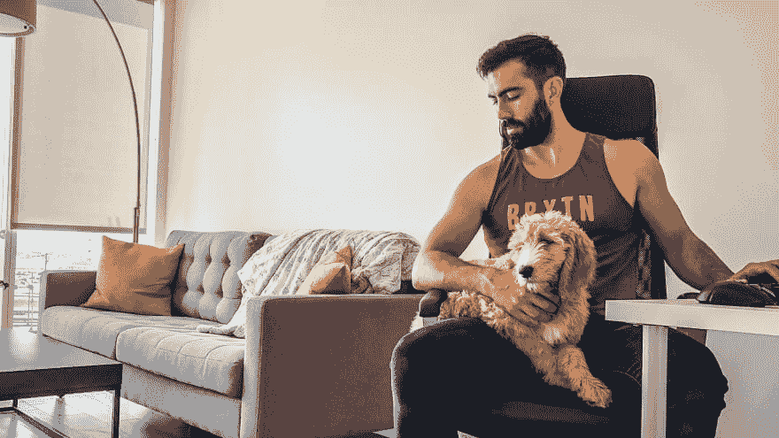

# 从睡在硅谷的车里到拥有一家开发机构

> 原文:[https://dev . to/Pete codes/from-sleeping-in-a-car-in-silicon-valley-to-owning-a-development-agency-1 ggf](https://dev.to/petecodes/from-sleeping-in-a-car-in-silicon-valley-to-owning-a-development-agency-1ggf)

[T2】](https://res.cloudinary.com/practicaldev/image/fetch/s--TFyM6sYV--/c_limit%2Cf_auto%2Cfl_progressive%2Cq_auto%2Cw_880/https://www.nocsdegree.com/conteimg/2019/09/IMG_2326-2.jpg)

迈克尔·奥布里想离开伊利诺伊州的家乡，去硅谷工作。于是，他开车穿越全国，到达帕洛阿尔托，口袋里装着 300 美元，在接自由职业者的工作时，他睡在自己的车里。我和他聊了聊他给新手程序员的建议，走出小镇，成为一名成功的开发人员。

## 迈克尔，非常感谢你接受采访。你能给我们介绍一下你自己吗？

我叫[迈克尔·奥布里](https://www.twitter.com/michaelaubry)，今年 28 岁，我和我的女朋友以及两只新出生的小狗住在圣地亚哥。我一直着迷于社交媒体、设计和讲故事。这就是为什么我正在开发[故事创建器](https://storycreatorapp.com/)——一个帮助内容创建者制作精美内容的工具。

为了保持资金流动，我在做自由职业。我目前正与一对夫妇合作，他们分享生酮饮食的食谱。我的目标是留住他们，让他们成为我的客户，这样我就可以维护我们开发的 web 应用程序，在他们上市之前一直支持他们，然后与他们合作，达到 50，000 美元以上的 MRR。

## 你最初为什么会涉足编程，是如何学习的？

事实上，在我发现你可以在 torrent 网站上获得免费的 xbox 游戏后，我就开始编写代码了。在我成长的中西部小镇，没有太多的企业家支持，我根本不可能去快餐店工作。另外，我不想给我的单身母亲增加负担，让她不得不付出自己辛苦赚来的钱。这意味着我很难每隔几个月就跟上新发布的视频游戏。所以我和几个精通技术的朋友做了研究，发现了互联网的狂野西部。

当时我不知道我想要什么，但我知道我喜欢做东西，我知道这是一个获得成功的机会。我被极大地驱使，决定使用 torrents 来尽可能多地学习。

这是我偶然发现 google adsense 的时候。我开始使用 dreamweaver 来构建我的第一个站点。我还利用了关于如何编写 HTML 和 CSS 的教程。我记得建造 LifesGreatQuotes.com。建成后有一个热潮，我不得不告诉每个人。我的一个朋友住在一英里外的路上，我在他的电脑上给他演示，他可以打开浏览器，调出我建的网站。

最实际的获得现金的方法是找到其他想要网站的人。这似乎比通过广告获得大量流量和赚钱更直接。所以我遇到了勇士论坛，这是一个非常棒的营销网站。我想我会忘记营销，只是帮助营销人员建立网站。我要价很低，当时一个网站大约 800 美元。我要做的是获取主题并修改它们。

最有价值的老师为我所在的篮球联盟开发了一个应用程序。我花了很多时间在各种课程之外学习新东西。我真的很想离开伊利诺伊州的小杰克逊维尔，去一个反馈循环与我想成为的人一致的地方。所以我打包好所有东西就走了。

## [没有 CS OK——没有学位的开发者的工作板](https://nocsok.com)

[T2】](https://res.cloudinary.com/practicaldev/image/fetch/s--ys8h0zPS--/c_limit%2Cf_auto%2Cfl_progressive%2Cq_auto%2Cw_880/https://www.nocsdegree.com/conteimg/2019/09/Screenshot-2019-09-20-at-17.11.41.png)

## 我读到你开车穿越美国，睡在你的车里，带着 300 美元到达了硅谷！

一切都是从我朋友的厨房开始的。他的名字也叫迈克尔。我说“迈克尔，如果我暂时无家可归会有多疯狂。你认为有可能失去这一切，重建自己吗？我有一个理论，你不可能拥有任何东西，除非你愿意处于底层，一无所有。”他看着我，好像我疯了一样。我思考了一下这个问题。在厌倦了我的生活后，我需要采取行动。

我对硅谷做了一些研究，了解了其他人做了些什么。我看到了 Kurt Varner 关于 T2 商业内幕的文章。这启发了我，让我觉得这是完全可行的。经过一夜的费用计算和广告工作，我相信我会找到另一个自由客户。我已经把所有东西都装进了我的庞蒂亚克 Vibe 里，启动了手机上没有服务的 GPS，只有 WI-FI。然后我上路了，雪慢慢地从车上融化了。

现在，在我走向新生活的路上，经过密苏里州时，我记得我来到了离堪萨斯城不远的一个小镇。我在停车场找了个好地方，睡了几个小时。穿过内布拉斯加州后，9 个小时后我到达了怀俄明州。我一直致力于健身房，所以我找到了最近的基督教青年会，这是我一生中最酷的锻炼之一。每当我失去动力的时候，我就会想到锻炼。

在穿过炎热而又糟糕的内华达州之后，我记得我撞上了去加利福尼亚的线，感觉自己已经成功了。我记得看到阳光透过高大的红杉林，树木是如此的绿，车一直开到一座美丽的山下——我恋爱了。

## [给我买杯咖啡支持网站](https://www.buymeacoffee.com/nocsdegree)

## 你是如何在找工作的时候靠 300 美元生存下来的？

幸运的是，在我收到客户回复的前一天。所以我的第一个目标是找到一家星巴克，然后开始工作。拿到项目设置和一半货款后，我就放心了。我的账户上现在有大约 500-600 美元，足够支付食物、汽油和健身会员的费用。在我工作和熟悉帕洛阿尔托的过程中，我采用了一种临时的惯例，这样我就可以取得一些进展，让客户满意。例行公事就是在星巴克工作几个小时，然后在西夫韦吃一顿便宜的饭，然后找一个人流量少的安静地方停车睡觉。

拿到一点钱后，我可以去黑客道场了。事实上，我在那里遇到了我最好的朋友之一法拉兹·尼什塔尔。他看了我的一些作品，很喜欢。那时他很友好，当我在车里睡觉时，他提出让我在他圣何塞的住处过夜。

## 你是如何在硅谷获得第一份工作的？

我的第一份工作是在黑客道场认识了 [Xy Gaming](https://www.xygaming.com/) 的创始人之后。他似乎知道自己在做什么，我知道他的员工不多。所以就像俗话说的“闭上嘴巴是不会有饭吃的”，我必须张开嘴，开始一段对话，让事情进展下去。在看了我的工作(有一个作品集是非常重要的)之后，他对进入编码面试很感兴趣。我必须用 PHP 建立一个电子邮件客户端。这很难，但我做了很多 Youtubing，并能够把它放在一起。我在那里工作过一段时间，做一些很酷的东西。从那时起，我开始真正成长为一名工程师，并在那里有了一段真正的硅谷经历。很有趣！

[T2】](https://res.cloudinary.com/practicaldev/image/fetch/s--qFd6_gxG--/c_limit%2Cf_auto%2Cfl_progressive%2Cq_auto%2Cw_880/https://www.nocsdegree.com/conteimg/2019/08/Triplebyte_Logo_on_Black_1800x400.png)

## **想要一份开发人员的工作却没有学位？通过 [Triple Byte 的测验](https://triplebyte.com/a/Ww4mbM6/d)，直接进入顶级科技公司的最终现场面试**

## 当你第一次试图被雇用，而你没有计算机科学学位时，有哪些好的步骤可以采取？

要记住的最重要的事情是，钱来自消费者，消费者向公司付费，公司需要人们帮助解决其他人的问题。雇主有这样做的使命，并将与你一起完成这一使命。他们会关注你的自信，你的互动方式，最重要的是，你给他们的感觉。你必须能够直视他人的眼睛，并且有信念。所以为了达到这个目标，你只需要擅长你所做的。

专门寻找那些可能有你可以用工程解决的问题的人。然后，一旦你发现某人有一个你可以用软件解决的问题，那么就提供免费或者非常便宜的服务——如果你刚刚开始的话。花 2-6 个月的时间在上面。然后看着它完成，并把它添加到你的文件夹中。在那之后，回到狩猎中，和人们交谈。你必须认识人，为机会定位自己。

## 对想学编程的人有什么建议？

要有耐心，要有激情。这将是一个艰难的旅程，但如果你解决问题的愿望足够强烈，你足够痴迷，那么你会爱上它。另外，想想你喜欢做什么，确保你在做你喜欢的事情，确保即使没有动力，你也能看到你的工作完成。

从编程有助于解决问题的心态出发。编程在现代社会是必不可少的。所以如果你不知道一些基本的东西，你可能会落后。

如果你能找到一个导师，那将极大地加快你的学习速度。如果你不能使用像 [Stack Over Flow](https://stackoverflow.com/%20) 这样的资源，以及其他任何课程。最后，了解一下基础知识，我想这里是 Javascript。React 很酷，但是如果你非常了解 javascript，那就万事俱备了。

## 你能告诉我们关于 Story Creator 应用程序和你的计划吗？

Story Creator 旨在帮助内容创作者制作专业外观的内容，而无需学习 Photoshop 等。我第一次看到 Instagram 和脸书的力量是在我回旧金山开派对的时候。我可以出去见人，交换 Instagrams，这样我就可以让他们了解我的生活。每当我有一个活动，我通常会有一个好的结局，因为看故事的人知道他们会有一段美好的时光。我见过健身品牌因为一个镜头背后的小故事而被炒到 1000 万美元。

问题是，并不是每个人都对摄像机前的实时记录感到舒适。也不是每个人都可以创造美丽的内容。有的人就是有好的产品或者信息。我的目标是给他们一个建立信任的平台，让他们的东西更受欢迎。我想帮助他们专注于使他们的产品和服务更好，而不是担心创造内容。

一个月后，我想得到我的第一个付费用户。从那里我会努力得到 10 分。然后，在一年的时间里，我希望达到 1000 名付费用户，这将为公司带来 1 万至 2 万美元的 MRR。从那里我可以进一步改进产品，并开始向月球发射。