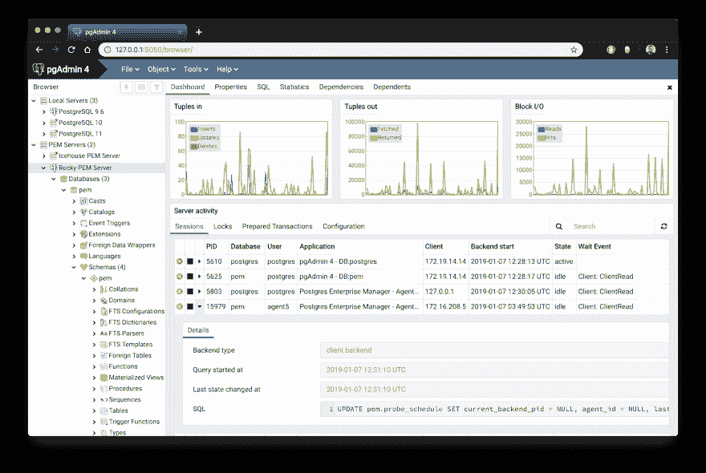
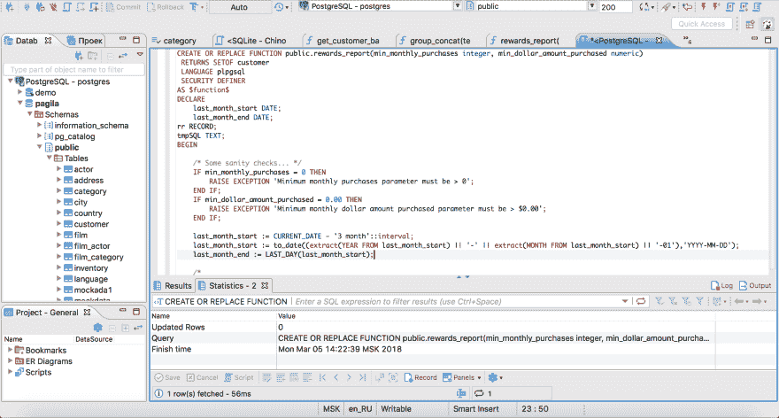
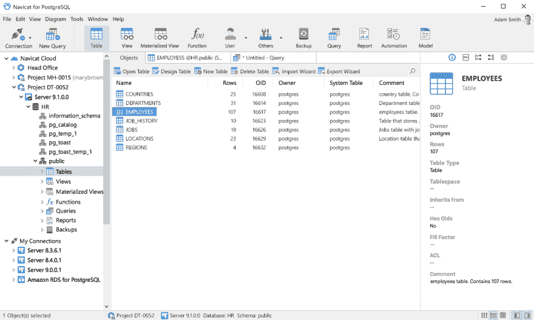
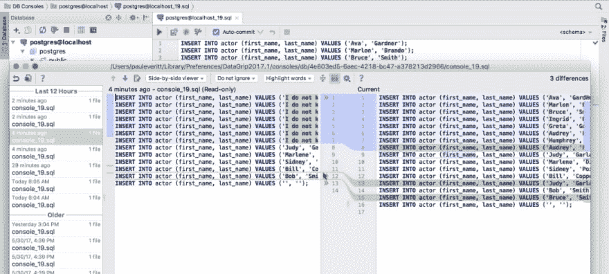
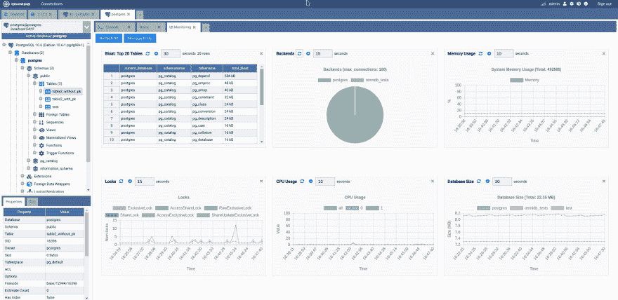

# 最好的 PostgreSQL GUI 是哪个？2019 年对比

> 原文:[https://dev . to/scale grid/哪个是最好的-PostgreSQL-GUI-2019-comparison-27lc](https://dev.to/scalegrid/which-is-the-best-postgresql-gui-2019-comparison-27lc)

[T2】](https://scalegrid.io/blog/which-is-the-best-postgresql-gui-2019-comparison/)

PostgreSQL 图形用户界面(GUI)工具帮助这些开源数据库用户管理、操作和可视化他们的数据。在本帖中，我们将讨论管理您的 [PostgreSQL 部署](https://scalegrid.io/postgresql.html)的五大 GUI 工具。PostgreSQL 是世界上第四大流行的数据库管理系统，广泛应用于从小型到大型的各种规模的应用程序中。使用数据库的传统方法是使用命令行界面(CLI)工具，然而，该界面带来了许多[问题](https://tableplus.com/blog/2018/08/cli-vs-gui-which-one-is-better.html):

*   充分利用数据库管理系统需要很长的学习时间。
*   控制台显示可能不是你喜欢的东西，它一次只能给出很少的信息。
*   很难通过控制台浏览数据库和表、检查索引以及监控数据库。

许多人仍然更喜欢 CLI 而不是 GUI，但是这一套已经越来越少了。我相信任何在 2010 年后开始编程的人都会告诉你 GUI 工具比 CLI 解决方案提高了他们的生产力。

## 为什么要使用 GUI 工具？

现在我们已经了解了用户使用 CLI 所面临的问题，让我们来看看使用 PostgreSQL GUI 的[优势:](https://www.computerhope.com/issues/ch000619.htm)

*   快捷键使新用户更容易使用和学习。
*   提供出色的可视化效果，帮助您解读数据。
*   您可以远程访问和导航另一个数据库服务器。
*   基于窗口的界面使管理 PostgreSQL 数据变得更加容易。
*   更轻松地访问文件、功能和操作系统。

因此，总而言之，GUI 工具使 PostgreSQL 开发人员的生活更加轻松。

## 热门 PostgreSQL GUI 工具

今天我将告诉你 5 个最好的 PostgreSQL GUI 工具。先说第一个，也是最流行的一个。

### 1.pgAdmin

[T2】](https://scalegrid.io/blog/wp-content/uploads/2019/09/Which-Is-The-Best-PostgreSQL-GUI-pgadmin-UI-ScaleGrid-Blog.png)

pgAdmin 是 PostgreSQL 事实上的 GUI 工具，也是第一个用于 PostgreSQL 的工具。它支持所有 PostgreSQL 操作和特性，同时是免费和开源的。新手和经验丰富的数据库管理员和开发人员都可以使用 pgAdmin 进行数据库管理。

以下是 PostgreSQL 用户喜欢 pgAdmin 的一些主要原因:

*   创建、查看和编辑所有通用 PostgreSQL 对象。
*   带有语法高亮显示的图形化查询规划工具。
*   仪表板允许您监视服务器活动，如数据库锁、连接的会话和准备好的事务。
*   因为 pgAdmin 是一个 web 应用程序，所以您可以在任何服务器上部署它并远程访问它。
*   pgAdmin UI 由可拆卸的面板组成，您可以根据自己的喜好进行排列。
*   过程语言调试器帮助您调试代码。
*   pgAdmin 有一个便携版本，使用它你可以很容易地在机器之间移动你的数据。

用户普遍抱怨 pgAdmin 有几个缺点:

*   与付费 GUI 工具相比，UI 速度慢且不直观。
*   pgAdmin 使用了太多资源。

pgAdmin 可以在 Windows、Linux 和 Mac OS 上使用。我们首先列出它，因为它是 PostgreSQL 中使用最多的 GUI 工具，也是我们列表中唯一的本地 PostgreSQL GUI 工具。因为它是专门为 PostgreSQL 开发的，所以您可以期待它会随着每个版本的最新特性而更新。pgAdmin 可以从他们的官方[网站](https://www.pgadmin.org/download/)下载。

#### pgAdmin Cost:免费(开源)

### 2.DBeaver

[T2】](https://scalegrid.io/blog/wp-content/uploads/2019/09/Which-Is-The-Best-PostgreSQL-GUI-DBeaver-UI-ScaleGrid-Blog.png)

DBeaver 是 PostgreSQL 的一个主要的跨平台 GUI 工具，深受开发人员和数据库管理员的喜爱。DBeaver 不是 PostgreSQL 的原生 GUI 工具，因为它支持所有流行的数据库，如 MySQL、 [MariaDB](https://severalnines.com/product/clustercontrol/mariadb-database-management-system) 、Sybase、SQLite、Oracle、SQL Server、DB2、MS Access、Firebird、Teradata 和 Derby。

以下是一些顶级的 DBeaver GUI 特性:

*   可视化查询生成器帮助您在没有实际 SQL 知识的情况下构建复杂的 SQL 查询。
*   它拥有最好的编辑器之一——多种数据视图可用于支持各种用户需求。
*   方便的数据导航。
*   在 DBeaver 中，您可以生成看起来像真实数据的假数据，以便测试您的系统。
*   对所有选择的表/视图进行全文数据搜索，搜索结果显示为筛选的表/视图。
*   数据库系统表中行之间的元数据搜索。
*   导入和导出多种文件格式的数据，如 CSV、HTML、XML、JSON、XLS、XLSX。
*   通过将密码存储在受主密码保护的安全存储中，为您的数据库提供高级安全性。
*   为数据库/模式自动生成的 ER 图。
*   企业版提供了一个特殊的在线支持系统。

与一些昂贵的 GUI 工具(如 Navicat 和 DataGrip)相比，DBeaver 的缺点之一是在处理大型数据集时可能会比较慢。

您可以在 Windows、Linux 和 macOS 上运行 DBeaver。它有一个免费的开源企业版。你可以花 149 美元[购买](https://dbeaver.com/buy/)企业版的标准许可证。对于大多数公司来说，免费版已经足够好了。尤其是大部分 DBeaver 用户都说它的免费版比 pgAdmin 好。

#### 免费社区，149 美元标准许可

### 3.Navicat

[T2】](https://scalegrid.io/blog/wp-content/uploads/2019/09/Which-Is-The-Best-PostgreSQL-GUI-Navicat-UI-ScaleGrid-Blog.png)

Navicat 是一个简单易用的图形工具，面向初学者和有经验的开发者。它支持多种数据库系统，如 MySQL、PostgreSQL 和 MongoDB。Navicat 的一个特别之处是它与云数据库的协作，如亚马逊 Redshift、亚马逊 RDS、亚马逊 Aurora、微软 Azure、谷歌云、腾讯云、阿里云和华为云。

Navicat 的重要特性:

*   它有一个非常直观和快速的用户界面。您可以使用其可视化 SQL builder 轻松创建和编辑 SQL 语句，强大的代码自动完成功能可以为您节省大量时间，并帮助您避免错误。
*   Navicat 有一个强大的数据建模工具，用于可视化数据库结构、进行更改以及从头开始设计整个模式。您可以通过图表直观地操作几乎任何数据库对象。
*   Navicat 可以运行计划的作业，并在作业完成后通过电子邮件通知您。
*   Navicat 能够同步不同的数据源和模式。
*   Navicat 有一个附加功能(Navicat 云)，提供基于项目的团队协作。
*   通过 SSH 隧道和 SSL 建立安全连接，确保每个连接都是安全、稳定和可靠的。
*   您可以从 Excel、Access、CSV 等多种格式导入数据或将数据导出到这些格式。

尽管有这些优点，但在购买 Navicat 之前，您需要考虑一些缺点:

*   许可证被锁定在一个平台上。你需要为 PostgreSQL 和 MySQL 购买不同的许可证。考虑到它沉重的价格，这对于小公司或者自由职业者来说有点困难。
*   它有许多功能，新手需要一些时间才能上手。

您可以在 Windows、Linux 和 Mac OS 环境中使用 Navicat。Navicat 的质量得到了全球客户的认可，包括苹果、甲骨文、谷歌、微软、脸书、迪士尼和 Adobe。Navicat 有三个版本，分别称为企业版、标准版和非商业版。企业版需要 239 美元，标准版需要 159 美元，而非商业版需要 89 美元。您可以在这里获得完整的价格详情[，并在这里](https://www2.navicat.com/en/store/navicat-for-postgresql)从[下载 14 天的 Navicat 试用版。](https://www.navicat.com/en/download/navicat-for-postgresql)

#### Navicat 成本:每个许可证 89 美元到 239 美元

### 4.数据夹点

[T2】](https://scalegrid.io/blog/wp-content/uploads/2019/09/Which-Is-The-Best-PostgreSQL-GUI-Datagrip-UI-ScaleGrid-Blog.png)

[DataGrip](http://jetbrains.com/datagrip/) 是一个跨平台的集成开发环境(IDE)，支持多种数据库环境。最重要的是 DataGrip 是由 JetBrains 开发的，JetBrains 是开发 ide 的领先品牌之一。如果你曾经使用过 PhpStorm，IntelliJ IDEA，PyCharm，WebStorm，你永远不需要关于 JetBrains IDEs 有多好的介绍。

您喜欢 DataGrip 的原因有很多令人兴奋的特性:

*   上下文敏感和模式感知的自动完成特性建议更相关的代码完成。
*   它有一个漂亮的可定制的用户界面，以及一个智能查询控制台，可以跟踪你的所有活动，所以你不会丢失你的作品。此外，您可以使用其强大的编辑器轻松地添加、删除、编辑和克隆数据行。
*   许多在表、视图和过程之间导航的方法。
*   它可以立即检测到代码中的错误，并建议修复它们的最佳选项。
*   它有一个高级的重构过程——当你重命名一个变量或对象时，它可以自动解析所有的引用。
*   DataGrip 并不是 PostgreSQL 的 GUI 工具，而是一个全功能的 IDE，具有版本控制系统之类的特性。

DataGrip 有一些缺点:

*   显而易见的问题是，它不是 PostgreSQL 自带的，所以它缺少 PostgreSQL 特有的特性。例如，调试错误并不容易，因为并不是所有的错误都能显示出来。
*   不仅仅是 DataGrip，大多数 JetBrains IDE 都有一个很大的学习曲线，这让初学者有些不知所措。
*   它会消耗大量系统资源，比如 RAM。

DataGrip 支持大量的数据库管理系统，包括 SQL Server、MySQL、Oracle、SQLite、Azure Database、DB2、H2、MariaDB、Cassandra、HyperSQL、Apache Derby 等等。

DataGrip 支持所有三种主要的操作系统，Windows、Linux 和 Mac OS。缺点之一是 JetBrains 的产品相对昂贵。DataGrip 对组织和个人有两种不同的价格。 [DataGrip for Organizations](https://www.jetbrains.com/datagrip/buy/#commercial?billing=yearly) 第一年的费用为 199 美元，第二年为 159 美元，第三年以后为 119 美元。[个人套餐](https://www.jetbrains.com/datagrip/buy/#personal?billing=yearly)第一年的费用为 89 美元。你可以在免费的 30 天[试用期](https://www.jetbrains.com/datagrip/download)里测试一下。

#### [DataGrip 成本](https://www.jetbrains.com/datagrip/buy/#commercial?billing=yearly):每年 89 到 199 美元

### 5.OmniDB

[T2】](https://scalegrid.io/blog/wp-content/uploads/2019/09/Which-Is-The-Best-PostgreSQL-GUI-OmniDB-UI-ScaleGrid-Blog.png)

我们列表的最后一项是 OmniDB。OmniDB 允许您在一个统一的工作空间中添加、编辑和管理数据以及所有其他必要的特性。尽管 OmniDB 支持其他数据库系统，如 MySQL、Oracle 和 MariaDB，但它们的主要目标是 PostgreSQL。这个开源工具主要由 2ndQuadrant 赞助。OmniDB 支持所有三大平台，即 Windows、Linux 和 Mac OS X。

在 Postgres 开发中使用 OmniDB 有很多原因:

*   您可以通过添加和删除连接来轻松配置它。
*   智能 SQL 编辑器通过自动完成和语法突出显示功能帮助您编写 SQL 代码。
*   PostgreSQL 函数和过程的完整调试功能。
*   您可以从显示数据库实时信息的自定义图表中监视仪表板。
*   查询计划可视化有助于您找到 SQL 查询中的瓶颈。
*   它允许你从多台电脑上访问加密的个人信息。
*   开发者可以通过插件添加和分享新功能。

OmniDB 有几个缺点:

*   与 pgAdmin 和 DBeaver 相比，OmniDB 缺乏社区支持。所以，你可能会发现学习这个工具很难，并且当你面对一个问题时会感到有点孤独。
*   它没有 Navicat 和 DataGrip 等付费 GUI 工具那么多功能。

无论如何，它的用户对它有好感。你可以从[这里](https://omnidb.org/en/downloads-en)下载 OmniDB。

#### OmniDB 成本:免费(开源)

## 结论

让我们总结一下我们的顶级 PostgreSQL GUI 比较。几乎每个人都用 pgAdmin 启动 PostgreSQL。它有很大的社区支持，如果你遇到问题，有很多资源可以帮助你。通常，pgAdmin 在很大程度上满足了许多开发人员的需求，因此，大多数开发人员不会寻找其他 GUI 工具。这就是为什么 pgAdmin 仍然是最受欢迎的 GUI 工具。

如果您正在寻找具有更好的 UI 和可视化编辑器的开源解决方案，那么 DBeaver 和 OmniDB 是非常适合您的解决方案。如果您正在寻找比开源工具所提供的更多的功能，并且您准备为此支付一个好价钱，那么 Navicat 和 DataGrip 是市场上最好的 GUI 产品。

虽然我相信这些工具中的一个肯定会支持您的需求，但您可能会喜欢其他流行的 PostgreSQL GUI 工具，包括 [Valentina Studio](https://www.valentina-db.com/en/) 、 [Adminer](https://www.adminer.org/) 、 [DB visualizer](https://www.dbvis.com/) 和 [SQL workbench](https://www.sql-workbench.eu/) 。我希望这篇文章能帮助您决定哪种 GUI 工具适合您的需要。