# 在 Angular 中重置 Firebase 身份验证密码(基于电子邮件的帐户)

> 原文：<https://dev.to/mainawycliffe/resetting-firebase-auth-passwords-in-angular-email-based-accounts-5b38>

在这篇文章中，我们将讨论以下内容:

1.  在 Firebase Auth 中，我们将定制:

    *   密码重置电子邮件内容/消息
    *   添加供电子邮件地址使用的自定义域
    *   和密码重置/电子邮件验证 URL
2.  角度单位:

    *   发送密码重置请求电子邮件
    *   确认密码重置代码并设置新密码
    *   确认电子邮件地址

## 先决条件

1.  [一个 Firebase 项目](https://codinglatte.com/how-to/how-to-create-a-firebase-project/)–如何创建一个新的 Firebase 项目。
2.  [创建新的 Angular App](https://codinglatte.com/posts/how-to/how-to-set-up-angular-for-beginners/)–如何安装和创建新的 Angular App。
3.  [安装和设置@ angular/fire(Angular fire 2)](https://codinglatte.com/posts/how-to/how-to-setup-firebase-for-angular/)–如何在 Angular 中安装和设置 Firebase。

## Firebase Auth

### 启用邮件/密码验证

首先，我们将启用电子邮件密码认证。

*   在您的 Firebase 项目主页中，转到“开发”菜单项下的侧面导航中的“身份验证”。然后，选择`sign-in method`选项卡。
    [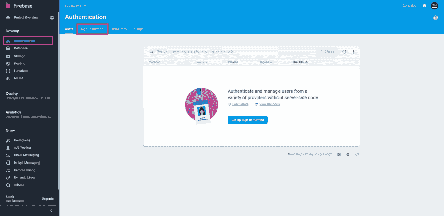](https://res.cloudinary.com/practicaldev/image/fetch/s--Y_KpITAV--/c_limit%2Cf_auto%2Cfl_progressive%2Cq_auto%2Cw_880/https://thepracticaldev.s3.amazonaws.com/i/wfvt5kuh154bh5dpxj8z.jpg)

*   然后，在登录提供者下的`Email/Password`提供者下，悬停以显示编辑图标。
    [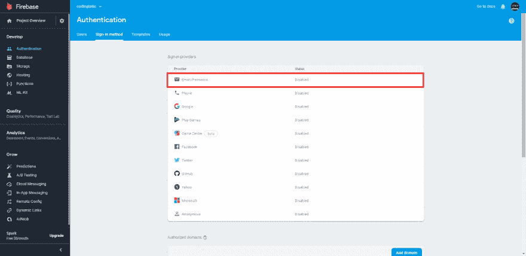](https://res.cloudinary.com/practicaldev/image/fetch/s--6L_5I4m0--/c_limit%2Cf_auto%2Cfl_progressive%2Cq_auto%2Cw_880/https://thepracticaldev.s3.amazonaws.com/i/dayd7wk5995r6ivg7npc.jpg)

*   最后，单击 toggle enable switch 并保存更改。
    [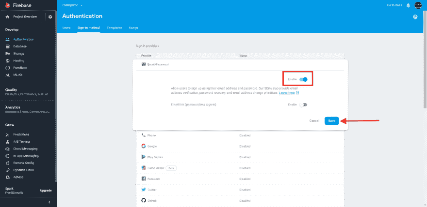T3】](https://res.cloudinary.com/practicaldev/image/fetch/s--i3qAAz7O--/c_limit%2Cf_auto%2Cfl_progressive%2Cq_auto%2Cw_880/https://thepracticaldev.s3.amazonaws.com/i/ugncp6smfjipz89bsk68.jpg)

### 自定义邮箱地址域

接下来，让我们定制 Firebase 用来向我们的用户发送密码重置请求和用户电子邮件验证请求的电子邮件域。

*   在认证下，选择`Templates`标签。
    [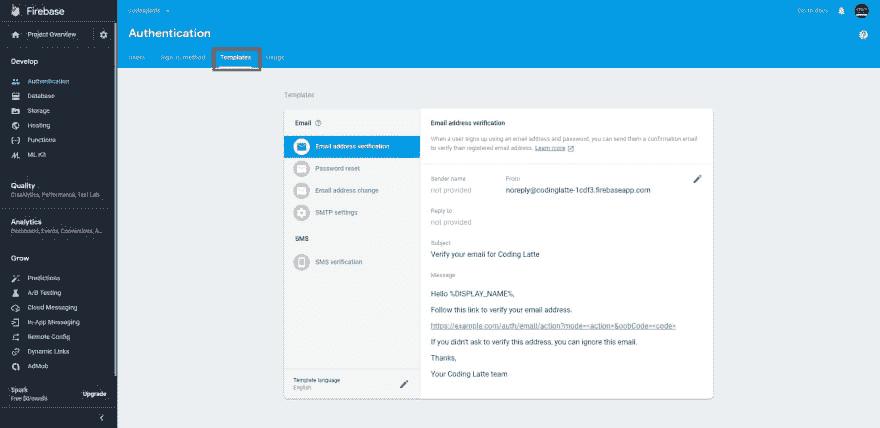](https://res.cloudinary.com/practicaldev/image/fetch/s--OaUjBLAu--/c_limit%2Cf_auto%2Cfl_progressive%2Cq_auto%2Cw_880/https://thepracticaldev.s3.amazonaws.com/i/9hh80tb78xzsn3nmmpxy.jpg)

*   然后，在`Email address Verification`下，点击`from`电子邮件地址旁边的编辑图标。
    T3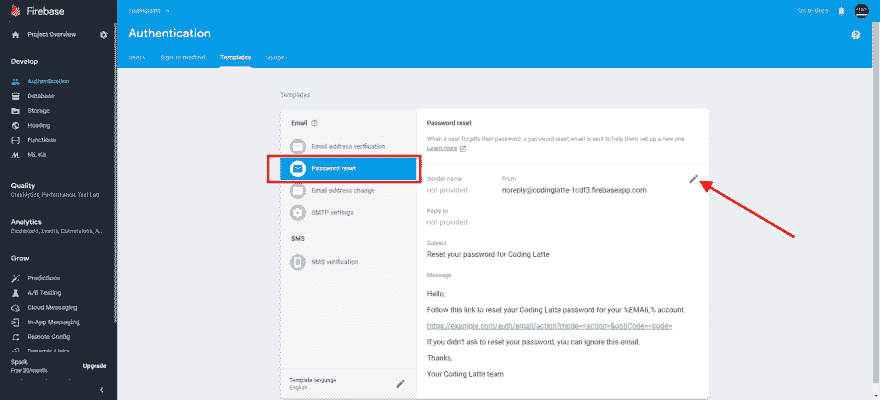T5】

*   然后，点击`customize domain`链接。
    [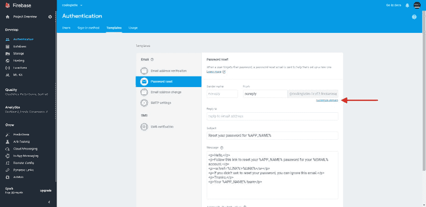](https://res.cloudinary.com/practicaldev/image/fetch/s--M0ZFyjzE--/c_limit%2Cf_auto%2Cfl_progressive%2Cq_auto%2Cw_880/https://thepracticaldev.s3.amazonaws.com/i/wzkrwtyvm8gaqjgu467p.jpg)

*   之后，将提示您输入域名，输入名称并单击下一步。
    [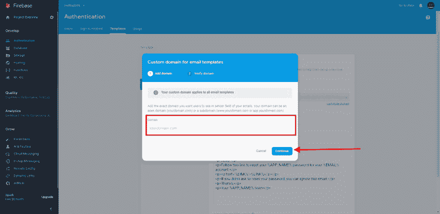T3】](https://res.cloudinary.com/practicaldev/image/fetch/s--9xvfNUDY--/c_limit%2Cf_auto%2Cfl_progressive%2Cq_auto%2Cw_880/https://thepracticaldev.s3.amazonaws.com/i/phge68b87fcepi7qkgkz.jpg)

*   在这里，您将被提示验证您的域名。这是通过将 firebase 在验证窗口上提供的 DNS 记录添加到您的域 DNS 记录中来完成的。这个过程因不同的域名注册商而异，但也很简单。

*   添加 DNS 记录后，单击“验证”按钮。这可能需要时间来验证记录——在极少数情况下长达 48 小时——所以不要惊慌。一旦验证完成，Firebase auth 发送的所有电子邮件都将使用您的域名。
    [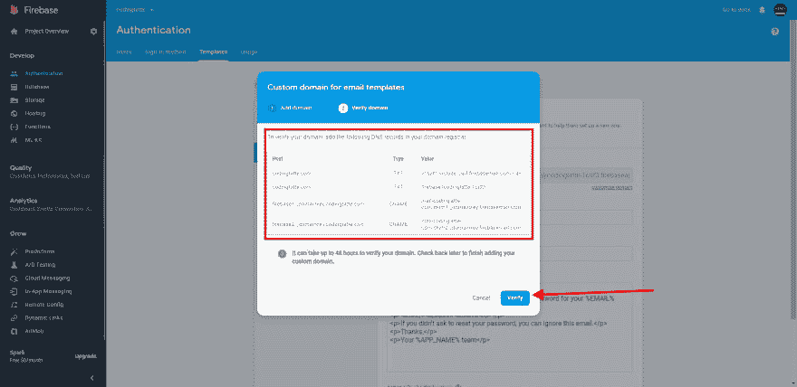T3】](https://res.cloudinary.com/practicaldev/image/fetch/s--jSa9Pelq--/c_limit%2Cf_auto%2Cfl_progressive%2Cq_auto%2Cw_880/https://thepracticaldev.s3.amazonaws.com/i/k5duypgpw2v9snccrds0.jpg)

### 自定义密码重置操作 URL

接下来，让我们自定义密码重置 URL。默认情况下，Firebase 提供了一个预置的 URL，带有一个处理密码重置的通用 UI。我们将更改这一点，以便我们可以将它指向我们的 angular 应用程序，该应用程序将处理新密码的确认和设置。这将在 Firebase 身份验证中的`Templates`选项卡下进行配置。

*   在侧边栏上，选择`Password Reset`并滚动到底部。
    [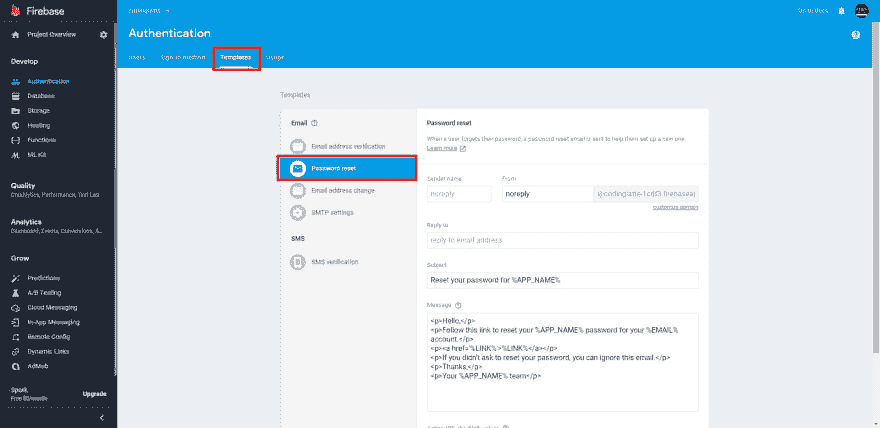](https://res.cloudinary.com/practicaldev/image/fetch/s--YCzeX5oK--/c_limit%2Cf_auto%2Cfl_progressive%2Cq_auto%2Cw_880/https://thepracticaldev.s3.amazonaws.com/i/flihym1ohikqf1w83104.jpg)

*   点击位于操作 URL 文本字段下方、保存按钮正上方的`Customize Action URL`链接。
    [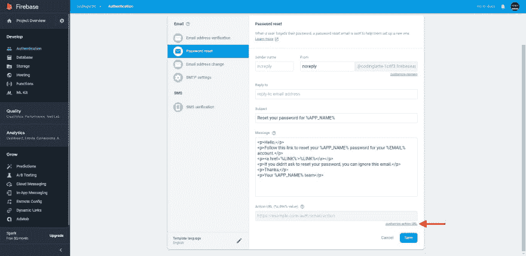](https://res.cloudinary.com/practicaldev/image/fetch/s--9ZuaSWwf--/c_limit%2Cf_auto%2Cfl_progressive%2Cq_auto%2Cw_880/https://thepracticaldev.s3.amazonaws.com/i/yv8ik4pn030kcyvs7ylv.jpg)

*   将弹出一个名为操作 URL 的模式窗口，提示您输入自定义操作 URL。输入您选择的自定义操作 URL 类似于`http://localhost:4200/auth/email/action`并保存。
    [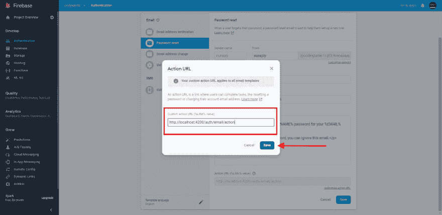](https://res.cloudinary.com/practicaldev/image/fetch/s--tXFlpj7h--/c_limit%2Cf_auto%2Cfl_progressive%2Cq_auto%2Cw_880/https://thepracticaldev.s3.amazonaws.com/i/0oelm8wzfqf0cpuymh6b.jpg)

> **注意:**请记住，密码重置、电子邮件地址更改和验证将共享同一个操作 URL。查询参数`mode`以及`oobCode`参数被附加到动作 URL。`mode`参数保存用户正在执行的动作类型，如密码重置等。

### 自定义密码重置消息

这不是完全必要的，但你可能想为你的应用程序用户定制一条消息。在上面的同一个页面中，您应该会看到消息字段，您可以使用 HTML 对其进行定制。使用以下占位符字符串将动态数据注入模板。

[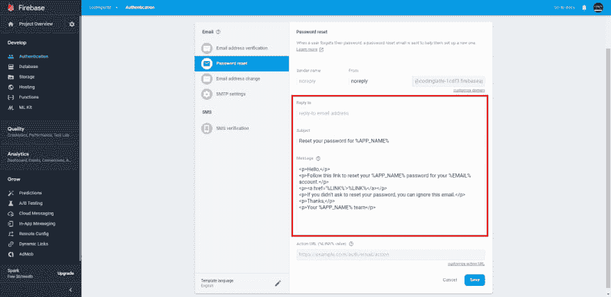](https://res.cloudinary.com/practicaldev/image/fetch/s--42kcdCLc--/c_limit%2Cf_auto%2Cfl_progressive%2Cq_auto%2Cw_880/https://thepracticaldev.s3.amazonaws.com/i/368srk7kdtbthrz27src.jpg)

*   %DISPLAY_NAME% -收件人的显示名称。

*   %APP_NAME% -你的应用的名称。您可以通过编辑“设置”页面上面向公众的名称字段来设置此值。

*   %LINK% -收件人完成帐户管理任务必须访问的 URL。请参阅自定义操作链接 URL。

*   %EMAIL% -收件人的电子邮件地址。

*   %NEW_EMAIL% -要设置为收件人主要地址的新电子邮件地址。*仅用于电子邮件地址变更模板*。

> **NB:** 你也可以在同一个页面定制邮件的主题。

## 角度应用

假设你已经创建了一个 Angular 应用程序并安装了`@angular/fire`——如果你还没有，检查上面的先决条件部分——让我们开始发送密码重置请求。

### 发送密码重置请求组件

该组件将收集用户的电子邮件地址，并请求 Firebase 发送一个密码请求，如果电子邮件存在。Firebase 认证服务器将确定电子邮件是否存在。

我们将从创建一个带有一个`FormControl`的反应式表单开始。首先，我们将把`FormBuilder`和`AngularFireAuth`服务注入我们的组件。

```
constructor(private afAuth: AngularFireAuth, private fb: FormBuilder) {} 
```

<svg width="20px" height="20px" viewBox="0 0 24 24" class="highlight-action crayons-icon highlight-action--fullscreen-on"><title>Enter fullscreen mode</title></svg> <svg width="20px" height="20px" viewBox="0 0 24 24" class="highlight-action crayons-icon highlight-action--fullscreen-off"><title>Exit fullscreen mode</title></svg>

然后，我们将声明类型为`FormGroup`的`frmResetPassword`属性，然后将其设置为`FormGroup`的一个新实例，其中有一个名为`email`的表单字段。表单控件将为必填和明显的电子邮件提供验证器。

```
frmPasswordReset: FormGroup = this.fb.group({
  email: [null, [Validators.required, Validators.email]]
}); 
```

<svg width="20px" height="20px" viewBox="0 0 24 24" class="highlight-action crayons-icon highlight-action--fullscreen-on"><title>Enter fullscreen mode</title></svg> <svg width="20px" height="20px" viewBox="0 0 24 24" class="highlight-action crayons-icon highlight-action--fullscreen-off"><title>Exit fullscreen mode</title></svg>

接下来，让我们添加一个从 submit 调用的方法，该方法将向 Firebase 发送一个请求，以便向所提供的电子邮件(如果存在的话)发送一个密码重置请求。

```
const email = this.frmPasswordReset.controls['email'].value;

this.afAuth.auth.sendPasswordResetEmail(email).then(
  () => {
    // success, show some message
  },
  err => {
    // handle errors
  }
); 
```

<svg width="20px" height="20px" viewBox="0 0 24 24" class="highlight-action crayons-icon highlight-action--fullscreen-on"><title>Enter fullscreen mode</title></svg> <svg width="20px" height="20px" viewBox="0 0 24 24" class="highlight-action crayons-icon highlight-action--fullscreen-off"><title>Exit fullscreen mode</title></svg>

当上述过程成功完成时，将向用户发送一个带有密码重置链接的电子邮件地址。

若要处理错误，请在返回的错误中检查代码属性。你可以在这里找到 Firebase Auth [的错误代码列表。我在这篇文章的底部附上了一个简单的 Firebase 错误解析器。](https://firebase.google.com/docs/reference/js/firebase.auth.Error)

最后，这是这个组件的模板:

```
<form [formGroup]="frmPasswordReset" (submit)="sendPasswordResetRequest()">
  <div class="field has-text-left">
    <label class="label">Email Address: </label>
    <div class="control has-icons-left">
     <input formControlName="email" class="input is-focused" type="email">
      <span class="icon is-small is-left">
        <fa-icon [icon]="faEnvelope"></fa-icon>
      </span>
    </div>

    <div class="has-text-danger">
      Email is required!
    </div>

    <div class="has-text-danger" >
      A valid email is required!
    </div>
  </div>

  <div class="field">
    <button [disabled]="frmPasswordReset.invalid" class="button is-block is-primary has-text-white is-fullwidth ">
      <fa-icon [icon]="faSigninIcon"></fa-icon>
      Send Request
    </button>
  </div>
</form> 
```

<svg width="20px" height="20px" viewBox="0 0 24 24" class="highlight-action crayons-icon highlight-action--fullscreen-on"><title>Enter fullscreen mode</title></svg> <svg width="20px" height="20px" viewBox="0 0 24 24" class="highlight-action crayons-icon highlight-action--fullscreen-off"><title>Exit fullscreen mode</title></svg>

### 确认电子邮件并为用户设置新密码

密码重置链接和电子邮件确认/验证链接是相同的，唯一的变化是`oobCode`和`mode`。该模式将确定用户是重置密码还是确认他们的电子邮件地址。可以是`resetPassword`也可以是`verifyEmail`。

这意味着，在我们的角度应用程序中，这两个动作将被重定向到相同的路径。因此，我们将需要 3 个组件-一个用于模式之间的切换，一个用于重置密码，另一个用于确认/验证电子邮件地址。

#### 在重设密码和验证邮件地址之间切换

让我们从用于在**重置密码**和**确认电子邮件地址**之间切换的组件开始。我们将从在组件中注入`ActivatedRoute`服务开始。

```
constructor(private activatedActivated: ActivatedRoute) {} 
```

<svg width="20px" height="20px" viewBox="0 0 24 24" class="highlight-action crayons-icon highlight-action--fullscreen-on"><title>Enter fullscreen mode</title></svg> <svg width="20px" height="20px" viewBox="0 0 24 24" class="highlight-action crayons-icon highlight-action--fullscreen-off"><title>Exit fullscreen mode</title></svg>

然后，让我们声明一个名为 mode 的属性，并将 URL 中查询参数`mode`的值赋给它。

```
mode = this.activatedActivated.snapshot.queryParams['mode']; 
```

<svg width="20px" height="20px" viewBox="0 0 24 24" class="highlight-action crayons-icon highlight-action--fullscreen-on"><title>Enter fullscreen mode</title></svg> <svg width="20px" height="20px" viewBox="0 0 24 24" class="highlight-action crayons-icon highlight-action--fullscreen-off"><title>Exit fullscreen mode</title></svg>

最后，在我们的模板中，我们可以使用 mode 属性的值来显示**重置密码组件**或**使用 [`ng-switch`](https://angular.io/api/common/NgSwitch) 验证电子邮件地址组件**。

```
<ng-container [ngSwitch]="action">
  <!-- password reset -->
  <ng-container *ngSwitchCase="'resetPassword'">
    <app-confirm-password-reset></app-confirm-password-reset>
  </ng-container>

  <!-- verify email address -->
  <ng-container *ngSwitchCase="'verifyEmail'">
    <app-confirm-email-address></app-confirm-email-address>
  </ng-container>

  <!-- default action -->
  <ng-container *ngSwitchDefault>
    <!—show an error message -->
  </ng-container>
</ng-container> 
```

<svg width="20px" height="20px" viewBox="0 0 24 24" class="highlight-action crayons-icon highlight-action--fullscreen-on"><title>Enter fullscreen mode</title></svg> <svg width="20px" height="20px" viewBox="0 0 24 24" class="highlight-action crayons-icon highlight-action--fullscreen-off"><title>Exit fullscreen mode</title></svg>

#### 确认密码重置码组件

在这个组件中，我们将做两件事，首先是请求用户提供输入新密码。然后我们将使用这个密码和`oobCode`来保存新密码。如果`oobCode`有效，则密码更新成功，否则失败。

我们将首先在组件中注入`FormBuilder`、`ActivatedRoute`、`Router`和 AngularFireAuth 服务。

```
constructor(private afAuth: AngularFireAuth, private fb: FormBuilder, private route: ActivatedRoute, private router: Router) {} 
```

<svg width="20px" height="20px" viewBox="0 0 24 24" class="highlight-action crayons-icon highlight-action--fullscreen-on"><title>Enter fullscreen mode</title></svg> <svg width="20px" height="20px" viewBox="0 0 24 24" class="highlight-action crayons-icon highlight-action--fullscreen-off"><title>Exit fullscreen mode</title></svg>

然后我们将声明一个名为`frmSetNewPassword`的`FormGroup`属性，带有新的和确认密码表单字段:

```
frmSetNewPassword = this.fb.group({
  password: [null, [Validators.required]],
  confirmPassword: [null, [Validators.required]]
}); 
```

<svg width="20px" height="20px" viewBox="0 0 24 24" class="highlight-action crayons-icon highlight-action--fullscreen-on"><title>Enter fullscreen mode</title></svg> <svg width="20px" height="20px" viewBox="0 0 24 24" class="highlight-action crayons-icon highlight-action--fullscreen-off"><title>Exit fullscreen mode</title></svg>

最后，在我们的提交方法中，我们将检查两个密码是否匹配:

```
const password = this.frmSetNewPassword.controls['password'].value;
const confirmPassword = this.frmSetNewPassword.controls['confirmPassword'].value;

if (password !== confirmPassword) {
  // react to error
  return;
} 
```

<svg width="20px" height="20px" viewBox="0 0 24 24" class="highlight-action crayons-icon highlight-action--fullscreen-on"><title>Enter fullscreen mode</title></svg> <svg width="20px" height="20px" viewBox="0 0 24 24" class="highlight-action crayons-icon highlight-action--fullscreen-off"><title>Exit fullscreen mode</title></svg>

然后使用`ActivateRoute`服务从 URL 获取`oobCode`。

```
const code = this.route.snapshot.queryParams['oobCode']; 
```

<svg width="20px" height="20px" viewBox="0 0 24 24" class="highlight-action crayons-icon highlight-action--fullscreen-on"><title>Enter fullscreen mode</title></svg> <svg width="20px" height="20px" viewBox="0 0 24 24" class="highlight-action crayons-icon highlight-action--fullscreen-off"><title>Exit fullscreen mode</title></svg>

然后最后发送调用`confirmPasswordReset`，传递代码和新密码来更新用户密码。

```
this.afAuth.auth
  .confirmPasswordReset(code, password)
  .then(() => this.router.navigate(['signin']))
  .catch(err => {
   const errorMessage = FirebaseErrors.Parse(err.code); // check this helper class at the bottom
  }); 
```

<svg width="20px" height="20px" viewBox="0 0 24 24" class="highlight-action crayons-icon highlight-action--fullscreen-on"><title>Enter fullscreen mode</title></svg> <svg width="20px" height="20px" viewBox="0 0 24 24" class="highlight-action crayons-icon highlight-action--fullscreen-off"><title>Exit fullscreen mode</title></svg>

如果成功，我们会将用户重定向到登录页面，在那里他们可以使用新密码登录，否则我们会显示错误。

下面是上面表格的模板:

```
<form [formGroup]="frmSetNewPassword" (ngSubmit)="setPassword()">
  <h3 class="title is-5 has-text-black">
    Set a new password
  </h3>
  <h4 class="subtitle is-6 has-text-grey">Please enter and confirm your new password</h4>
  <div class="field">
    <label class="label">Password: </label>
    <div class="control">
      <input class="input " type="password" name="password" formControlName="password">
    </div>
  </div>
  <div class="field">
    <label class="label">Confirm Password: </label>
    <div class="control">
      <input class="input " type="password" name="confirmPassword" formControlName="confirmPassword">
     <div class="has-text-danger" >
        Confirm password is required!
      </div>
    </div>
  </div>

  <div class="field">
    <div class="control">
      <button class="button is-fullwidth is-primary" type="submit" [disabled]="!frmSetNewPassword.valid">
        <span class="icon">
          <fa-icon [icon]="saveIcon"></fa-icon>
        </span>
        <span>Reset</span>
      </button>
    </div>
  </div>
</form> 
```

<svg width="20px" height="20px" viewBox="0 0 24 24" class="highlight-action crayons-icon highlight-action--fullscreen-on"><title>Enter fullscreen mode</title></svg> <svg width="20px" height="20px" viewBox="0 0 24 24" class="highlight-action crayons-icon highlight-action--fullscreen-off"><title>Exit fullscreen mode</title></svg>

#### 验证邮件地址

验证电子邮件地址超出了这篇文章的范围，所以我就不赘述了。下面是验证用户电子邮件地址的代码片段:

```
const code = this.activateRoute.snapshot.queryParams['oobCode'];

this.afAuth.auth
  .applyActionCode(code)
  .then(() => {
    // do something after successful verification
  })
  .catch(err => {
    // show error message
  }); 
```

<svg width="20px" height="20px" viewBox="0 0 24 24" class="highlight-action crayons-icon highlight-action--fullscreen-on"><title>Enter fullscreen mode</title></svg> <svg width="20px" height="20px" viewBox="0 0 24 24" class="highlight-action crayons-icon highlight-action--fullscreen-off"><title>Exit fullscreen mode</title></svg>

记住注入`AngularFireAuth`和`ActivatedRoute`服务:

```
constructor(private afAuth: AngularFireAuth, private activateRoute: ActivatedRoute) {} 
```

<svg width="20px" height="20px" viewBox="0 0 24 24" class="highlight-action crayons-icon highlight-action--fullscreen-on"><title>Enter fullscreen mode</title></svg> <svg width="20px" height="20px" viewBox="0 0 24 24" class="highlight-action crayons-icon highlight-action--fullscreen-off"><title>Exit fullscreen mode</title></svg>

> **NB:** 如果不需要任何用户动作，可以运行上面的代码`OnInit`，显示一个加载动画。

### 配置路由器

最后，剩下的就是配置我们的角度路由器:

```
const routes: Routes = [
  {
    path: 'auth',
    children: [
      {
        //... Auth Guards For UnAuthenticated Users Here
        children: [
         // ...
          {
            path: 'forgot-password',
            component: PasswordResetRequestComponent,
            data: { title: 'Forgot Password' }
          }
        ]
      },
      {
        path: 'email/action',
        component: EmailConfirmationComponent,
        data: { title: 'Confirm Email Address' }
      }
    ]
  }
]; 
```

<svg width="20px" height="20px" viewBox="0 0 24 24" class="highlight-action crayons-icon highlight-action--fullscreen-on"><title>Enter fullscreen mode</title></svg> <svg width="20px" height="20px" viewBox="0 0 24 24" class="highlight-action crayons-icon highlight-action--fullscreen-off"><title>Exit fullscreen mode</title></svg>

### Bonus - Firebase 验证错误解析器

下面是一个简单的助手方法，用于检查 Firebase Auth 返回的错误:

```
export class FirebaseErrors {
  static Parse(errorCode: string): string {

    let message: string;

    switch (errorCode) {
      case 'auth/wrong-password':
        message = 'Invalid login credentials.';
        break;
      case 'auth/network-request-failed':
        message = 'Please check your internet connection';
        break;
      case 'auth/too-many-requests':
        message =
          'We have detected too many requests from your device. Take a break please!';
        break;
      case 'auth/user-disabled':
        message =
          'Your account has been disabled or deleted. Please contact the system administrator.';
        break;
      case 'auth/requires-recent-login':
        message = 'Please login again and try again!';
        break;
      case 'auth/email-already-exists':
        message = 'Email address is already in use by an existing user.';
        break;
      case 'auth/user-not-found':
        message =
          'We could not find user account associated with the email address or phone number.';
        break;
      case 'auth/phone-number-already-exists':
        message = 'The phone number is already in use by an existing user.';
        break;
      case 'auth/invalid-phone-number':
        message = 'The phone number is not a valid phone number!';
        break;
      case 'auth/invalid-email ':
        message = 'The email address is not a valid email address!';
        break;
      case 'auth/cannot-delete-own-user-account':
        message = 'You cannot delete your own user account.';
        break;
       default:
        message = 'Oops! Something went wrong. Try again later.';
        break;
    }

    return message;
  }
} 
```

<svg width="20px" height="20px" viewBox="0 0 24 24" class="highlight-action crayons-icon highlight-action--fullscreen-on"><title>Enter fullscreen mode</title></svg> <svg width="20px" height="20px" viewBox="0 0 24 24" class="highlight-action crayons-icon highlight-action--fullscreen-off"><title>Exit fullscreen mode</title></svg>