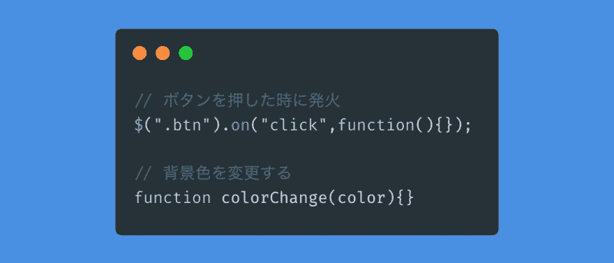
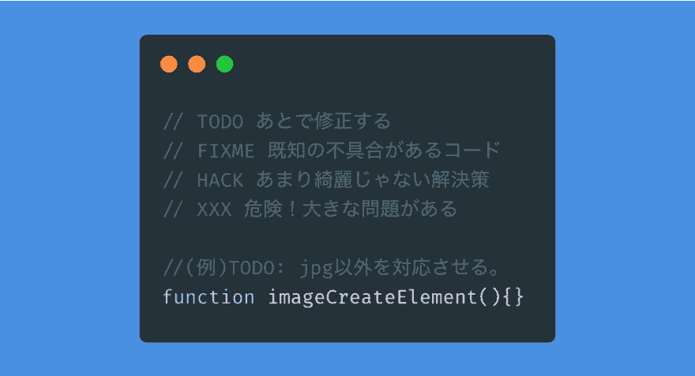
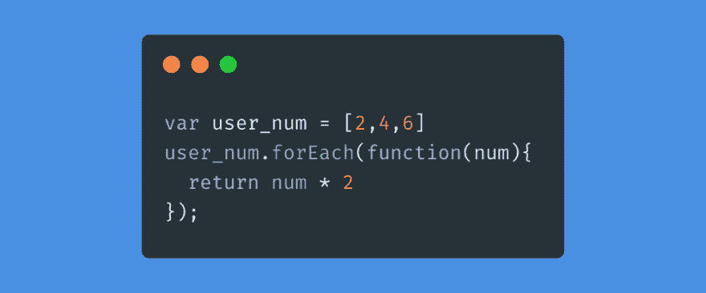

# 前台工程师可读取代码#3 注释的写法

> 原文:[https://dev.to/shibandd/3-571n](https://dev.to/shibandd/3-571n)

“前端工程师可读写代码”的结尾是注释的写法。 本文对所有编写代码的开发人员都有帮助。 评论具有多样性，对语言的理解因人而异，所以比写代码更难。

#### #3 注释的写法

“要写优秀的代码，就不要写不优秀的代码。 ’这就是可读取代码的想法。 在这篇文章中，比起应该写的评论，我更想关注**不该写的评论**。

不应该在注释中写可以从代码中提取。 如果是以学习为目的的话也许可以，但在开发现场没有必要吧。 另外，也不要发表补充代码的评论。

[T2】](https://res.cloudinary.com/practicaldev/image/fetch/s--bYlXIyBI--/c_limit%2Cf_auto%2Cfl_progressive%2Cq_auto%2Cw_880/https://thepracticaldev.s3.amazonaws.com/i/5u5eikdyp1eraumyqpqz.png)

如果需要写修正注释的话，请修改该代码。 虽然示例说明要更改背景颜色，但应该在函数名称后面加上( background 的) " bg "。

给常数加注释。 因为名字很明确，所以也有不需要评论的常数。 但是，可以加评论改善的常数很多。 决定常数值的背景和记录说明会更容易理解吧。

[T2】](https://res.cloudinary.com/practicaldev/image/fetch/s--WcsGYDNV--/c_limit%2Cf_auto%2Cfl_progressive%2Cq_auto%2Cw_880/https://thepracticaldev.s3.amazonaws.com/i/zdcsorp1dzw7orbunpzk.png)

你可能觉得这是自家人的评论，但其他开发者想要这样的背景易懂的评论。

虽然开发人员已经尽了最大努力，但有时代码会出现缺陷。 把缺陷留在评论里就好了吧。 参考书籍《[可读取代码——为了写出更好的代码的简单且实践的技巧](https://www.oreilly.co.jp/books/9784873115658/)》中，认为如下内容比较好。

[T2】](https://res.cloudinary.com/practicaldev/image/fetch/s--vmob3LGx--/c_limit%2Cf_auto%2Cfl_progressive%2Cq_auto%2Cw_880/https://thepracticaldev.s3.amazonaws.com/i/sqsprnw1orwtdd6dshbj.png)

在团队内决定符号。 通过在注释的开头进行记述，其他开发者可以马上判断应该修改哪里。

接下来，要站在读者的立场上思考。 其他开发者不像你那么熟悉。 但是，会无意识地写下以知道为前提的评论。

※不是一个好例子。
看到上述代码，其他开发者说:“咦，如果要一个个处理要素的话，map 不是也可以吗？ 你可能会想”。 但是，这个代码有背景。 使用 user_num 的值，对外部要素进行某种变化。 如果在不知道代码与其他处理联动的情况下进行更改，则会导致故障。 为了防止纠纷，请在评论中追加可能会陷入僵局的陷阱。

到目前为止的注释写法参考了书籍《[可读取代码——编写更好代码的简单实践技巧](https://www.oreilly.co.jp/books/9784873115658/)》的第 5 章“知道应该注释什么”。 第 6 章“注释准确简洁”在开发现场也很有用。 请一定要看看。 参考代码是面向前台工程师的，但注释对所有开发人员都有帮助。