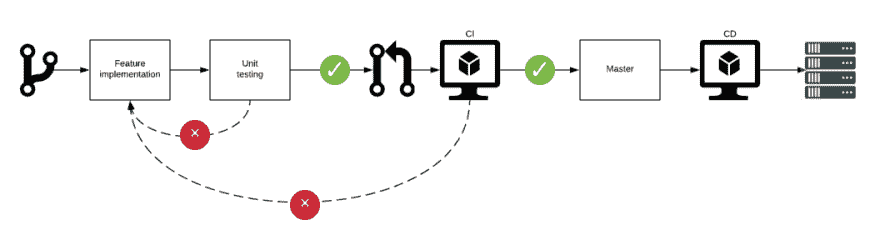
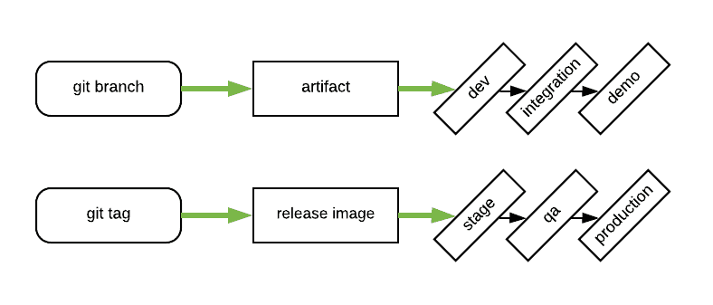

# 持续集成/持续交付

> 原文:[https://dev . to/luminous men/continuous-integration-continuous-delivery-1 k3](https://dev.to/luminousmen/continuous-integration-continuous-delivery-1ik3)

## 我们为什么需要它？

在工作过程中，开发人员经常需要更新他们的服务，并将它们部署在服务器上。当项目数量很小时，这不是问题，因为发布和部署很少，所以不存在问题。测试正在手动运行。但是当时间到来时，服务和任务的数量会增加，执行相同的任务会花费更多的时间。

让我们看看大多数项目的特性实现的典型过程:

*   从待办事项/团队领导处获取任务
*   从 git 创建一个新的分支
*   实现特性，单元测试来覆盖新的功能
*   运行测试
*   创建合并请求并等待代码审查
*   将分支合并到主控形状
*   构建应用程序
*   部署新版本

每个任务都要重复这个过程。

如果实现、调试和测试功能需要 10 天，而构建/部署需要 1 小时，这似乎是合理的，成本也不高。但是如果你有一百个小错误，每个都要花一分钟来修复，这似乎代价很高。

第一种方法是扩大合并请求，尽可能少地将它们合并到主分支中。第二种方法是配置 CI，使测试/构建/部署过程自动运行。我每天都做代码审查，这是我日常活动的一大部分，我可以说审查大的代码变更是非常不舒服的。所以今天我们就来说说第一种选择。

## CI/CD 定义

[T2】](https://res.cloudinary.com/practicaldev/image/fetch/s--VRRbnKk0--/c_limit%2Cf_auto%2Cfl_progressive%2Cq_auto%2Cw_880/https://thepracticaldev.s3.amazonaws.com/i/h4r1lq7staycb0oog4qh.png)

持续集成过程的技术目标是建立一种一致的、自动化的方法来构建、打包和测试应用程序。有了集成过程中的一致性，团队更有可能更频繁地提交代码变更，这导致了更好的协作和软件质量。

持续交付从 CI 结束的地方开始。CD 在选定的环境中自动部署应用程序。大多数团队正在与不同于生产的多个环境一起工作，例如开发和测试环境，CD 确保有一种自动的方式将代码变更推送给他们。它们包括在每个 sprint 结束时开发的功能性测试，并汇总成整个应用程序的回归测试。然后，这些回归测试会通知团队，代码更改是否未能通过一个或多个测试，这些测试是在有测试覆盖的应用程序的所有功能区域中开发的。

持续集成和持续交付需要持续测试，因为他们的目标是为用户提供高质量的应用程序和代码。连续测试通常被实现为在 CI/CD 管道中执行的一组自动回归、性能和其他测试。

CI/CD 的成熟实践提供了一个创建 CD 过程的选项，其中所有代码更改都经过 CI/CD 管道，并在构建后直接部署到所需的环境中。但是您需要理解 CI/CD 主要是为开发而创建的。当然，它从开发过程的创建开始:想要在他们的项目中实现 CI/CD 的团队通常从选择分支策略开始，从选择 feature branch 应该与 master 合并的时刻开始，选择如何构建和打包应用程序，等等。实践持续集成的开发团队使用不同的技术来控制哪些特性和代码可以投入生产。

CI 不仅打包所有的软件和数据库组件，而且自动化还将执行单元测试和其他测试。这种测试向开发人员提供了反馈，表明他们的代码更改没有破坏任何现有的单元测试。

[T2】](https://res.cloudinary.com/practicaldev/image/fetch/s--t3v06VPb--/c_limit%2Cf_auto%2Cfl_progressive%2Cq_auto%2Cw_880/https://thepracticaldev.s3.amazonaws.com/i/ers9wr5grjpvv5z7ebnr.png)

大多数 CI/CD 工具允许开发人员根据需求启动构建，由版本控制存储库中的代码提交或定义的时间表触发。团队需要讨论最适合团队规模的构建时间表、预期的每日提交数量以及其他应用程序考虑事项。确保快速提交和构建的最佳实践，否则，可能会减慢团队的进度。

## CI/CD 的主要思想

*   CI/CD 流程主要用于开发流程自动化；
*   最大限度地自动化流程，首先是最耗时的操作；
*   在每次提交的基础上构建——在这种情况下，很容易识别 bug/问题；
*   最小化构建时间——并行运行各种测试；
*   构建总是可再生的——构建是可交换的和关联的，如果代码不变，构建保持不变；
*   基础设施作为代码——所有构建过程都用任何 DSL 语言描述(例如，groovy 用于 Jenkins，yml 用于 Docker 文件),以匹配上一点，并且总是能够重新创建工件；
*   如果整个团队不在一起工作(作为一个团队)，那么开发人员、测试人员和 DevOps 工程师、CI/CD 就不可能在一个项目中协同工作。

## CI/CD 中的测试

自动测试框架帮助 QA 工程师定义、运行和自动化各种类型的测试，这可以帮助开发团队知道新的构建是否通过了测试。自动化测试包括功能测试，这些测试在每个 sprint 结束时开发，并聚合成整个应用程序的回归测试。然后，这些回归测试通知团队，新的代码变更是否破坏了在应用程序的所有功能区域中开发的一个或多个测试，其中有测试覆盖。

回归测试只是开始。性能测试、API 测试、[静态代码分析](https://luminousmen.com/post/python-static-analysis-tools)、安全测试和其他形式的测试也可以自动化。这个想法是能够通过命令行、webhook 或者在 web 服务中运行这些测试，并且它们用状态代码来响应。

一旦测试自动化，持续测试意味着自动化被集成到 CI/CD 管道中。一些单元和特性测试可以被集成到 CI 中，CI 在集成过程之前或期间设置标志。需要完整交付环境的测试，例如性能和安全测试，通常被集成到 CD 中，并在组件被交付到目标环境后执行。

## 有些怀疑

CI/CD 的支持者声称可以加速上市时间、更快的客户反馈、提高开发人员的生产力、降低技术风险、提高质量以及提高客户满意度。我对这些说法没有任何疑问。我质疑的是向 CI 和 CD 过渡的成本，改变公司软件开发文化的困难，以及始终保持一个可发布产品的实际困难。如果您对所有这些都很现实，并且很好地规划了补救策略，那么您可以从持续集成和交付中受益。

## 用于 CI/CD 的工具

Jenkins/Hudson，GitLab CI，TeamCity，Circle CI，Bamboo，Microsoft Team Foundation Build，GoCD，AppVeyor，Codeship，Drone

BitBucket Pipelines、Heroku CI、Travis CI、Codeship、Buddy CI、AWS CodeBuild

## 结论

1.  CI 需要创建一种一致的自动化方法来创建、打包和测试应用程序
2.  CD 在选定的环境中自动化应用程序部署
3.  回归测试是 CI 测试的基础，但是，除此之外，您还可以自动化性能测试、API 测试、静态代码分析、安全测试等
4.  市场上有很多工具可以创建您自己的 CI/CD 管道。

* * *

**感谢您的阅读！**

有什么问题吗？请在下面留下您的评论，开始精彩的讨论！

查看我的博客或来打个招呼👋在[推特](https://twitter.com/luminousmen)或订阅[我的电报频道](https://t.me/iamluminousmen)。
做好你的计划！