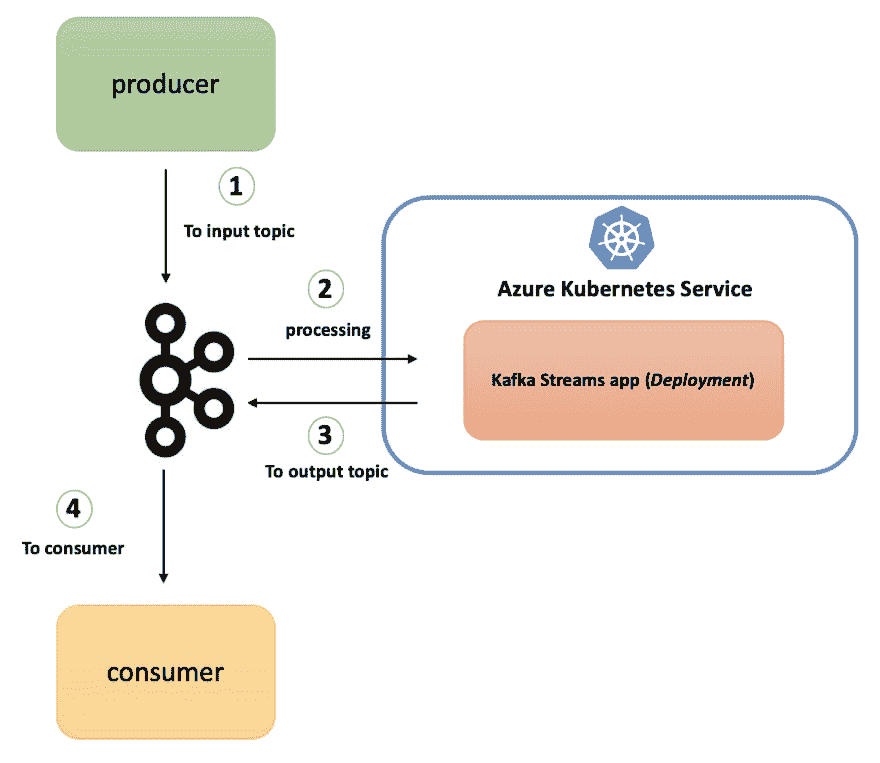
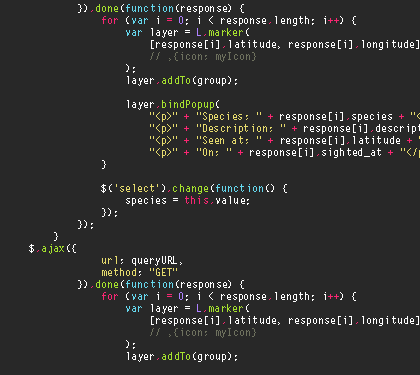
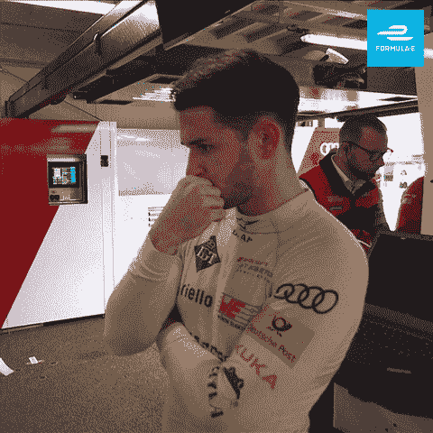

# 如何开发用于数据处理的 Kafka Streams 应用程序并将其部署到 Kubernetes

> 原文:[https://dev . to/azure/learn-how-to-develop-a-Kafka-streams-application-for-data-processing-and-deploy-it-to-kubernetes-25li](https://dev.to/azure/learn-how-to-develop-a-kafka-streams-application-for-data-processing-and-deploy-it-to-kubernetes-25li)

本教程将指导您如何使用 [Kafka Streams](https://kafka.apache.org/documentation/streams/) 库构建一个无状态流处理应用程序，并在 Azure (AKS) 上的 [Kubernetes 集群中运行它。](https://docs.microsoft.com/azure/aks/?WT.mc_id=devto-blog-abhishgu)

当您完成此操作时，您将了解以下内容:

*   什么是卡夫卡溪流？
*   如何在 Azure 上设置和配置 Docker 容器注册中心和 Kubernetes 集群
*   使用 Kafka 流的流处理逻辑的 Java 代码中发生了什么
*   如何在 Kubernetes 上构建和部署我们的应用程序，并最终使用 Kafka CLI 进行测试

源代码是 GitHub 上的

> 在这篇博客的末尾有一个所有 CLI 命令的列表

在我们开始之前，这里有一个最终状态的快照。

[T2】](https://res.cloudinary.com/practicaldev/image/fetch/s--Mr_Ot6hm--/c_limit%2Cf_auto%2Cfl_progressive%2Cq_auto%2Cw_880/https://thepracticaldev.s3.amazonaws.com/i/d64mmoyzzooc0ofp74kb.png)

### [](#overview-of-kafka-streams)卡夫卡溪流概述

它是一个简单的轻量级客户端库，可以很容易地嵌入到任何 Java app 或微服务中，其中输入和输出数据存储在 [Kafka clusters](https://kafka.apache.org/) 中。除了 Kafka 本身和它的分区模型之外，它对其他系统没有外部依赖性，可以水平扩展处理，同时保持强大的排序保证。它支持容错本地状态，采用一次一条记录处理来实现毫秒级处理延迟，并提供必要的流处理原语，以及一个[高级流 DSL](https://kafka.apache.org/23/documentation/streams/developer-guide/dsl-api.html) 和一个[低级处理器 API](https://kafka.apache.org/23/documentation/streams/developer-guide/processor-api.html) 。“状态存储”和“交互式查询”的组合允许您从应用程序外部利用应用程序的状态。

### [](#prerequistes)前置要求:

如果你还没有，请[安装 Azure CLI](https://docs.microsoft.com/cli/azure/install-azure-cli?view=azure-cli-latest&WT.mc_id=devto-blog-abhishgu) 和 [kubectl](https://kubernetes.io/docs/tasks/tools/install-kubectl/) 。流处理应用程序是用 Java 编写的，使用 [Maven](https://maven.apache.org/install.html) ，你还需要 [Docker](https://docs.docker.com/install/) 来构建应用程序容器映像。

> 本教程假设您有一个 Kafka 集群，可以从 Azure 上的 Kubernetes 集群访问它

### [](#aks-cluster-setup)AKS 集群设置

你只需要一个命令就可以在 Azure 上建立一个 Kubernetes 集群。但是，在此之前，我们必须创建一个资源组

```
export AZURE_SUBSCRIPTION_ID=[to be filled]
export AZURE_RESOURCE_GROUP=[to be filled]
export AZURE_REGION=[to be filled] (e.g. southeastasia) 
```

<svg width="20px" height="20px" viewBox="0 0 24 24" class="highlight-action crayons-icon highlight-action--fullscreen-on"><title>Enter fullscreen mode</title></svg> <svg width="20px" height="20px" viewBox="0 0 24 24" class="highlight-action crayons-icon highlight-action--fullscreen-off"><title>Exit fullscreen mode</title></svg>

切换到您的套餐并调用`az group create`

```
az account set -s $AZURE_SUBSCRIPTION_ID
az group create -l $AZURE_REGION -n $AZURE_RESOURCE_GROUP 
```

<svg width="20px" height="20px" viewBox="0 0 24 24" class="highlight-action crayons-icon highlight-action--fullscreen-on"><title>Enter fullscreen mode</title></svg> <svg width="20px" height="20px" viewBox="0 0 24 24" class="highlight-action crayons-icon highlight-action--fullscreen-off"><title>Exit fullscreen mode</title></svg>

您现在可以调用`az aks create`来创建新的集群

> 为了简单起见，下面的命令创建了一个单节点集群。请根据您的要求随意更改规格

```
export AKS_CLUSTER_NAME=[to be filled]

az aks create --resource-group $AZURE_RESOURCE_GROUP --name $AKS_CLUSTER_NAME --node-count 1 --node-vm-size Standard_B2s --node-osdisk-size 30 --generate-ssh-keys 
```

<svg width="20px" height="20px" viewBox="0 0 24 24" class="highlight-action crayons-icon highlight-action--fullscreen-on"><title>Enter fullscreen mode</title></svg> <svg width="20px" height="20px" viewBox="0 0 24 24" class="highlight-action crayons-icon highlight-action--fullscreen-off"><title>Exit fullscreen mode</title></svg>

使用`az aks get-credentials`获取 AKS 集群凭证——因此，`kubectl`现在将指向您的新集群。你可以证实这一点

```
az aks get-credentials --resource-group $AZURE_RESOURCE_GROUP --name $AKS_CLUSTER_NAME
kubectl get nodes 
```

<svg width="20px" height="20px" viewBox="0 0 24 24" class="highlight-action crayons-icon highlight-action--fullscreen-on"><title>Enter fullscreen mode</title></svg> <svg width="20px" height="20px" viewBox="0 0 24 24" class="highlight-action crayons-icon highlight-action--fullscreen-off"><title>Exit fullscreen mode</title></svg>

> 如果你对使用 [Azure](https://azure.microsoft.com/services/kubernetes-service/?WT.mc_id=devto-blog-abhishgu) 学习 Kubernetes 和 Containers 感兴趣，只需[创建一个**免费**账户](https://azure.microsoft.com/en-us/free/?WT.mc_id=devto-blog-abhishgu)就可以开始了！一个好的起点是使用文档中的[快速入门、教程和代码示例](https://docs.microsoft.com/azure/aks/?WT.mc_id=devto-blog-abhishgu)来熟悉这项服务。我也强烈推荐查看 [50 天 Kubernetes 学习路径](https://azure.microsoft.com/resources/kubernetes-learning-path/?WT.mc_id=devto-blog-abhishgu)。高级用户可能希望参考 [Kubernetes 最佳实践](https://docs.microsoft.com/azure/aks/best-practices?WT.mc_id=devto-blog-abhishgu)或观看一些[视频](https://azure.microsoft.com/resources/videos/index/?services=kubernetes-service&WT.mc_id=devto-blog-abhishgu)以了解演示、主要功能和技术会议。

### [](#setup-azure-container-registry)设置 Azure 容器注册表

简单地说， [Azure Container Registry](https://azure.microsoft.com/services/container-registry/?WT.mc_id=devto-blog-abhishgu) (简称`ACR`)是云中的一个托管私有 Docker 注册表，它允许您为所有类型的容器部署构建、存储和管理映像。

首先创建一个 ACR 实例

```
export ACR_NAME=[to be filled]
az acr create --resource-group $AZURE_RESOURCE_GROUP --name $ACR_NAME --sku Basic 
```

<svg width="20px" height="20px" viewBox="0 0 24 24" class="highlight-action crayons-icon highlight-action--fullscreen-on"><title>Enter fullscreen mode</title></svg> <svg width="20px" height="20px" viewBox="0 0 24 24" class="highlight-action crayons-icon highlight-action--fullscreen-off"><title>Exit fullscreen mode</title></svg>

> 有效的 SKU 值- `Basic`、`Classic`、`Premium`、`Standard`。参见[命令文档](https://docs.microsoft.com/cli/azure/acr?view=azure-cli-latest&WT.mc_id=devto-blog-abhishgu#az-acr-create)

### [](#configure-acr-to-work-with-aks)配置 ACR 与 AKS 协同工作

要访问存储在 ACR 中的图像，您必须授予 AKS 服务主体从 ACR 提取图像的正确权限。

获取与您的 AKS 集群相关联的服务主体的`appId`

```
AKS_SERVICE_PRINCIPAL_APPID=$(az aks show --name $AKS_CLUSTER_NAME --resource-group $AZURE_RESOURCE_GROUP --query servicePrincipalProfile.clientId -o tsv) 
```

<svg width="20px" height="20px" viewBox="0 0 24 24" class="highlight-action crayons-icon highlight-action--fullscreen-on"><title>Enter fullscreen mode</title></svg> <svg width="20px" height="20px" viewBox="0 0 24 24" class="highlight-action crayons-icon highlight-action--fullscreen-off"><title>Exit fullscreen mode</title></svg>

查找 ACR 资源 ID

```
ACR_RESOURCE_ID=$(az acr show --resource-group $AZURE_RESOURCE_GROUP --name $ACR_NAME --query "id" --output tsv) 
```

<svg width="20px" height="20px" viewBox="0 0 24 24" class="highlight-action crayons-icon highlight-action--fullscreen-on"><title>Enter fullscreen mode</title></svg> <svg width="20px" height="20px" viewBox="0 0 24 24" class="highlight-action crayons-icon highlight-action--fullscreen-off"><title>Exit fullscreen mode</title></svg>

授予 AKS 服务主体`acrpull`权限

```
az role assignment create --assignee $AKS_SERVICE_PRINCIPAL_APPID --scope $ACR_RESOURCE_ID --role acrpull 
```

<svg width="20px" height="20px" viewBox="0 0 24 24" class="highlight-action crayons-icon highlight-action--fullscreen-on"><title>Enter fullscreen mode</title></svg> <svg width="20px" height="20px" viewBox="0 0 24 24" class="highlight-action crayons-icon highlight-action--fullscreen-off"><title>Exit fullscreen mode</title></svg>

关于这个话题的更多细节，请查看我以前的博客

[](/azure) [## 快速提示:如何获得 Kubernetes 集群服务主体并使用它来访问其他 Azure 服务？

### abhishek Gupta for Microsoft Azure 2019 年 9 月 11 日 2 分钟阅读

#kubernetes #azure #productivity #showdev](/azure/azure-tip-how-to-get-your-kubernetes-cluster-service-principal-and-use-it-to-access-other-azure-services-2735)

好了，我们的 AKS 集群和 ACR 已经可以使用了！让我们换个话题，看看 Kafka Streams 代码——它很简洁，为了本教程的目的，它一直保持简单。

### [](#stream-processing-code)流处理代码

[T2】](https://i.giphy.com/media/xT9IgzoKnwFNmISR8I/giphy.gif)

处理管道做的事情非常简单。它利用了[高层流 DSL](https://kafka.apache.org/23/documentation/streams/developer-guide/dsl-api.html) API:

*   从输入/源 Kafka 主题接收单词
*   将其转换为大写
*   将记录存储在输出 Kafka 主题(接收器)中

请不要忘记，在撰写本文时，最新的 Kafka Streams 库版本是`2.3.0`，这就是该应用程序所使用的版本

```
 <dependency>
        <groupId>org.apache.kafka</groupId>
        <artifactId>kafka-streams</artifactId>
        <version>2.3.0</version>
    </dependency> 
```

<svg width="20px" height="20px" viewBox="0 0 24 24" class="highlight-action crayons-icon highlight-action--fullscreen-on"><title>Enter fullscreen mode</title></svg> <svg width="20px" height="20px" viewBox="0 0 24 24" class="highlight-action crayons-icon highlight-action--fullscreen-off"><title>Exit fullscreen mode</title></svg>

我们从`StreamsBuilder`的一个实例开始，调用它的`stream`方法来挂钩源主题(名称:`lower-case`)。我们得到的是一个 [`KStream`对象](https://kafka.apache.org/23/javadoc/org/apache/kafka/streams/kstream/KStream.html)，它表示发送到主题`lower-case`的连续记录流。请注意，输入记录只是键值对。

```
 StreamsBuilder builder = new StreamsBuilder();
    KStream<String, String> lowerCaseStrings = builder.stream(INPUT_TOPIC); 
```

<svg width="20px" height="20px" viewBox="0 0 24 24" class="highlight-action crayons-icon highlight-action--fullscreen-on"><title>Enter fullscreen mode</title></svg> <svg width="20px" height="20px" viewBox="0 0 24 24" class="highlight-action crayons-icon highlight-action--fullscreen-off"><title>Exit fullscreen mode</title></svg>

好了，我们有了一个对象形式的记录，我们该怎么处理它们呢？我们如何处理它们？在这种情况下，我们所做的就是使用`mapValues`应用一个简单的`transformation`来将记录(值，而不是键)转换成大写字母。这给了我们另一个`KStream`实例- `upperCaseStrings`，通过调用`to`方法，它的记录被推送到一个名为`upper-case`的接收器主题。

```
 KStream<String, String> upperCaseStrings = lowerCaseStrings.mapValues(new ValueMapper<String, String>() {
        @Override
        public String apply(String str) {
            return str.toUpperCase();
        }
    });
    upperCaseStrings.to(OUTPUT_TOPIC); 
```

<svg width="20px" height="20px" viewBox="0 0 24 24" class="highlight-action crayons-icon highlight-action--fullscreen-on"><title>Enter fullscreen mode</title></svg> <svg width="20px" height="20px" viewBox="0 0 24 24" class="highlight-action crayons-icon highlight-action--fullscreen-off"><title>Exit fullscreen mode</title></svg>

这就是建立流程和定义逻辑的全部内容。我们使用`StreamsBuilder`中的`build`方法创建一个`Topology`对象，并使用该对象创建一个 [`KafkaStreams`](https://kafka.apache.org/23/javadoc/org/apache/kafka/streams/KafkaStreams.html) 实例，这是我们的应用程序本身的表示。我们使用`start`方法开始流处理

```
 Topology topology = builder.build();
    KafkaStreams streamsApp = new KafkaStreams(topology, getKafkaStreamsConfig());
    streamsApp.start(); 
```

<svg width="20px" height="20px" viewBox="0 0 24 24" class="highlight-action crayons-icon highlight-action--fullscreen-on"><title>Enter fullscreen mode</title></svg> <svg width="20px" height="20px" viewBox="0 0 24 24" class="highlight-action crayons-icon highlight-action--fullscreen-off"><title>Exit fullscreen mode</title></svg>

`getKafkaStreamsConfig()`只是一个帮助器方法，它创建一个 [`Properties`](https://docs.oracle.com/javase/8/docs/api/java/util/Properties.html?is-external=true) 对象，该对象包含 Kafka 流的特定配置，包括 Kafka broker 端点等。

```
static Properties getKafkaStreamsConfig() {
    String kafkaBroker = System.getenv().get(KAFKA_BROKER_ENV_VAR);
    Properties configurations = new Properties();
    configurations.put(StreamsConfig.BOOTSTRAP_SERVERS_CONFIG, kafkaBroker + ":9092");
    configurations.put(StreamsConfig.APPLICATION_ID_CONFIG, APP_ID);
    configurations.put(StreamsConfig.DEFAULT_KEY_SERDE_CLASS_CONFIG, Serdes.String().getClass().getName());
    configurations.put(StreamsConfig.DEFAULT_VALUE_SERDE_CLASS_CONFIG, Serdes.String().getClass().getName());
    configurations.put(StreamsConfig.REQUEST_TIMEOUT_MS_CONFIG, "20000");
    configurations.put(StreamsConfig.RETRY_BACKOFF_MS_CONFIG, "500");

    return configurations;
} 
```

<svg width="20px" height="20px" viewBox="0 0 24 24" class="highlight-action crayons-icon highlight-action--fullscreen-on"><title>Enter fullscreen mode</title></svg> <svg width="20px" height="20px" viewBox="0 0 24 24" class="highlight-action crayons-icon highlight-action--fullscreen-off"><title>Exit fullscreen mode</title></svg>

代码到此为止。是时候部署了！

### [](#from-your-laptop-to-a-docker-registry-in-the-cloud)从你的笔记本电脑到云中的 Docker 注册表

克隆 GitHub repo，切换到正确的目录并构建应用程序 JAR

```
git clone https://github.com/abhirockzz/kafka-streams-kubernetes
cd kafka-streams-kubernetes
mvn clean isntall 
```

<svg width="20px" height="20px" viewBox="0 0 24 24" class="highlight-action crayons-icon highlight-action--fullscreen-on"><title>Enter fullscreen mode</title></svg> <svg width="20px" height="20px" viewBox="0 0 24 24" class="highlight-action crayons-icon highlight-action--fullscreen-off"><title>Exit fullscreen mode</title></svg>

> 您应该会在`target`目录中看到`kstreams-lower-to-upper-1.0.jar`

这是我们的流处理应用程序的`Dockerfile`

```
FROM openjdk:8-jre
WORKDIR /
COPY target/kstreams-lower-to-upper-1.0.jar /
CMD ["java", "-jar","kstreams-lower-to-upper-1.0.jar"] 
```

<svg width="20px" height="20px" viewBox="0 0 24 24" class="highlight-action crayons-icon highlight-action--fullscreen-on"><title>Enter fullscreen mode</title></svg> <svg width="20px" height="20px" viewBox="0 0 24 24" class="highlight-action crayons-icon highlight-action--fullscreen-off"><title>Exit fullscreen mode</title></svg>

我们现在将构建一个 Docker 映像...

```
export DOCKER_IMAGE=kstreams-lower-to-upper:v1
export ACR_SERVER=$ACR_NAME.azurecr.io
docker build -t $DOCKER_IMAGE . 
```

<svg width="20px" height="20px" viewBox="0 0 24 24" class="highlight-action crayons-icon highlight-action--fullscreen-on"><title>Enter fullscreen mode</title></svg> <svg width="20px" height="20px" viewBox="0 0 24 24" class="highlight-action crayons-icon highlight-action--fullscreen-off"><title>Exit fullscreen mode</title></svg>

...并将其推送到 [Azure 容器注册表](https://azure.microsoft.com/services/container-registry/?WT.mc_id=devto-blog-abhishgu)

```
az acr login --name $ACR_NAME
docker tag $DOCKER_IMAGE $ACR_SERVER/$DOCKER_IMAGE
docker push $ACR_SERVER/$DOCKER_IMAGE 
```

<svg width="20px" height="20px" viewBox="0 0 24 24" class="highlight-action crayons-icon highlight-action--fullscreen-on"><title>Enter fullscreen mode</title></svg> <svg width="20px" height="20px" viewBox="0 0 24 24" class="highlight-action crayons-icon highlight-action--fullscreen-off"><title>Exit fullscreen mode</title></svg>

完成后，您可以使用`az acr repository list`进行确认

```
az acr repository list --name $ACR_NAME --output table 
```

<svg width="20px" height="20px" viewBox="0 0 24 24" class="highlight-action crayons-icon highlight-action--fullscreen-on"><title>Enter fullscreen mode</title></svg> <svg width="20px" height="20px" viewBox="0 0 24 24" class="highlight-action crayons-icon highlight-action--fullscreen-off"><title>Exit fullscreen mode</title></svg>

### [](#deploy-to-kubernetes)部署到 Kubernetes

我们的应用程序是一个无状态处理器，我们将把它部署为一个带有两个实例(副本)的 Kubernetes `Deployment`。

如果您对管理无状态应用程序的原生 Kubernetes 原语感兴趣，请查看这个博客

[](/itnext) [## 教程:如何在 Kubernetes 中编排无状态应用？

### abhishek Gupta for it 9 月 9 日 1910 分钟阅读

#kubernetes #tutorial #showdev #beginners](/itnext/stateless-apps-in-kubernetes-beyond-pods-4p52)

`kstreams-deployment.yaml`文件包含将代表我们的流处理应用程序的规范`Deployment`。您需要修改它，根据您的环境添加以下信息

*   Azure 容器注册表名称(您之前使用`ACR_NAME`指定的)
*   您的 Kafka 经纪人的端点，例如`my-kafka:9092`

    ```
    spec:
    containers:
    - name: kstreams-lower-to-upper
        image: [REPLACE_ACR_NAME].azurecr.io/kstreams-lower-to-upper:v1
        env:
        - name: KAFKA_BROKER
            value: [to be filled] 
    ```

部署和确认

```
kubectl apply -f kstreams-deployment.yaml
kubectl get pods -l=app=kstream-lower-to-upper 
```

<svg width="20px" height="20px" viewBox="0 0 24 24" class="highlight-action crayons-icon highlight-action--fullscreen-on"><title>Enter fullscreen mode</title></svg> <svg width="20px" height="20px" viewBox="0 0 24 24" class="highlight-action crayons-icon highlight-action--fullscreen-off"><title>Exit fullscreen mode</title></svg>

您应该会看到两个 pod 处于`Running`状态

### [](#the-moment-of-truth)真相大白的时刻！

是时候测试我们的端到端流程了。总结一下:

*   您将在本地使用 Kafka CLI 向输入 Kafka 主题(`lower-case`)生成数据
*   AKS 中的流处理应用程序将搅动数据，并将其放回另一个 Kafka 主题
*   您的本地基于 Kafka CLI 的消费者进程将从输出主题(`upper-case`)中获取该数据

[T2】](https://i.giphy.com/media/cnhmhpqWYRRQ3RSU2S/giphy.gif)

让我们先创造卡夫卡的主题

```
export KAFKA_HOME=[kafka installation directory]
export INPUT_TOPIC=lower-case
export OUTPUT_TOPIC=upper-case

$KAFKA_HOME/bin/kafka-topics.sh --create --topic $INPUT_TOPIC --partitions 2 --replication-factor 1 --bootstrap-server $KAFKA_BROKER
$KAFKA_HOME/bin/kafka-topics.sh --create --topic $OUTPUT_TOPIC --partitions 2 --replication-factor 1 --bootstrap-server $KAFKA_BROKER

$KAFKA_HOME/bin/kafka-topics.sh --list --bootstrap-server $KAFKA_BROKER 
```

<svg width="20px" height="20px" viewBox="0 0 24 24" class="highlight-action crayons-icon highlight-action--fullscreen-on"><title>Enter fullscreen mode</title></svg> <svg width="20px" height="20px" viewBox="0 0 24 24" class="highlight-action crayons-icon highlight-action--fullscreen-off"><title>Exit fullscreen mode</title></svg>

### [](#start-consumer-process)启动消费流程

```
export KAFKA_HOME=[kafka installation directory]
export KAFKA_BROKER=[kafka broker e.g. localhost:9092]
export OUTPUT_TOPIC=upper-case

$KAFKA_HOME/bin/kafka-console-consumer.sh --bootstrap-server 
$KAFKA_BROKER --topic $OUTPUT_TOPIC --from-beginning 
```

<svg width="20px" height="20px" viewBox="0 0 24 24" class="highlight-action crayons-icon highlight-action--fullscreen-on"><title>Enter fullscreen mode</title></svg> <svg width="20px" height="20px" viewBox="0 0 24 24" class="highlight-action crayons-icon highlight-action--fullscreen-off"><title>Exit fullscreen mode</title></svg>

### [](#start-producer-process-different-terminal)启动生产者流程(不同的终端)

```
export KAFKA_HOME=[kafka installation directory]
export KAFKA_BROKER=[kafka broker e.g. localhost:9092]
export INPUT_TOPIC=lower-case

$KAFKA_HOME/bin/kafka-console-producer.sh --broker-list $KAFKA_BROKER --topic $INPUT_TOPIC 
```

<svg width="20px" height="20px" viewBox="0 0 24 24" class="highlight-action crayons-icon highlight-action--fullscreen-on"><title>Enter fullscreen mode</title></svg> <svg width="20px" height="20px" viewBox="0 0 24 24" class="highlight-action crayons-icon highlight-action--fullscreen-off"><title>Exit fullscreen mode</title></svg>

您将看到一个提示，然后您可以开始输入值，例如

```
> foo
> bar
> baz
> john
> doe 
```

<svg width="20px" height="20px" viewBox="0 0 24 24" class="highlight-action crayons-icon highlight-action--fullscreen-on"><title>Enter fullscreen mode</title></svg> <svg width="20px" height="20px" viewBox="0 0 24 24" class="highlight-action crayons-icon highlight-action--fullscreen-off"><title>Exit fullscreen mode</title></svg>

等待几秒钟，检查终端窗口。您应该看到以上记录的大写形式，即`FOO`、`BAR`等。

### [](#clean-up)清理干净

清理 AKS 集群、ACR 实例和相关资源

```
az group delete --name $AZURE_RESOURCE_GROUP --yes --no-wait 
```

<svg width="20px" height="20px" viewBox="0 0 24 24" class="highlight-action crayons-icon highlight-action--fullscreen-on"><title>Enter fullscreen mode</title></svg> <svg width="20px" height="20px" viewBox="0 0 24 24" class="highlight-action crayons-icon highlight-action--fullscreen-off"><title>Exit fullscreen mode</title></svg>

(如承诺的那样)

### [](#handy-list-of-commands)随手可得的命令列表..

..供您参考

#### [](#azure-kubernetes-service)蓝色立方服务

*   [`az aks create`](https://docs.microsoft.com/cli/azure/aks?view=azure-cli-latest&WT.mc_id=devto-blog-abhishgu#az-aks-create) -创建新的托管 Kubernetes 集群
*   [`az aks get-credentials`](https://docs.microsoft.com/cli/azure/aks?view=azure-cli-latest&WT.mc_id=devto-blog-abhishgu#az-aks-get-credentials) -获取受管 Kubernetes 集群的访问凭证
*   [`az aks show`](https://docs.microsoft.com/cli/azure/aks?view=azure-cli-latest&WT.mc_id=devto-blog-abhishgu#az-aks-show) -显示被管理的 Kubernetes 集群的详细信息

#### [](#azure-container-registry)Azure 容器注册表

*   [`az acr create`](https://docs.microsoft.com/cli/azure/acr?view=azure-cli-latest&WT.mc_id=devto-blog-abhishgu#az-acr-create)——创建 Azure 容器注册表
*   [`az acr show`](https://docs.microsoft.com/cli/azure/acr?view=azure-cli-latest&WT.mc_id=devto-blog-abhishgu#az-acr-show)——获取 Azure 容器注册的详细信息
*   [`az acr login`](https://docs.microsoft.com/cli/azure/acr?view=azure-cli-latest&WT.mc_id=devto-blog-abhishgu#az-acr-login)——通过 Docker CLI 登录 Azure 容器注册表
*   [`az acr repository list`](https://docs.microsoft.com/cli/azure/acr/repository?view=azure-cli-latest&WT.mc_id=devto-blog-abhishgu#az-acr-repository-list) -列出 Azure 容器注册中心中的存储库。

#### [](#general-commands)通用命令

*   [`az account set`](https://docs.microsoft.com/cli/azure/account?view=azure-cli-latest&WT.mc_id=devto-blog-abhishgu#az-account-set) -将订阅设置为当前活动订阅
*   [`az group create`](https://docs.microsoft.com/cli/azure/group?view=azure-cli-latest&WT.mc_id=devto-blog-abhishgu#az-group-create) -创建新的资源组
*   [`az role assignment create`](https://docs.microsoft.com/cli/azure/role/assignment?view=azure-cli-latest&WT.mc_id=devto-blog-abhishgu#az-role-assignment-create) -为用户、组或服务主体创建新的角色分配

如果你觉得这篇文章有帮助，请喜欢并关注！很高兴通过 [@abhi_tweeter](https://twitter.com/abhi_tweeter) 获得反馈，或者发表评论:-)