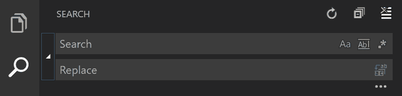

# VS 代码:搜索并替换正则表达式

> 原文:[https://dev.to/rfornal/vs-code-search-and-replace-regex-mn2](https://dev.to/rfornal/vs-code-search-and-replace-regex-mn2)

这是我经常使用的一个特性，但还不够频繁，以至于当我需要它的时候我还记得这个模式。因此，我写这篇文章是作为我自己对一个有用的 VS 代码工具的参考。

## [](#details-regex-flavor)细节(正则风味)

> find 小部件只是使用 ECMAScript 5(VS 代码的运行时)中指定的 **JavaScript 的正则表达式**...

[参考](https://github.com/Microsoft/vscode/issues/8635#issuecomment-230318011)

VS 代码可以选择使用基于 Perl 的 PCRE2 引擎。这可以通过设置配置来启用。

这允许更高级的正则表达式操作，如前视和反向引用。正则表达式仍然必须是有效的 JavaScript 正则表达式。

> VS 代码支持正则表达式搜索，但是默认情况下不支持反向引用和 lookaround。但是您可以通过设置 search.usePCRE2 来启用这些功能。这将 ripgrep 配置为使用 PCRE2 regex 引擎。虽然 PCRE2 支持许多其他特性，但我们只支持在 JavaScript 中仍然有效的正则表达式，因为打开的编辑器仍然使用编辑器的基于 JavaScript 的搜索来搜索。

## [](#use-findandreplace)使用查找和替换

您可以在 Windows 和 Linux 上按 **`Ctrl + H`** ，或者在 Mac 上按 **`⌥⌘F`** 来启用搜索和替换工具。

[T2】](https://res.cloudinary.com/practicaldev/image/fetch/s--kf7pv4zW--/c_limit%2Cf_auto%2Cfl_progressive%2Cq_auto%2Cw_880/https://thepracticaldev.s3.amazonaws.com/i/0wp01npxh0bmxp92tahj.png)

[参考](https://code.visualstudio.com/docs/getstarted/tips-and-tricks#_search-and-modify)

基本上，一些代码需要应用**搜索和替换**模式...

```
const demo = {
  test1: 'test1',
  test2: 'test2',
  test3: 'test3',
  test4: 'test4',
  test5: 'test5',
  test6: 'test6'
}; 
```

<svg width="20px" height="20px" viewBox="0 0 24 24" class="highlight-action crayons-icon highlight-action--fullscreen-on"><title>Enter fullscreen mode</title></svg> <svg width="20px" height="20px" viewBox="0 0 24 24" class="highlight-action crayons-icon highlight-action--fullscreen-off"><title>Exit fullscreen mode</title></svg>

...有了这段代码，假设我想创建一个使用字符串中的数字的 ***索引*** ，我们可以使用这样的正则表达式...`'(.*?)(\d+)'`。这个正则表达式将选择单引号内的所有文本。

如果我想要类似于`test1: 'test1', index: 1,`的东西，那么简单替换上面的选择就会变成...`'$1$2', index: $2`当全部被替换时，代码变为...

```
const demo = {
  test1: 'test1', index: 1,
  test2: 'test2', index: 2,
  test3: 'test3', index: 3,
  test4: 'test4', index: 4,
  test5: 'test5', index: 5,
  test6: 'test6', index: 6
}; 
```

<svg width="20px" height="20px" viewBox="0 0 24 24" class="highlight-action crayons-icon highlight-action--fullscreen-on"><title>Enter fullscreen mode</title></svg> <svg width="20px" height="20px" viewBox="0 0 24 24" class="highlight-action crayons-icon highlight-action--fullscreen-off"><title>Exit fullscreen mode</title></svg>

## [](#conclusion)结论

因为这是一个我经常使用的特性，但还不够频繁，以至于我在需要时还记得模式，所以我写了这篇文章，作为我自己对一个有用的 VS 代码工具的参考。