# ⚡利用无服务器的 Microsoft Azure 功能和 Azure 警报来确保应用程序的可用性

> 原文：<https://dev.to/daverendon/leverage-serverless-microsoft-azure-functions-and-azure-alerts-to-ensure-application-availability-2l73>

## 目录

*   [概述](#Overview)
*   [场景](#Scenario)
*   [利用无服务器的微软 Azure 功能，通过 Azure 资源管理器自动化资源部署](#Leverage%20Serverless%20Microsoft%20Azure%20Functions%20to%20automate%20resource%20deployment%20via%20Azure%20Resource%20Manager)
    *   [提供 Azure 功能](#Provision%20Azure%20Function)
    *   [配置 Azure 功能](#Configure%20Azure%20Function)
    *   [在资源上配置警报](#Configure%20alerts%20on%20the%20resource)
*   [测试](#Testing)
*   [参见](#See%20also)

## 概述

大家好！

在这篇文章中，我们将回顾如何有效地利用 Azure 功能和 Azure alerts 来确保应用程序的可用性。我将演示如何利用 Azure 函数和 Azure Alerts 为 Azure 上的虚拟机启用自动故障转移。

虽然 Azure 功能旨在处理数据、集成系统、使用物联网(IoT)以及构建简单的 API 和微服务，但这种方法是为了验证无服务器组件的潜在功能。

## 场景

虽然您可以根据您的业务需求在虚拟机(VM)、数据中心和区域级别建立冗余，但在这种情况下，我遇到了一个非常不可能的情况，即一个组织试图使用 Azure Site Recovery 将 Kemp 虚拟 LoadMaster 复制到一个辅助区域，但是 Azure Site Recovery 中用于启用副本的移动服务代理与用于 Azure 的 [Kemp 负载平衡器](https://azuremarketplace.microsoft.com/en-us/marketplace/apps/kemptech.vlm-azure)不兼容。

[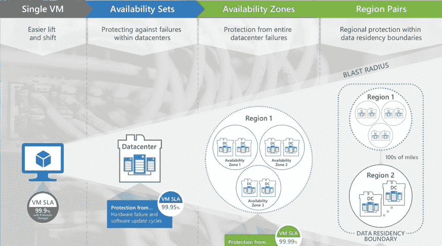](https://res.cloudinary.com/practicaldev/image/fetch/s--1ULVn-R7--/c_limit%2Cf_auto%2Cfl_progressive%2Cq_auto%2Cw_880/https://thepracticaldev.s3.amazonaws.com/i/25gke8ucmm9fjrurpti2.jpg)

这家提供战略、咨询、数字、技术和运营服务的跨国专业服务公司希望为其位于特定 Azure 美国地区的所有服务执行灾难恢复解决方案，并通过支持 Azure 站点恢复到第二个美国地区来尽量减少 RPO/RTO。

考虑到在虚拟机上安装移动服务代理以启用复制作业的限制，有两种可能的解决方案:

1.  支持 LoadMaster GEO 跨 2 个 Azure 区域分发流量，然后在 HA 模式下利用 2 个 LoadMaster 将流量分发到本地服务器和应用程序
2.  利用无服务器的 Microsoft Azure 功能和 Azure Alerts 来监控主站点上运行的虚拟机，并在潜在故障的情况下使用 Azure 功能来加速辅助区域上的基础架构资源。

为了这次讨论，我将向你展示如何利用无服务器的微软 Azure 函数和 Azure Alerts，我建议你看看如何使用 Azure 函数来启动/停止资源。

通过这种方法，您可以在主虚拟机(VM)上启用主动监控和实时运行状况检查，这样，如果 VM 运行状况检查失败，您就可以触发 Azure 函数在第二个区域上启动 VM

[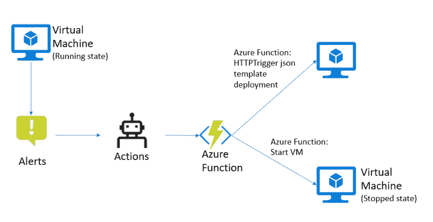](https://res.cloudinary.com/practicaldev/image/fetch/s--jjNnXflJ--/c_limit%2Cf_auto%2Cfl_progressive%2Cq_auto%2Cw_880/https://thepracticaldev.s3.amazonaws.com/i/vofpk5o5zbcmk33ittzz.png)

## 利用无服务器的微软 Azure 功能，通过 Azure 资源管理器自动化资源部署

### 先决条件

我假设您有以下内容:

1.  有效的 Azure 订阅。
2.  ARM 模板(。json 文件)

通过 Azure 资源管理器利用无服务器 Microsoft Azure 功能来自动化资源部署的步骤

1.  提供 Azure 功能
2.  配置 Azure 功能
3.  在资源上配置警报:

### 提供 Azure 功能

*   转到 Azure 门户并从模板创建新资源:

[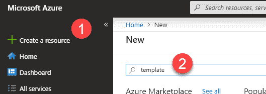](https://res.cloudinary.com/practicaldev/image/fetch/s--U5VKKmN1--/c_limit%2Cf_auto%2Cfl_progressive%2Cq_auto%2Cw_880/https://thepracticaldev.s3.amazonaws.com/i/o7t88fdkmgou5k3yws8r.png)

[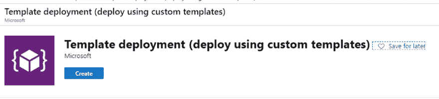](https://res.cloudinary.com/practicaldev/image/fetch/s--ZgL0qxoi--/c_limit%2Cf_auto%2Cfl_progressive%2Cq_auto%2Cw_880/https://thepracticaldev.s3.amazonaws.com/i/hgxn3p04dbw0ac959euk.png)

[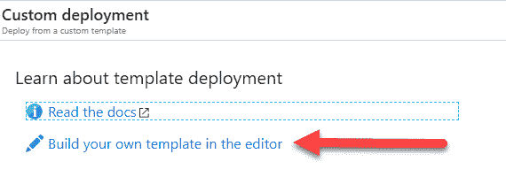](https://res.cloudinary.com/practicaldev/image/fetch/s--IMkvUnwW--/c_limit%2Cf_auto%2Cfl_progressive%2Cq_auto%2Cw_880/https://thepracticaldev.s3.amazonaws.com/i/u1fyziypotozzxuuudoz.png)

*   使用以下 Github Repo 基于消费计划创建您的 Azure 函数:

    [https://github . com/daveRendon/Kemp/blob/master/tools/templates/azure-function . JSON](https://github.com/daveRendon/kemp/blob/master/tools/templates/azure-function.json)

*   从上面的 URL 复制 json 模板并粘贴到编辑器上:

[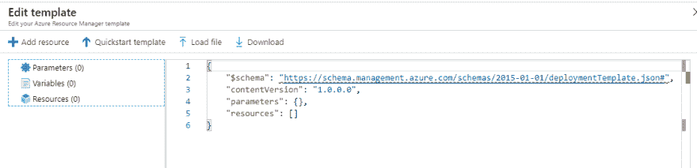](https://res.cloudinary.com/practicaldev/image/fetch/s--HaTtuJMl--/c_limit%2Cf_auto%2Cfl_progressive%2Cq_auto%2Cw_880/https://thepracticaldev.s3.amazonaws.com/i/v4qj5fms99daj7wwatmd.png)

*   然后单击保存

[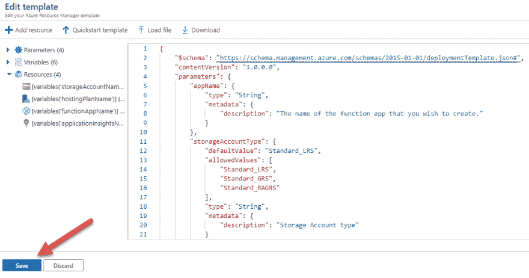](https://res.cloudinary.com/practicaldev/image/fetch/s--jMdKhH1a--/c_limit%2Cf_auto%2Cfl_progressive%2Cq_auto%2Cw_880/https://thepracticaldev.s3.amazonaws.com/i/066yhhxt4hw0kyjgax9l.png)

*   现在为您的 Azure 函数提供参数，如下所示:

[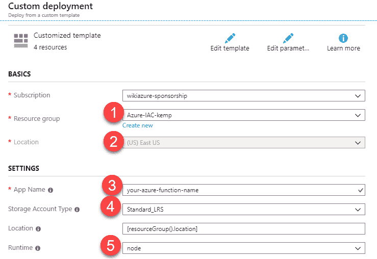](https://res.cloudinary.com/practicaldev/image/fetch/s--yAbNIFXZ--/c_limit%2Cf_auto%2Cfl_progressive%2Cq_auto%2Cw_880/https://thepracticaldev.s3.amazonaws.com/i/2nmtaeeoeanenfumfr0q.png)

小费。“Azure Functions 有两种主要风格，消费型和专用型。这两者之间的区别很重要，选择一个不仅决定了你的应用程序的行为，也决定了你如何计费。消费计划是我们的“无服务器”模型，您的代码对事件做出反应，有效地向外扩展以满足您看到的任何负载，当代码不运行时向下扩展，并且仅对您使用的内容计费。此外，所有这些都发生在你没有考虑微软 Azure 在幕后做什么的情况下。

另一方面，专用计划涉及租用虚拟机的控制权。这种控制意味着你可以在那台机器上做任何你想做的事。它总是可用的，如果您有一个需要 24/7 运行的功能，它可能在财务上更有意义。"

*   调配完成后，您应该会看到如下所示的 Azure 功能:

[](https://res.cloudinary.com/practicaldev/image/fetch/s--5ImtbPEU--/c_limit%2Cf_auto%2Cfl_progressive%2Cq_auto%2Cw_880/https://thepracticaldev.s3.amazonaws.com/i/11uk812590bnzm6dgvwb.png)

## 配置 Azure 功能

*   现在点击创建一个新函数并选择 HTTP 触发器类型:

[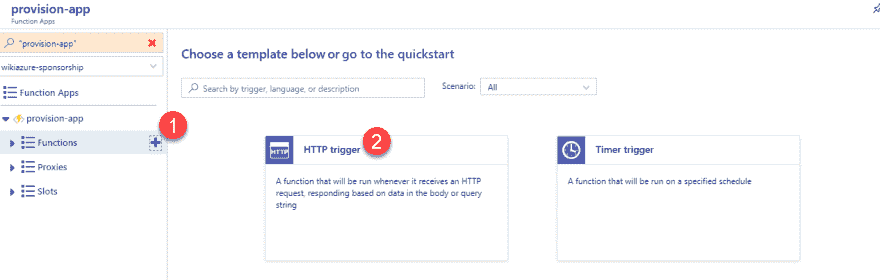](https://res.cloudinary.com/practicaldev/image/fetch/s--GRHhWeBD--/c_limit%2Cf_auto%2Cfl_progressive%2Cq_auto%2Cw_880/https://thepracticaldev.s3.amazonaws.com/i/7whbi7j4umhjkgp2v67x.png)

*   现在为您的函数提供名称和授权级别，并单击 create:

[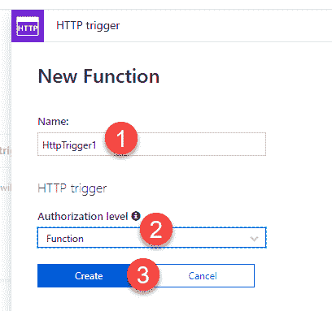](https://res.cloudinary.com/practicaldev/image/fetch/s--qjWASZuD--/c_limit%2Cf_auto%2Cfl_progressive%2Cq_auto%2Cw_880/https://thepracticaldev.s3.amazonaws.com/i/mlyfw4d7w9rdzfos3guh.png)

您应该会看到下面的代码:

```
module.exports = async function(context, req) {
    context.log('JavaScript HTTP trigger function processed a request.');
    if (req.query.name || (req.body && req.body.name)) {
        context.res = {
            // status: 200, /* Defaults to 200 */
            body: "Hello " + (req.query.name || req.body.name)
        };
    } else {
        context.res = {
            status: 400,
            body: "Please pass a name on the query string or in the request body"
        };
    }
}; 
```

出于演示目的，只需复制下面的代码，该代码将重定向到 ARM 模板以配置资源。在这种情况下，Azure 函数将重定向到将要提供的 json。

```
module.exports = function(context, req){
    var url = "https://portal.azure.com/#create/Microsoft.Template/uri/https%3A%2F%2Fraw.githubusercontent.com%2FdaveRendon%2Fkemp%2Fmaster%2Ftools%2Ftemplates%2Fvlm-200-az-function-template.json";
    context.res =  {
        status: 302,
        headers: {
            Location: url
        }
    }
    context.done();
} 
```

*   现在单击保存并运行。出于测试目的，您可以从 Azure 函数获取 URL，并在您的浏览器上执行它:

[](https://res.cloudinary.com/practicaldev/image/fetch/s--2mW5MNQ8--/c_limit%2Cf_auto%2Cfl_progressive%2Cq_auto%2Cw_880/https://thepracticaldev.s3.amazonaws.com/i/eojpp2c6jgg1owunkbft.png)

[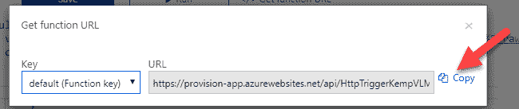](https://res.cloudinary.com/practicaldev/image/fetch/s--Q8ovAqwN--/c_limit%2Cf_auto%2Cfl_progressive%2Cq_auto%2Cw_880/https://thepracticaldev.s3.amazonaws.com/i/xznu2pxotv3371x84h7e.png)

URL 示例:

```
https://provision-app.azurewebsites.net/api/HttpTriggerKempVLM?code=Qe6aB7umn1CWgkI8KkaO5yBu0RmtEybGlHnLmPhJhXPUxRkWS1TXtg== 
```

*   导航到此 url 后，您应该会被重定向到 ARM 部署:

[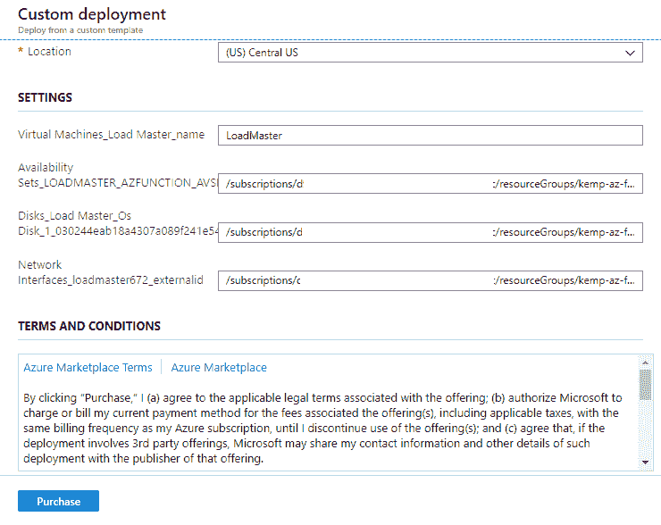](https://res.cloudinary.com/practicaldev/image/fetch/s--Hx9n6eP5--/c_limit%2Cf_auto%2Cfl_progressive%2Cq_auto%2Cw_880/https://thepracticaldev.s3.amazonaws.com/i/pkv5tj3j0f1q52vm2a5z.png)

## 在资源上配置警报

*   转到资源在这种情况下，LoadMaster 运行在虚拟机上，然后向下滚动主选项刀片并选择“Alerts”，然后单击“New alert rule”:

[](https://res.cloudinary.com/practicaldev/image/fetch/s--fuzm0O2x--/c_limit%2Cf_auto%2Cfl_progressive%2Cq_auto%2Cw_880/https://thepracticaldev.s3.amazonaws.com/i/vhr44ywbvcqle2n3dtkf.png)

*   为了创建规则，您需要选择资源目标，然后验证触发警报的条件，然后定义要启用的操作。单击条件下的添加:

[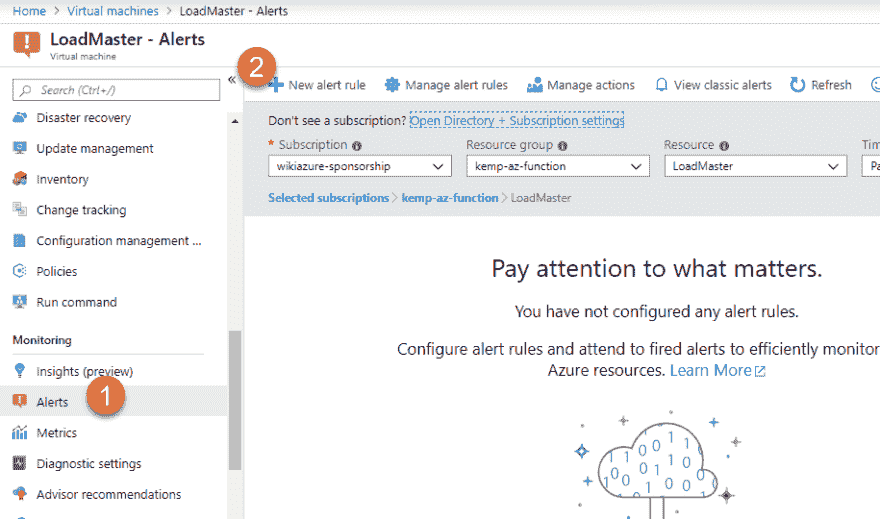](https://res.cloudinary.com/practicaldev/image/fetch/s--TyZISKd---/c_limit%2Cf_auto%2Cfl_progressive%2Cq_auto%2Cw_880/https://thepracticaldev.s3.amazonaws.com/i/yyvpnlmnt6mwnaqu5dbx.png)

*   然后选择百分比 CPU 指标

[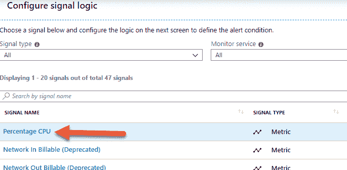](https://res.cloudinary.com/practicaldev/image/fetch/s--jEVRt9QA--/c_limit%2Cf_auto%2Cfl_progressive%2Cq_auto%2Cw_880/https://thepracticaldev.s3.amazonaws.com/i/s211aip03wejpmtgpx34.png)

*   现在配置警报逻辑。在这种情况下，我们希望确保资源正常运行，因此将阈值设置为静态，并选择运算符“小于”，聚合类型“平均”，值= 1

[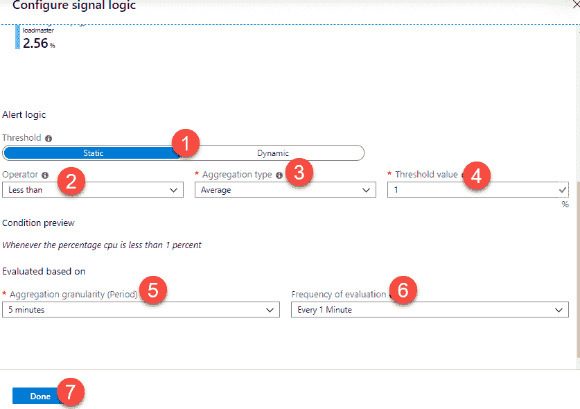](https://res.cloudinary.com/practicaldev/image/fetch/s--dmG5bn7a--/c_limit%2Cf_auto%2Cfl_progressive%2Cq_auto%2Cw_880/https://thepracticaldev.s3.amazonaws.com/i/z29mvgsigog3poftz1kr.png)

*   这将确保每当 cpu 百分比低于 1%时就会触发警报。

*   现在点击“操作”下的“创建操作组”，如下所示:

[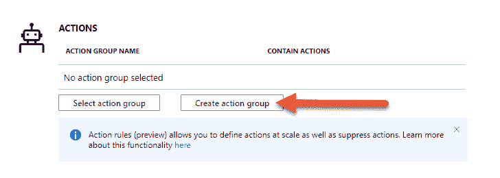](https://res.cloudinary.com/practicaldev/image/fetch/s--o42Sdn-f--/c_limit%2Cf_auto%2Cfl_progressive%2Cq_auto%2Cw_880/https://thepracticaldev.s3.amazonaws.com/i/6fhakzsao65b1qle3x11.png)

*   为行动组提供如下参数:

[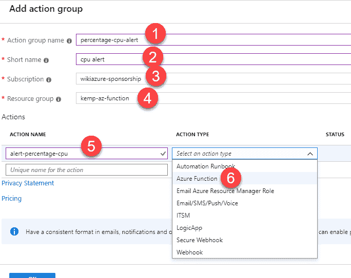](https://res.cloudinary.com/practicaldev/image/fetch/s--iiQRePqB--/c_limit%2Cf_auto%2Cfl_progressive%2Cq_auto%2Cw_880/https://thepracticaldev.s3.amazonaws.com/i/lmro3extipg4xkpp83rn.png)

*   现在将 Azure 函数与警报关联起来:

[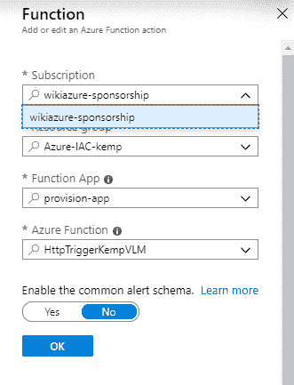](https://res.cloudinary.com/practicaldev/image/fetch/s--5pCxCJ7T--/c_limit%2Cf_auto%2Cfl_progressive%2Cq_auto%2Cw_880/https://thepracticaldev.s3.amazonaws.com/i/r9rfu4e26lek0jjr6fj5.png)

*   现在点击确定两次。

## 测试

1.  确保资源(本例中为虚拟机)已启动并正在运行
2.  确保警报已启用
3.  确保 Azure 功能已启用。

### 测试过程

1.  停止虚拟机
2.  查看 Azure Function Live 指标——您应该会看到一个传入的请求
3.  可以选择手动执行函数上的触发器。

## 亦见

*   [https://azure . Microsoft . com/en-us/blog/understanding-server less-cold-start/](https://azure.microsoft.com/en-us/blog/understanding-serverless-cold-start/)
*   [https://docs . Microsoft . com/en-us/azure/azure-monitor/platform/alerts-metric-overview](https://docs.microsoft.com/en-us/azure/azure-monitor/platform/alerts-metric-overview)
*   [https://stack overflow . com/questions/40838619/azure-function-role-like-permissions-to-stop-azure-virtual-machines/40883318 # 40883318](https://stackoverflow.com/questions/40838619/azure-function-role-like-permissions-to-stop-azure-virtual-machines/40883318#40883318)
*   [https://docs.microsoft.com/en-us/rest/api/azure/](https://docs.microsoft.com/en-us/rest/api/azure/)