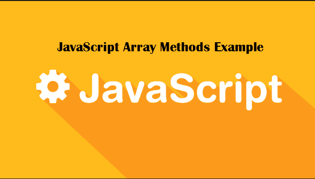

# JavaScript 中 5 个著名的数组方法。

> 原文：<https://dev.to/nikhilswain/5-famous-array-methods-in-javascript-1i6a>

#### map()，reduce()，filter()，some()，every()。

JavaScript 为我们提供了许多有用的方法来简化我们的工作。在本文中，我们将仔细研究一些 JavaScript 著名的**数组方法**，它们将帮助我们高效地编码。

[](https://res.cloudinary.com/practicaldev/image/fetch/s--PVmynwsj--/c_limit%2Cf_auto%2Cfl_progressive%2Cq_auto%2Cw_880/https://cdn-images-1.medium.com/max/627/1%2Ara6r7nqtZD13yTTwhC6VRw.png)

1.  **array . prototype . map()**map()方法创建一个**新数组**，其结果是为每个数组元素调用一个函数。它接受一个回调函数作为参数，我们可以访问数组的当前值、当前索引和数组本身。**语法:** *数组*。map( *函数(currentValue，index，arr)，thisValue*

```
const array = [2,4,6,8];

const newArr = array.map(val => val*2);

// [4, 8, 12, 16] 
```

Enter fullscreen mode Exit fullscreen mode

您也可以将回调函数作为参数传递。

```
const callbackFunc = val => val + 2;

const array = [2,4,6,8];

cons newArr = array.map(sum)

// [4, 6, 8, 10] 
```

Enter fullscreen mode Exit fullscreen mode

链接在中也是可用的，所以我们可以这样做:

```
const sum = val => val + 2;

const mul = val => val * 2;

const array = [1, 2, 3, 4, 5];

const newArray = array.map(sum).map(mul);

// [6, 8, 10, 12, 14] 
```

Enter fullscreen mode Exit fullscreen mode

**2。array . prototype . reduce()**

reduce()方法对数组的每个元素执行一个 **reducer** 函数(您提供的),产生一个输出值。

reducer 函数有四个参数:

1.  蓄电池
2.  现值
3.  当前索引
4.  源阵列

reducer 函数的返回值被赋给累加器，累加器的值在整个数组的每次迭代中被记住，并最终成为最终的单个结果值。

**语法:**

*数组*。reduce( *函数(total，currentValue，currentIndex，arr)，initialValue* )

```
function myFunc( total, num ) {
return total + num ;
}

const numbers = [30, 20, 10];

numbers.reduce(myFunc)
// 60 
```

Enter fullscreen mode Exit fullscreen mode

我们也可以提供一个初始值，而不是默认取第一个值作为累加器:

```
const num = [5, 10, 15, 10];

const sum = num.reduce(( acc, val ) => acc + val, 100);

// 140 
```

Enter fullscreen mode Exit fullscreen mode

**3。Array.prototype.filter()**

**语法:**

const new array = arr . filter(callback(element[，index[，array]])[，thisArg])

callback:函数是一个谓词，用来测试数组中的每个元素。返回 true 以保留元素，否则返回 false。

它接受三个参数:

*元素*:数组中正在处理的当前元素。

*index :* (可选)数组中正在处理的当前元素的索引。

*数组*:(可选)数组过滤器被调用。

*thisArg :* (可选)执行回调时用作 this 的值。

```
const band = ['Against', 'the', 'current', 'is', 'my', 'favourite', 'band'];

const newBand = band.filter( word => word.length > 5 );

// ["Against", "current", "favourite"] 
```

Enter fullscreen mode Exit fullscreen mode

让我们看另一个例子。

```
const isGreater = (val) => {
return val > 12;
}

const realNumbers = [3,6,12,15,18,21].filter(isGreater);

// [15, 18, 21] 
```

Enter fullscreen mode Exit fullscreen mode

**4。array . prototype . some()**

顾名思义，some()方法测试数组中是否至少有**一个元素**通过了所提供函数实现的测试。它返回一个布尔值。

**语法:** *数组*。某(*函数(currentValue，index，arr)，thisValue* )

```
const names = [const names = ['sheldon', 'lenoard', 'raj', 'howard', 'penny'];

names.some(having => having === 'sheldon');

// true

names.some(having => having === 'chrissy');

// false 
```

Enter fullscreen mode Exit fullscreen mode

some()方法的另一个例子

```
const number = [5,7,10,12,15,17,20];

number.some(mulOfFive => mulOfFive % 5 === 0); 
```

Enter fullscreen mode Exit fullscreen mode

**5。array . prototype . every()**

与某些()不同的是，every()方法测试数组中的所有元素是否都通过了由提供的函数实现的测试。它还返回一个布尔值。

**语法:** *数组*。every( *函数(currentValue，index，arr)，thisValue* )

```
const band = ['ATC','ATC','ATC','ATC'];

band.every(having => having === 'ATC');

// true 
```

Enter fullscreen mode Exit fullscreen mode

some()方法的另一个例子

```
const marks = [80, 75, 52, 91, 63];

marks.every(mark => mark > 50);

// true 
```

Enter fullscreen mode Exit fullscreen mode