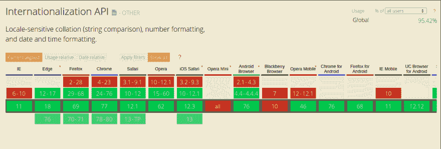

# 为什么应该开始使用 web 国际化 API

> 原文:[https://dev . to/bernardohazin/why-you-should-start-using-the-web-international ization-API-oid](https://dev.to/bernardohazin/why-you-should-start-using-the-web-internationalization-api-oid)

当您开始构建 web 应用程序时，您的主要目标是确保最终用户理解并吸收您所交付的内容，并按照设计的方式使用它，这就需要构建一个可访问且可定位的应用程序。

不幸的是，可访问性仍然是软件开发中一个上升的话题，作为开发人员，我们的工作是通过我们的代码不断提供一个包容和友好的环境。

我所说的可访问性是指所有人(无论是否有残疾)都可以访问并理解其内容的应用程序。

确保您的应用程序可以以多种不同的方式阅读和解释，对于获得广泛的受众来说极其重要。

独自完成它可能会很困难和令人困惑，但幸运的是，在 web 环境中，有巨大的努力来帮助您实现这个目标，我将讨论一个简单但极其强大的 API，它具有非常好的支持，即国际化 API。

[T2】](https://res.cloudinary.com/practicaldev/image/fetch/s--ybxC7ZPS--/c_limit%2Cf_auto%2Cfl_progressive%2Cq_auto%2Cw_880/https://thepracticaldev.s3.amazonaws.com/i/jav81sgkbj7qykioe6pp.png)

总之，它代表一个具有一系列属性的对象，你可以使用这些属性来改善用户体验，你不再需要担心如何格式化你的日期、数字、列表等等..让浏览器帮你做吧。

这个 API 一直在不断改进，到目前为止，这是一些已经可用的属性

```
Intl.Collator

Intl.DateTimeFormat

Intl.ListFormat

Intl.NumberFormat

Intl.PluralRules

Intl.RelativeTimeFormat 
```

每个属性都是一个类，在这个类中，您可以传递一个构造函数，这是您给定区域设置的默认格式配置，让我们来看看每个属性:

#### [](#intlcollator)国际。校对机

Collator 构造函数允许您对指定语言进行敏感字符串比较。这对于用多种语言创建逻辑非常有用。按照 MDN 的例子，我们可以使用比较方法
对给定字母表的字符串列表进行排序

```
function letterSort(lang, letters) {
  letters.sort(new Intl.Collator(lang).compare);
  return letters;
}

console.log(letterSort('de', ['a','z','ä']));
// expected output: Array ["a", "ä", "z"]

console.log(letterSort('sv', ['a','z','ä']));
// expected output: Array ["a", "z", "ä"] 
```

正如你在下面的例子中看到的，我们可以预期在不同的地区会有不同的结果

```
// in German, ä sorts with a
console.log(new Intl.Collator('de').compare('ä', 'z'));
// → a negative value

// in Swedish, ä sorts after z
console.log(new Intl.Collator('sv').compare('ä', 'z'));
// → a positive value 
```

你可以在 [MDN](https://developer.mozilla.org/en-US/docs/Web/JavaScript/Reference/Global_Objects/Collator) 页面查看它是如何工作的

#### [](#intldatetimeformat)国际。日期时间格式

处理日期和时间格式可能会令人望而生畏，但使用 DateTimeFormat 构造函数，它变成了一项简单的任务。它允许您通过简单的配置轻松设置日期格式。

```
const dayMonth = {
  // You can build up your date item by item
  day: 'numeric',
  month: 'long'
};

const usDate = new Intl.DateTimeFormat('en-US', dayMonth);

usDate.format(new Date()); // -> "September 16"

const frDate = new Intl.DateTimeFormat('fr-EU', dayMonth);

frDate.format(new Date()); // -> "16 septembre" 
```

很棒吧？您可以在 [MDN](https://developer.mozilla.org/en-US/docs/Web/JavaScript/Reference/Global_Objects/DateTimeFormat) 页面选择所有选项来定制日期和时间

#### [](#intllistformat)国际。列表格式

当你需要显示一个项目列表时，ListFormat 构造函数就派上了用场，你不再需要担心不同语言上的格式和语义，你只需要编写一次。

```
const list = ['Motorcycle', 'Bus', 'Car'];

const option = { style: 'long', type: 'conjunction' };

new Intl.ListFormat('en-GB', option).format(list);
// -> "Motorcycle, Bus and Car"

new Intl.ListFormat('fr-EU', option).format(list);
// -> "Motorcycle, Bus et Car"

new Intl.ListFormat('pt-BR', option).format(list);
// -> "Motorcycle, Bus e Car" 
```

您可以在 [MDN](https://developer.mozilla.org/en-US/docs/Web/JavaScript/Reference/Global_Objects/ListFormat) 页面查看列表格式的所有选项

#### [](#intlnumberformat)国际。数字格式

格式化数字这是开发应用程序时最棘手的挑战，这是因为它有很多不同的方式来显示一个数字，比如在货币风格或设置小数位数时，你需要小心避免四舍五入和错误显示的数字。

使用 NumberFormat 构造函数，您可以按照您需要的方式可靠地格式化数字

##### [](#formatting-currencies)格式化货币

```
const options = {
  style: 'currency',
  currency: 'EUR'
};

const money = new Intl.NumberFormat('en-US', options);

money.format(150); // -> "€150.00" 
```

##### [](#formatting-decimals)格式化小数

```
const options = {
  style: 'decimal',
  useGrouping: false,
  minimumFractionDigits: 3
};

const decimal = new Intl.NumberFormat('en-US', options);

decimal.format(150000); // -> "150000.000" 
```

您可以在 [MDN](https://developer.mozilla.org/en-US/docs/Web/JavaScript/Reference/Global_Objects/NumberFormat) 页面查看所有数字格式选项

#### [](#intlpluralrules)国际。多重规则

PluralRules 构造函数在处理一个地区的复数规则时非常有用，你可以用它来区分单数和复数形式

```
// Arabic has different plural rules

new Intl.PluralRules('ar-EG').select(0);
// → 'zero'
new Intl.PluralRules('ar-EG').select(1); 
// → 'one'
new Intl.PluralRules('ar-EG').select(2);
// → 'two'
new Intl.PluralRules('ar-EG').select(6);
// → 'few'
new Intl.PluralRules('ar-EG').select(18);
// → 'many' 
```

您可以在 [MDN](https://developer.mozilla.org/en-US/docs/Web/JavaScript/Reference/Global_Objects/PluralRules) 页面查看如何使用复数规则

#### [](#intlrelativetimeformat)国际。相对时间格式

RelativeTimeFormat 构造函数允许你在你的语言环境中创建一个相对时间，这对于以一种简单的方式显示时间非常有用

```
const rtf1 = new Intl.RelativeTimeFormat('en', { style: 'narrow' });

console.log(rtf1.format(3, 'quarter'));
// -> "in 3 qtrs."

console.log(rtf1.format(-1, 'day'));
// -> "1 day ago"

const rtf2 = new Intl.RelativeTimeFormat('es', { numeric: 'auto' });

console.log(rtf2.format(2, 'day'));
// -> "pasado mañana" 
```

您可以在 [MDN](https://developer.mozilla.org/en-US/docs/Web/JavaScript/Reference/Global_Objects/RelativeTimeFormat) 页面查看所有时间格式选项

#### [](#conclusion)结论

仅仅通过应用这些工具，你就可以用可靠的代码和很小的努力在用户体验上做出巨大的改变。互联网是为每个人而生的，国际化是迈向更好网络的一步！

希望我在某些方面帮助了你！