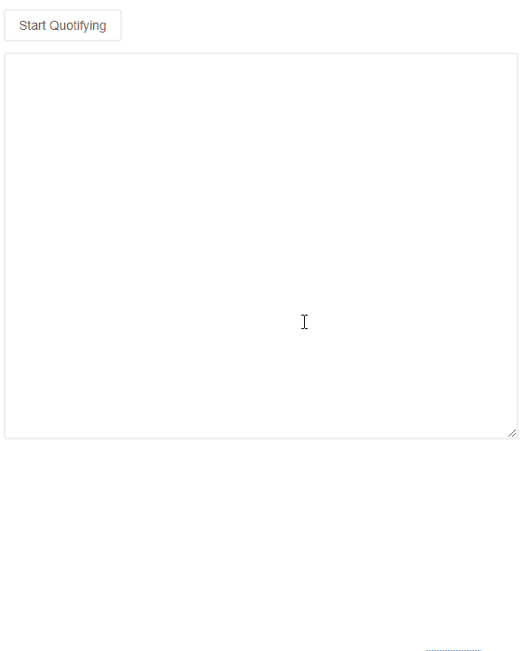
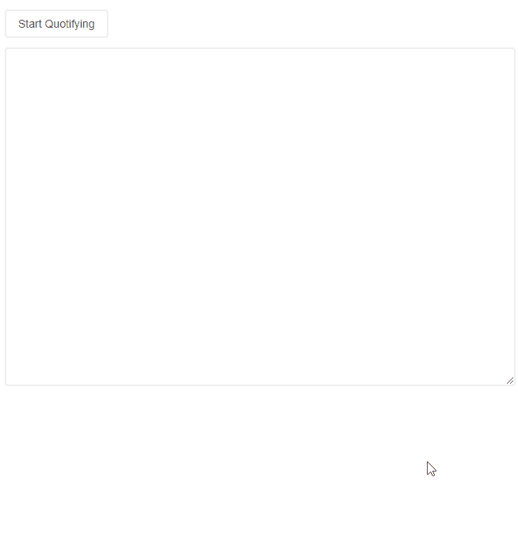

# React 钩子的力量——在 React 中创建一个只使用这个特性的应用程序

> 原文:[https://dev . to/js manifest/build-an-app-with-just-react-hooks-2c 45](https://dev.to/jsmanifest/build-an-app-with-just-react-hooks-2c45)

在[媒体](https://medium.com/@jsmanifest)上找到我

React [钩子](https://reactjs.org/docs/hooks-intro.html)是 React 库的新成员，此后被 react 开发者广泛采用。这些钩子允许您编写状态逻辑和使用其他 react 特性，而不必编写一个[类组件](https://reactjs.org/docs/components-and-props.html#function-and-class-components)。你可以单独使用 react hooks 来制作自己的应用，这证明了 hooks 的概念对于 react 团队来说是一个成功的转变。

在这篇文章中，我们将建立一个应用程序，我称之为 **Slotify** ，只有反应挂钩。

*Slotify* 将为用户提供一个用户界面，呈现给他们一个[文本区](https://developer.mozilla.org/en-US/docs/Web/HTML/Element/textarea)，可以获取任何博客文章并在其中插入引文，其中换行(`\n`)和字数将在应用的数量中发挥作用。一篇文章最少引用一句话，最多引用三句话。

只要有一个*槽*可用，就允许插入一个引用和引用的作者。用户将能够与插槽和类型/粘贴在他们选择的报价/作者互动。当他们完成后，他们可以点击保存按钮，一个翻新的博客帖子将被重新创建，其中包括他们的报价。这是用户打算用作下一篇博文的最终版本。

这些是我们将要使用的钩子 API:(基本上是所有的)

*   [反应.使用状态](https://reactjs.org/docs/hooks-reference.html#usestate)
*   [React.useEffect](https://reactjs.org/docs/hooks-reference.html#useeffect)
*   [React.useRef](https://reactjs.org/docs/hooks-reference.html#usecontext)
*   [React.useReducer](https://reactjs.org/docs/hooks-reference.html#usereducer)
*   [react . use 回调](https://reactjs.org/docs/hooks-reference.html#usecallback)
*   [反应.使用备忘录](https://reactjs.org/docs/hooks-reference.html#usememo)
*   [react . useimperativehandle](https://reactjs.org/docs/hooks-reference.html#useimperativehandle)
*   [React.useLayoutEffect](https://reactjs.org/docs/hooks-reference.html#uselayouteffect)
*   `useSlotify`(自定义)

这就是我们将要构建的:(将一篇博文转换成带有样式化引用的博文，并返回包含样式的博文的 HTML 源代码)

[T2】](https://res.cloudinary.com/practicaldev/image/fetch/s--Y4S6i6l6--/c_limit%2Cf_auto%2Cfl_progressive%2Cq_66%2Cw_880/https://jsmanifest.s3-us-west-1.amazonaws.com/posts/build-your-app-with-just-react-hooks/slotify2.gif)

事不宜迟，我们开始吧！

在本教程中，我们将使用 create-react-app 快速生成一个 react 项目。

(如果你想从 github 获得一份库的副本，点击[这里](https://github.com/jsmanifest/build-with-hooks))。

继续使用下面的命令创建一个项目。在本教程中，我将把我们的项目称为*用钩子构建*。

```
npx create-react-app build-with-hooks 
```

<svg width="20px" height="20px" viewBox="0 0 24 24" class="highlight-action crayons-icon highlight-action--fullscreen-on"><title>Enter fullscreen mode</title></svg> <svg width="20px" height="20px" viewBox="0 0 24 24" class="highlight-action crayons-icon highlight-action--fullscreen-off"><title>Exit fullscreen mode</title></svg>

一旦完成，现在进入目录:

```
cd build-with-hooks 
```

<svg width="20px" height="20px" viewBox="0 0 24 24" class="highlight-action crayons-icon highlight-action--fullscreen-on"><title>Enter fullscreen mode</title></svg> <svg width="20px" height="20px" viewBox="0 0 24 24" class="highlight-action crayons-icon highlight-action--fullscreen-off"><title>Exit fullscreen mode</title></svg>

在主条目`src/index.js`中，我们将对其进行一点清理，以便我们可以专注于`App`组件:

> src/index.js

```
import React from 'react'
import ReactDOM from 'react-dom'
import App from './App'
import './index.css'
import * as serviceWorker from './serviceWorker'
ReactDOM.render(<App />, document.getElementById('root'))
serviceWorker.unregister() 
```

<svg width="20px" height="20px" viewBox="0 0 24 24" class="highlight-action crayons-icon highlight-action--fullscreen-on"><title>Enter fullscreen mode</title></svg> <svg width="20px" height="20px" viewBox="0 0 24 24" class="highlight-action crayons-icon highlight-action--fullscreen-off"><title>Exit fullscreen mode</title></svg>

现在转到`src/App.js`，让我们从什么都不渲染开始:

```
import React from 'react'

function App() {
  return null
}

export default App 
```

<svg width="20px" height="20px" viewBox="0 0 24 24" class="highlight-action crayons-icon highlight-action--fullscreen-on"><title>Enter fullscreen mode</title></svg> <svg width="20px" height="20px" viewBox="0 0 24 24" class="highlight-action crayons-icon highlight-action--fullscreen-off"><title>Exit fullscreen mode</title></svg>

我们的应用程序的核心功能是允许用户在某种类型的字段中插入/编写博客文章，以便可以插入引用。

为了确保我们保持积极乐观的态度，我们可以做到这一点，让我们先解决核心功能，这样我们就知道我们处于良好的状态。

这意味着我们将首先制作一个按钮，以便用户能够通过单击它来启动。然后，我们还将创建`textarea`元素，以便用户可以向其中插入内容。

**src/button . js**T2】

```
import React from 'react'

function Button({ children, ...props }) {
  return (
    <button type="button" {...props}>
      {children}
    </button>
  )
}

export default Button 
```

<svg width="20px" height="20px" viewBox="0 0 24 24" class="highlight-action crayons-icon highlight-action--fullscreen-on"><title>Enter fullscreen mode</title></svg> <svg width="20px" height="20px" viewBox="0 0 24 24" class="highlight-action crayons-icon highlight-action--fullscreen-off"><title>Exit fullscreen mode</title></svg>

在 index.css 中，我应用了一些样式，使得每个`button`都有相同的样式:

**src/index . CSS**T2】

```
button {
  border: 2px solid #eee;
  border-radius: 4px;
  padding: 8px 15px;
  background: none;
  color: #555;
  cursor: pointer;
  outline: none;
}

button:hover {
  border: 2px solid rgb(224, 224, 224);
}
button:active {
  border: 2px solid #aaa;
} 
```

<svg width="20px" height="20px" viewBox="0 0 24 24" class="highlight-action crayons-icon highlight-action--fullscreen-on"><title>Enter fullscreen mode</title></svg> <svg width="20px" height="20px" viewBox="0 0 24 24" class="highlight-action crayons-icon highlight-action--fullscreen-off"><title>Exit fullscreen mode</title></svg>

让我们继续创建 textarea 组件。我们称之为`PasteBin`:

**src/PasteBin.js**

```
import React from 'react'

function PasteBin(props) {
  return (
    <textarea
      style={{
        width: '100%',
        margin: '12px 0',
        outline: 'none',
        padding: 12,
        border: '2px solid #eee',
        color: '#666',
        borderRadius: 4,
      }}
      rows={25}
      {...props}
    />
  )
}

export default PasteBin 
```

<svg width="20px" height="20px" viewBox="0 0 24 24" class="highlight-action crayons-icon highlight-action--fullscreen-on"><title>Enter fullscreen mode</title></svg> <svg width="20px" height="20px" viewBox="0 0 24 24" class="highlight-action crayons-icon highlight-action--fullscreen-off"><title>Exit fullscreen mode</title></svg>

现在我们使用内联样式，因为我们希望在生成最终内容时包含这些样式。如果我们使用纯 CSS，将只生成类名字符串，因此组件将变成无样式的。

我们将创建一个 react [context](https://reactjs.org/docs/context.html) 来从顶部包装这一切，这样我们就可以通过使用 [React.useContext](https://reactjs.org/docs/hooks-reference.html#usecontext) 来强制所有子组件与其余组件保持同步

创建一个`Context.js`文件:

**src/Context.js**

```
import React from 'react'

const Context = React.createContext()

export default Context 
```

<svg width="20px" height="20px" viewBox="0 0 24 24" class="highlight-action crayons-icon highlight-action--fullscreen-on"><title>Enter fullscreen mode</title></svg> <svg width="20px" height="20px" viewBox="0 0 24 24" class="highlight-action crayons-icon highlight-action--fullscreen-off"><title>Exit fullscreen mode</title></svg>

现在我们将创建`Provider.js`,它将导入`Context.js`,并将所有逻辑保持在管理状态:

**src/Provider.js**

```
import React from 'react'
import Slot from './Slot'
import { attachSlots, split } from './utils'
import Context from './Context'

const initialState = {
  slotifiedContent: [],
}

function reducer(state, action) {
  switch (action.type) {
    case 'set-slotified-content':
      return { ...state, slotifiedContent: action.content }
    default:
      return state
  }
}

function useSlotify() {
  const [state, dispatch] = React.useReducer(reducer, initialState)
  const textareaRef = React.useRef()

  function slotify() {
    let slotifiedContent, content
    if (textareaRef && textareaRef.current) {
      content = textareaRef.current.value
    }
    const slot = <Slot />
    if (content) {
      slotifiedContent = attachSlots(split(content), slot)
    }
    dispatch({ type: 'set-slotified-content', content: slotifiedContent })
  }

  return {
    ...state,
    slotify,
    textareaRef,
  }
}

function Provider({ children }) {
  return <Context.Provider value={useSlotify()}>{children}</Context.Provider>
}

export default Provider 
```

<svg width="20px" height="20px" viewBox="0 0 24 24" class="highlight-action crayons-icon highlight-action--fullscreen-on"><title>Enter fullscreen mode</title></svg> <svg width="20px" height="20px" viewBox="0 0 24 24" class="highlight-action crayons-icon highlight-action--fullscreen-off"><title>Exit fullscreen mode</title></svg>

我想花点时间解释一下这最后一段代码的作用，因为它非常重要。我们应该使用 [React.useState](https://reactjs.org/docs/hooks-reference.html#usestate) 来管理我们的状态，但是当你考虑我们的应用程序将要做什么时，你可能会意识到它不仅仅是一个单一的状态，因为需要考虑双方的情况:

1.  用户什么时候想把他们的博客文章分槽？
2.  我们应该何时向他们展示最终的翻新内容？
3.  我们应该在博文中插入几个槽？
4.  我们应该何时显示或隐藏插槽？

知道了这一点，我们应该使用一个 [React.useReducer](https://reactjs.org/docs/hooks-reference.html#usereducer) 来设计我们的状态，将状态更新逻辑封装到一个单独的位置，因此我们的第一个动作是通过添加第一个 switch case 来声明的，这个 switch case 可以通过调度一个类型为`'set-slotified-content'`的动作来访问。

我们将在博客文章中插入槽的方法是获取一个字符串，并将其转换为一个数组，用换行符`'\n'`对其进行分隔，这就是为什么初始状态将`slotifiedContent`声明为一个数组，因为那是我们将工作数据放入的地方。

我们还看到声明了一个`textareaRef`,因为我们需要用它来获取对我们之前创建的`PasteBin`组件的引用。我们本可以让 textarea 完全由[控制](https://reactjs.org/docs/forms.html#controlled-components)，但是最简单、最有效的沟通方式是获取对根`textarea`元素的引用，因为我们需要做的只是获取它的值，而不是设置状态。这将在稍后使用`textarea`上的`ref`道具时被抓住。

当用户按下*开始引用*按钮来引用他们的博客文章时，我们的`slotify`函数被调用。目的是弹出一个模式，并向他们显示可以输入报价/作者的位置。我们使用对`PasteBin`组件的引用来获取 textarea 的当前值，并将内容迁移到 modal。

然后，我们使用两个实用函数，`attachSlots`和`split`来将博客文章开槽，并使用它们来设置`state.slotifiedContent`，这样我们的 UI 就可以拾取它并完成它们的工作。

我们将`attachSlots`和`split`放入一个`utils.js`文件，如下所示:

**src/utils.js**

```
export function attachSlots(content, slot) {
  if (!Array.isArray(content)) {
    throw new Error('content is not an array')
  }
  let result = []
  // Post is too short. Only provide a quote at the top
  if (content.length <= 50) {
    result = [slot, ...content]
  }
  // Post is a little larger but 3 quotes is excessive. Insert a max of 2 quotes
  else if (content.length > 50 && content.length < 100) {
    result = [slot, ...content, slot]
  }
  // Post should be large enough to look beautiful with 3 quotes inserted (top/mid/bottom)
  else if (content.length > 100) {
    const midpoint = Math.floor(content.length / 2)
    result = [
      slot,
      ...content.slice(0, midpoint),
      slot,
      ...content.slice(midpoint),
      slot,
    ]
  }
  return result
}

// Returns the content back as an array using a delimiter
export function split(content, delimiter = '\n') {
  return content.split(delimiter)
} 
```

<svg width="20px" height="20px" viewBox="0 0 24 24" class="highlight-action crayons-icon highlight-action--fullscreen-on"><title>Enter fullscreen mode</title></svg> <svg width="20px" height="20px" viewBox="0 0 24 24" class="highlight-action crayons-icon highlight-action--fullscreen-off"><title>Exit fullscreen mode</title></svg>

为了将`textareaRef`应用到`PasteBin`上，我们必须使用`React.useContext`来获得我们之前在`useSlotify`中声明的 [React.useRef](https://reactjs.org/docs/hooks-reference.html#useref) 钩子:

**src/PasteBin.js**

```
import React from 'react'
import Context from './Context'

function PasteBin(props) {
  const { textareaRef } = React.useContext(Context)
  return (
    <textarea
      ref={textareaRef}
      style={{
        width: '100%',
        margin: '12px 0',
        outline: 'none',
        padding: 12,
        border: '2px solid #eee',
        color: '#666',
        borderRadius: 4,
      }}
      rows={25}
      {...props}
    />
  )
}

export default PasteBin 
```

<svg width="20px" height="20px" viewBox="0 0 24 24" class="highlight-action crayons-icon highlight-action--fullscreen-on"><title>Enter fullscreen mode</title></svg> <svg width="20px" height="20px" viewBox="0 0 24 24" class="highlight-action crayons-icon highlight-action--fullscreen-off"><title>Exit fullscreen mode</title></svg>

我们遗漏的最后一件事是创建`<Slot />`组件，因为我们在上下文中使用了它。这个 slot 组件是从用户那里获取报价和作者的组件。用户不会马上看到它，因为我们将把它放在模态组件中，只有当用户点击*开始报价*按钮时，模态组件才会打开。

这个槽组件会有点难，但是我会在后面解释发生了什么:

```
import React from 'react'
import PropTypes from 'prop-types'
import cx from 'classnames'
import Context from './Context'
import styles from './styles.module.css'

function SlotDrafting({ quote, author, onChange }) {
  const inputStyle = {
    border: 0,
    borderRadius: 4,
    background: 'none',
    fontSize: '1.2rem',
    color: '#fff',
    padding: '6px 15px',
    width: '100%',
    height: '100%',
    outline: 'none',
    marginRight: 4,
  }

  return (
    <div
      style={{
        display: 'flex',
        justifyContent: 'space-around',
        alignItems: 'center',
      }}
    >
      <input
        name="quote"
        type="text"
        placeholder="Insert a quote"
        style={{ flexGrow: 1, flexBasis: '70%' }}
        onChange={onChange}
        value={quote}
        className={styles.slotQuoteInput}
        style={{ ...inputStyle, flexGrow: 1, flexBasis: '60%' }}
      />
      <input
        name="author"
        type="text"
        placeholder="Author"
        style={{ flexBasis: '30%' }}
        onChange={onChange}
        value={author}
        className={styles.slotQuoteInput}
        style={{ ...inputStyle, flexBasis: '40%' }}
      />
    </div>
  )
}

function SlotStatic({ quote, author }) {
  return (
    <div style={{ padding: '12px 0' }}>
      <h2 style={{ fontWeight: 700, color: '#2bc7c7' }}>{quote}</h2>
      <p
        style={{
          marginLeft: 50,
          fontStyle: 'italic',
          color: 'rgb(51, 52, 54)',
          opacity: 0.7,
          textAlign: 'right',
        }}
      >
        - {author}
      </p>
    </div>
  )
}

function Slot({ input = 'textfield' }) {
  const [quote, setQuote] = React.useState('')
  const [author, setAuthor] = React.useState('')
  const { drafting } = React.useContext(Context)

  function onChange(e) {
    if (e.target.name === 'quote') {
      setQuote(e.target.value)
    } else {
      setAuthor(e.target.value)
    }
  }

  let draftComponent, staticComponent

  if (drafting) {
    switch (input) {
      case 'textfield':
        draftComponent = (
          <SlotDrafting onChange={onChange} quote={quote} author={author} />
        )
        break
      default:
        break
    }
  } else {
    switch (input) {
      case 'textfield':
        staticComponent = <SlotStatic quote={quote} author={author} />
        break
      default:
        break
    }
  }

  return (
    <div
      style={{
        color: '#fff',
        borderRadius: 4,
        margin: '12px 0',
        outline: 'none',
        transition: 'all 0.2s ease-out',
        width: '100%',
        background: drafting
          ? 'rgba(175, 56, 90, 0.2)'
          : 'rgba(16, 46, 54, 0.02)',
        boxShadow: drafting
          ? undefined
          : '0 3px 15px 15px rgba(51, 51, 51, 0.03)',
        height: drafting ? 70 : '100%',
        minHeight: drafting ? 'auto' : 70,
        maxHeight: drafting ? 'auto' : 100,
        padding: drafting ? 8 : 0,
      }}
    >
      <div
        className={styles.slotInnerRoot}
        style={{
          transition: 'all 0.2s ease-out',
          cursor: 'pointer',
          width: '100%',
          height: '100%',
          padding: '0 6px',
          borderRadius: 4,
          display: 'flex',
          alignItems: 'center',
          textTransform: 'uppercase',
          justifyContent: drafting ? 'center' : 'space-around',
          background: drafting
            ? 'rgba(100, 100, 100, 0.35)'
            : 'rgba(100, 100, 100, 0.05)',
        }}
      >
        {drafting ? draftComponent : staticComponent}
      </div>
    </div>
  )
}

Slot.defaultProps = {
  slot: true,
}

Slot.propTypes = {
  input: PropTypes.oneOf(['textfield']),
}

export default Slot 
```

<svg width="20px" height="20px" viewBox="0 0 24 24" class="highlight-action crayons-icon highlight-action--fullscreen-on"><title>Enter fullscreen mode</title></svg> <svg width="20px" height="20px" viewBox="0 0 24 24" class="highlight-action crayons-icon highlight-action--fullscreen-off"><title>Exit fullscreen mode</title></svg>

这个文件中最重要的部分是`state.drafting`。我们还没有在上下文中声明这一点，但是它的目的是给我们一种方法来知道何时向用户显示插槽以及何时向他们显示最终输出。当`state.drafting`为真(这将是默认值)时，我们将向他们显示插槽，这些插槽是他们可以插入报价和报价作者的块。当他们点击*保存*按钮时，`state.drafting`将切换到`false`，我们将利用这一点来确定他们想要查看他们的最终输出。

我们声明了一个默认值为`'textfield'`的`input`参数，因为将来我们可能希望使用其他输入类型，让用户除了输入之外还可以插入引号(例如:文件输入，我们可以让他们上传图片作为引号，等等)。对于本教程，我们将只支持`'textfield'`。

所以当`state.drafting`为`true`时，`<SlotDrafting />`被`Slot`使用，当`false`时，`<SlotStatic />`被使用。最好将这种区别分成单独的组件，这样我们就不会用一堆`if/else`条件来膨胀组件。

此外，尽管我们为报价/作者输入字段声明了一些内联样式，但我们仍然应用了`className={styles.slotQuoteInput}`以便我们可以样式化占位符，因为我们不能用内联样式来这样做。(这对于最终翻新的内容是可以的，因为甚至不会生成输入)

这是它的 css 代码:

**src/styles . module . CSS**T2】

```
.slotQuoteInput::placeholder {
  color: #fff;
  font-size: 0.9rem;
} 
```

<svg width="20px" height="20px" viewBox="0 0 24 24" class="highlight-action crayons-icon highlight-action--fullscreen-on"><title>Enter fullscreen mode</title></svg> <svg width="20px" height="20px" viewBox="0 0 24 24" class="highlight-action crayons-icon highlight-action--fullscreen-off"><title>Exit fullscreen mode</title></svg>

让我们返回并向上下文声明`drafting`状态:

**src/Provider.js**

```
import React from 'react'
import Slot from './Slot'
import { attachSlots, split } from './utils'
import Context from './Context'

const initialState = {
  slotifiedContent: [],
  drafting: true,
}

function reducer(state, action) {
  switch (action.type) {
    case 'set-slotified-content':
      return { ...state, slotifiedContent: action.content }
    case 'set-drafting':
      return { ...state, drafting: action.drafting }
    default:
      return state
  }
}

function useSlotify() {
  const [state, dispatch] = React.useReducer(reducer, initialState)
  const textareaRef = React.useRef()

  function onSave() {
    if (state.drafting) {
      setDrafting(false)
    }
  }

  function setDrafting(drafting) {
    if (drafting === undefined) return
    dispatch({ type: 'set-drafting', drafting })
  }

  function slotify() {
    let slotifiedContent, content
    if (textareaRef && textareaRef.current) {
      content = textareaRef.current.value
    }
    const slot = <Slot />
    if (content && typeof content === 'string') {
      slotifiedContent = attachSlots(split(content), slot)
    }
    dispatch({ type: 'set-slotified-content', content: slotifiedContent })
  }

  return {
    ...state,
    slotify,
    onSave,
    setDrafting,
    textareaRef,
  }
}

function Provider({ children }) {
  return <Context.Provider value={useSlotify()}>{children}</Context.Provider>
}

export default Provider 
```

<svg width="20px" height="20px" viewBox="0 0 24 24" class="highlight-action crayons-icon highlight-action--fullscreen-on"><title>Enter fullscreen mode</title></svg> <svg width="20px" height="20px" viewBox="0 0 24 24" class="highlight-action crayons-icon highlight-action--fullscreen-off"><title>Exit fullscreen mode</title></svg>

现在，最后让我们将它放入`App.js`组件，这样我们就可以看到目前为止的情况:

(注意:在这个例子中，我使用了来自 *semantic-ui-react* 的模态组件，它是模态所需要的**而不是**。您可以使用任何模型或使用 **react 门户** api 创建自己的普通模型):

```
import React from 'react'
import { Modal } from 'semantic-ui-react'
import Button from './Button'
import Context from './Context'
import Provider from './Provider'
import PasteBin from './PasteBin'
import styles from './styles.module.css'

// Purposely call each fn without args since we don't need them
const callFns = (...fns) => () => fns.forEach((fn) => fn && fn())

const App = () => {
  const {
    modalOpened,
    slotifiedContent = [],
    slotify,
    onSave,
    openModal,
    closeModal,
  } = React.useContext(Context)

  return (
    <div
      style={{
        padding: 12,
        boxSizing: 'border-box',
      }}
    >
      <Modal
        open={modalOpened}
        trigger={
          <Button type="button" onClick={callFns(slotify, openModal)}>
            Start Quotifying
          </Button>
        }
      >
        <Modal.Content
          style={{
            background: '#fff',
            padding: 12,
            color: '#333',
            width: '100%',
          }}
        >
          <div>
            <Modal.Description>
              {slotifiedContent.map((content) => (
                <div style={{ whiteSpace: 'pre-line' }}>{content}</div>
              ))}
            </Modal.Description>
          </div>
          <Modal.Actions>
            <Button type="button" onClick={onSave}>
              SAVE
            </Button>
          </Modal.Actions>
        </Modal.Content>
      </Modal>
      <PasteBin onSubmit={slotify} />
    </div>
  )
}

export default () => (
  <Provider>
    <App />
  </Provider>
) 
```

<svg width="20px" height="20px" viewBox="0 0 24 24" class="highlight-action crayons-icon highlight-action--fullscreen-on"><title>Enter fullscreen mode</title></svg> <svg width="20px" height="20px" viewBox="0 0 24 24" class="highlight-action crayons-icon highlight-action--fullscreen-off"><title>Exit fullscreen mode</title></svg>

在启动我们的服务器之前，我们需要声明`modal`状态(打开/关闭):

**src/Provider.js**

```
import React from 'react'
import Slot from './Slot'
import { attachSlots, split } from './utils'
import Context from './Context'

const initialState = {
  slotifiedContent: [],
  drafting: true,
  modalOpened: false,
}

function reducer(state, action) {
  switch (action.type) {
    case 'set-slotified-content':
      return { ...state, slotifiedContent: action.content }
    case 'set-drafting':
      return { ...state, drafting: action.drafting }
    case 'open-modal':
      return { ...state, modalOpened: true }
    case 'close-modal':
      return { ...state, modalOpened: false }
    default:
      return state
  }
}

function useSlotify() {
  const [state, dispatch] = React.useReducer(reducer, initialState)
  const textareaRef = React.useRef()

  function onSave() {
    if (state.drafting) {
      setDrafting(false)
    }
  }

  function openModal() {
    dispatch({ type: 'open-modal' })
  }

  function closeModal() {
    dispatch({ type: 'close-modal' })
  }

  function setDrafting(drafting) {
    if (typeof drafting !== 'boolean') return
    dispatch({ type: 'set-drafting', drafting })
  }

  function slotify() {
    let slotifiedContent, content
    if (textareaRef && textareaRef.current) {
      content = textareaRef.current.value
    }
    const slot = <Slot />
    if (content && typeof content === 'string') {
      slotifiedContent = attachSlots(split(content), slot)
    }
    if (!state.drafting) {
      setDrafting(true)
    }
    dispatch({ type: 'set-slotified-content', content: slotifiedContent })
  }

  return {
    ...state,
    slotify,
    onSave,
    setDrafting,
    textareaRef,
    openModal,
    closeModal,
  }
}

function Provider({ children }) {
  return <Context.Provider value={useSlotify()}>{children}</Context.Provider>
}

export default Provider 
```

<svg width="20px" height="20px" viewBox="0 0 24 24" class="highlight-action crayons-icon highlight-action--fullscreen-on"><title>Enter fullscreen mode</title></svg> <svg width="20px" height="20px" viewBox="0 0 24 24" class="highlight-action crayons-icon highlight-action--fullscreen-off"><title>Exit fullscreen mode</title></svg>

这是我们目前应该有的:

[T2】](https://res.cloudinary.com/practicaldev/image/fetch/s--Z00RZMNK--/c_limit%2Cf_auto%2Cfl_progressive%2Cq_66%2Cw_880/https://jsmanifest.s3-us-west-1.amazonaws.com/posts/build-your-app-with-just-react-hooks/slotify1.gif)

(注意:*保存*按钮正在关闭图像中的模态，但这是一个小错误。它不应该关闭模态)

现在我们将对`PasteBin`做一点修改，使用[react . useimperativehandle](https://reactjs.org/docs/hooks-reference.html#useimperativehandle)为 textarea 声明一个新的 api，这样我们就可以在`useSlotify`中使用它，我们不会用一堆函数来膨胀钩子，而是提供一个封装的 api:

**src/PasteBin.js**

```
import React from 'react'
import Context from './Context'

function PasteBin(props) {
  const { textareaRef, textareaUtils } = React.useContext(Context)

  React.useImperativeHandle(textareaUtils, () => ({
    copy: () => {
      textareaRef.current.select()
      document.execCommand('copy')
      textareaRef.current.blur()
    },
    getText: () => {
      return textareaRef.current.value
    },
  }))

  return (
    <textarea
      ref={textareaRef}
      style={{
        width: '100%',
        margin: '12px 0',
        outline: 'none',
        padding: 12,
        border: '2px solid #eee',
        color: '#666',
        borderRadius: 4,
      }}
      rows={25}
      {...props}
    />
  )
}

export default PasteBin 
```

<svg width="20px" height="20px" viewBox="0 0 24 24" class="highlight-action crayons-icon highlight-action--fullscreen-on"><title>Enter fullscreen mode</title></svg> <svg width="20px" height="20px" viewBox="0 0 24 24" class="highlight-action crayons-icon highlight-action--fullscreen-off"><title>Exit fullscreen mode</title></svg>

`textareaUtils`也将是一个`React.useRef`，它将被放置在`useSlotify`钩子
中的`textareaRef`旁边

```
const [state, dispatch] = React.useReducer(reducer, initialState)
const textareaRef = React.useRef()
const textareaUtils = React.useRef() 
```

<svg width="20px" height="20px" viewBox="0 0 24 24" class="highlight-action crayons-icon highlight-action--fullscreen-on"><title>Enter fullscreen mode</title></svg> <svg width="20px" height="20px" viewBox="0 0 24 24" class="highlight-action crayons-icon highlight-action--fullscreen-off"><title>Exit fullscreen mode</title></svg>

我们将在`slotify`函数中使用这个新的 api:

**src/Provider.js**

```
function slotify() {
  let slotifiedContent, content
  if (textareaRef && textareaRef.current) {
    textareaUtils.current.copy()
    textareaUtils.current.blur()
    content = textareaUtils.current.getText()
  }
  const slot = <Slot />
  if (content && typeof content === 'string') {
    slotifiedContent = attachSlots(split(content), slot)
  }
  if (!state.drafting) {
    setDrafting(true)
  }
  dispatch({ type: 'set-slotified-content', content: slotifiedContent })
} 
```

<svg width="20px" height="20px" viewBox="0 0 24 24" class="highlight-action crayons-icon highlight-action--fullscreen-on"><title>Enter fullscreen mode</title></svg> <svg width="20px" height="20px" viewBox="0 0 24 24" class="highlight-action crayons-icon highlight-action--fullscreen-off"><title>Exit fullscreen mode</title></svg>

现在，我们要做的下一件事是，当用户正在查看插槽，并且我们检测到他们还没有插入作者时，我们闪烁该元素以引起他们的更多注意。

为此，我们将在`SlotDrafting`组件中使用 [React.useLayoutEffect](https://reactjs.org/docs/hooks-reference.html#uselayouteffect) ,因为 *SlotDrafting* 包含作者输入:

**src/Slot.js**

```
function SlotDrafting({ quote, author, onChange }) {
  const authorRef = React.createRef()

  React.useLayoutEffect(() => {
    const elem = authorRef.current
    if (!author) {
      elem.classList.add(styles.slotQuoteInputAttention)
    } else if (author) {
      elem.classList.remove(styles.slotQuoteInputAttention)
    }
  }, [author, authorRef])

  const inputStyle = {
    border: 0,
    borderRadius: 4,
    background: 'none',
    fontSize: '1.2rem',
    color: '#fff',
    padding: '6px 15px',
    width: '100%',
    height: '100%',
    outline: 'none',
    marginRight: 4,
  }

  return (
    <div
      style={{
        display: 'flex',
        justifyContent: 'space-around',
        alignItems: 'center',
      }}
    >
      <input
        name="quote"
        type="text"
        placeholder="Insert a quote"
        onChange={onChange}
        value={quote}
        className={styles.slotQuoteInput}
        style={{ ...inputStyle, flexGrow: 1, flexBasis: '60%' }}
      />
      <input
        ref={authorRef}
        name="author"
        type="text"
        placeholder="Author"
        onChange={onChange}
        value={author}
        className={styles.slotQuoteInput}
        style={{ ...inputStyle, flexBasis: '40%' }}
      />
    </div>
  )
} 
```

<svg width="20px" height="20px" viewBox="0 0 24 24" class="highlight-action crayons-icon highlight-action--fullscreen-on"><title>Enter fullscreen mode</title></svg> <svg width="20px" height="20px" viewBox="0 0 24 24" class="highlight-action crayons-icon highlight-action--fullscreen-off"><title>Exit fullscreen mode</title></svg>

我们在这里可能不需要使用`useLayoutEffect`，但这只是为了演示。众所周知，这是更新风格的好选择。因为钩子是在 dom 挂载并更新了它的变化之后被调用的。从样式的角度来看，这很好，因为它在下一次浏览器重画之前调用了*，而之后调用了`useEffect`钩子——这会导致 UI 中出现[的浮华效果](https://blog.logrocket.com/useeffect-vs-uselayouteffect/)。*

样式:

**src/styles . module . CSS**T2】

```
.slotQuoteInputAttention {
  transition: all 1s ease-out;
  animation: emptyAuthor 3s infinite;
  border: 1px solid #91ffde;
}

.slotQuoteInputAttention::placeholder {
  color: #91ffde;
}

.slotQuoteInputAttention:hover,
.slotQuoteInputAttention:focus,
.slotQuoteInputAttention:active {
  transform: scale(1.1);
}

@keyframes emptyAuthor {
  0% {
    opacity: 1;
  }
  50% {
    opacity: 0;
  }
  100% {
    opacity: 1;
  }
} 
```

<svg width="20px" height="20px" viewBox="0 0 24 24" class="highlight-action crayons-icon highlight-action--fullscreen-on"><title>Enter fullscreen mode</title></svg> <svg width="20px" height="20px" viewBox="0 0 24 24" class="highlight-action crayons-icon highlight-action--fullscreen-off"><title>Exit fullscreen mode</title></svg>

在模态的底部，我们放了一个`SAVE`按钮，它将从`useSlotify`调用`onSave`。当用户点击此按钮时，插槽将转换为最终插槽(当`drafting === false`时)。我们还将在附近呈现一个按钮，将 HTML 中的源代码复制到他们的剪贴板，以便他们可以将内容粘贴到他们的博客帖子上。

到目前为止，我们掌握的情况如下:

一切都将保持不变，除了现在我们使用 CSS 类名。对于新的 css 类名，它们以`Static`为后缀，表示它们在`drafting === false`时使用。下面是对`Slot`组件的一个小改动，以适应 CSS 的变化:

**src/Slot.js**

```
function Slot({ input = 'textfield' }) {
  const [quote, setQuote] = React.useState('')
  const [author, setAuthor] = React.useState('')
  const { drafting } = React.useContext(Context)

  function onChange(e) {
    if (e.target.name === 'quote') {
      setQuote(e.target.value)
    } else {
      setAuthor(e.target.value)
    }
  }

  let draftComponent, staticComponent

  if (drafting) {
    switch (input) {
      case 'textfield':
        draftComponent = (
          <SlotDrafting onChange={onChange} quote={quote} author={author} />
        )
        break
      default:
        break
    }
  } else {
    switch (input) {
      case 'textfield':
        staticComponent = <SlotStatic quote={quote} author={author} />
        break
      default:
        break
    }
  }

  return (
    <div
      style={{
        color: '#fff',
        borderRadius: 4,
        margin: '12px 0',
        outline: 'none',
        transition: 'all 0.2s ease-out',
        width: '100%',
        background: drafting
          ? 'rgba(175, 56, 90, 0.2)'
          : 'rgba(16, 46, 54, 0.02)',
        boxShadow: drafting
          ? undefined
          : '0 3px 15px 15px rgba(51, 51, 51, 0.03)',
        height: drafting ? 70 : '100%',
        minHeight: drafting ? 'auto' : 70,
        maxHeight: drafting ? 'auto' : 100,
        padding: drafting ? 8 : 0,
      }}
      className={cx({
        [styles.slotRoot]: drafting,
        [styles.slotRootStatic]: !drafting,
      })}
    >
      <div
        className={styles.slotInnerRoot}
        style={{
          transition: 'all 0.2s ease-out',
          cursor: 'pointer',
          width: '100%',
          height: '100%',
          padding: '0 6px',
          borderRadius: 4,
          display: 'flex',
          alignItems: 'center',
          textTransform: 'uppercase',
          justifyContent: drafting ? 'center' : 'space-around',
          background: drafting
            ? 'rgba(100, 100, 100, 0.35)'
            : 'rgba(100, 100, 100, 0.05)',
        }}
      >
        {drafting ? draftComponent : staticComponent}
      </div>
    </div>
  )
} 
```

<svg width="20px" height="20px" viewBox="0 0 24 24" class="highlight-action crayons-icon highlight-action--fullscreen-on"><title>Enter fullscreen mode</title></svg> <svg width="20px" height="20px" viewBox="0 0 24 24" class="highlight-action crayons-icon highlight-action--fullscreen-off"><title>Exit fullscreen mode</title></svg>

下面是新加入的 CSS 样式:

```
.slotRoot:hover {
  background: rgba(245, 49, 104, 0.3) !important;
}

.slotRootStatic:hover {
  background: rgba(100, 100, 100, 0.07) !important;
}

.slotInnerRoot:hover {
  filter: brightness(80%);
} 
```

<svg width="20px" height="20px" viewBox="0 0 24 24" class="highlight-action crayons-icon highlight-action--fullscreen-on"><title>Enter fullscreen mode</title></svg> <svg width="20px" height="20px" viewBox="0 0 24 24" class="highlight-action crayons-icon highlight-action--fullscreen-off"><title>Exit fullscreen mode</title></svg>

这是我们的应用程序现在的样子:

[T2】](https://res.cloudinary.com/practicaldev/image/fetch/s--Y4S6i6l6--/c_limit%2Cf_auto%2Cfl_progressive%2Cq_66%2Cw_880/https://jsmanifest.s3-us-west-1.amazonaws.com/posts/build-your-app-with-just-react-hooks/slotify2.gif)

我们需要做的最后一件事是添加一个*关闭*按钮来关闭模态，和一个*复制*按钮来复制他们最终确定的博客文章的源代码。

添加*关闭*按钮很容易。只要在*保存*按钮旁边加上这个按钮。*复制*按钮将放置在*关闭*按钮旁边。这些按钮将被赋予一些`onClick`处理程序:

```
<Modal.Actions>
  <Button type="button" onClick={onSave}>
    SAVE
  </Button>
  &nbsp;
  <Button type="button" onClick={closeModal}>
    CLOSE
  </Button>
  &nbsp;
  <Button type="button" onClick={onCopyFinalDraft}>
    COPY
  </Button>
</Modal.Actions> 
```

<svg width="20px" height="20px" viewBox="0 0 24 24" class="highlight-action crayons-icon highlight-action--fullscreen-on"><title>Enter fullscreen mode</title></svg> <svg width="20px" height="20px" viewBox="0 0 24 24" class="highlight-action crayons-icon highlight-action--fullscreen-off"><title>Exit fullscreen mode</title></svg>

当我们实现`onCopyFinalContent`函数时，我们*应该*完成，但是我们还没有。我们遗漏了最后一步。当我们复制最终确定的内容时，*我们复制的是 UI 的哪一部分？我们不能复制整个模态，因为我们不想让*保存*、*关闭*和*复制*按钮出现在我们的博客文章中，否则看起来会非常尴尬。我们必须制作另一个`React.useRef`，并使用它来附加到一个特定的元素，该元素*只包含我们想要的内容*。*

这就是为什么我们* *使用内联样式而不是完全 CSS 类*的原因，因为我们希望样式包含在翻新的版本中。

在`useSlotify` :
中声明`modalRef`

```
const textareaRef = React.useRef()
const textareaUtils = React.useRef()
const modalRef = React.useRef() 
```

<svg width="20px" height="20px" viewBox="0 0 24 24" class="highlight-action crayons-icon highlight-action--fullscreen-on"><title>Enter fullscreen mode</title></svg> <svg width="20px" height="20px" viewBox="0 0 24 24" class="highlight-action crayons-icon highlight-action--fullscreen-off"><title>Exit fullscreen mode</title></svg>

将它附加到仅包含内容的元素*:*

```
const App = () => {
  const {
    modalOpened,
    slotifiedContent = [],
    slotify,
    onSave,
    openModal,
    closeModal,
    modalRef,
    onCopyFinalContent,
  } = React.useContext(Context)

  const ModalContent = React.useCallback(
    ({ innerRef, ...props }) => <div ref={innerRef} {...props} />,
    [],
  )

  return (
    <div
      style={{
        padding: 12,
        boxSizing: 'border-box',
      }}
    >
      <Modal
        open={modalOpened}
        trigger={
          <Button type="button" onClick={callFns(slotify, openModal)}>
            Start Quotifying
          </Button>
        }
        style={{
          background: '#fff',
          padding: 12,
          color: '#333',
          width: '100%',
        }}
      >
        <Modal.Content>
          <Modal.Description as={ModalContent} innerRef={modalRef}>
            {slotifiedContent.map((content) => (
              <div style={{ whiteSpace: 'pre-line' }}>{content}</div>
            ))}
          </Modal.Description>
          <Modal.Actions>
            <Button type="button" onClick={onSave}>
              SAVE
            </Button>
            &nbsp;
            <Button type="button" onClick={closeModal}>
              CLOSE
            </Button>
            &nbsp;
            <Button type="button" onClick={onCopyFinalContent}>
              COPY
            </Button>
          </Modal.Actions>
        </Modal.Content>
      </Modal>
      <PasteBin onSubmit={slotify} />
    </div>
  )
} 
```

<svg width="20px" height="20px" viewBox="0 0 24 24" class="highlight-action crayons-icon highlight-action--fullscreen-on"><title>Enter fullscreen mode</title></svg> <svg width="20px" height="20px" viewBox="0 0 24 24" class="highlight-action crayons-icon highlight-action--fullscreen-off"><title>Exit fullscreen mode</title></svg>

注意:我们用`React.useCallback`包装`ModalContent`，因为我们希望对*的引用保持不变*。如果我们不这样做，那么组件将被重新呈现，所有的引用/作者值将被重置，因为`onSave`函数更新了状态。当状态更新时，`ModalContent`会重新创建自己，产生一个新的空状态，这是我们*不想要的。*

最后，`onCopyFinalDraft`将被放置在`useSlotify`钩子内，该钩子将使用`modalRef` ref:

**src/Provider.js**

```
function onCopyFinalContent() {
  const html = modalRef.current.innerHTML
  const inputEl = document.createElement('textarea')
  document.body.appendChild(inputEl)
  inputEl.value = html
  inputEl.select()
  document.execCommand('copy')
  document.body.removeChild(inputEl)
} 
```

<svg width="20px" height="20px" viewBox="0 0 24 24" class="highlight-action crayons-icon highlight-action--fullscreen-on"><title>Enter fullscreen mode</title></svg> <svg width="20px" height="20px" viewBox="0 0 24 24" class="highlight-action crayons-icon highlight-action--fullscreen-off"><title>Exit fullscreen mode</title></svg>

我们完了。

这是我们的应用程序:

[T2】](https://res.cloudinary.com/practicaldev/image/fetch/s--Y4S6i6l6--/c_limit%2Cf_auto%2Cfl_progressive%2Cq_66%2Cw_880/https://jsmanifest.s3-us-west-1.amazonaws.com/posts/build-your-app-with-just-react-hooks/slotify2.gif)

## [](#conclusion)结论

本帖到此结束！我希望你觉得它有用，并期待在未来更多！

在[媒体](https://medium.com/@jsmanifest)上找到我