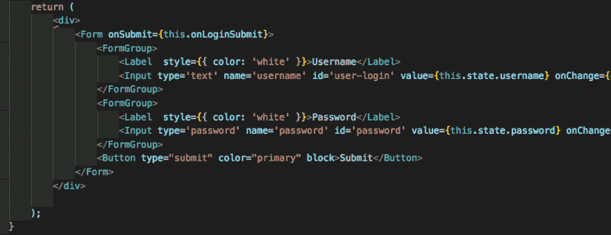
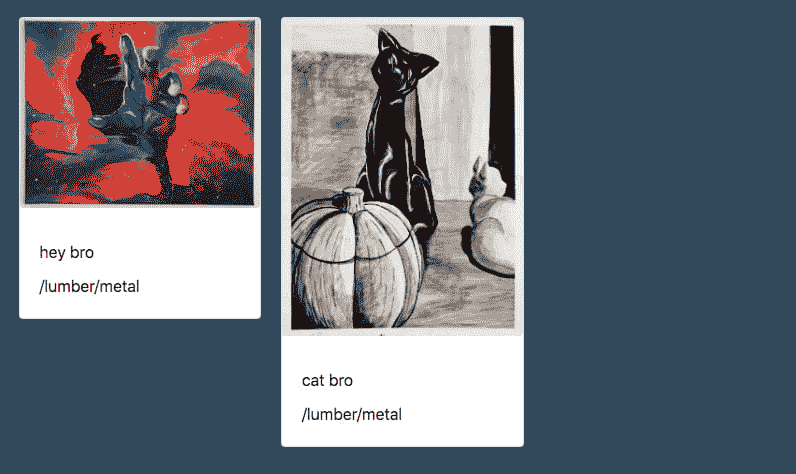
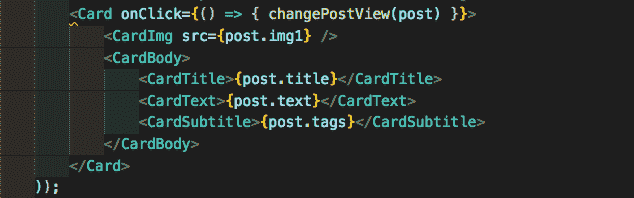
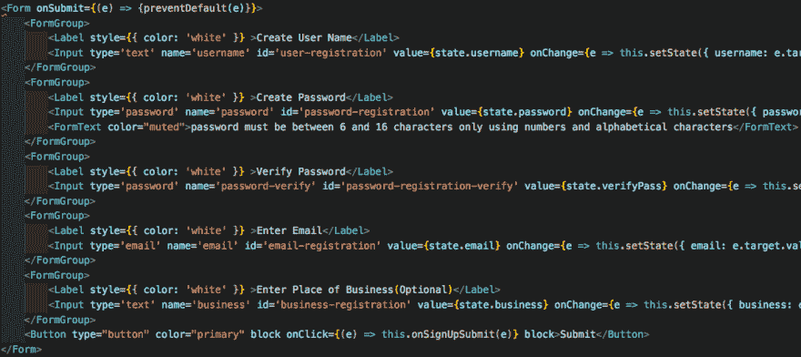
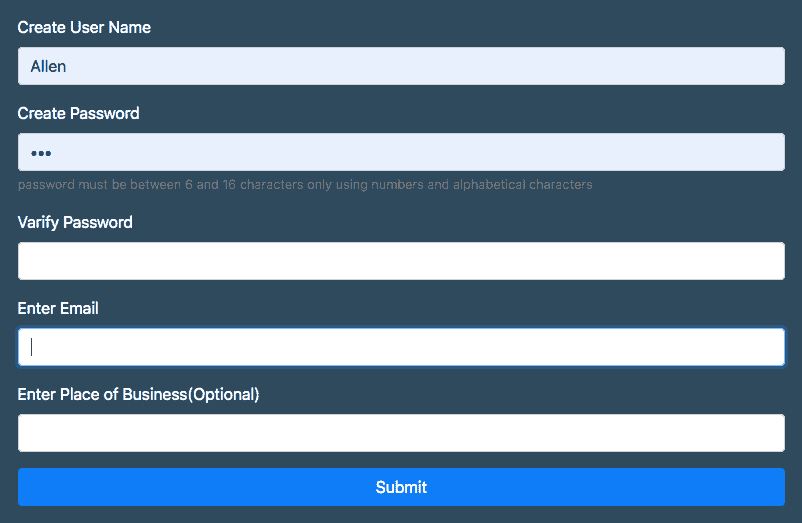

# ReactStrap 和你！

> 原文:[https://dev.to/wtschmidt/reactstrap-and-you-4o5e](https://dev.to/wtschmidt/reactstrap-and-you-4o5e)

React 是一个显示所有珍贵代码的伟大框架。它通过其独特的组件进行交流，这是一种动态而有趣的方式。但是如果你想使用 Bootstrap，一个用于 html、css 和 javascript 的开源开发工具包，它可以快速创建一个有趣的网页。

介绍 ReactStrap！它的作用只是提供一些额外的标记名，用于在页面上快速创建预构建的功能。例如，如果你想在你的页面上有一个按钮(<button>)，而不是通过设置全点击功能和一个悬停事件来指示它是可点击的，你可以只使用</button><button>来为你设置所有这些！

[T2】](https://res.cloudinary.com/practicaldev/image/fetch/s--23GKiD8---/c_limit%2Cf_auto%2Cfl_progressive%2Cq_auto%2Cw_880/https://thepracticaldev.s3.amazonaws.com/i/n5eiqdukf69n2xoiv2hw.png)

它还包括大量用于显示文本、图像和其他输入形式的选项，具有类似的功能。例如,“卡”标签将接收各种信息，并以一种漂亮、有序的方式显示出来。

[T2】](https://res.cloudinary.com/practicaldev/image/fetch/s--c_5D4wqd--/c_limit%2Cf_auto%2Cfl_progressive%2Cq_auto%2Cw_880/https://thepracticaldev.s3.amazonaws.com/i/6embmk8w17l8xzpb2ldy.png)

按和组织显示的属性

, being rows and columns. Each row can contain up to twelve columns depending on their size, which you set. When the combined size of each column reaches more than twelve, it will automatically set the next property underneath the last.

[T2】](https://res.cloudinary.com/practicaldev/image/fetch/s--rOzKzPVo--/c_limit%2Cf_auto%2Cfl_progressive%2Cq_auto%2Cw_880/https://thepracticaldev.s3.amazonaws.com/i/jgljbmvnu3nfv4knzfei.png)

作为说服你的最后一次尝试，reactStrap 使表单成为一个事后想法。只需创建一个

tag with required information and it'll do the rest for you! This includes a password input that will hide characters upon typing them, an email input that makes sure the input string matches the structure of an email, toggle switches that keep track of votes in a poll for example, and many more.

这个:

[T2】](https://res.cloudinary.com/practicaldev/image/fetch/s--ZMJA5BQm--/c_limit%2Cf_auto%2Cfl_progressive%2Cq_auto%2Cw_880/https://thepracticaldev.s3.amazonaws.com/i/bdqi9zymn2095tufgd8a.png)

渲染这个:

[T2】](https://res.cloudinary.com/practicaldev/image/fetch/s--iAhuJAf2--/c_limit%2Cf_auto%2Cfl_progressive%2Cq_auto%2Cw_880/https://thepracticaldev.s3.amazonaws.com/i/phpwbpg6aznko7sv9mrx.png)

总之，与其花几个小时在网站前端摸索 css，不如试试 reactStrap！安装学习又快又简单，省了很多时间，看起来也专业很多。</button>