# Ionic 4 PayPal 支付集成-用于应用程序和 PWA

> 原文:[https://dev . to/enappd/ionic-4-paypal-payment-integration-for-apps-and-pwa-1ck 4](https://dev.to/enappd/ionic-4-paypal-payment-integration-for-apps-and-pwa-1ck4)

* * *

PayPal 是使用最广泛、最容易集成到您的网站或应用程序中的支付网关之一。此外，它遍布全球，支持多种支付方式。与 Stripe 一起，PayPal 可以满足您几乎所有的支付需求，因此您不必去所有

[**Ionic 4 Full Payment app Starter - Enappd | Ionic, React native, Firebase themes, templates and…**
*Get the amazing UI and source code of full Payment app for your Ionic 4 project. Start your own Payment app…*store.enappd.com](https://store.enappd.com/product/ionic-4-full-payment-app-starter/ "https://store.enappd.com/product/ionic-4-full-payment-app-starter/")

### 什么是离子 4？

你可能已经知道离子，但我把它放在这里只是为了初学者。 **Ionic** 是 Drifty Co .的 Max Lynch、Ben Sperry 和 Adam Bradley 于 2013 年创建的一款用于混合移动应用开发的完整开源 SDK。Ionic 提供使用 CSS、HTML5 和 Sass 等 Web 技术开发混合移动应用的工具和服务。可以使用这些 Web 技术构建应用程序，然后通过本地应用程序商店分发，并利用 Cordova 安装在设备上。

所以，换句话说——如果你用 Android 创建原生应用，你就用 Java 编码。如果你在 iOS 中创建原生应用，你用 Obj-C 或 Swift 编码。这两种语言都是强大但复杂的语言。有了 Cordova(和 Ionic ),你可以为你的应用程序编写一段代码，它可以在 iOS 和 Android(以及 windows！)，HTML、CSS 和 JS 的简单性也是如此。

### Ionic 4 和支付网关

Ionic 4 可以创建各种各样的应用程序，因此可以在 Ionic 4 应用程序中实现各种各样的支付网关。流行的有 PayPal，Stripe，Braintree，应用内购买等。关于支付网关的更多细节，你可以阅读我关于 Ionic 4 中的[支付网关解决方案的博客。](https://medium.com/enappd/payment-solutions-in-ionic-8c4bb28ce5cc)

PayPal 可以集成在网站和移动应用程序中。PayPal SDK 有不同的集成方式。在这篇博客中，我们将学习如何在 Ionic 4 应用程序和 Ionic 4 PWA 中集成 PayPal 支付网关。

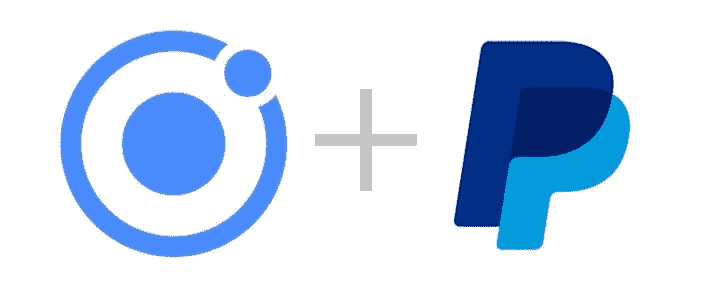

<figure>

<figcaption class="imageCaption">Ionic 4 and PayPal make a great team</figcaption>

</figure>

在这篇文章中，我们将学习如何为 Ionic 4 移动应用程序实现 Paypal 支付。我们可以按以下步骤分解帖子:

**步骤 1** —创建 Ionic 4 应用程序。我们将使用离子 4 边菜单启动器

**第 2 步** —创建一个 PayPal 开发人员账户，并对其进行配置以实现应用程序和 PWA 集成

**步骤 3** —使用 Ionic Native plugin for PayPal 在移动应用中实现支付

**第 4 步** —在 android 上构建应用程序以测试应用程序支付。

**步骤 5** —用 Javascript 配置 PayPal 网络集成

**第 6 步** —在`ionic serve`运行 PWA 测试网络支付

### 步骤 1 —创建一个基本的 Ionic 4 应用程序

创建一个基本的 Ionic 4 应用程序非常容易。假设您的系统中已经安装了所有的基本要求，运行

```
$ ionic start MyApp sidemenu
```

这将创建标题为`MyApp`和侧菜单模板的应用程序。

> 关于如何创建一个基本的 Ionic 4 应用程序的更多细节，请参考我的博客[如何创建一个 Ionic 4 应用程序](https://medium.com/enappd/how-to-create-an-ionic-4-app-for-beginners-e181e116190a)

稍加修改，我的主页看起来是这样的。

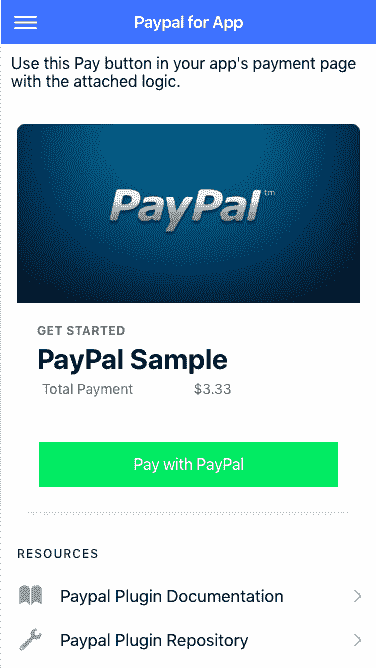

<figure>

<figcaption class="imageCaption">Paypal payment home page</figcaption>

</figure>

### 第 2 步—配置 PayPal 开发者账户

要在 Ionic 4 应用程序中配置 PayPal 支付，您需要创建一个商务 PayPal 帐户。出于测试目的，您可以使用沙盒测试帐户。沙盒测试将看起来完全像现场支付，但它不会从你的账户或信用卡中扣除任何钱。

要获取您的沙盒凭据，请按照以下步骤操作:

1.  转到[沙盒账户](https://developer.paypal.com/developer/accounts/)并创建一个沙盒企业和个人测试账户。
2.  转到[我的应用&凭证](https://developer.paypal.com/developer/applications/)并生成一个 [v.zero](https://developer.paypal.com/docs/bt-vzero-overview/) SDK 沙盒凭证，并将其链接到您的沙盒测试帐户。你需要一个沙盒帐户才能在应用的沙盒模式下进行支付。换句话说，当你的应用程序的 PayPal SDK 在沙盒模式下运行时，你不能用“实际的”PayPal 帐户进行支付，你需要一个沙盒帐户。
3.  前往[我的应用&凭证](https://developer.paypal.com/developer/applications/)并创建一个应用。这是与您的付款相关的应用程序。一个 PayPal 账户可以关联多个这样的应用程序(你可以在一个 PayPal 账户中从多个移动或网络应用程序中转移资金)


<figure>

<figcaption class="imageCaption">Create new app in PayPal account</figcaption>

</figure>

此外，从应用程序详细信息中记下您的**客户端 ID** 。这是你在应用程序中集成 PayPal 和测试支付所需要的。

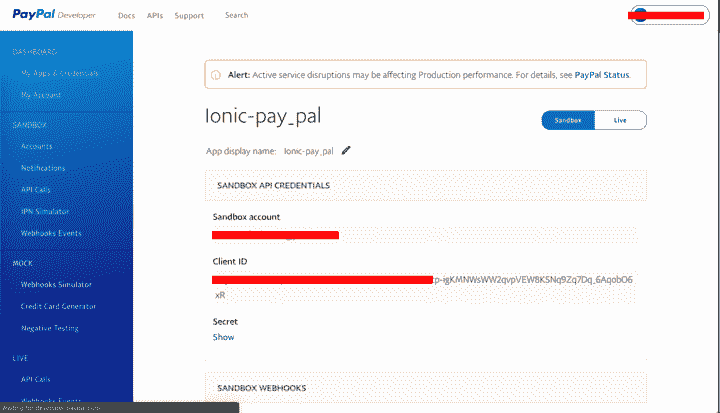

<figure>

<figcaption class="imageCaption">App details contain your Sandbox and Live client ID and secrets</figcaption>

</figure>

### 第 3 步—在移动应用程序中启用 PayPal 支付

#### 设置 PayPal 模块

要为 Ionic 安装 Paypal 插件，请使用

```
$ ionic cordova plugin add com.paypal.cordova.mobilesdk
```

```
$ npm install @ionic-native/paypal
```

这将安装 PayPal 插件。使用以下方式将 **PayPal** 导入您的组件

```
import { PayPal, PayPalPayment, PayPalConfiguration } from '@ionic-native/paypal/ngx';
```

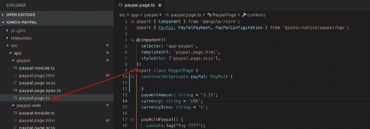

<figure>

<figcaption class="imageCaption">Import PayPal in paypal.page.ts file</figcaption>

</figure>

您还需要在您的`app.module.ts`文件的`providers`列表中包含`PayPal`。

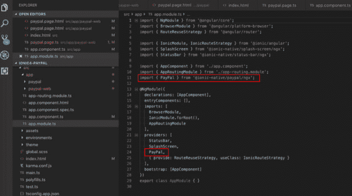

<figure>

<figcaption class="imageCaption">Import PayPal in your app.module.ts</figcaption>

</figure>

#### PayPal 支付功能

调用支付功能启动支付。正如在**步骤 2** 中提到的，你需要从你的 PayPal 账户中取出你的`client_id`。([如何从 PayPal 账户获取我的凭证](https://developer.paypal.com/docs/integration/direct/webhooks/my-apps-and-credentials/))。这个功能将被附加到我们之前在应用程序截图中看到的 **Pay with PayPal** 按钮上。

在`payWithPaypal()`函数中，我们将首先使用 PayPal 环境(沙箱或产品)初始化`PayPal`对象，为设备处理支付做准备。通过调用`prepareToRender()`方法，我们将传递我们之前设置的环境。最后，我们将呈现 PayPal UI，通过调用`renderSinglePaymentUI()` 方法向用户收取费用。

<figure>

完整的`paypal.page.ts`文件将如下所示

<figcaption class="imageCaption">page.ts file with PayPal payment function</figcaption>

</figure>

注意`PayPalEnvironmentSandbox`参数。这是用于沙盒环境。对于生产环境，将更改为`PayPalEnvironmentProduction`。当然，不要忘记在第二步中用你的沙盒客户端 ID 替换`YOUR_SANDBOX_CLIENT_ID`。

还要注意的是，为了举例，我们在逻辑中将`PaymentAmount`和`currency`设为静态，但是根据你的应用程序的要求，它们可以很容易地动态化。

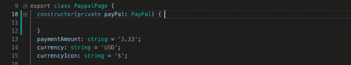

<figure>

<figcaption class="imageCaption">Static amount and currency for sample purpose</figcaption>

</figure>

一旦支付完成，PayPal SDK 将返回一个响应。上面的要点中显示了一个示例沙盒响应。人们可以使用这个响应向应用程序用户显示适当的*祝酒辞*或*警告*。

这是 PayPal 应用集成页面的 HTML 模板

### 第四步——开发安卓应用并测试支付。

要在 android 上构建应用程序，请依次运行以下命令

```
$ ionic cordova platform add android
```

```
$ ionic cordova prepare android
```

```
$ ionic cordova run android
```

最后一个命令将在默认模拟器或连接到您系统的 android 设备上运行该应用程序。点击**PayPal 付款**按钮后，您将看到 PayPal 付款屏幕

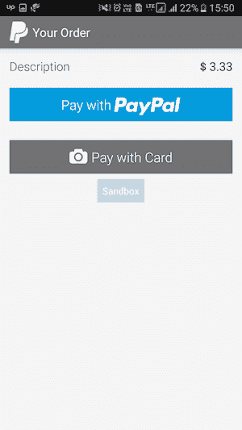

<figure>

<figcaption class="imageCaption">PayPal payment options screen</figcaption>

</figure>

你可以选择

*   **使用 PayPal 付款** —使用您的 PayPal 帐户，或
*   **用卡支付** —这将使用你手机的摄像头帮助读取你的信用卡(避免输入你的卡号、有效期等)

1.  **用 PayPal 支付**

你需要登录到你的**沙盒账户**进行支付(因为，记住，你是在沙盒环境中)

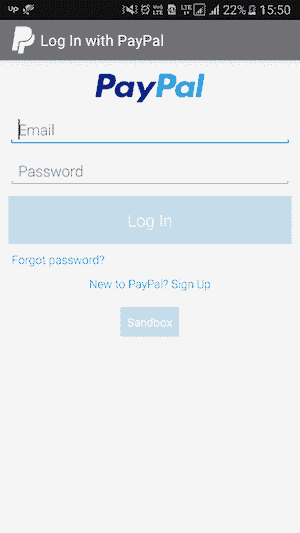

<figure>

<figcaption class="imageCaption">Sign in to your sandbox account to make test payments</figcaption>

</figure>

登录后，您将看到结账选项

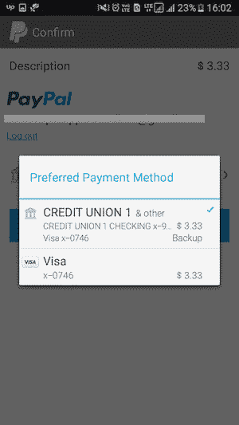

<figure>

<figcaption class="imageCaption">Payment options in your sandbox account</figcaption>

</figure>

选择一个选项，并支付虚拟金额。

2.**刷卡支付**

在这种情况下，你的应用程序的摄像头将打开扫描你的卡。

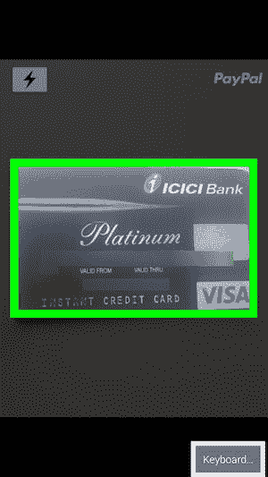

<figure>

<figcaption class="imageCaption">Scan your card</figcaption>

</figure>

一旦完成扫描，它将确认卡号，有效期，并要求您的 CVV 细节等。最后，它会显示一个确认屏幕，你继续支付金额。


<figure>

<figcaption class="imageCaption">Confirm payment with PayPal card payment</figcaption>

</figure>

在这两种支付情况下，您应该会收到一个成功的支付响应，类似于前面步骤 3 中显示的响应，或者如下所示


<figure>

<figcaption class="imageCaption">Successful payment response on Chrome console</figcaption>

</figure>

这就完成了 PayPal 支付的手机 app 部分。

### 第 5 步—配置 PayPal 网络集成

由于我们使用原生插件在 Ionic 4 应用中实现了 PayPal，因此它在浏览器环境中无法工作。所以我们不能在 Ionic Progressive Web App (PWA)中使用这个插件。但是我们可以在这种情况下使用 PayPal 前端 Javascript SDK。

> 警告:在网站或 PWA 中，建议在后端使用支付网关功能，因为前端实现可能会泄露您的客户 ID、机密等

#### PayPal 网络实施页面

对于 PWA 实现，我在应用程序中创建了一个`paypal-web`文件夹，并在侧菜单中附加了路线。

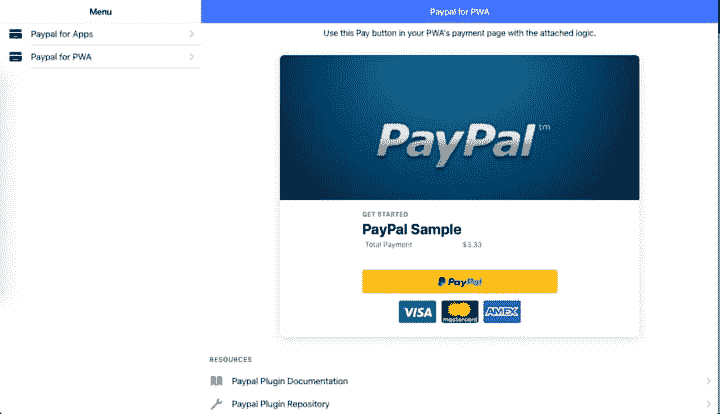

<figure>

<figcaption class="imageCaption">PayPal PWA implementation page</figcaption>

</figure>

对于网站前端实现，PayPal 提供了**支付按钮**(上图黄色按钮)**。**这些是预先配置的贝宝按钮+功能，附在一个 JS 文件，我们在我们的 PWA 的`index.html`

#### 导入 PayPal 脚本

首先，像这样将 PayPal JS SDK 导入到您的`index.html`中

```
<script src="https://www.paypal.com/sdk/js?client-id=sb&amp;currency=USD"&gt;&lt;/script>
```

现在，PayPal 官方文档告诉您在 index.html 自己编写逻辑的剩余部分。但是默认实现是好的，原因有两个

*   Ionic app 在 webview 环境下编译加载需要时间，所以渲染功能找不到按钮容器
*   我们需要将金额、货币等变量传递给函数。所以将函数放在 PWA 的 page.ts 文件中更有意义

#### 呈现支付按钮

在 HTML 模板中，我们将`ion-button`替换为

```
<div id="paypal-button-container"></div>
```

此`id`用于识别按钮，并为按钮附加正确的渲染和支付功能。

在 web 实现的逻辑中，我们将`createOrder`和`onApprove`功能附加到 **PayPal 按钮上。**web 实现`page.ts`文件如下所示

请注意，`.render(‘#paypal-button-container’)`部分实际上是在网页中呈现按钮的部分。

`onApprove`函数执行交易后的成功或错误部分。在这里，您可以用 REST API 调用您的服务器，并将成功的付款保存在您的 DB 中。

您可以在 [PayPal 支付按钮演示页面](https://developer.paypal.com/demo/checkout/#/pattern/client)尝试不同风格的支付按钮

### 第 6 步—测试 web/PWA 支付

当你点击支付按钮，贝宝脚本自动弹出一个所需功能的模式

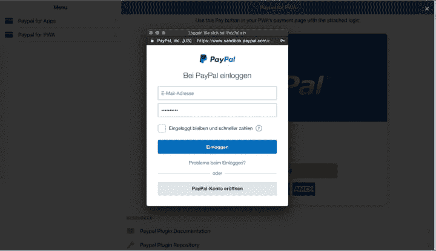

<figure>

<figcaption class="imageCaption">PayPal web script launches modal for login and payment</figcaption>

</figure>

使用沙盒帐户登录后，您将看到与应用程序实现中相同的选项

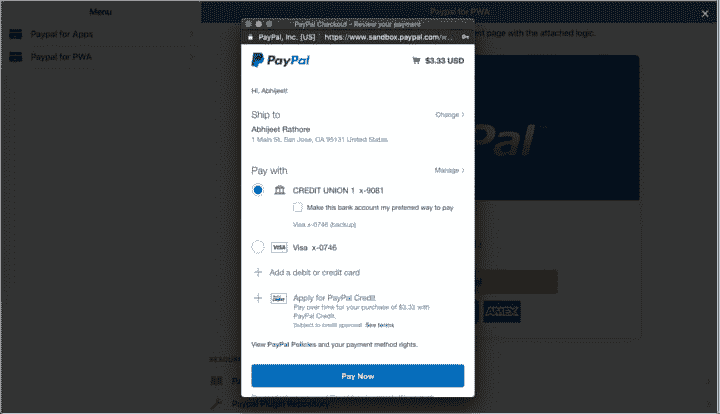

<figure>

<figcaption class="imageCaption">Payment options in your sandbox account — PayPal web implementation</figcaption>

</figure>

选择合适的方法，您的付款就完成了。响应对象将如下所示

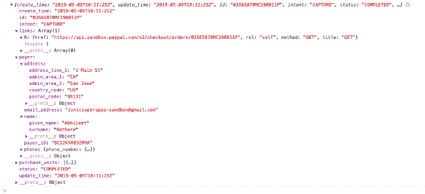

<figure>

<figcaption class="imageCaption">Response from PayPal web payments</figcaption>

</figure>

您可以很容易地使用响应来确定支付是否成功。

[**Ionic 4 Full Payment app Starter - Enappd | Ionic, React native, Firebase themes, templates and…**
*Get the amazing UI and source code of full Payment app for your Ionic 4 project. Start your own Payments app…*store.enappd.com](https://store.enappd.com/product/ionic-4-full-payment-app-starter/ "https://store.enappd.com/product/ionic-4-full-payment-app-starter/")

### 上线

在对应用程序和 PWA 进行测试后，当您想要上线时，您需要执行以下步骤

*   从您的 PayPal 帐户复制`production` client-ID，并在您的应用程序中使用

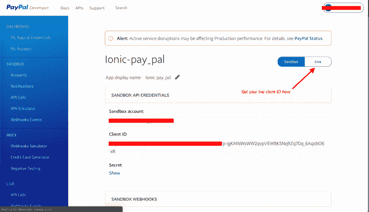

<figure>

<figcaption class="imageCaption">Get your live client-ID for production usage</figcaption>

</figure>

*   在 app 实现中，将`prepareToRender`函数中的`PayPalEnvironmentSandbox`改为`PayPalEnvironmentProduction`
*   在 web 实现中，将脚本导入更改为

```
<script src=”https://www.paypal.com/sdk/js?client-id=LIVE_CLIENT_ID"> </script>
```

现在，您可以通过 Ionic 4 应用程序和 PWA 进行支付并接受付款了。去享受吧，兄弟！


<figure>

<figcaption class="imageCaption">Let it rain !!!!</figcaption>

</figure>

### 结论

在这篇文章中，我们学习了如何将 PayPal 集成到 Ionic 4 应用程序以及 Ionic 4 渐进式网络应用程序中。使用沙盒帐户可以很容易地执行测试，我们可以通过简单地用 live-ID 更改沙盒客户端 ID 来上线。

敬请关注更多 Ionic 4 博客！

### 觉得这个帖子有意思？

查看我的另一篇文章 [Ionic 4 Stripe 支付集成——针对应用和 PWA](https://medium.com/enappd/ionic-4-stripe-payment-integration-with-firebase-for-apps-and-pwa-d2bfbf1a7e46)

也可以看看我们其他的博客文章，关于 Ionic 4 中的[Firebase](https://medium.com/enappd/how-to-use-firebase-with-ionic-4-complete-guide-for-beginners-1888b1034024)、Ionic 4 中的[地理定位](https://medium.com/enappd/using-geolocation-and-beacon-plugins-in-ionic-4-754b41304007)、Ionic 4 中的[二维码和扫描仪](https://medium.com/enappd/qr-code-scanning-and-optical-character-recognition-ocr-in-ionic-4-95fd46be91dd)以及 Ionic 4 中的[翻译](https://medium.com/enappd/how-to-translate-in-ionic-4-globalization-internationalization-and-localization-31ec5807a8bc)

### 需要免费离子 4 启动器？

你也可以在我们的网站[enappd.com](http://enappd.com)找到免费的离子 4 启动器

*   【Ionic 4 的免费聊天主题启动器
*   [自由离子 4-Phaser 游戏框架集成](https://medium.com/enappd/how-to-create-mobile-games-pwa-with-ionic4-and-phaser-7fb1e917678e)

你也可以使用 [Ionic 4 完整版应用](https://store.enappd.com/product/ionic-4-full-app/)制作你的下一个精彩应用

### 参考

*   [离子文件](https://ionicframework.com/docs)