# Ionic 4 的最佳健身插件-如何使用计步器

> 原文:[https://dev . to/ENA PPD/best-fitness-plugins-for-ionic-4-how-to-use-计步器-10m3](https://dev.to/enappd/best-fitness-plugins-for-ionic-4-how-to-use-pedometer-10m3)

* * *

如今，越来越多的人选择完全不去健身房，在适合他们的时间和地点健身——通过他们舒适的设备。有越来越多的应用程序补充你的锻炼计划，并保留你的数据历史，以分析你的健康状况。

鉴于日程安排得满满的，个人越来越难以将健康放在首位。这看起来像是一份全职工作。幸运的是，我们生活在 21 世纪，科技可以帮助我们。因此，现在是时候推出健康和健身领域的应用程序了。


<figure>

<figcaption class="imageCaption">Don’t be that minion</figcaption>

</figure>

用户的所有相关和必要的健康数据都可以在 Android 和 iOS 平台上获得。你可以通过处理这些数据和加入你的新想法、算法、逻辑来增加价值，从而提供新的有用的见解。

> 由于健康数据可能包含敏感的个人信息，应用程序必须获得用户的许可才能读取和修改数据。他们还必须采取措施随时保护这些数据。

在本帖中，我们将了解谷歌和苹果在其设备中提供的默认健康应用选项，以及如何连接您的 **Ionic 4 应用**以利用这些数据。

### 默认健身套餐

#### 健康工具包，iOS

iPhone 上的 HealthKit 为 iPhone 和 Apple Watch 上的健康和健身数据提供了一个中央存储库。在用户许可的情况下，应用程序可以与 HealthKit 商店进行通信，以访问和共享这些数据。

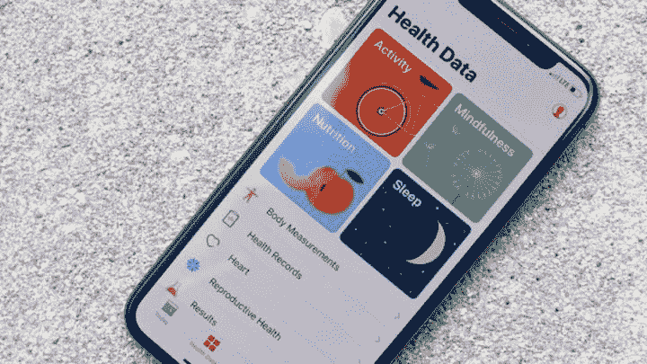

<figure>

<figcaption class="imageCaption">iOS HealthKit gives a complete bundle of health related data</figcaption>

</figure>

创建完整、个性化的健康和健身体验包括各种任务:

*   收集和存储健康和健身数据
*   分析和可视化数据
*   实现社交互动

Apple Health 的主仪表板名为 Health Data，将你的健康分为四个关键领域:活动、正念、营养和睡眠。

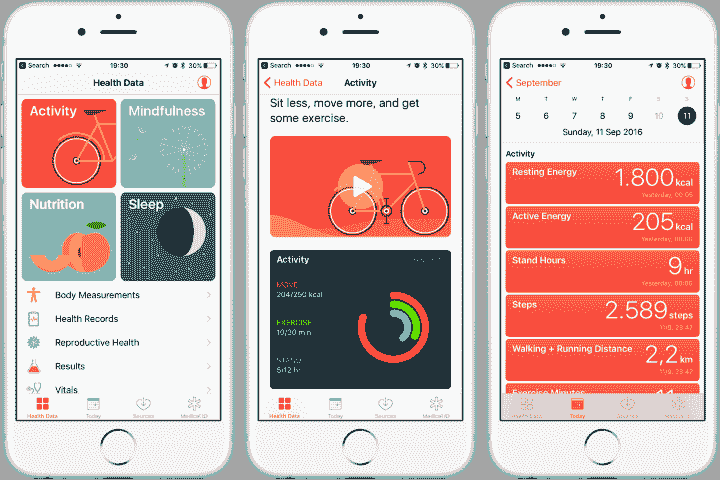

<figure>

<figcaption class="imageCaption">iOS Healthkit features</figcaption>

</figure>

HealthKit 应用程序采用协作方式来构建这种体验。HealthKit 应用程序允许与其他应用程序进行数据交换。你的应用不需要提供 HealthKit 的所有功能。相反，你可以只关注你最感兴趣的任务子集。

例如，用户可以选择他们最喜欢的体重跟踪、计步和健康挑战应用程序，每个应用程序都根据他们的个人需求进行校准。因为 HealthKit 应用程序可以自由交换数据(在用户许可的情况下)，所以组合套件比任何单独的应用程序都提供了更定制化的体验。例如，当一群朋友加入每天的计步挑战时，每个人都可以使用他们喜欢的硬件设备和应用程序来跟踪他们的步数，而组中的每个人都使用相同的社交应用程序进行挑战。


<figure>

<figcaption class="imageCaption">Ugh … that s**ks</figcaption>

</figure>

HealthKit 还设计用于管理和合并来自多个来源的数据。例如，用户可以在健康应用程序中查看和管理他们的所有数据，包括添加数据、删除数据和更改应用程序的权限。因此，你的应用需要处理这些变化，即使它们发生在你的应用之外。

#### 谷歌健身，谷歌


<figure>

<figcaption class="imageCaption">Google Fit is similar to iOS HealthKit</figcaption>

</figure>

Google Fit 是谷歌为 Android 操作系统开发的健康跟踪平台。它是一组 API，融合了来自多个应用程序和设备的数据。Google Fit 使用用户活动跟踪器或移动设备中的传感器来记录身体健康活动(如步行或骑自行车)，根据用户的健康目标进行测量，以提供对其健康状况的全面了解。它让

*   用户控制他们的健身数据
*   开发人员构建更智能的应用程序
*   制造商专注于创造令人惊叹的设备。

Google Fit 允许开发人员将健身数据上传到中央存储库，用户可以在一个位置从不同的设备和应用程序访问他们的数据:

*   健身应用可以存储来自任何可穿戴设备或传感器的数据。
*   健身应用程序可以访问其他应用程序创建的数据。
*   当用户升级健身设备时，他们的健身数据会被保存。

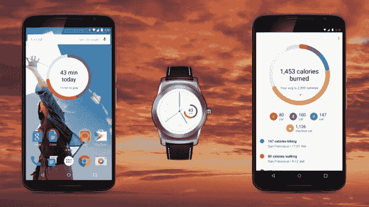

<figure>

<figcaption class="imageCaption">Google Fit syncs across devices</figcaption>

</figure>

由于您从 Google Fit 读取健身数据，因此还需要将您收集的健身数据写入 Google Fit。

Google Fit APIs 被禁止用于非健身目的，如存储医疗或生物识别数据、出售数据或使用数据做广告。

### Ionic 4 中的健身插件

现在让我们看看如何在 Ionic 4 应用程序中使用健身数据

#### 1.健康工具包插件

HealthKit 插件允许你从 iOS 8+ HealthKit 框架读取数据和向其写入数据。任何存储的数据都会显示在 iOS 健康应用程序中，并可用于其他 iOS 应用程序。

#### 2.健康

一个抽象健身和健康库的插件，如苹果健康工具包或谷歌健身。这是所有可用插件中最广泛的一个。

#### 3.步数计

获取与行人相关的计步器数据，如步数和其他有关行驶距离的信息。

#### 4.计步器

用于在 Android 上使用设备计步器的 Cordova 插件(API > 19)

我们将详细介绍**健康插件**，它是所有插件中最广泛的。所有其他插件将以类似的方式运行。

### Ionic 4 健康插件

#### 安装插件

首先，我们需要一个基本的 Ionic 4 应用程序。如果你是初学者，你可以看看我们的博客[如何创建 Ionic 4 应用](https://medium.com/enappd/how-to-create-an-ionic-4-app-for-beginners-e181e116190a)。一旦你有了一个基本的 Ionic 4 应用程序，通过

```
$ ionic cordova plugin add cordova-plugin-health
$ npm install @ionic-native/health
```

#### 在您的页面中导入插件

使用以下命令在页面/组件中导入插件

```
import { Health } from '@ionic-native/health/ngx';
```

```
constructor(private health: Health) { }
```

#### 在应用程序提供商中包含插件

同样导入`**app.module.ts**`中的插件提供者，并将插件包含在提供者数组中

```
import { Health } from '@ionic-native/health/ngx';
```

```
@NgModule({
...
providers: [
...,
Health,
{ provide: RouteReuseStrategy, useClass: IonicRouteStrategy }
],
bootstrap: [AppComponent]
})
```

#### 检查平台是否准备好

需要注意的一点是，只有当平台准备好了，才可以访问插件。否则它将抛出错误`plugin not installed`或者可能它不会抛出任何错误，但就是不工作。

```
ngOnInit() {
    this.checkPlatformReady();
}
```

```
async checkPlatformReady() {
    const ready = !!await this.platform.ready();
    if (ready) {
        // Use plugin functions here
    }
}
```

#### iOS 怪癖

这只是 iOS 中的一个要求。对于任何想要读取/写入私人数据的应用程序，该应用程序都会请求用户的许可以及使用说明。对于我们的健康插件，我们需要`read`和`write`许可。这些可以在 Xcode 的`info.plist`中设定。如果没有这个，当你尝试运行除了`isAvailable()`以外的任何功能时，应用程序将在 iOS 中崩溃

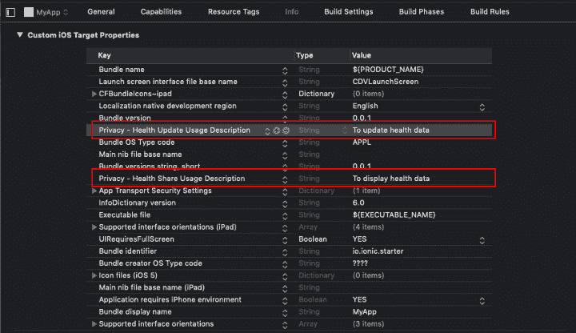

<figure>

<figcaption class="imageCaption">Add app’s usage description for using Apple’s Health Kit</figcaption>

</figure>

此外，安装此插件时，请确保您的应用程序 id 拥有“HealthKit”权限。如果您使用 Cordova-ios 4.3.0 或更高版本，这将自动添加到您的应用程序中。

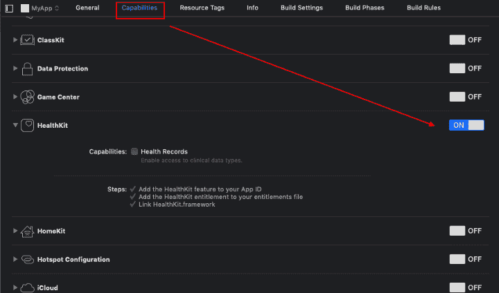

<figure>

<figcaption class="imageCaption">Enable HealthKit entitlement for your app in Xcode</figcaption>

</figure>

您需要在应用的预置描述文件中拥有 HealthKit 授权。

### 方法

#### isAvailable()

告知 Google Fit 或 HealthKit 是否可用。

#### promptInstallFit()

检查是否安装了最新的 Google Play 服务和 Google Fit。如果播放服务没有安装，或者过时，它会显示一个弹出窗口，建议下载它们。

#### 请求授权()

请求对一组数据类型的读写访问权限。在使用查询和存储方法之前，必须调用此方法，即使在过去的某个时间点已经进行了授权。如果不这样做，可能会导致你的应用程序崩溃，或者在 Android 的情况下，Google Fit 可能还没有准备好。

```
this.health.requestAuthorization([
'distance', 'nutrition',  //read and write permissions
 {
    read: ['steps','height', 'weight'],//read only permission
    write: ['height', 'weight']  //write only permission
 }
])
.then(res => console.log("response " + res))
.catch(e => console.log("error "+e));
```

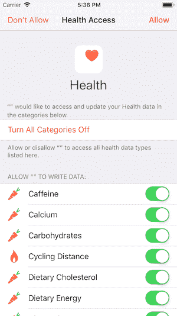

<figure>

<figcaption class="imageCaption">App requesting permission from iOS Health Kit</figcaption>

</figure>

#### 查询()

该方法获取特定时间窗口内特定数据类型的所有数据点。这就是健康插件的精髓，使用这个功能我们可以从 iOS 健康工具包和 Google Fit 中读写数据。

首先，我们在 iOS HealthKit 数据集中有一些样本数据

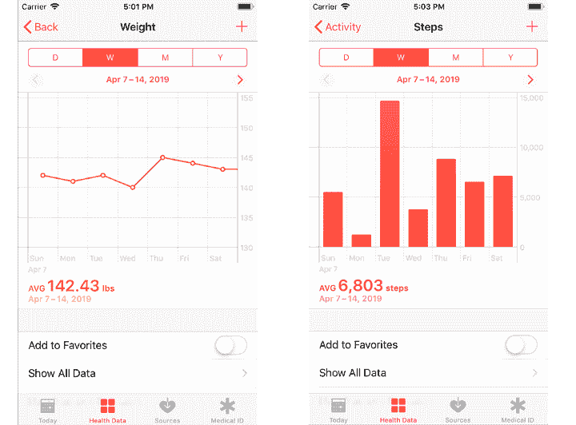

<figure>

<figcaption class="imageCaption">iOS Healthkit dataset for sample data</figcaption>

</figure>

示例查询

```
this.health.query({
  startDate: new Date(new Date().getTime() - 10*24*60*60*1000 ), 
  // ten days ago
  endDate: new Date(), // now
  dataType: 'steps',
  limit: 1000
}).then(data=>{
  console.log(data);
}).catch(e => {
  console.log("error "+ e);
})
```

在执行上面的`query`时，您将得到类似于下面的结果(假设您在 HealthKit 中有数据)

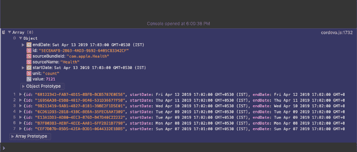

<figure>

<figcaption class="imageCaption">Steps data from last 10 days — Safari debug console</figcaption>

</figure>

例如，我们的示例回购中的数据显示如下所示的 10 天数据

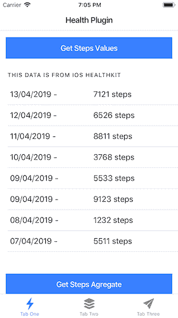

<figure>

<figcaption class="imageCaption">Past 10 days steps data from iOS HealthKit</figcaption>

</figure>

#### queryAggregated()

另一种查询方法，但它返回值的总和，而不是单个值。例如，当您想要检查最近一周走过的步数时。

```
this.health.queryAggregated({
  startDate: new Date(new Date().getTime() - 10*24*60*60*1000 ), 
  // ten days ago
  endDate: new Date(), // now
  dataType: 'steps',
  bucket: 'week'
}).then(data=>{
  console.log(data);
}).catch(e => {
  console.log("error "+ e);
})
```

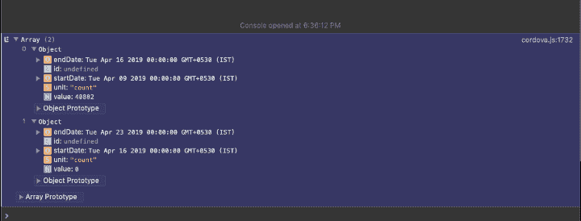

<figure>

<figcaption class="imageCaption">Aggregated steps data from last 10 days, week wise — Safari debug console</figcaption>

</figure>

例如，我们示例回购中的数据显示了按周分组的 10 天数据，如下所示

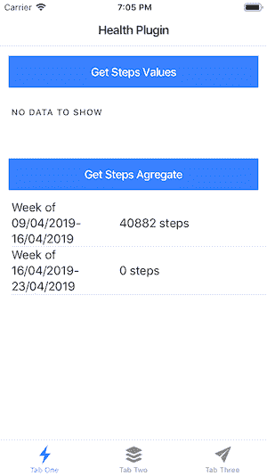

<figure>

<figcaption class="imageCaption">10 days Steps data aggregated into weeks</figcaption>

</figure>

#### 商店()

这种方法可以用来将 Ionic 4 应用程序中的数据存储到 HealthKit 或 Google Fit 中

```
this.health.store({
  startDate: new Date(new Date().getTime() - 3*60*1000 ), 
  // three minutes ago
  endDate: new Date(), // now
  dataType: 'steps',
  value: 180,
  sourceName: 'my_app',
  sourceBundleId: 'com.example.my_app'
}).then(data=>{
  console.log(data);
}).catch(e => {
  console.log("error "+ e);
})
```

关于健康插件的数据类型、方法和怪癖的更多细节可以在官方插件 github repo 上找到。

在这里可以找到苹果官方的健康工具包文档。

此外，确保你的应用和 AppStore 描述符合这些[苹果审查指南](https://developer.apple.com/app-store/review/guidelines/#healthkit)。

### HealthKit 和 Google Fit 的区别

*   HealthKit 包括医疗数据(例如血糖)，而 Google Fit 主要用于健身数据(尽管[现在也支持一些医疗数据](https://developers.google.com/android/reference/com/google/android/gms/fitness/data/HealthDataTypes))。
*   HealthKit 提供了一个不可扩展的数据模型，而 Google Fit 允许定义自定义数据类型。
*   HealthKit 允许插入带有您选择的测量单位的数据，并在查询时自动转换单位，而 Google Fit 使用固定的测量单位。
*   当你随身携带手机并且手机装有 CoreMotion 芯片时，HealthKit 会自动计算步数和距离。Google Fit 在硬件芯片上独立完成，还可以检测活动类型(久坐、跑步、步行、骑自行车、在车内)。
*   HealthKit 只能计算跑步/步行活动的距离，而 Google Fit 也可以为自行车活动计算距离。

### 结论:

在这篇文章中，我们介绍了 iPhone 和 Android 设备中可用的健身包。这些健身包本身就是一个完整的功能包。但是，当你想要为自己的 Ionic 4 应用程序提供这些健身数据，或者想要将健身数据写入默认的设备健身包时，你可以通过几个不同的 Ionic 原生插件来实现。

Ionic Health 插件是这些插件中最广泛的，它允许对 iOS HealthKit 和 Google Fit 进行读写操作。它有多种查询数据集，可以为您的应用程序执行多种功能。

* * *

### 参考

*   [https://developer . apple . com/documentation/health kit #//apple _ ref/doc/uid/TP 40014707](https://developer.apple.com/documentation/healthkit#//apple_ref/doc/uid/TP40014707)
*   [https://www . Forbes . com/sites/leebelltech/2019/01/02/best-health-and-fitness-apps-2019/# 45a 72 f 9 DCA 53](https://www.forbes.com/sites/leebelltech/2019/01/02/best-health-and-fitness-apps-2019/#45a72f9dca53)
*   [https://www . ware able . com/apple/how-to-use-apple-health-iphone-fitness-app-960](https://www.wareable.com/apple/how-to-use-apple-health-iphone-fitness-app-960)
*   [https://developers.google.com/fit/](https://developers.google.com/fit/)
*   [https://alternativeto.net/software/google-fit/](https://alternativeto.net/software/google-fit/)
*   [https://www . Android central . com/Google-fit-integration-and-why-you-want-it](https://www.androidcentral.com/google-fit-integration-and-why-you-want-it)
*   [https://www . ware able . com/Android-wear/Android-wear-Google-fit-watch-face-widget-lands-along-by-extra-data-1143](https://www.wareable.com/android-wear/android-wear-google-fit-watch-face-widget-lands-along-with-extra-data-1143)