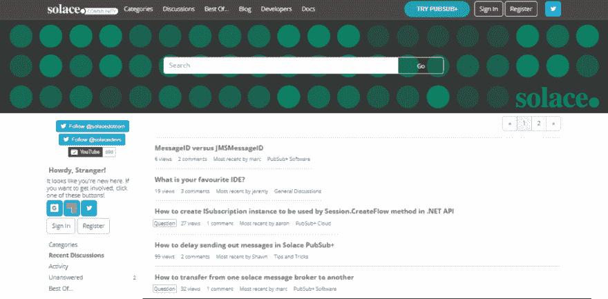
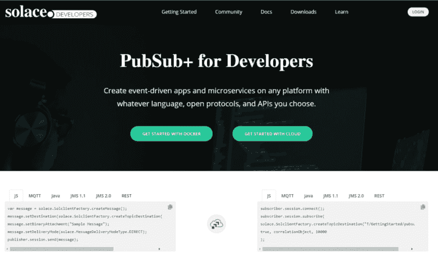

# 将我们对开发者的承诺提升到一个新的高度

> 原文:[https://dev . to/solace devs/taking-our-commitment-to-developers-to-the-next-level-45b 6](https://dev.to/solacedevs/taking-our-commitment-to-developers-to-the-next-level-45b6)

[T2】](https://res.cloudinary.com/practicaldev/image/fetch/s--NqbU5CDv--/c_limit%2Cf_auto%2Cfl_progressive%2Cq_auto%2Cw_880/https://solace.com/wp-content/uploads/2019/07/chat-app-blog-featured-image.jpg)

园艺经常被用来比喻社区，这是有道理的。你从一个需求(新鲜水果蔬菜)开始；你规划好，准备好土壤，种下种子；然后你给你的花园提供你认为它茁壮成长所需要的资源(水、养分、杀虫剂)。你的最终结果可能会因许多因素而异，但是如果你知道你在做什么，并遵循这些步骤，你会有一个很好的主意。

开发者社区也是如此。就像在一个花园里，你从需求开始，规划社区，播种，并给予它茁壮成长所需的资源。播下种子是关于参与和布道——通过在活动中举办研讨会来传播信息，接触开发人员并获得他们的反馈，以及发布开发人员关心的技术内容、样本和教程。

除了 Mountain Dew 和 pizza，开发者社区需要的主要资源是一个空间，在这里他们可以分享他们正在做的事情，与他人就想法进行合作，在需要时向他人寻求帮助，并分享他们对《星球大战》或漫威的电影宇宙是否是最佳电影系列的想法(提示:只有一个正确答案)。

## 推出我们的社区论坛

这就是为什么我如此激动地宣布我们的[专用社区论坛](https://solace.community/)的启动。这是一个漫长的过程，也反映了开发者在 Solace 中扮演的重要角色。使用 Vanilla Forums，一个论坛软件的领导者，来自各种背景和经历的社区成员将能够进行社交，共享资源，一起组织项目，并互相帮助。

[T2】](https://solace.community)

作为该社区论坛的一部分，您将开始看到一些东西，如提示和技巧、教程、一般讨论以及 PubSub+软件和云主题、问题和答案。我们鼓励你在任何你想参与的地方参与进来。

## **增加我们以开发者为中心的内容**

我们重新关注开发者的另一个方面是我们正在创建的内容。如果你还没有注意到的话，我们已经在我们的[博客](https://solace.com/blog/category/developers/)上增加了以开发者为中心的内容，并在互联网上开发者内容的最大位置 [Dev.to](http://dev.to/solacedevs) 上发布。我们最近还推出了改进后的[开发者门户](https://solace.dev/)，以及[教程](https://docs.solace.com/Developer-Tutorials/Developer-Tutorials.htm)、[示例](https://github.com/SolaceSamples)和[快速入门](https://docs.solace.com/Developer-Tools/QuickStarts-Connectors/Quickstarts-Connectors.htm)。

[T2】](https://www.solace.dev/)

### 结论

从您对我们产品的想法到我们如何为您提供必要的工具和资源来帮助您取得成功，我们非常乐意听取您的意见。所有类型的反馈都很重要，我们珍惜我们能得到的每一点反馈！

帖子[将我们对开发者的承诺提升到了一个新的水平](https://solace.com/blog/commitment-to-developers/)最先出现在[安慰](https://solace.com)上。