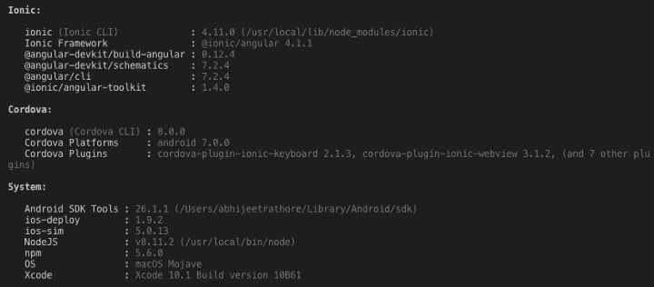
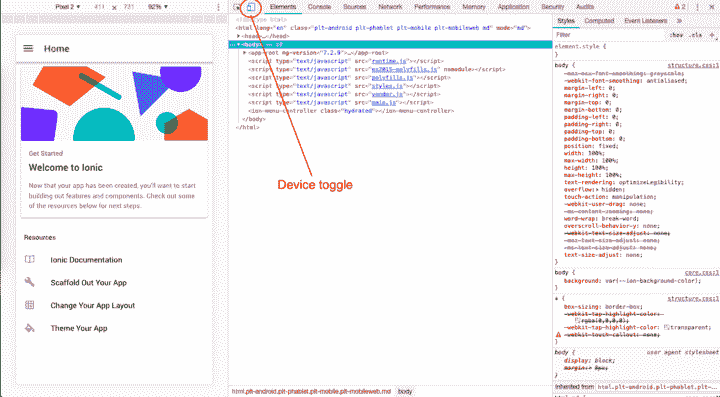
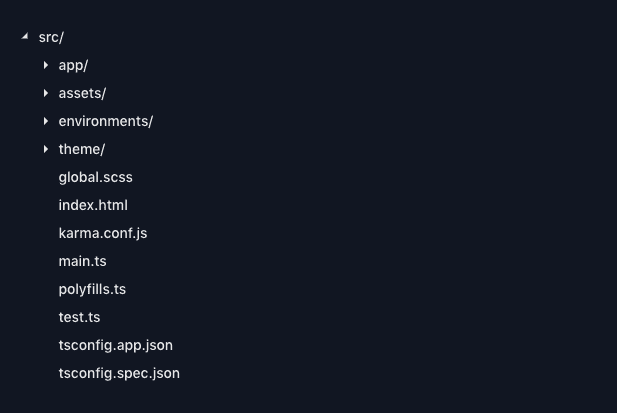
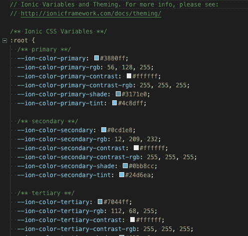
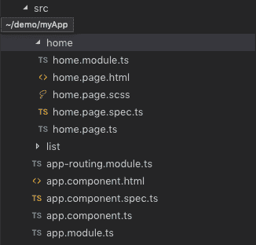
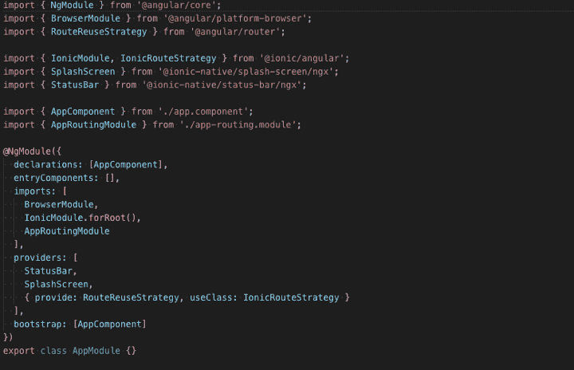
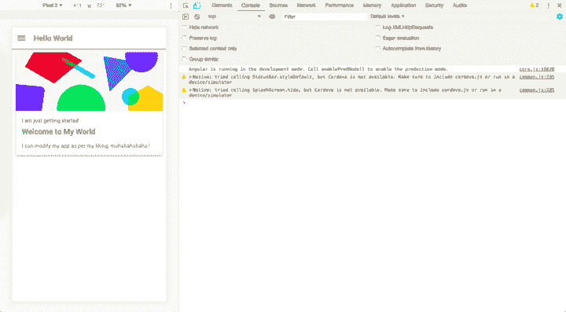
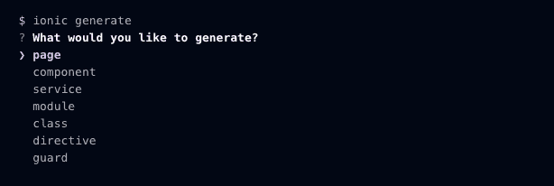

# 如何为初学者创建一个 Ionic 4 应用程序

> 原文:[https://dev . to/enappd/how-to-create-an-ionic-4-app-for-初学者-efd](https://dev.to/enappd/how-to-create-an-ionic-4-app-for-beginners-efd)

* * *

混合应用在最近几年引起了轰动，这是有原因的。凭借其易于开发、强大的性能和多用途的可能性，混合应用在许多前沿领域击败了本地应用。在过去的几年里，Ionic 一直处于混合应用程序开发的前沿，而且它正在变得越来越好。随着最新 **Ionic 4 框架**的发布，app 的整体稳定性又上去了。

我们已经在 **Ionic 4** 中写了一段时间的复杂话题。在这篇博文中，我们将了解一个 **Ionic 4** 应用的基本方面以及如何创建一个。

### 爱奥尼亚和科尔多瓦是什么？

**Ionic** 是 Drifty Co .的 Max Lynch、Ben Sperry 和 Adam Bradley 于 2013 年创建的一款用于混合移动应用开发的完整开源 SDK。Ionic 提供使用 CSS、HTML5 和 Sass 等 Web 技术开发混合移动应用的工具和服务。可以使用这些 Web 技术构建应用程序，然后通过本地应用程序商店分发，并利用 Cordova 安装在设备上。

Cordova 使软件程序员能够使用 CSS3、HTML5 和 JavaScript 为移动设备构建应用，而不是依赖于 Android、iOS 或 Windows Phone 中的特定平台 API。它扩展了 HTML 和 JavaScript 的特性，使之能与设备一起工作。

> Ionic 实际上是科尔多瓦上的另一个包装。Cordova 具有基本的 HTML/CSS/JS → Native 功能，而 Ionic 则在 Cordova 的基础上提供了更整洁、更强大的布局和全面的应用管理

所以，换句话说——如果你用 Android 创建原生应用，你就用 Java 编码。如果你在 iOS 中创建原生应用，你用 Obj-C 或 Swift 编码。这两种语言都是强大但复杂的语言。有了 Cordova(和 Ionic ),你可以为你的应用程序编写一段代码，它可以在 iOS 和 Android(以及 windows！)，HTML、CSS 和 JS 的简单性也是如此。

Ionic 一开始是以 AngularJS 作为底层框架，现在已经扩展到 [Angular](https://en.wikipedia.org/wiki/Angular_%28application_platform%29 "Angular (application platform)") 甚至 [React](https://reactjs.org/) ！

### 设置 Ionic 4 应用程序

那么 Ionic 4 app 开发需要哪些工具呢？嗯，这是清单

*   一台电脑(咄！)
*   已安装 NodeJS 框架— NodeJS 是 JS 中的服务器框架
*   NPM —节点程序包管理器
*   Cordova —需要在设备上构建，而不是在浏览器上构建
*   离子的

您还需要最新的开发环境浏览器。要在 Android 和 iOS 中创建生产版本，分别需要 [Android Studio](https://developer.android.com/studio) 和 [XCode](https://developer.apple.com/xcode/) 。

通过从他们的[网站](https://nodejs.org/en/)下载兼容的包来安装 node。NPM 与 node.js 一起安装。NPM 用于任何进一步的安装。

要验证安装，请在终端中运行以下命令

```
$ node --version
$ npm --version
```

使用安装离子

```
$ npm install -g ionic
```

你可以走了。使用检查您的环境信息

```
$ ionic info
```

这将显示您的运行时环境，如下所示(Android SDK 工具和 XCode 需要单独安装)



<figure>

<figcaption class="imageCaption">Development environment information</figcaption>

</figure>

你可以从他们的网站上安装最新的 Android Studio。 [XCode](https://developer.apple.com/xcode/) 只能安装在苹果系统上。

### 创建 Ionic 4 应用程序

一旦你的开发环境设置好了，创建一个 Ionic 4 应用程序就像运行一个命令一样简单

```
$ ionic start
```

真的，这就是创建一个 Ionic 应用程序所需要的全部。运行该命令后，Ionic CLI 将显示提示，询问新项目的名称以及要使用的模板(侧菜单、制表符或空白)。点击回车键，它将在你的系统上安装基本的应用程序模板

要在浏览器中运行应用程序，请在您的项目根目录中运行它

```
$ ionic serve
```

这将在默认浏览器的开发环境中运行应用程序。网址将会是`localhost:8100`

> Ionic 中的开发环境不(可以)使用 Cordova。Cordova 只能在设备上运行。所以你不能在浏览器环境中使用 Ionic 原生插件。Ionic 开发环境仅使用底层 Angular(或 React)在浏览器上运行应用程序

假设你运行了`ionic start myApp sidemenu`，你将会在你的 chrome 中加载一个侧菜单模板。要以移动格式查看，在浏览器中右键单击，并选择`Inspect Element`。使用设备图标切换设备模式。



<figure>

<figcaption class="imageCaption">First run on browser, in device mode</figcaption>

</figure>

所以现在你已经有了在浏览器中运行的 Ionic 应用，是时候理解代码结构了，然后做一些改变。

### 代码结构

每次使用`ionic start`创建应用程序时，Ionic 都会创建一个默认结构。让我们了解一下结构



<figure>

<figcaption class="imageCaption">Basic structure of Ionic app</figcaption>

</figure>

`src` —此文件夹包含应用程序的大部分代码。所有页面、服务、组件和样式都位于其中。

`assets` —该文件夹包含项目的所有静态文件——图像、字体等。

`environments` —该文件夹可用于定义环境设置。默认情况下，它有两个文件，一个用于`dev`，一个用于`prod`环境。这些设置可以相同也可以不同，取决于您的`dev`与`prod`配置。例如，您可以为开发定义一个服务器配置，而为`prod`环境定义另一个生产服务器配置。

`theme` —主题文件夹可用于定义样式变量。Ionic 4 使用 CSS 变量来定义各种样式参数，如原色、字体大小、字体系列等等。您可以使用该文件夹创建全局样式变量。



<figure>

<figcaption class="imageCaption">Example of Ionic styling variables</figcaption>

</figure>

`global.scss` —定义应用于整个应用程序的全局样式。

`index.html` —是启动应用程序的主 HTML 文件。毕竟，Ionic 应用是建立在网络视图上的。

在`src`文件夹中，有默认的`app`文件，其中包含应用程序的全局设置



<figure>

<figcaption class="imageCaption">Folder structure inside src folder</figcaption>

</figure>

`app.routing.module.ts` —包含与页面导航相关的信息

`app.component.html` —定义应用程序的父 HTML。在我们的例子中，它包含 sidemenu

`app.component.ts` —是`app.component.html`的 Javascript 文件。一般来说，任何需要在应用程序加载后立即运行的代码都写在这个文件中。

`app.module.ts` —是父模块的“模块”文件，也可以说是整个应用的“模块”文件。它定义了应用程序中包含哪些模块。在构建产品版本时，这是一个非常重要的文件。



<figure>

<figcaption class="imageCaption">app.module.ts file initial structure</figcaption>

</figure>

你可以在上面的图片中看到导入的基本模块。让我们试着多理解一些这里的事情。

### 高级—了解 app.module.ts

#### 声明

在**声明**部分，我们需要包含我们作为应用程序的一部分创建的所有**组件**、**指令**和**管道**。如果你没有在这里包含它们，当你试图在你的应用程序中使用它们时，你会得到一个错误，因为 Angular 将不能在你的代码中识别它们。

#### 进口

在 **imports** 部分中，我们看到**io cinmodule**被导入，并且它设置了根 app 组件。

**IonicModule** 包含来自 Ionic 框架的所有组件、指令和服务，通过在此处导入模块，我们可以将这些内容应用到我们的应用中。

**批准模块**也在这里导入。您可以在此处导入您可能想要在应用程序中使用的其他角度模块。

#### 引导程序

在 **bootstrap** 部分，我们配置在应用程序启动时创建哪些组件。

通常，在这个数组中你只能找到一个组件。在这种情况下，那就是 **AppComponent** ，它是 Ionic 的根组件，负责加载我们的 **MyApp** 组件。

如果你看一下**index.html**，你会看到`<body>`中包括**离子键**的选择器`<ion-app>`。在应用程序启动时，Angular 将创建一个根组件的实例，并将其插入到`<ion-app>`元素的位置。

```
<!-- Ionic's root component and where the app will load -->  
<ion-app></ion-app>
```

#### 入口组件

在 **entryComponents** 部分，我们定义了需要与该模块一起加载的任何组件。所有页面组件都是如此，因为它们都是通过导航控制器加载的。

以声明方式加载的组件(即在另一个组件的模板中被引用)不需要包含在 **entryComponents** 数组中。

可能会有一些重复，我们必须在**声明**和 **entryComponents** 部分定义页面组件。拥有这个单独的 **entryComponents** 部分的原因是 Angular 可以为应用程序编译一个包，其中只包括应用程序中实际使用的组件。

当您想要一个更小的第一个部署包时，动态加载模块是很有用的，并且**延迟加载**随后将到来的模块/页面。你可以在这里阅读更多关于懒加载[的内容。](https://blog.ionicframework.com/ionic-and-lazy-loading-pt-1/)

#### 提供者

在 **providers** 部分，我们可以注册依赖注入的服务。当您在应用模块中注册服务时，它可以在您的应用中的所有组件中使用。但是，如果没有在全局范围内使用服务，您总是可以在本地为页面定义服务。

### 修改应用程序

所以我们有了一个基本的模板。我们了解这个结构，现在我们想根据自己的喜好修改这个应用程序。确保`ionic serve`进程正在终端中运行。

我们来修改一下 app 的主页，它驻留在`src/app/home`文件夹中。

转到`home.page.html`并将代码改为如下

```
<ion-header>
  <ion-toolbar>
    <ion-buttons slot="start">
      <ion-menu-button></ion-menu-button>
    </ion-buttons>
    <ion-title>
      Hello World
    </ion-title>
  </ion-toolbar>
</ion-header>
```

```
<ion-content>
  <ion-card class="welcome-card">
    <ion-img src="/assets/shapes.svg"></ion-img>
    <ion-card-header>
     <ion-card-subtitle>I am just getting started</ion-card-subtitle>
     <ion-card-title>Welcome to My World</ion-card-title>
    </ion-card-header>
    <ion-card-content>
     <p>I can modify my app as I like, muhahahahaha !</p>
    </ion-card-content>
  </ion-card>
</ion-content>
```

保存您的文件。一旦你保存了文件，你会看到应用程序在终端重新编译。浏览器中的应用程序会自动更新以显示此信息



<figure>

<figcaption class="imageCaption">Make your first modification in Ionic 4 app</figcaption>

</figure>

您已经成功修改了一个 Ionic 应用程序。现在你可以继续添加更多的页面，更多的逻辑，图像，文本等等。做成特色 app！

#### 添加新页面

在 Ionic 中，添加新页面或组件是非常系统的。您可以使用命令

```
$ ionic generate
```

它会问你一些问题来创建新的代码



<figure>

<figcaption class="imageCaption">Generate new page, component etc in Ionic is very easy</figcaption>

</figure>

或者您可以使用直接 CLI 命令一步完成

```
$ ionic g page "My new page"
```

使用这个命令，Ionic 将为模块创建所需的文件。例如，对于一个页面，它会创建 HTML、SCSS、`module.ts`和`page.ts`文件。

### 结论

这个博客是对 Ionic 4 初学者的一个基本热身。你可以在 [Ionic 文档](https://ionicframework.com/docs)中阅读更多关于高级组件、UI 布局和插件的内容。

* * *

### 觉得这个帖子有意思？

还可以看看我们的其他博客文章，包括与 Ionic 4 中的[Firebase](https://medium.com/enappd/how-to-use-firebase-with-ionic-4-complete-guide-for-beginners-1888b1034024)、Ionic 4 中的[地理定位](https://medium.com/enappd/using-geolocation-and-beacon-plugins-in-ionic-4-754b41304007)、Ionic 4 中的[二维码和扫描仪](https://medium.com/enappd/qr-code-scanning-and-optical-character-recognition-ocr-in-ionic-4-95fd46be91dd)以及 Ionic 4 中的[支付网关](https://medium.com/enappd/payment-solutions-in-ionic-8c4bb28ce5cc)

也可以看看这个有趣的帖子[如何用 Phaser](https://medium.com/enappd/how-to-create-mobile-games-pwa-with-ionic4-and-phaser-7fb1e917678e) 在 Ionic 4 中创建游戏

### 需要免费离子 4 启动器？

你也可以在我们的网站[enappd.com](http://enappd.com)找到免费的离子 4 启动器

*   【Ionic 4 的免费聊天主题启动器
*   [游离离子 4 —燃烧基启动器](https://store.enappd.com/product/ionic4-firebase-starter/)

你也可以使用 [Ionic 4 完整版应用](https://store.enappd.com/product/ionic-4-full-app/)制作你的下一个精彩应用

### 参考

*   [离子文件](https://ionicframework.com/docs)