# Discovery.js 教程:快速入门

> 原文:[https://dev . to/rdvornov/discovery-js-教程-快速入门-m3k](https://dev.to/rdvornov/discovery-js-tutorials-quick-start-m3k)

本教程和接下来的教程将指导您完成基于 [discoveryjs](https://github.com/discoveryjs) 项目构建解决方案的过程。作为一个目标，我们将得到一个 NPM 依赖检查器，即一个用于探索`node_modules`结构的界面。

> 注意:Discoveryjs 还处于早期阶段，所以有些东西可能会变得更加有用和简单。如果你有如何让事情变得更好的想法，请通过 [discoveryjs 问题](https://github.com/discoveryjs/discovery/issues)告诉我们。

## TL；速度三角形定位法(dead reckoning)

下面是对`discoveryjs`关键概念的概述。你可以在 GitHub 的[a repo](https://github.com/discoveryjs/quick-start-tutorial)或[try how it online](https://discoveryjs.github.io/quick-start-tutorial/)中探索教程中的所有资源。

## [](#prerequisites)先决条件

开始之前，我们需要一个项目来分析。它可能是一个新项目，也可能是一个现有的项目，唯一的要求是它内部有一个`node_modules`(我们分析的一个主题)。

作为第一步，我们需要安装`discoveryjs`视图和 CLI 工具:

```
npm install @discoveryjs/discovery @discoveryjs/cli 
```

<svg width="20px" height="20px" viewBox="0 0 24 24" class="highlight-action crayons-icon highlight-action--fullscreen-on"><title>Enter fullscreen mode</title></svg> <svg width="20px" height="20px" viewBox="0 0 24 24" class="highlight-action crayons-icon highlight-action--fullscreen-off"><title>Exit fullscreen mode</title></svg>

下一步，我们需要启动一个发现服务器:

```
> npx discovery
No config is used
  Models are not defined (model free mode is enabled)
Init common routes ... OK
Server listen on http://localhost:8123 
```

<svg width="20px" height="20px" viewBox="0 0 24 24" class="highlight-action crayons-icon highlight-action--fullscreen-on"><title>Enter fullscreen mode</title></svg> <svg width="20px" height="20px" viewBox="0 0 24 24" class="highlight-action crayons-icon highlight-action--fullscreen-off"><title>Exit fullscreen mode</title></svg>

并在浏览器中打开`http://localhost:8123`查看:

[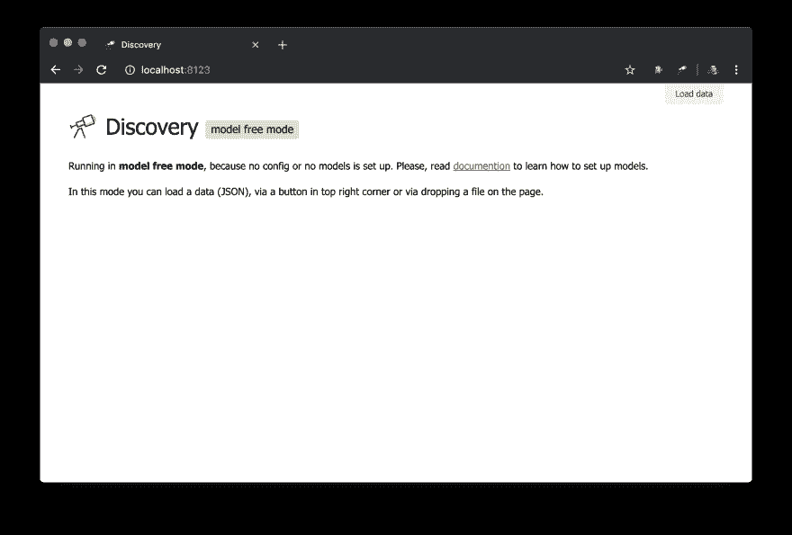T2】](https://res.cloudinary.com/practicaldev/image/fetch/s--Ku61MvRF--/c_limit%2Cf_auto%2Cfl_progressive%2Cq_auto%2Cw_880/https://thepracticaldev.s3.amazonaws.com/i/fg2nuy238e8xm9orls7z.png)

这是一种无模型模式，没有任何预先配置。您可以通过“加载数据”按钮选择任何 JSON 文件，或者将它放在页面上，然后开始探索它。

但是，我们需要一些具体的东西，特别是，我们需要得到一个`node_modules`结构。我们来补充一些配置。

## [](#add-a-configuration)添加一个配置

你可能已经注意到了，当我们第一次启动服务器时，有一条消息`No config is used`。所以让我们创建一个名为`.discoveryrc.js`的配置文件，内容如下:

```
module.exports = {
    name: 'Node modules structure',
    data() {
        return { hello: 'world' };
    }
}; 
```

<svg width="20px" height="20px" viewBox="0 0 24 24" class="highlight-action crayons-icon highlight-action--fullscreen-on"><title>Enter fullscreen mode</title></svg> <svg width="20px" height="20px" viewBox="0 0 24 24" class="highlight-action crayons-icon highlight-action--fullscreen-off"><title>Exit fullscreen mode</title></svg>

注意:如果你在当前的工作目录下创建一个配置文件(比如在一个项目的根目录下)，那么不需要额外的操作。否则，你需要用`--config`选项传递一个路径到配置文件，或者在`package.json`中这样指定:

```
{  ...  "discovery":  "path/to/discovery/config.js",  ...  } 
```

<svg width="20px" height="20px" viewBox="0 0 24 24" class="highlight-action crayons-icon highlight-action--fullscreen-on"><title>Enter fullscreen mode</title></svg> <svg width="20px" height="20px" viewBox="0 0 24 24" class="highlight-action crayons-icon highlight-action--fullscreen-off"><title>Exit fullscreen mode</title></svg>

好了，让我们重启服务器来应用一个配置:

```
> npx discovery
Load config from .discoveryrc.js
Init single model
  default
    Define default routes ... OK
    Cache: DISABLED
Init common routes ... OK
Server listen on http://localhost:8123 
```

<svg width="20px" height="20px" viewBox="0 0 24 24" class="highlight-action crayons-icon highlight-action--fullscreen-on"><title>Enter fullscreen mode</title></svg> <svg width="20px" height="20px" viewBox="0 0 24 24" class="highlight-action crayons-icon highlight-action--fullscreen-off"><title>Exit fullscreen mode</title></svg>

如您所见，我们创建的配置文件现在正在使用。还有一个我们定义的默认模型(discovery 可以在多模型模式下运行，我们将在后面的教程中介绍这种方法)。让我们看看我们在浏览器中得到什么:

[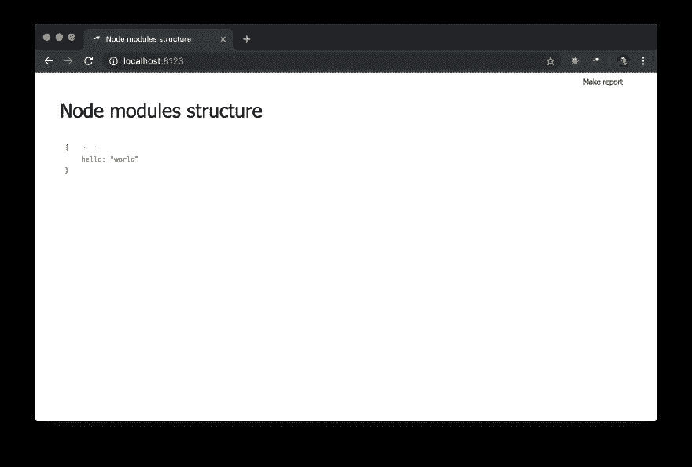T2】](https://res.cloudinary.com/practicaldev/image/fetch/s--EEqURk1S--/c_limit%2Cf_auto%2Cfl_progressive%2Cq_auto%2Cw_880/https://thepracticaldev.s3.amazonaws.com/i/0p2p7yuy05qd99vmwoi2.png)

我们在这里看到了什么:

*   `name`用作页面的页眉；
*   `data`方法调用的结果显示为页面的主要内容

> 注意:`data`方法必须返回数据或承诺，这将被解析为数据。

我们的基本设置已经就绪，现在可以进入下一步了。

## [](#context)上下文

在继续之前，让我们看看报告页面(单击`Make report`打开):

[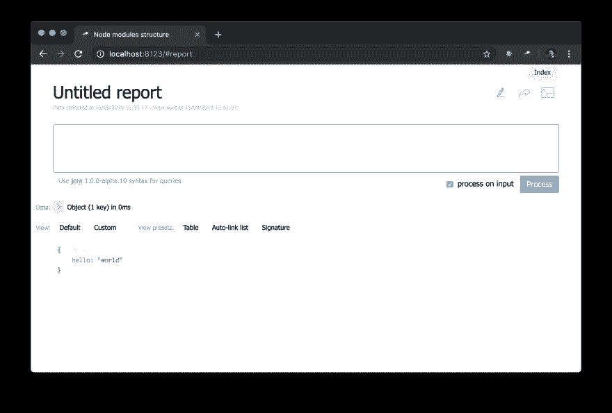T2】](https://res.cloudinary.com/practicaldev/image/fetch/s--Hwlc_TJV--/c_limit%2Cf_auto%2Cfl_progressive%2Cq_auto%2Cw_880/https://thepracticaldev.s3.amazonaws.com/i/9c2glc0bvztmbimv25j9.png)

乍一看，这与索引页面相同...但是我们可以改变一切！例如，我们可以重新创建一个索引页面，这很简单:

[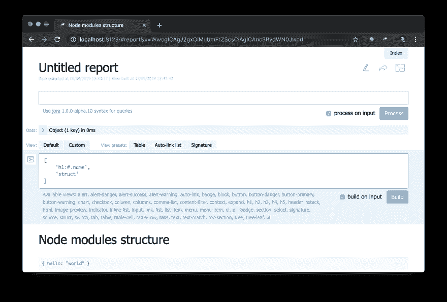T2】](https://res.cloudinary.com/practicaldev/image/fetch/s--2ONC9jCN--/c_limit%2Cf_auto%2Cfl_progressive%2Cq_auto%2Cw_880/https://thepracticaldev.s3.amazonaws.com/i/ro3o3weiq4lwo5jy0kf8.png)

注意标题是如何定义的:`"h1:#.name"`。这是一个标题级别 1，内容为`#.name`，是一个[乔拉](https://github.com/discoveryjs/jora)查询。`#`是指查询的上下文。要查看它包含的内容，只需在查询编辑器中输入`#`并使用默认视图:

[T2】](https://res.cloudinary.com/practicaldev/image/fetch/s--o49kScdU--/c_limit%2Cf_auto%2Cfl_progressive%2Cq_auto%2Cw_880/https://thepracticaldev.s3.amazonaws.com/i/kc35dqs5qw05n3mmczkr.png)

所以现在你知道在哪里可以得到当前的页面 ID，它的参数和其他东西。

## [](#collecting-data)收集数据

回到我们的项目，目前我们使用模拟数据，但我们需要收集真实数据。因此，我们应该创建一个模块，并在配置中更改`data`值(顺便说一句，您不应该在这样的更改后重新启动服务器):

```
module.exports = {
    name: 'Node modules structure',
    data: require('./collect-node-modules-data')
}; 
```

<svg width="20px" height="20px" viewBox="0 0 24 24" class="highlight-action crayons-icon highlight-action--fullscreen-on"><title>Enter fullscreen mode</title></svg> <svg width="20px" height="20px" viewBox="0 0 24 24" class="highlight-action crayons-icon highlight-action--fullscreen-off"><title>Exit fullscreen mode</title></svg>

`collect-node-modules-data.js`的来源:

```
const path = require('path');
const scanFs = require('@discoveryjs/scan-fs');

module.exports = function() {
    const packages = [];

    return scanFs({
        include: ['node_modules'],
        rules: [{
            test: /\/package.json$/,
            extract: (file, content) => {
                const pkg = JSON.parse(content);

                if (pkg.name && pkg.version) {
                    packages.push({
                        name: pkg.name,
                        version: pkg.version,
                        path: path.dirname(file.filename),
                        dependencies: pkg.dependencies
                    });
                }
            }
        }]
    }).then(() => packages);
}; 
```

<svg width="20px" height="20px" viewBox="0 0 24 24" class="highlight-action crayons-icon highlight-action--fullscreen-on"><title>Enter fullscreen mode</title></svg> <svg width="20px" height="20px" viewBox="0 0 24 24" class="highlight-action crayons-icon highlight-action--fullscreen-off"><title>Exit fullscreen mode</title></svg>

我使用了`@discoveryjs/scan-fs`包，它通过定义规则来简化文件系统扫描。在 package 的 readme 中可以找到一个使用示例，所以我将其作为基础，并根据需要进行了修改。现在我们有了一些关于`node_modules`内容的信息:

[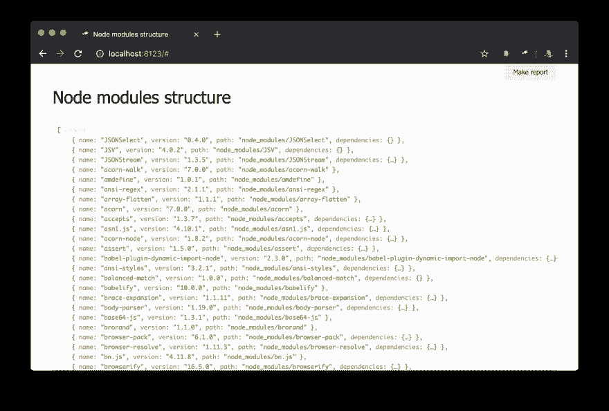T2】](https://res.cloudinary.com/practicaldev/image/fetch/s--ctqUAsAd--/c_limit%2Cf_auto%2Cfl_progressive%2Cq_auto%2Cw_880/https://thepracticaldev.s3.amazonaws.com/i/zyxa4ebpqwe8qkd3v7ov.png)

好多了！尽管它只是一个 JSON，但我们可以深入研究它并获得一些见解。例如，使用签名弹出菜单，我们可以找出程序包的数量，以及其中有多少程序包具有多个物理实例(由于不同版本或程序包重复数据消除问题)。

[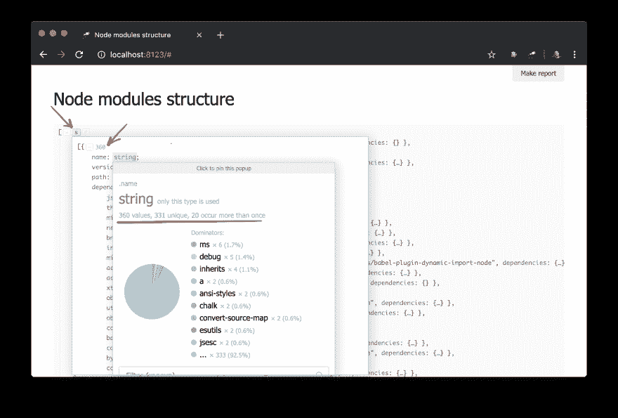T2】](https://res.cloudinary.com/practicaldev/image/fetch/s--Sjw0z6Ty--/c_limit%2Cf_auto%2Cfl_progressive%2Cq_auto%2Cw_880/https://thepracticaldev.s3.amazonaws.com/i/j78eccneotspsgdyvb44.png)

虽然我们已经有了一些数据，但还需要更多的细节。例如，知道哪个物理实例解析每个依赖项是很好的。然而，数据获取方面的改进超出了本教程的范围。所以我们只需要使用`@discoveryjs/node-modules`(它也是建立在`@discoveryjs/scan-fs`之上的)并轻松获得关于包的大部分细节。`collect-node-modules-data.js`大幅简化:

```
const fetchNodeModules = require('@discoveryjs/node-modules');

module.exports = function() {
    return fetchNodeModules();
}; 
```

<svg width="20px" height="20px" viewBox="0 0 24 24" class="highlight-action crayons-icon highlight-action--fullscreen-on"><title>Enter fullscreen mode</title></svg> <svg width="20px" height="20px" viewBox="0 0 24 24" class="highlight-action crayons-icon highlight-action--fullscreen-off"><title>Exit fullscreen mode</title></svg>

关于`node_modules`的数据现在看起来是这样的:

[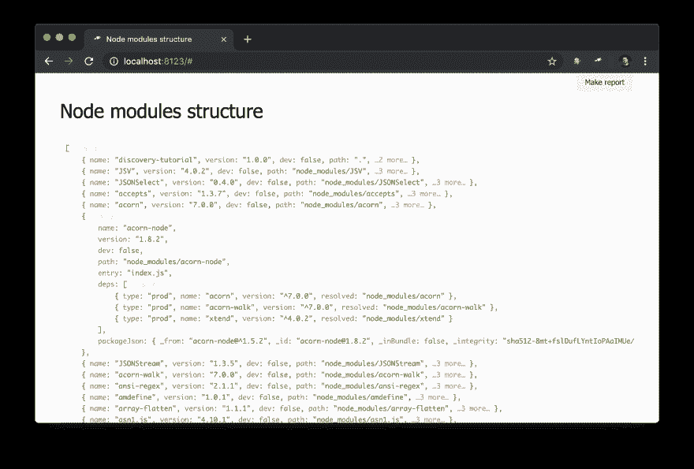T2】](https://res.cloudinary.com/practicaldev/image/fetch/s--hicV6EjH--/c_limit%2Cf_auto%2Cfl_progressive%2Cq_auto%2Cw_880/https://thepracticaldev.s3.amazonaws.com/i/9376bzwytjnkjeyn1wgo.png)

## [](#preparation-script)准备脚本

您可能已经注意到，一些包包含`deps`——依赖项列表。每个依赖项都有`resolved`字段，其中值是对包物理实例的引用。引用是一个包的`path`值，因为每个`path`值都是唯一的。为了解析对包的引用，我们需要使用一个额外的代码(例如`#.data.pick(<path=resolved>)`)。但是可以肯定的是，已经解决了这样的引用是非常合适的。

不幸的是，我们不能在数据收集阶段解析引用，因为这将导致循环引用和数据重复，并使数据传输成为问题。然而，有一个解决方案——一个叫做`prepare`的特殊脚本。该脚本在配置中定义，并为发现实例的任何新数据调用。让我们从配置开始:

```
module.exports = {
    ...
    prepare: __dirname + '/prepare.js', // Note: value is a path to a module
    ...
}; 
```

<svg width="20px" height="20px" viewBox="0 0 24 24" class="highlight-action crayons-icon highlight-action--fullscreen-on"><title>Enter fullscreen mode</title></svg> <svg width="20px" height="20px" viewBox="0 0 24 24" class="highlight-action crayons-icon highlight-action--fullscreen-off"><title>Exit fullscreen mode</title></svg>

然后定义一个`prepare.js` :

```
discovery.setPrepare(function(data) {
    // do something with data or/and with discovery instance
}); 
```

<svg width="20px" height="20px" viewBox="0 0 24 24" class="highlight-action crayons-icon highlight-action--fullscreen-on"><title>Enter fullscreen mode</title></svg> <svg width="20px" height="20px" viewBox="0 0 24 24" class="highlight-action crayons-icon highlight-action--fullscreen-off"><title>Exit fullscreen mode</title></svg>

在此模块中，我们为发现实例指定了`prepare`函数。每次将数据应用于发现实例之前，都会调用此函数。这是一个解析引用的好地方:

```
discovery.setPrepare(function(data) {
    const packageIndex = data.reduce((map, pkg) => map.set(pkg.path, pkg), new Map());

    data.forEach(pkg =>
        pkg.deps.forEach(dep =>
            dep.resolved = packageIndex.get(dep.resolved)
        )
    );
}); 
```

<svg width="20px" height="20px" viewBox="0 0 24 24" class="highlight-action crayons-icon highlight-action--fullscreen-on"><title>Enter fullscreen mode</title></svg> <svg width="20px" height="20px" viewBox="0 0 24 24" class="highlight-action crayons-icon highlight-action--fullscreen-off"><title>Exit fullscreen mode</title></svg>

这里我们创建一个包索引，其中 key 是包的`path`值(这是唯一的)。之后，我们遍历所有的包和每个依赖项，并用一个包的引用替换`resolved`值。这就是结果:

[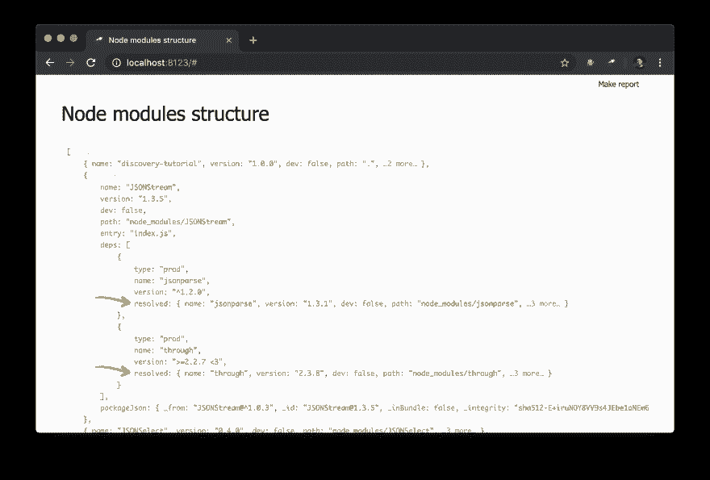T2】](https://res.cloudinary.com/practicaldev/image/fetch/s--wLl6ZHJr--/c_limit%2Cf_auto%2Cfl_progressive%2Cq_auto%2Cw_880/https://thepracticaldev.s3.amazonaws.com/i/emc4ye3xlwzmbzjfuicj.png)

现在对依赖图进行查询容易多了。下面是如何得到一个依赖集群(依赖，依赖依赖等。)对于特定的包:

[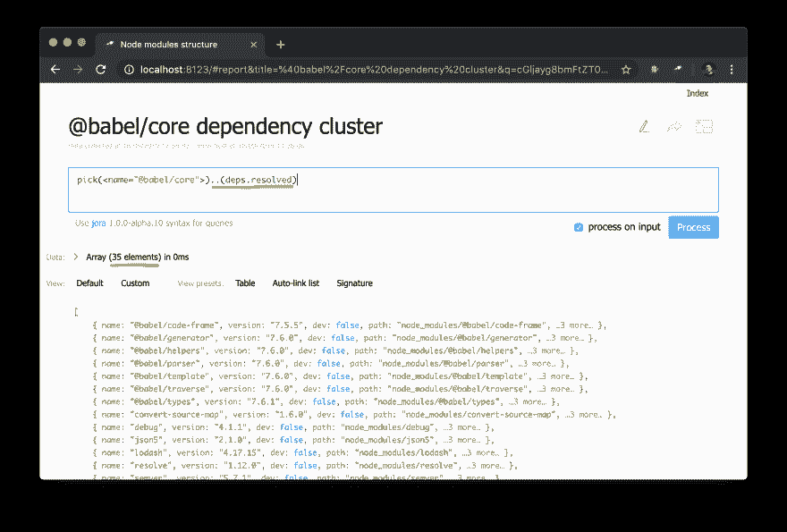T2】](https://res.cloudinary.com/practicaldev/image/fetch/s--VExKtwjV--/c_limit%2Cf_auto%2Cfl_progressive%2Cq_auto%2Cw_880/https://thepracticaldev.s3.amazonaws.com/i/5oy1713lfd2wg0ygex0k.png)

> 意想不到的成功案例:探索 tutorial 的数据我在`@discoveryjs/cli`(通过查询`.[deps.[not resolved]]`)中发现了一个问题，它在一个对等依赖引用中有一个打字错误。这已经被[立即修复](https://github.com/discoveryjs/discovery-cli/commit/3f300cedb7e8217d339cb0ecd7aa57e3e53ecd91)。这是一个恰当的例子。

我想，这是一个很好的时间来显示一些数字和软件包在索引页上重复。

## [](#setup-default-page)设置默认页面

首先我们需要创建一个页面模块，例如`pages/default.js`。使用`default`是因为索引页面有这个 slug，我们可以覆盖它(discoveryjs 中的大多数内容都可以被覆盖)。我们可以从简单的开始，像这样:

```
discovery.page.define('default', [
    'h1:#.name',
    'text:"Hello world!"'
]); 
```

<svg width="20px" height="20px" viewBox="0 0 24 24" class="highlight-action crayons-icon highlight-action--fullscreen-on"><title>Enter fullscreen mode</title></svg> <svg width="20px" height="20px" viewBox="0 0 24 24" class="highlight-action crayons-icon highlight-action--fullscreen-off"><title>Exit fullscreen mode</title></svg>

现在我们需要在配置中链接模块:

```
module.exports = {
    name: 'Node modules structure',
    data: require('./collect-node-modules-data'),
    view: {
        assets: [
            'pages/default.js'  // a reference to page's module
        ]
    }
}; 
```

<svg width="20px" height="20px" viewBox="0 0 24 24" class="highlight-action crayons-icon highlight-action--fullscreen-on"><title>Enter fullscreen mode</title></svg> <svg width="20px" height="20px" viewBox="0 0 24 24" class="highlight-action crayons-icon highlight-action--fullscreen-off"><title>Exit fullscreen mode</title></svg>

在浏览器中检入:

[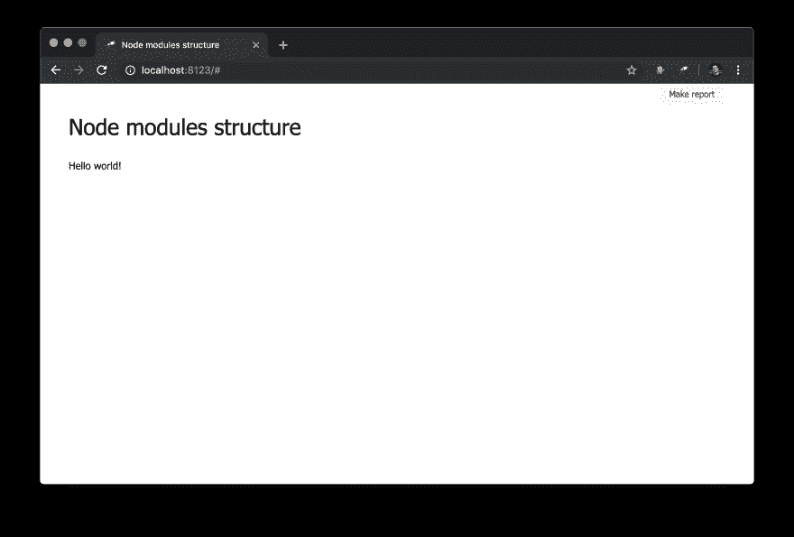T2】](https://res.cloudinary.com/practicaldev/image/fetch/s--j8Q6mikz--/c_limit%2Cf_auto%2Cfl_progressive%2Cq_auto%2Cw_880/https://thepracticaldev.s3.amazonaws.com/i/k8feoq2gwo4yho24xlb9.png)

有用！

让我们通过这样改变`pages/default.js`来显示一些计数器:

```
discovery.page.define('default', [
    'h1:#.name',
    {
        view: 'inline-list',
        item: 'indicator',
        data: `[
            { label: 'Package entries', value: size() },
            { label: 'Unique packages', value: name.size() },
            { label: 'Dup packages', value: group(<name>).[value.size() > 1].size() }
        ]`
    }
]); 
```

<svg width="20px" height="20px" viewBox="0 0 24 24" class="highlight-action crayons-icon highlight-action--fullscreen-on"><title>Enter fullscreen mode</title></svg> <svg width="20px" height="20px" viewBox="0 0 24 24" class="highlight-action crayons-icon highlight-action--fullscreen-off"><title>Exit fullscreen mode</title></svg>

这里我们定义了一个内嵌的指示器列表。一个`data`值是一个乔拉查询，它产生一个条目数组。一个包列表被用作一个数据源(一个数据根)，所以我们得到一个列表长度(`size()`)、一些唯一的名字(`name.size()`)和由不止一个成员的名字组成的组的数量(`group(<name>).[value.size() > 1].size()`)。

[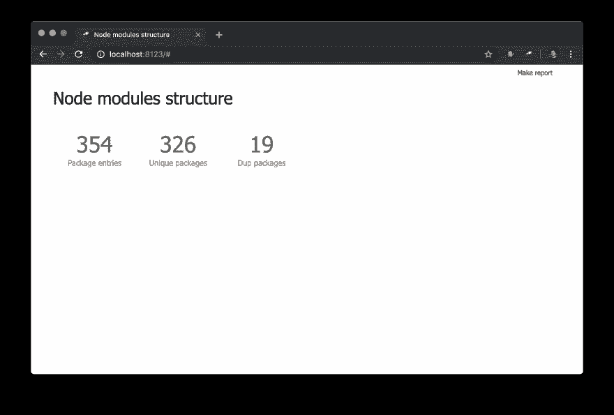T2】](https://res.cloudinary.com/practicaldev/image/fetch/s--bQqoZ3L3--/c_limit%2Cf_auto%2Cfl_progressive%2Cq_auto%2Cw_880/https://thepracticaldev.s3.amazonaws.com/i/cf4w97i3kkv9b8matg02.png)

还不错。然而，除了数字之外，最好还有一个到所选条目的链接:

```
discovery.page.define('default', [
    'h1:#.name',
    {
        view: 'inline-list',
        data: [
            { label: 'Package entries', value: '' },
            { label: 'Unique packages', value: 'name' },
            { label: 'Dup packages', value: 'group(<name>).[value.size() > 1]' }
        ],
        item: `indicator:{
            label,
            value: value.query(#.data, #).size(),
            href: pageLink('report', { query: value, title: label })
        }`
    }
]); 
```

<svg width="20px" height="20px" viewBox="0 0 24 24" class="highlight-action crayons-icon highlight-action--fullscreen-on"><title>Enter fullscreen mode</title></svg> <svg width="20px" height="20px" viewBox="0 0 24 24" class="highlight-action crayons-icon highlight-action--fullscreen-off"><title>Exit fullscreen mode</title></svg>

首先`data`的值被改变了，现在它是一个有几个对象的规则数组。此外,`size()`方法被移除用于每个值的查询。

子查询也被添加到`indicator`视图中。这样的查询产生一个新的对象，其中的`value`和`href`属性值被计算。对于`value`,它使用`query()`方法执行查询，并从上下文向其传递数据，然后将`size()`方法应用于查询结果。对于`href`,它使用`pageLink()`方法生成一个链接，链接到具有特定查询和标题的报告页面。在这些改变之后，指示器变得可以点击(注意它们的值变成了蓝色)并且功能更加强大。

[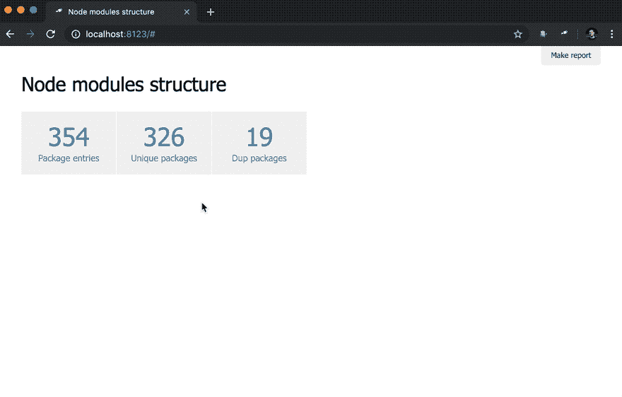T2】](https://res.cloudinary.com/practicaldev/image/fetch/s--uchN0SJu--/c_limit%2Cf_auto%2Cfl_progressive%2Cq_66%2Cw_880/https://thepracticaldev.s3.amazonaws.com/i/smfew510zs8di508kkej.gif)

为了让索引页面更有用，让我们添加一个包含重复包的表。

```
discovery.page.define('default', [
    // ... the same as before

    'h2:"Packages with more than one physical instance"',
    {
        view: 'table',
        data: `
            group(<name>)
            .[value.size() > 1]
            .sort(<value.size()>)
            .reverse()
        `,
        cols: [
            { header: 'Name', content: 'text:key' },
            { header: 'Version & Location', content: {
                view: 'list',
                data: 'value.sort(<version>)',
                item: [
                    'badge:version',
                    'text:path'
                ]
            } }
        ]
    }
]); 
```

<svg width="20px" height="20px" viewBox="0 0 24 24" class="highlight-action crayons-icon highlight-action--fullscreen-on"><title>Enter fullscreen mode</title></svg> <svg width="20px" height="20px" viewBox="0 0 24 24" class="highlight-action crayons-icon highlight-action--fullscreen-off"><title>Exit fullscreen mode</title></svg>

表中使用了与`Dup packages`指示器相同的数据。此外，包列表按组大小逆序排序。rest 设置是针对列的(顺便说一句，通常不需要设置它们)。对于`Version & Location`列，我们定义了一个嵌套列表(按版本排序)，其中每一项都是一对版本标记和实例路径。

[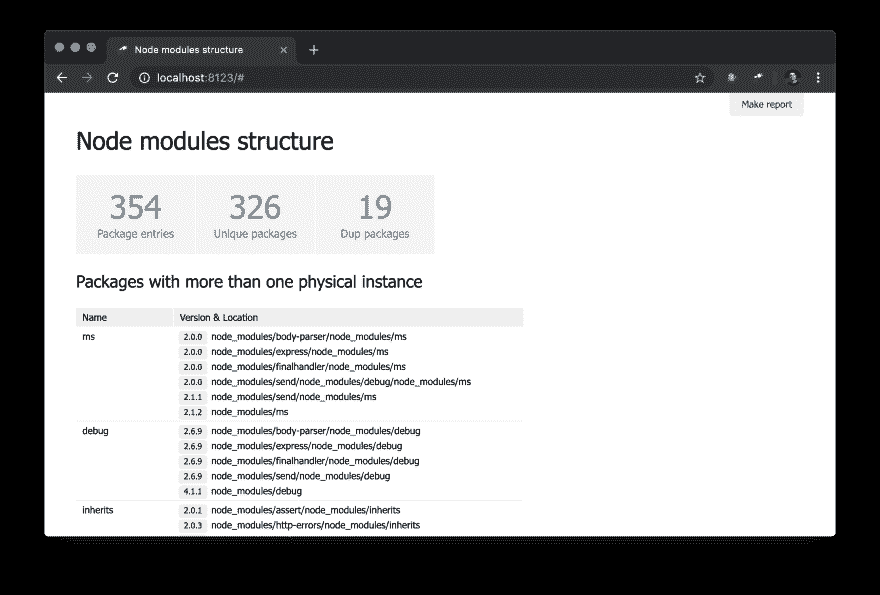T2】](https://res.cloudinary.com/practicaldev/image/fetch/s---ZV4h9MD--/c_limit%2Cf_auto%2Cfl_progressive%2Cq_auto%2Cw_880/https://thepracticaldev.s3.amazonaws.com/i/2g74fgg6svq8iyahprs4.png)

## [](#a-package-page)一个包的页面

目前，我们只有包的整体视图。拥有一个特定的包页面可能会很有用。为了存档，我们需要创建一个新模块`pages/package.js`并定义一个新页面:

```
discovery.page.define('package', {
    view: 'context',
    data: `{
        name: #.id,
        instances: .[name = #.id]
    }`,
    content: [
        'h1:name',
        'table:instances'
    ]
}); 
```

<svg width="20px" height="20px" viewBox="0 0 24 24" class="highlight-action crayons-icon highlight-action--fullscreen-on"><title>Enter fullscreen mode</title></svg> <svg width="20px" height="20px" viewBox="0 0 24 24" class="highlight-action crayons-icon highlight-action--fullscreen-off"><title>Exit fullscreen mode</title></svg>

在这个模块中，我们用 slug `package`定义一个页面。由于使用了根视图`context`视图，这是一个非可视化视图，有助于为嵌套视图定义公共数据。注意，我们使用`#.id`来获得一个包名，它来自一个 URL，例如`http://localhost:8123/#package:{id}`。

不要忘记在配置中包含新模块:

```
module.exports = {
    ...
    view: {
        assets: [
            'pages/default.js',
            'pages/package.js'  // here you go
        ]
    }
}; 
```

<svg width="20px" height="20px" viewBox="0 0 24 24" class="highlight-action crayons-icon highlight-action--fullscreen-on"><title>Enter fullscreen mode</title></svg> <svg width="20px" height="20px" viewBox="0 0 24 24" class="highlight-action crayons-icon highlight-action--fullscreen-off"><title>Exit fullscreen mode</title></svg>

这是浏览器中的一个结果:

[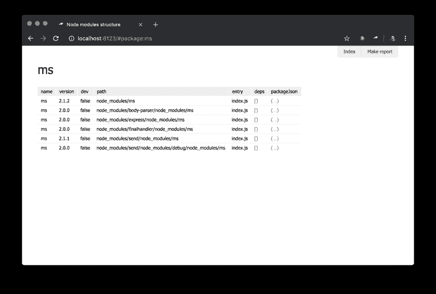T2】](https://res.cloudinary.com/practicaldev/image/fetch/s--6VLf5tH8--/c_limit%2Cf_auto%2Cfl_progressive%2Cq_auto%2Cw_880/https://thepracticaldev.s3.amazonaws.com/i/57ph7siuanhx9kqsoygz.png)

这不是那么令人印象深刻，但现在还好。更复杂的视图将在接下来的教程中创建。

## [](#sidebar)侧栏

因为现在我们有了一个包页面，有一个所有包的列表是很好的。我们可以为此定义一个特殊的视图`sidebar`，当定义时就会呈现(默认情况下没有定义)。让我们创建一个新模块`views/sidebar.js` :

```
discovery.view.define('sidebar', {
    view: 'list',
    data: 'name.sort()',
    item: 'link:{ text: $, href: pageLink("package") }'
}); 
```

<svg width="20px" height="20px" viewBox="0 0 24 24" class="highlight-action crayons-icon highlight-action--fullscreen-on"><title>Enter fullscreen mode</title></svg> <svg width="20px" height="20px" viewBox="0 0 24 24" class="highlight-action crayons-icon highlight-action--fullscreen-off"><title>Exit fullscreen mode</title></svg>

现在我们有了一个包含所有包的侧栏:

[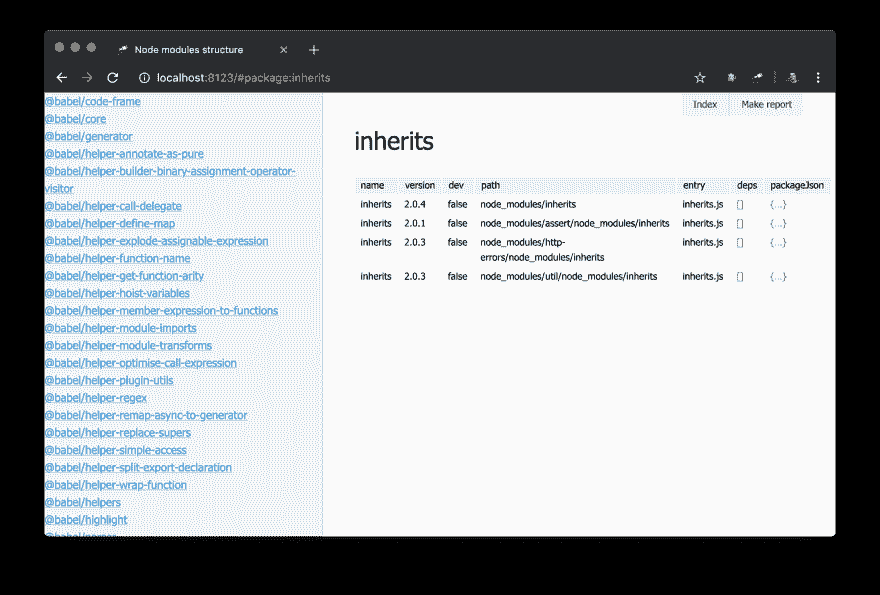T2】](https://res.cloudinary.com/practicaldev/image/fetch/s--pJA1Nt8r--/c_limit%2Cf_auto%2Cfl_progressive%2Cq_auto%2Cw_880/https://thepracticaldev.s3.amazonaws.com/i/d2zyu9uxr7cwn38g8zyg.png)

看起来不错。但是如果有了过滤器，它可能会对用户更加友好。扩展`sidebar`定义:

```
discovery.view.define('sidebar', {
    view: 'content-filter',
    content: {
        view: 'list',
        data: 'name.[no #.filter or $~=#.filter].sort()',
        item: {
            view: 'link',
            data: '{ text: $, href: pageLink("package"), match: #.filter }',
            content: 'text-match'
        }
    }
}); 
```

<svg width="20px" height="20px" viewBox="0 0 24 24" class="highlight-action crayons-icon highlight-action--fullscreen-on"><title>Enter fullscreen mode</title></svg> <svg width="20px" height="20px" viewBox="0 0 24 24" class="highlight-action crayons-icon highlight-action--fullscreen-off"><title>Exit fullscreen mode</title></svg>

这里，我们将列表包装到`content-filter`视图中，该视图将提供一个转换为 RegExp 的输入值(或为空时的`null`)作为上下文中的`filter`值(可以通过`name`选项更改名称)。我们还使用了`#.filter`来过滤列表数据。最后，扩展了一个链接视图定义，使用`text-match`视图突出显示匹配的零件。并且有一个结果:

[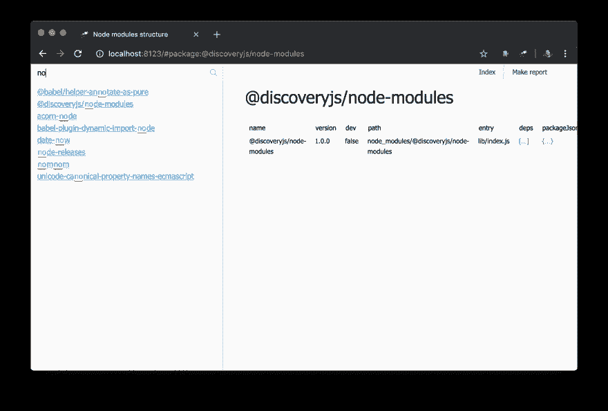T2】](https://res.cloudinary.com/practicaldev/image/fetch/s--xKxzb2hB--/c_limit%2Cf_auto%2Cfl_progressive%2Cq_auto%2Cw_880/https://thepracticaldev.s3.amazonaws.com/i/t98xdlq0v8r5s8pauihy.png)

如果你不喜欢某些东西的默认样式，你可以随意调整样式。假设，你想改变侧边栏的宽度。然后你需要创建一个样式文件(`views/sidebar.css`将是一个不错的选择):

```
.discovery-sidebar {
    width: 300px;
} 
```

<svg width="20px" height="20px" viewBox="0 0 24 24" class="highlight-action crayons-icon highlight-action--fullscreen-on"><title>Enter fullscreen mode</title></svg> <svg width="20px" height="20px" viewBox="0 0 24 24" class="highlight-action crayons-icon highlight-action--fullscreen-off"><title>Exit fullscreen mode</title></svg>

并在配置中包含对该文件的引用，就像 JavaScript 模块一样:

```
module.exports = {
    ...
    view: {
        assets: [
            ...
            'views/sidebar.css',  // you may specify *.css files in assets too
            'views/sidebar.js'
        ]
    }
}; 
```

<svg width="20px" height="20px" viewBox="0 0 24 24" class="highlight-action crayons-icon highlight-action--fullscreen-on"><title>Enter fullscreen mode</title></svg> <svg width="20px" height="20px" viewBox="0 0 24 24" class="highlight-action crayons-icon highlight-action--fullscreen-off"><title>Exit fullscreen mode</title></svg>

## [](#auto-linking)自动链接

本教程的最后一章是关于链接的。正如你在上面看到的，我们通过`pageLink()`方法链接到一个包页面。除此之外，我们还需要指定链接文本。但是让它简单一点怎么样？

为了简化链接，我们需要定义一个链接解析器。一个很好的地方是`prepare`脚本:

```
discovery.setPrepare(function(data) {
    ...

    const packageIndex = data.reduce(
        (map, item) => map
            .set(item, item)        // key is item itself
            .set(item.name, item),  // and `name` value
        new Map()
    );
    discovery.addEntityResolver(value => {
        value = packageIndex.get(value) || packageIndex.get(value.name);

        if (value) {
            return {
                type: 'package',
                id: value.name,
                name: value.name
            };
        }
    });
}); 
```

<svg width="20px" height="20px" viewBox="0 0 24 24" class="highlight-action crayons-icon highlight-action--fullscreen-on"><title>Enter fullscreen mode</title></svg> <svg width="20px" height="20px" viewBox="0 0 24 24" class="highlight-action crayons-icon highlight-action--fullscreen-off"><title>Exit fullscreen mode</title></svg>

我们在这里为包添加了一个新的映射(一个索引),并将其用于实体解析器。实体解析器尽可能尝试将传递的值翻译成包描述符。包描述符包含:

*   `type`–实例类型的 slug
*   `id` -对实例的唯一引用，用作链接中的页面 ID
*   `name`–用作链接的标题

最后一步，我们需要将这种类型附加到某个页面上(链接应该指向某个地方，不是吗？).

```
discovery.page.define('package', {
    ...
}, {
    resolveLink: 'package'  // link `package` entities to this page
}); 
```

<svg width="20px" height="20px" viewBox="0 0 24 24" class="highlight-action crayons-icon highlight-action--fullscreen-on"><title>Enter fullscreen mode</title></svg> <svg width="20px" height="20px" viewBox="0 0 24 24" class="highlight-action crayons-icon highlight-action--fullscreen-off"><title>Exit fullscreen mode</title></svg>

这些变化的第一个影响是，`struct`视图中的一些值现在标记有一个到包页面的标记链接:

[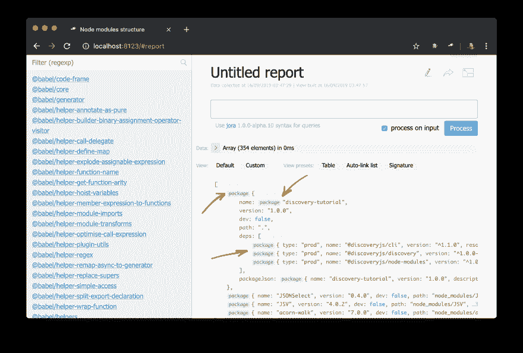T2】](https://res.cloudinary.com/practicaldev/image/fetch/s--43TK7UdZ--/c_limit%2Cf_auto%2Cfl_progressive%2Cq_auto%2Cw_880/https://thepracticaldev.s3.amazonaws.com/i/pajh5110lvykh50iax4v.png)

现在您可以对包对象或名称应用`auto-link`视图:

[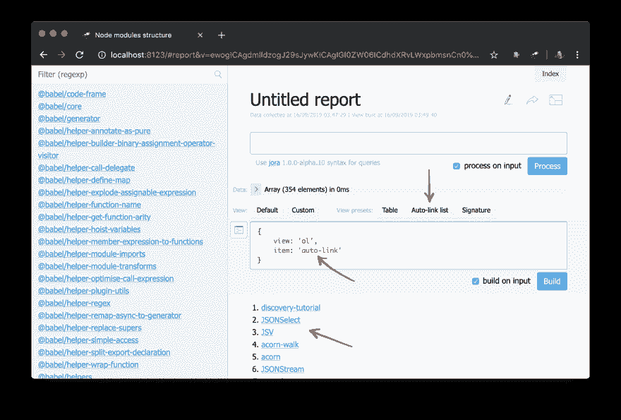T2】](https://res.cloudinary.com/practicaldev/image/fetch/s--GpTNH7zt--/c_limit%2Cf_auto%2Cfl_progressive%2Cq_auto%2Cw_880/https://thepracticaldev.s3.amazonaws.com/i/6zw8apz0zms4kdg3wson.png)

举个例子，侧边栏可以稍微重构:

```
 // before
        item: {
            view: 'link',
            data: '{ text: $, href: pageLink("package"), match: #.filter }',
            content: 'text-match'
        },

    // with `auto-link`
        item: {
            view: 'auto-link',
            content: 'text-match:{ text, match: #.filter }'
        } 
```

<svg width="20px" height="20px" viewBox="0 0 24 24" class="highlight-action crayons-icon highlight-action--fullscreen-on"><title>Enter fullscreen mode</title></svg> <svg width="20px" height="20px" viewBox="0 0 24 24" class="highlight-action crayons-icon highlight-action--fullscreen-off"><title>Exit fullscreen mode</title></svg>

## [](#conclusion)结论

现在你对`discoveryjs`关键概念有了基本的了解。接下来的教程将继续引导你更深入地了解这些主题。

你可以在 GitHub 上的[a repo](https://github.com/discoveryjs/quick-start-tutorial)或[中探索教程的所有来源，在线尝试它是如何工作的](https://discoveryjs.github.io/quick-start-tutorial/)。

在 Twitter 上关注 [@js_discovery](https://twitter.com/js_discovery) ，敬请关注！