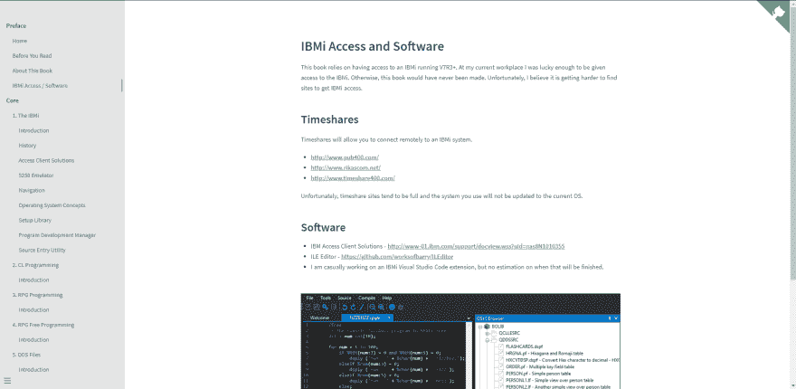
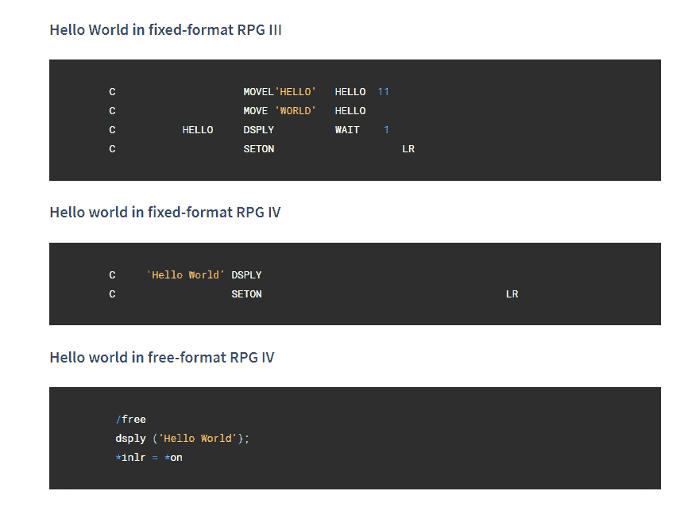

# 认真地写一本书

> 原文：<https://dev.to/barrettotte/write-a-book-with-docsify-3c0o>

[](https://res.cloudinary.com/practicaldev/image/fetch/s--NwNEUJQh--/c_limit%2Cf_auto%2Cfl_progressive%2Cq_auto%2Cw_880/https://thepracticaldev.s3.amazonaws.com/i/q7pt4f8hbv99s9unzcf8.PNG)

如果你曾经想过用 markdown/html 写一本小书，那么我会建议你使用 Docsify[https://github.com/docsifyjs/docsify](https://github.com/docsifyjs/docsify)

Docsify 非常直观，并且有足够的文档来帮助你完成整理一本书的基本步骤。每个目录是一个章节，每个降价文件是书中的一页。它还有其他功能，比如导航、封面和边栏，我还没有深入研究过。

因为它使用 markdown，所以你也可以使用标准的 HTML 和 CSS 来设计一切。我得到了混合的结果，但是看起来你也可以使用基本的 JavaScript。到目前为止，我发现的唯一问题是不能使用任何异步内容。例如，我不能使用来自[https://www.cacher.io/](https://www.cacher.io/)的嵌入式代码片段，因为它是对缓存器的异步请求以获取内容。

## 命令

*   通过 npm - **npm i -g docsify-cli** 安装 docsify cli
*   开始一个新项目- **docsify init mybook**
*   在[http://localhost:3000](http://localhost:3000)-**docsify serve my book**

## 样本页面

正如所料，您可以根据需要混合搭配 markdown 和 HTML。对我所有的案例来说，这是完美的。

```
<!-- Sample page from my book -->

## Introduction to the 5250 Emulator

This is an emulator of the IBM 5250 terminal originally used to interact with the IBMi and its ancestors. A bit more information on it here https://en.wikipedia.org/wiki/IBM_5250

There's a lot of features in this emulator that I haven't messed around with.

One important thing I learned is using the **popup keypad** located in **Actions** > **Popup Keypad...**
Sometimes when things go wrong, you have to use **SysReq** to bail yourself out (more on this later).
<figure align="center">
    
</figure> 
```

<svg width="20px" height="20px" viewBox="0 0 24 24" class="highlight-action crayons-icon highlight-action--fullscreen-on"><title>Enter fullscreen mode</title></svg> <svg width="20px" height="20px" viewBox="0 0 24 24" class="highlight-action crayons-icon highlight-action--fullscreen-off"><title>Exit fullscreen mode</title></svg>

## 代码块

我在书中想要的一个特性是带有黑暗主题的基本代码块。Docsify 使用了一个名为 [Prism JS](https://github.com/PrismJS/prism) 的语法高亮包。在很大程度上，Prism JS 开箱即用就能很好地工作。为了包含 PHP 的语法高亮显示，你可以把它放到你的【index.html
的**中**

```
<!-- index.html -->
<script src="//unpkg.com/prismjs/components/prism-php.min.js"></script> 
```

<svg width="20px" height="20px" viewBox="0 0 24 24" class="highlight-action crayons-icon highlight-action--fullscreen-on"><title>Enter fullscreen mode</title></svg> <svg width="20px" height="20px" viewBox="0 0 24 24" class="highlight-action crayons-icon highlight-action--fullscreen-off"><title>Exit fullscreen mode</title></svg>

不幸的是，我不够聪明，不知道如何在 Docsify 中使用 Prism 插件(如果你能做到的话)。我还试图通过几个不同的 CSS 片段来获取行号，但我认为我的前端能力严重不足。

## 具有 Monokai 主题的代码块

此外，我想在 VS 代码中实现一个类似 Monokai 的黑暗主题。我找到了一个名为 **Xonokai** 的主题，它足够接近我想要的 https://github.com/PrismJS/prism-themes
。我还创建了一个基本的 **styles.css** 来对 Xonokai 主题做一些额外的调整。

```
/*styles.css*/

/* Hide php tag in code block */
#main > pre::after {
  display: none;
} 
#main > pre, #main > pre > code {
  background-color: #2e2e2e; 
}
#main > pre > code {
  color: white;
}
.sidebar, .sidebar-toggle {
  background-color: rgb(228, 228, 228);
} 
```

<svg width="20px" height="20px" viewBox="0 0 24 24" class="highlight-action crayons-icon highlight-action--fullscreen-on"><title>Enter fullscreen mode</title></svg> <svg width="20px" height="20px" viewBox="0 0 24 24" class="highlight-action crayons-icon highlight-action--fullscreen-off"><title>Exit fullscreen mode</title></svg>

正如所料，您可以在您的**index.html**中链接样式表。我把我所有的 css 放在一个根目录下 **_assets/css** 。

```
<!-- index.html -->
<link rel="stylesheet" href="./_assets/css/prism-xonokai.css">
<link rel="stylesheet" href="./_assets/css/styles.css"> 
```

<svg width="20px" height="20px" viewBox="0 0 24 24" class="highlight-action crayons-icon highlight-action--fullscreen-on"><title>Enter fullscreen mode</title></svg> <svg width="20px" height="20px" viewBox="0 0 24 24" class="highlight-action crayons-icon highlight-action--fullscreen-off"><title>Exit fullscreen mode</title></svg>

目前，这是它看起来像什么时候说的和做的
[](https://res.cloudinary.com/practicaldev/image/fetch/s--UisjH759--/c_limit%2Cf_auto%2Cfl_progressive%2Cq_auto%2Cw_880/https://thepracticaldev.s3.amazonaws.com/i/3yrqd792b7r330q077dj.PNG)

## 附加设置

我还没有深入研究 docsify，但是我发现了一些很酷的东西。
有一个非常可爱的插件，可以使用
添加章节内的分页

```
<!-- index.html -->
<script src="//unpkg.com/docsify-pagination/dist/docsify-pagination.min.js"> 
```

<svg width="20px" height="20px" viewBox="0 0 24 24" class="highlight-action crayons-icon highlight-action--fullscreen-on"><title>Enter fullscreen mode</title></svg> <svg width="20px" height="20px" viewBox="0 0 24 24" class="highlight-action crayons-icon highlight-action--fullscreen-off"><title>Exit fullscreen mode</title></svg>

许多定制可以在**窗口中完成。$docsify** 元素，这是我的配置，包括主页、回购链接和侧边栏。

```
<!-- index.html -->
<script>
    window.$docsify = {
      name: '',
      repo: 'https://github.com/barrettotte/IBMi-Book',
      loadSidebar: true,
      alias: {
        '/.*/_sidebar.md': '/_sidebar.md'
      },
      homepage: 'README.md',
      search: 'auto',
      auto2top: true
    }
  </script> 
```

<svg width="20px" height="20px" viewBox="0 0 24 24" class="highlight-action crayons-icon highlight-action--fullscreen-on"><title>Enter fullscreen mode</title></svg> <svg width="20px" height="20px" viewBox="0 0 24 24" class="highlight-action crayons-icon highlight-action--fullscreen-off"><title>Exit fullscreen mode</title></svg>

这只是皮毛，但你可以在 https://docsify.js.org/#/?id=docsify 找到更多

## 部署到 GitHub 页面

如果您将所有图书内容放在存储库的 **docs** 目录中，您可以轻松地将存储库用作 GitHub.io 页面。为了确保您的存储库不会被误认为是 Jekyll 站点，创建一个名为**的空文件。变身怪**。

要启用 GitHub.io 页面，请转到您的 GitHub 存储库，在**设置** > **GitHub 页面** > **源**中选择**主分支/文档文件夹**

[](https://res.cloudinary.com/practicaldev/image/fetch/s--DMZNYYL6--/c_limit%2Cf_auto%2Cfl_progressive%2Cq_auto%2Cw_880/https://thepracticaldev.s3.amazonaws.com/i/jc1feaz3cavvwywu1dov.PNG)

## 我的“书”

我不太愿意把我正在制作的东西命名为一本书，但是你可以找到我的项目**在 https://barrettotte.github.io/IBMi-Book/#/[作为一个卑微的 Web 开发人员](https://barrettotte.github.io/IBMi-Book/#/)**学习 IBMi

这将是用 RPGLE、CL 等在 IBMi 上编程的初学者指南。我希望保持动力/专注，并坚持不懈。

感谢你阅读这篇文章。