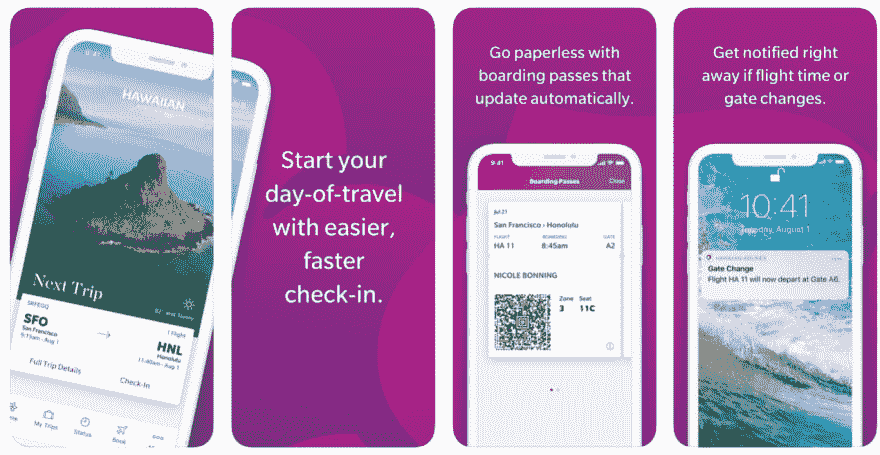
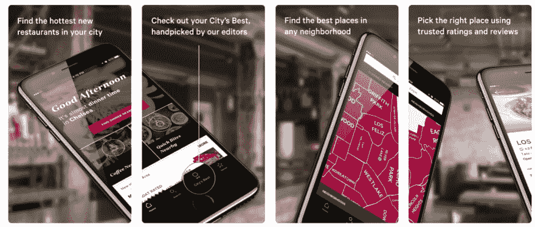

# 如何使用 iPhone 模型在 App Store 上创建有效的屏幕截图

> 原文：<https://dev.to/ramotiondev/how-to-use-iphone-mockups-to-create-effective-screenshots-on-the-app-store-o6g>

你知道吗，精彩的截图是推广你的应用最有效的方式。这是因为人脑处理图像的速度比文字快 6 万倍——这意味着人们会根据你的图像而不是你的描述来决定是否下载你的应用程序。

这就是为什么在 app store 上拥有优秀的截图会成为潜在用户下载或点击离开的转折点。

因为它们非常重要，我们建议使用设备模型，以便客户可以在现实环境中使用您的应用程序。截图很好，但是模型更进一步，让用户在日常生活中描绘与你的应用程序的互动。

让我们来看看如何有效地使用模型来推广你的应用。

## 选择有效的模型

###### 夏威夷航空 iPhone 应用商店截图

既然有这么多选择，挑选真正让你的应用脱颖而出的模型[是很重要的](https://store.ramotion.com/blog/iphone-x-mockup-psd-sketch/)。这些模型应该是高分辨率，易于编辑和多功能的。

根据你将在哪里发布你的应用程序，你可能需要以下任何或所有东西: [iPhone 模型](https://store.ramotion.com/product/iphone-x-clay-mockups)，设备模型，设备框架，粘土设备，[粘土模型](https://store.ramotion.com/product/clay-devices-mockups)， [iPad 模型](https://store.ramotion.com/product/ipad-pro-clay-mockups)， [iMac 模型](https://store.ramotion.com/product/imac-macbook-clay-mockups)， [Macbook 模型](https://store.ramotion.com/product/imac-macbook-clay-mockups)。

一旦你选择了你的模型，并把你的截图插入到模板中，你需要在应用商店中尽可能有效地推广它们。有一些最佳实践可以遵循。

## 遵循 app store 指南

iOS 和 Google Play 商店都有严格的指导原则，你必须遵循这些原则才能提交应用程序。确保你按照他们的要求去做，这样你在评估的时候就不会有问题了。

iOS 和 Play 商店在显示应用程序的方式上也有很大差异。例如，Google Play 在应用程序页面的顶部以横幅式的方式展示了一幅特色图片。另一方面，iOS 更喜欢描述。选择模型时请记住这一点。

iPhone 模板特别有用，因为 iOS 商店的要求比 Play 商店多得多。在 iOS 中。很多事情都会耽误你的回顾，如果你正在赶一个截止日期，你就等不起了。

## 突出主要优点而不是主要特性

###### Zagat iPhone 应用商店截图

人们想知道你的应用程序将如何让他们的生活变得更好或更容易。虽然你有 1000 多件商品出售这一事实很好，但这并不能解释为什么你的应用比你的竞争对手更好。

为了[展示优势](https://appradar.com/academy/bonus-chapters/app-store-screenshots/)，你可以在你的截图中添加文字，清楚地说明为什么你的应用是最佳选择。

例如，如果你做了一个电子商务应用程序，你可以解释你的服务如何更好地连接卖家和买家。或者，解释你的结账过程比你的竞争对手更快。

## 你显示截图的顺序很重要

警惕随意排列你的截图。大多数人只看到两张截图就做出决定，所以前两张是最重要的。

当内容以类似故事的方式展示时，人们也能更好地理解它。如果可能的话，用一种定义好开始、中间和结束的方式排列你的截图。

对于同一个电子商务示例，您可以首先显示常规产品页面，然后显示所选的特定产品，最后显示购买页面。一个简单有效的故事。越容易理解，就越有可能有人下载。

## 演示该应用程序是如何工作的

演示应用程序下载后的工作方式同样重要。如果一个应用程序无法识别，它被删除的速度会比安装它的时间还要快。

为了保证成功，你的应用需要易于使用，交互，友好和不复杂。保证用户有信心选中所有这些框的唯一方法是在截图中解释清楚。

例如，如果您创建了一个游戏，请将说明写在您的屏幕截图上(即，点击此处开始，按此处开机，按此处退出)。

还是那句话，越容易理解，人们就会越兴奋去下载它。

## 描述一下

虽然文字没有截图重要，但它们仍然很重要。

截图给出了一个直观的表示，文字准确地描述了图像中发生的事情。目标是将描述性的、吸引人的图像与同样描述性的文本配对。这样，读者就能真正了解整个情况。

## 结论

你如何在应用商店展示你的应用程序是非常重要的。因为能够在现实世界中形象地描绘自己使用你的应用的用户更有可能下载，所以使用有效的模型是关键。

正确的模型可以决定你的应用是否成功。访问我们的商店，查看我们的最新模型，这些模型已经帮助数百人在应用程序商店中获得成功。