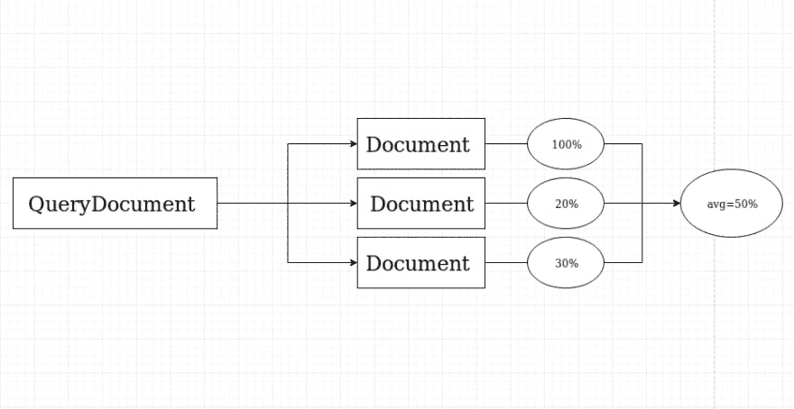
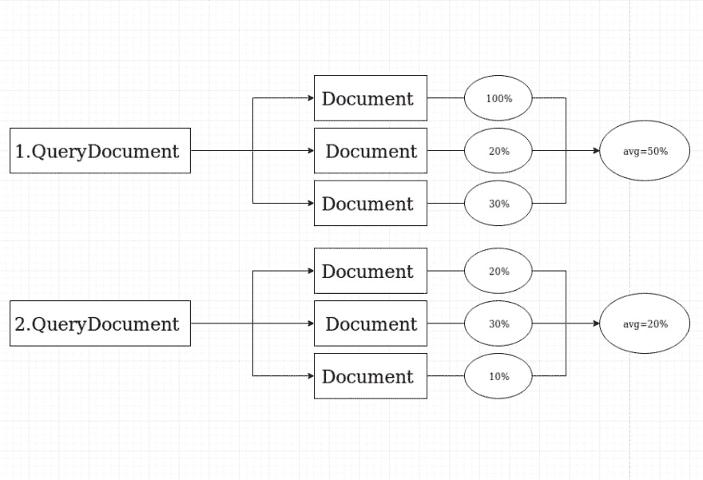
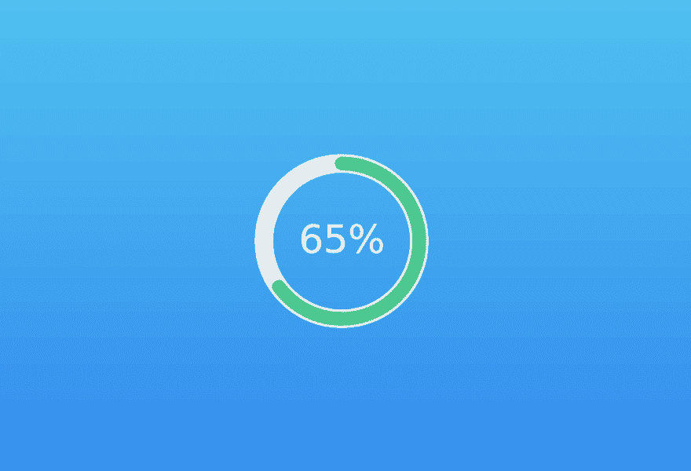

# 使用 Python | NLP 比较文档相似性

> 原文：<https://dev.to/thepylot/compare-documents-similarity-using-python-nlp-4odp>

嗨 **DEV** 网络！

Youtube 频道有视频教程- [反向 Python Youtube](https://www.youtube.com/channel/UCEwYRHE5ZAOMfUaIpCQvjEQ)

在这篇文章中，我们将构建一个 web 应用程序来比较两个文档之间的相似性。我们将学习自然语言处理(NLP)的基础知识，NLP 是人工智能的一个分支，它使用自然语言处理计算机和人类之间的交互。

本帖最初发表于我的实验室[反向 Python](https://reversepython.net) 。

让我们从程序的基本结构开始，然后我们将添加图形界面，使程序更容易使用。请随意在我的 GitHub 中贡献这个项目。

#### NLTK 和 Gensim

**自然语言工具包(NLTK)** 是最流行的自然语言处理(NLP)库，用 Python 编写，背后有一个很大的社区。NLTK 也很容易学习，实际上，它是我们将要使用的最简单的自然语言处理(NLP)库。它包含用于标记化、解析、分类、词干、标记和语义推理的文本处理库。

Gensim 被宣传为一个自然语言处理包，为人类做主题建模。但实际上远不止如此。它是用于处理文本的领先和最先进的软件包，支持单词向量模型(如 Word2Vec、FastText 等)

主题模型和单词嵌入在 scikit、R 等其他包中也有。但是在 gensim 中，构建和评估主题模型的工具的宽度和范围是无与伦比的，此外还有许多更方便的文本处理工具。gensim 的另一个重要好处是，它允许您管理大文本文件，而无需将整个文件加载到内存中。

首先，让我们通过以下命令安装 nltk 和 gensim:

```
pip install nltk
pip install gensim 
```

<svg width="20px" height="20px" viewBox="0 0 24 24" class="highlight-action crayons-icon highlight-action--fullscreen-on"><title>Enter fullscreen mode</title></svg> <svg width="20px" height="20px" viewBox="0 0 24 24" class="highlight-action crayons-icon highlight-action--fullscreen-off"><title>Exit fullscreen mode</title></svg>

#### 词的标记化(NLTK)

我们使用 word_tokenize()方法将句子拆分成单词。看下面的例子

```
from nltk.tokenize import word_tokenize

data = "Mars is approximately half the diameter of Earth."
print(word_tokenize(data)) 
```

<svg width="20px" height="20px" viewBox="0 0 24 24" class="highlight-action crayons-icon highlight-action--fullscreen-on"><title>Enter fullscreen mode</title></svg> <svg width="20px" height="20px" viewBox="0 0 24 24" class="highlight-action crayons-icon highlight-action--fullscreen-off"><title>Exit fullscreen mode</title></svg>

输出:

```
['Mars', 'is', 'approximately', 'half', 'the', 'diameter', 'of', 'Earth'] 
```

<svg width="20px" height="20px" viewBox="0 0 24 24" class="highlight-action crayons-icon highlight-action--fullscreen-on"><title>Enter fullscreen mode</title></svg> <svg width="20px" height="20px" viewBox="0 0 24 24" class="highlight-action crayons-icon highlight-action--fullscreen-off"><title>Exit fullscreen mode</title></svg>

#### 句子的标记化

一个显而易见的问题是，当我们可以选择单词标记化时，为什么需要句子标记化。我们需要计算每个句子的平均字数，所以为了完成这样的任务，我们使用句子标记化和单词来计算比率。

```
from nltk.tokenize import sent_tokenize

data = "Mars is a cold desert world. It is half the size of Earth. "
print(sent_tokenize(data)) 
```

<svg width="20px" height="20px" viewBox="0 0 24 24" class="highlight-action crayons-icon highlight-action--fullscreen-on"><title>Enter fullscreen mode</title></svg> <svg width="20px" height="20px" viewBox="0 0 24 24" class="highlight-action crayons-icon highlight-action--fullscreen-off"><title>Exit fullscreen mode</title></svg>

输出:

```
['Mars is a cold desert world', 'It is half the size of Earth '] 
```

<svg width="20px" height="20px" viewBox="0 0 24 24" class="highlight-action crayons-icon highlight-action--fullscreen-on"><title>Enter fullscreen mode</title></svg> <svg width="20px" height="20px" viewBox="0 0 24 24" class="highlight-action crayons-icon highlight-action--fullscreen-off"><title>Exit fullscreen mode</title></svg>

现在，您知道这些方法在处理文本分类时是如何有用的了。让我们在相似度算法中实现它。

#### 打开文件并标记句子

创建一个. txt 文件，在里面写 4-5 句话。将该文件包含在 Python 程序的同一目录中。现在，我们要用 Python 打开这个文件，拆分句子。

```
import nltk
from nltk.tokenize import word_tokenize, sent_tokenize

file_docs = []

with open ('demofile.txt') as f:
    tokens = sent_tokenize(f.read())
    for line in tokens:
        file_docs.append(line)

print("Number of documents:",len(file_docs)) 
```

<svg width="20px" height="20px" viewBox="0 0 24 24" class="highlight-action crayons-icon highlight-action--fullscreen-on"><title>Enter fullscreen mode</title></svg> <svg width="20px" height="20px" viewBox="0 0 24 24" class="highlight-action crayons-icon highlight-action--fullscreen-off"><title>Exit fullscreen mode</title></svg>

程序将打开文件并读取其内容。然后，它会将标记化的句子添加到数组中进行单词标记化。

#### 对单词进行标记并创建词典

一旦我们在数组中添加了标记化的句子，就该为每个句子标记单词了。

```
gen_docs = [[w.lower() for w in word_tokenize(text)] 
            for text in file_docs] 
```

<svg width="20px" height="20px" viewBox="0 0 24 24" class="highlight-action crayons-icon highlight-action--fullscreen-on"><title>Enter fullscreen mode</title></svg> <svg width="20px" height="20px" viewBox="0 0 24 24" class="highlight-action crayons-icon highlight-action--fullscreen-off"><title>Exit fullscreen mode</title></svg>

输出:

```
[['mars', 'is', 'a', 'cold', 'desert', 'world', '.'],
 ['it', 'is', 'half', 'the', 'size', 'of', 'earth', '.']] 
```

<svg width="20px" height="20px" viewBox="0 0 24 24" class="highlight-action crayons-icon highlight-action--fullscreen-on"><title>Enter fullscreen mode</title></svg> <svg width="20px" height="20px" viewBox="0 0 24 24" class="highlight-action crayons-icon highlight-action--fullscreen-off"><title>Exit fullscreen mode</title></svg>

为了处理文本文档，Gensim 要求将单词(又名记号)转换成唯一的 id。因此，Gensim 允许您创建一个 Dictionary 对象，将每个单词映射到一个惟一的 id。让我们将我们的句子转换成一个[单词列表]并将其传递给语料库。字典()对象。

```
dictionary = gensim.corpora.Dictionary(gen_docs)
print(dictionary.token2id) 
```

<svg width="20px" height="20px" viewBox="0 0 24 24" class="highlight-action crayons-icon highlight-action--fullscreen-on"><title>Enter fullscreen mode</title></svg> <svg width="20px" height="20px" viewBox="0 0 24 24" class="highlight-action crayons-icon highlight-action--fullscreen-off"><title>Exit fullscreen mode</title></svg>

输出:

```
{'.': 0, 'a': 1, 'cold': 2, 'desert': 3, 'is': 4, 'mars': 5,
 'world': 6, 'earth': 7, 'half': 8, 'it': 9, 'of': 10, 'size': 11, 'the': 12} 
```

<svg width="20px" height="20px" viewBox="0 0 24 24" class="highlight-action crayons-icon highlight-action--fullscreen-on"><title>Enter fullscreen mode</title></svg> <svg width="20px" height="20px" viewBox="0 0 24 24" class="highlight-action crayons-icon highlight-action--fullscreen-off"><title>Exit fullscreen mode</title></svg>

字典把每个单词都映射成一个数字。Gensim 允许您读取文本并更新字典，一次一行，而无需将整个文本文件加载到系统内存中。

#### 创造一个单词包

为了在 gensim 中工作，您需要熟悉的下一个重要对象是语料库(一包单词)。它基本上是一个对象，包含单词 id 及其在每个文档中的出现频率(只列出每个单词在句子中出现的次数)。

请注意,“令牌”通常意味着“单词”。“文档”通常可以指“句子”或“段落”，而“语料库”通常是“作为单词包的文档集合”。

现在，创建一个单词语料库，并将单词的标记化列表传递给 Dictionary.doc2bow()

让我们假设我们的文档是:

```
Mars is a cold desert world. It is half the size of the Earth. 
```

<svg width="20px" height="20px" viewBox="0 0 24 24" class="highlight-action crayons-icon highlight-action--fullscreen-on"><title>Enter fullscreen mode</title></svg> <svg width="20px" height="20px" viewBox="0 0 24 24" class="highlight-action crayons-icon highlight-action--fullscreen-off"><title>Exit fullscreen mode</title></svg>

```
corpus = [dictionary.doc2bow(gen_doc) for gen_doc in gen_docs] 
```

<svg width="20px" height="20px" viewBox="0 0 24 24" class="highlight-action crayons-icon highlight-action--fullscreen-on"><title>Enter fullscreen mode</title></svg> <svg width="20px" height="20px" viewBox="0 0 24 24" class="highlight-action crayons-icon highlight-action--fullscreen-off"><title>Exit fullscreen mode</title></svg>

输出:

```
{'.': 0, 'a': 1, 'cold': 2, 'desert': 3, 'is': 4, 
'mars': 5, 'world': 6, 'earth': 7, 'half': 8, 'it': 9, 
'of': 10, 'size': 11,'the': 12}
[[(0, 1), (1, 1), (2, 1), (3, 1), (4, 1), (5, 1), (6, 1)],
 [(0, 1), (4, 1), (7, 1), (8, 1), (9, 1), (10, 1), (11, 1), (12, 2)]] 
```

<svg width="20px" height="20px" viewBox="0 0 24 24" class="highlight-action crayons-icon highlight-action--fullscreen-on"><title>Enter fullscreen mode</title></svg> <svg width="20px" height="20px" viewBox="0 0 24 24" class="highlight-action crayons-icon highlight-action--fullscreen-off"><title>Exit fullscreen mode</title></svg>

正如你所看到的，我们在第二句中使用了“the”两次，如果你查找 id=12 的单词(the ),你会看到它的频率是 2(在句子中出现了两次)

#### TFIDF

词频-逆文档频率(TF-IDF)也是一个词袋模型，但与常规语料库不同，TFIDF 降低了文档中频繁出现的标记(词)的权重。

Tf-Idf 的计算方法是将局部分量(Tf)乘以整体分量(Idf ),并根据需要将结果归一化为单位长度。术语频率是单词在文档中出现的频率，而逆文档频率通过单词在语料库中的稀有程度来衡量该值。简而言之，在文档中出现频率较高的单词权重较小。

```
This is the space. This is our planet. This is the Mars. 
```

<svg width="20px" height="20px" viewBox="0 0 24 24" class="highlight-action crayons-icon highlight-action--fullscreen-on"><title>Enter fullscreen mode</title></svg> <svg width="20px" height="20px" viewBox="0 0 24 24" class="highlight-action crayons-icon highlight-action--fullscreen-off"><title>Exit fullscreen mode</title></svg>

```
tf_idf = gensim.models.TfidfModel(corpus)
for doc in tfidf[corpus]:
    print([[dictionary[id], np.around(freq, decimals=2)] for id, freq in doc]) 
```

<svg width="20px" height="20px" viewBox="0 0 24 24" class="highlight-action crayons-icon highlight-action--fullscreen-on"><title>Enter fullscreen mode</title></svg> <svg width="20px" height="20px" viewBox="0 0 24 24" class="highlight-action crayons-icon highlight-action--fullscreen-off"><title>Exit fullscreen mode</title></svg>

输出:

```
[['space', 0.94], ['the', 0.35]]
[['our', 0.71], ['planet', 0.71]]
[['the', 0.35], ['mars', 0.94]] 
```

<svg width="20px" height="20px" viewBox="0 0 24 24" class="highlight-action crayons-icon highlight-action--fullscreen-on"><title>Enter fullscreen mode</title></svg> <svg width="20px" height="20px" viewBox="0 0 24 24" class="highlight-action crayons-icon highlight-action--fullscreen-off"><title>Exit fullscreen mode</title></svg>

单词“The”在两个文档中出现，所以它变轻了。在这三份文件中出现的「this」和「is」两个字已一并删除。

#### 创建相似性度量对象

现在，我们将创建相似性对象。主要的类是 Similarity，它为一组给定的文档建立一个索引。相似性类将索引分成几个更小的子索引，这些子索引是基于磁盘的。让我们只创建相似性对象，然后你会明白我们如何使用它进行比较。

```
 # building the index
 sims = gensim.similarities.Similarity('workdir/',tf_idf[corpus],
                                        num_features=len(dictionary)) 
```

<svg width="20px" height="20px" viewBox="0 0 24 24" class="highlight-action crayons-icon highlight-action--fullscreen-on"><title>Enter fullscreen mode</title></svg> <svg width="20px" height="20px" viewBox="0 0 24 24" class="highlight-action crayons-icon highlight-action--fullscreen-off"><title>Exit fullscreen mode</title></svg>

我们将索引矩阵存储在“workdir”目录中，但是您可以随意命名它，当然您必须使用您程序的相同目录来创建它。

#### 创建查询文档

一旦构建了索引，我们将计算这个查询文档与索引中每个文档的相似程度。所以，创造第二。txt 文件，它将包括查询文档或句子，并像我们以前做的那样标记它们。

```
file2_docs = []

with open ('demofile2.txt') as f:
    tokens = sent_tokenize(f.read())
    for line in tokens:
        file2_docs.append(line)

print("Number of documents:",len(file2_docs))  
for line in file2_docs:
    query_doc = [w.lower() for w in word_tokenize(line)]
    query_doc_bow = dictionary.doc2bow(query_doc) #update an existing dictionary and create bag of words 
```

<svg width="20px" height="20px" viewBox="0 0 24 24" class="highlight-action crayons-icon highlight-action--fullscreen-on"><title>Enter fullscreen mode</title></svg> <svg width="20px" height="20px" viewBox="0 0 24 24" class="highlight-action crayons-icon highlight-action--fullscreen-off"><title>Exit fullscreen mode</title></svg>

我们获得新的文档(查询文档或句子),因此可以更新现有的字典来包含新单词。

#### 记录与查询的相似之处

在这个阶段，您将看到查询和所有索引文档之间的相似之处。要获得查询文档与索引文档的相似性:

```
# perform a similarity query against the corpus query_doc_tf_idf = tf_idf[query_doc_bow]
# print(document_number, document_similarity) print('Comparing Result:', sims[query_doc_tf_idf]) 
```

<svg width="20px" height="20px" viewBox="0 0 24 24" class="highlight-action crayons-icon highlight-action--fullscreen-on"><title>Enter fullscreen mode</title></svg> <svg width="20px" height="20px" viewBox="0 0 24 24" class="highlight-action crayons-icon highlight-action--fullscreen-off"><title>Exit fullscreen mode</title></svg>

余弦度量返回范围中的相似度(越大，越相似)。

假设我们的文档是:

```
Mars is the fourth planet in our solar system.
It is second-smallest planet in the Solar System after Mercury. 
Saturn is yellow planet. 
```

<svg width="20px" height="20px" viewBox="0 0 24 24" class="highlight-action crayons-icon highlight-action--fullscreen-on"><title>Enter fullscreen mode</title></svg> <svg width="20px" height="20px" viewBox="0 0 24 24" class="highlight-action crayons-icon highlight-action--fullscreen-off"><title>Exit fullscreen mode</title></svg>

而查询文档是:

```
Saturn is the sixth planet from the Sun. 
```

<svg width="20px" height="20px" viewBox="0 0 24 24" class="highlight-action crayons-icon highlight-action--fullscreen-on"><title>Enter fullscreen mode</title></svg> <svg width="20px" height="20px" viewBox="0 0 24 24" class="highlight-action crayons-icon highlight-action--fullscreen-off"><title>Exit fullscreen mode</title></svg>

输出:

```
[0.11641413 0.10281226 0.56890744] 
```

<svg width="20px" height="20px" viewBox="0 0 24 24" class="highlight-action crayons-icon highlight-action--fullscreen-on"><title>Enter fullscreen mode</title></svg> <svg width="20px" height="20px" viewBox="0 0 24 24" class="highlight-action crayons-icon highlight-action--fullscreen-off"><title>Exit fullscreen mode</title></svg>

结果，我们可以看到第三个文档是最相似的

#### 平均相似度

下一步是什么？我认为最好是计算查询文档的平均相似度。此时，我们将导入 numpy 来计算这些相似性输出的总和。

[](https://res.cloudinary.com/practicaldev/image/fetch/s--y2WfNRvq--/c_limit%2Cf_auto%2Cfl_progressive%2Cq_auto%2Cw_880/https://thepracticaldev.s3.amazonaws.com/i/vvritibxqymh7d3jk8vj.png)T3】

```
import numpy as np

sum_of_sims =(np.sum(sims[query_doc_tf_idf], dtype=np.float32))
print(sum_of_sims) 
```

<svg width="20px" height="20px" viewBox="0 0 24 24" class="highlight-action crayons-icon highlight-action--fullscreen-on"><title>Enter fullscreen mode</title></svg> <svg width="20px" height="20px" viewBox="0 0 24 24" class="highlight-action crayons-icon highlight-action--fullscreen-off"><title>Exit fullscreen mode</title></svg>

Numpy 将帮助我们计算这些浮点数的和，输出是:

```
# [0.11641413 0.10281226 0.56890744] 0.78813386 
```

<svg width="20px" height="20px" viewBox="0 0 24 24" class="highlight-action crayons-icon highlight-action--fullscreen-on"><title>Enter fullscreen mode</title></svg> <svg width="20px" height="20px" viewBox="0 0 24 24" class="highlight-action crayons-icon highlight-action--fullscreen-off"><title>Exit fullscreen mode</title></svg>

为了计算平均相似性，我们必须用这个值除以文档数

```
percentage_of_similarity = round(float((sum_of_sims / len(file_docs)) * 100))
print(f'Average similarity float: {float(sum_of_sims / len(file_docs))}')
print(f'Average similarity percentage: {float(sum_of_sims / len(file_docs)) * 100}')
print(f'Average similarity rounded percentage: {percentage_of_similarity}') 
```

<svg width="20px" height="20px" viewBox="0 0 24 24" class="highlight-action crayons-icon highlight-action--fullscreen-on"><title>Enter fullscreen mode</title></svg> <svg width="20px" height="20px" viewBox="0 0 24 24" class="highlight-action crayons-icon highlight-action--fullscreen-off"><title>Exit fullscreen mode</title></svg>

输出:

```
Average similarity float: 0.2627112865447998
Average similarity percentage: 26.27112865447998
Average similarity rounded percentage: 26 
```

<svg width="20px" height="20px" viewBox="0 0 24 24" class="highlight-action crayons-icon highlight-action--fullscreen-on"><title>Enter fullscreen mode</title></svg> <svg width="20px" height="20px" viewBox="0 0 24 24" class="highlight-action crayons-icon highlight-action--fullscreen-off"><title>Exit fullscreen mode</title></svg>

现在，我们可以说查询文档(demofile2.txt)与主文档(demofile.txt)有 26%相似

如果我们有多个查询文档怎么办？

作为一个解决方案，我们可以计算每个查询文档的平均值之和，它将给出我们整体的相似性百分比。

[](https://res.cloudinary.com/practicaldev/image/fetch/s--I0qY7KP6--/c_limit%2Cf_auto%2Cfl_progressive%2Cq_auto%2Cw_880/https://thepracticaldev.s3.amazonaws.com/i/onxj2fpums94wh1lho5a.png)

假设我们主要文档是:

```
Malls are great places to shop, I can find everything I need under one roof.
I love eating toasted cheese and tuna sandwiches.
Should we start class now, or should we wait for everyone to get here? 
```

<svg width="20px" height="20px" viewBox="0 0 24 24" class="highlight-action crayons-icon highlight-action--fullscreen-on"><title>Enter fullscreen mode</title></svg> <svg width="20px" height="20px" viewBox="0 0 24 24" class="highlight-action crayons-icon highlight-action--fullscreen-off"><title>Exit fullscreen mode</title></svg>

顺便说一下，我正在使用随机单词生成器工具来创建这些文档。不管怎样，我们的查询文档是:

```
Malls are goog for shopping. What kind of bread is used for sandwiches? Do we have to start class now, or should we wait for
everyone to come here? 
```

<svg width="20px" height="20px" viewBox="0 0 24 24" class="highlight-action crayons-icon highlight-action--fullscreen-on"><title>Enter fullscreen mode</title></svg> <svg width="20px" height="20px" viewBox="0 0 24 24" class="highlight-action crayons-icon highlight-action--fullscreen-off"><title>Exit fullscreen mode</title></svg>

让我们看看代码:

```
avg_sims = [] # array of averages 
# for line in query documents for line in file2_docs:
        # tokenize words
        query_doc = [w.lower() for w in word_tokenize(line)]
        # create bag of words
        query_doc_bow = dictionary.doc2bow(query_doc)
        # find similarity for each document
        query_doc_tf_idf = tf_idf[query_doc_bow]
        # print (document_number, document_similarity)
        print('Comparing Result:', sims[query_doc_tf_idf]) 
        # calculate sum of similarities for each query doc
        sum_of_sims =(np.sum(sims[query_doc_tf_idf], dtype=np.float32))
        # calculate average of similarity for each query doc
        avg = sum_of_sims / len(file_docs)
        # print average of similarity for each query doc
        print(f'avg: {sum_of_sims / len(file_docs)}')
        # add average values into array
        avg_sims.append(avg)  
   # calculate total average
    total_avg = np.sum(avg_sims, dtype=np.float)
    # round the value and multiply by 100 to format it as percentage
    percentage_of_similarity = round(float(total_avg) * 100)
    # if percentage is greater than 100
    # that means documents are almost same
    if percentage_of_similarity >= 100:
        percentage_of_similarity = 100 
```

<svg width="20px" height="20px" viewBox="0 0 24 24" class="highlight-action crayons-icon highlight-action--fullscreen-on"><title>Enter fullscreen mode</title></svg> <svg width="20px" height="20px" viewBox="0 0 24 24" class="highlight-action crayons-icon highlight-action--fullscreen-off"><title>Exit fullscreen mode</title></svg>

输出:

```
Comparing Result: [0.33515707 0.02852172 0.13209888]
avg: 0.16525922218958536
Comparing Result: [0.         0.21409164 0.27012902]
avg: 0.16140689452489218
Comparing Result: [0.02963242 0.         0.9407785 ]
avg: 0.3234703143437703 
```

<svg width="20px" height="20px" viewBox="0 0 24 24" class="highlight-action crayons-icon highlight-action--fullscreen-on"><title>Enter fullscreen mode</title></svg> <svg width="20px" height="20px" viewBox="0 0 24 24" class="highlight-action crayons-icon highlight-action--fullscreen-off"><title>Exit fullscreen mode</title></svg>

我们有 3 个查询文档，程序计算每个文档的平均相似度。如果我们计算这些值，结果将是:

```
0.6501364310582478 
```

<svg width="20px" height="20px" viewBox="0 0 24 24" class="highlight-action crayons-icon highlight-action--fullscreen-on"><title>Enter fullscreen mode</title></svg> <svg width="20px" height="20px" viewBox="0 0 24 24" class="highlight-action crayons-icon highlight-action--fullscreen-off"><title>Exit fullscreen mode</title></svg>

我们将该值乘以 100 并四舍五入，使其更简单，从而将其格式化为百分比。姜戈的最终结果是:

[](https://res.cloudinary.com/practicaldev/image/fetch/s--Mh8cDgAu--/c_limit%2Cf_auto%2Cfl_progressive%2Cq_auto%2Cw_880/https://thepracticaldev.s3.amazonaws.com/i/jsfk53a2t4r586bi39jz.png)

#### 任务完成！

太好了！我希望你从这个项目中学到了一些 NLP 的基础知识。另外，我在 Django 中实现了这个算法来创建图形界面。请随意在我的 GitHub 中贡献项目。

##  [ thepylot ](https://github.com/thepylot) / [酷肖](https://github.com/thepylot/Resemblance)

### [不再支持无效项目]

<article class="markdown-body entry-content container-lg" itemprop="text">

# 相似

测量两个 txt 文件之间的相似性(Python)

## 入门指南

相似平衡在 **python 3+** 和 django 2+上工作。

安装依赖项:

```
python3 -m pip3 install -r requirements.txt 
```

然后运行以下命令:

```
python3 manage.py makemigrations sim
python3 manage.py migrate
python3 manage.py runserver 
```

</article>

[View on GitHub](https://github.com/thepylot/Resemblance)

我希望你能从这个实验中学到一些东西😃如果你觉得有用，请在社交媒体上分享并加入我！一如既往地保持联系！🚀

另请参见[反向 Python](https://reversepython.net)

[Instagram](https://www.instagram.com/coderasha/?hl=en)
[推特](https://twitter.com/coderasha?lang=en)

参考资料:

[机械瓶颈](https://www.machinelearningplus.com/nlp/gensim-tutorial/)
[【genim】](https://radimrehurek.com/gensim/)