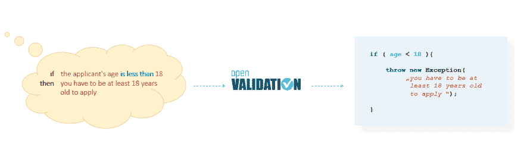
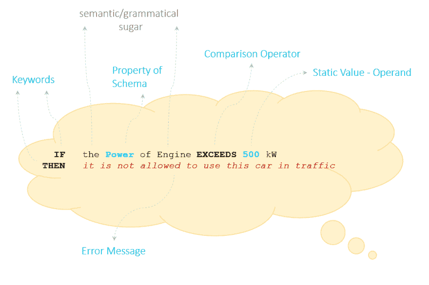
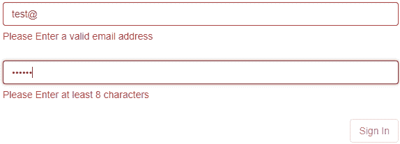

# 打开验证

> 原文:[https://dev.to/validaria/openvalidation-303k](https://dev.to/validaria/openvalidation-303k)

[openVALIDATION](http://openvalidation.io/) 支持使用自然语言(如德语或英语)对复杂的验证规则进行编程。

用自然语言记录的规则不仅人类可读，机器也可读，因此不再需要软件开发人员编程。此任务现在接管 openVALIDATION。通过集成的代码生成器，可以自动生成所需编程语言的相应代码，如 Java、C#、JavaScript 等。这些代码可以集成到任何应用程序中(服务、前端、中间件)。

[T2】](https://res.cloudinary.com/practicaldev/image/fetch/s--9LoS4_Fc--/c_limit%2Cf_auto%2Cfl_progressive%2Cq_auto%2Cw_880/https://thepracticaldev.s3.amazonaws.com/i/dlri3lpdu2o19akh13tt.png)

*写一次，DONT 码就到处跑！*

## 自然语法

基于自然语言的语法既正式又自然。这将这种语法与其他编程语言或特定于领域的语言区分开来。它允许使用额外的语义或语法内容。附加内容仅与人类可读性相关。另一方面，机器忽略了这个加法。因此，一方面可以语法正确地表达规则，另一方面可以给规则一个语义上下文。所有这些都使规则更容易理解。因此，用 openVALIDATION 制定的规则同时是一个正式的、机器可处理的规范，也是一个易于人们理解的文档。

[T2】](https://res.cloudinary.com/practicaldev/image/fetch/s--w6onmEHY--/c_limit%2Cf_auto%2Cfl_progressive%2Cq_auto%2Cw_880/https://thepracticaldev.s3.amazonaws.com/i/jo0lotva523ejsn2pxz7.png)

## 什么是验证规则？

每次传输数据时，都必须检查其正确性。这种检查也称为真实性检查或验证。通常有几个检查，其中一个被称为验证规则。用户界面、服务、CLI 或业务流程中的不同位置(即处理数据的任何地方)通常需要验证规则。这里有一个大家都很熟悉的例子:

[T2】](https://res.cloudinary.com/practicaldev/image/fetch/s--J0Xjlmon--/c_limit%2Cf_auto%2Cfl_progressive%2Cq_auto%2Cw_880/https://thepracticaldev.s3.amazonaws.com/i/imdnlht126sj8hoqa4cg.png)

这里实现了两种不同的验证规则。第一条规则检查电子邮件地址的格式。第二条规则检查密码的长度。这当然是一个非常简单的例子。随着应用程序的复杂性，验证规则的复杂性也在增加。例如，一个用于缔结机动车辆保险单的在线表单可以包含超过 1000 个验证规则。

## 开始使用

你可以在 [GitHub](https://github.com/openvalidation/openvalidation) 上找到这个项目。在自述文件中，您可以找到有关该项目的所有信息。联系方式你也可以写一封[电子邮件](//mailto:validaria@openvalidation.io)，提及我们的 twitter 账户 [@openVALIDATION](https://twitter.com/openvalidation) ，或者发消息给我们的 instagram 账户 [@openvalidation_](https://www.instagram.com/openvalidation_/) 。

为了获得关于 openVALIDATION 的第一个表达式，你也可以看看我们的[游乐场](http://playground.openvalidation.io/)。