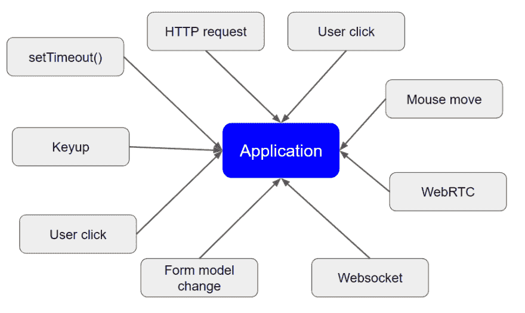

# [专业提示]反应式思维🤔

> 原文:[https://dev.to/bartosz_io/pro-tip-thinking-reactively-55mj](https://dev.to/bartosz_io/pro-tip-thinking-reactively-55mj)

又到了**角识丸**的时候了！
只需几秒钟就能学会新东西🔥
比如早上服用维生素😃

您知道所有的 Web 应用程序(包括 Angular)都在两个不同的阶段运行吗？第一个阶段是当所有初始代码被执行并且事件监听器被附加时引导应用程序！一旦完成，应用程序就可以工作了，这是最重要的，第二阶段- **倾听**！当应用程序开始运行时，它所做的就是**监听**和**对事件做出**反应！

下图展示了应用程序生命周期的这个阶段。有很多像用户点击，从服务器返回的 HTTP 请求，定时器等事件。这就是为什么**反应式编程**和 **RxJS** 现在变得如此有用和主流。因为我们意识到这就是 web 应用程序的工作方式！这都是关于应用程序中一直异步发生的事件流，RxJS 支持的函数式反应式编程非常强大。这就是我所说的开始**反应式思维**的范式转变。

[T2】](https://res.cloudinary.com/practicaldev/image/fetch/s--cXSeC0ke--/c_limit%2Cf_auto%2Cfl_progressive%2Cq_auto%2Cw_880/https://thepracticaldev.s3.amazonaws.com/i/3kcon5bock7haaeh0bmy.png)

如果你想把这种知识药丸直接发到你的邮箱，请在[angular-academy.com/blog/](https://angular-academy.com/blog)订阅。我将定期发送它们！记住，学习新东西只需要 10 秒钟！😃